Exploratory Data Analysis for 5Sp Dataset
================
Melissa Chen
Sat Jun 15 14:07:48 2019

First, load required packages
-----------------------------

``` r
#### Load packages ####
library(tidyverse) # for data manipulation
```

    ## ── Attaching packages ────────────────────────────────── tidyverse 1.2.1 ──

    ## ✔ ggplot2 2.2.1     ✔ purrr   0.2.4
    ## ✔ tibble  1.4.2     ✔ dplyr   0.7.5
    ## ✔ tidyr   0.8.1     ✔ stringr 1.3.1
    ## ✔ readr   1.1.1     ✔ forcats 0.3.0

    ## ── Conflicts ───────────────────────────────────── tidyverse_conflicts() ──
    ## ✖ dplyr::filter() masks stats::filter()
    ## ✖ dplyr::lag()    masks stats::lag()

``` r
library(MASS) # For fitting distributions and NMDS
```

    ## 
    ## Attaching package: 'MASS'

    ## The following object is masked from 'package:dplyr':
    ## 
    ##     select

``` r
library(rstanarm) # For calculated expected alpha and beta diversity
```

    ## Loading required package: Rcpp

    ## rstanarm (Version 2.17.4, packaged: 2018-04-13 01:51:52 UTC)

    ## - Do not expect the default priors to remain the same in future rstanarm versions.

    ## Thus, R scripts should specify priors explicitly, even if they are just the defaults.

    ## - For execution on a local, multicore CPU with excess RAM we recommend calling

    ## options(mc.cores = parallel::detectCores())

    ## - Plotting theme set to bayesplot::theme_default().

``` r
library(gridExtra) # For arranging ggplots
```

    ## 
    ## Attaching package: 'gridExtra'

    ## The following object is masked from 'package:dplyr':
    ## 
    ##     combine

``` r
library(mgcv) # For beta distribution (beta diversity)
```

    ## Loading required package: nlme

    ## 
    ## Attaching package: 'nlme'

    ## The following object is masked from 'package:dplyr':
    ## 
    ##     collapse

    ## This is mgcv 1.8-17. For overview type 'help("mgcv-package")'.

``` r
library(vegan) # for permanova
```

    ## Loading required package: permute

    ## Loading required package: lattice

    ## This is vegan 2.4-5

``` r
library(car) # for type III Anova
```

    ## Loading required package: carData

    ## 
    ## Attaching package: 'car'

    ## The following object is masked from 'package:dplyr':
    ## 
    ##     recode

    ## The following object is masked from 'package:purrr':
    ## 
    ##     some

``` r
library(RColorBrewer) # colors for barplots
library(grid) # for text grobs in gridExtra
```

Define pathways for input files

``` r
# Should I re-run all models? Set to FALSE if you don't want to waste time and already have the .RData files saved
RERUN_RICH=FALSE
RERUN_INHIBRICH=FALSE
RERUN_PERCINHIB=FALSE
RERUN_DISP=FALSE
RERUN_DIST=FALSE

#### Pathways ####
# OTU table in text format; rarefied to 'rared' OTUs
oturarePWD="../MF_and_OTU_edited/otu_table_r5000.txt"
# rarefaction depth
rared <- 5000
# OTU table in text format; not rarefied
otuPWD = "../MF_and_OTU_edited/otu_table_text.txt"
# FULL Mapping file; with alpha diversity added-- must have all columns described in aMetrics
mfPWD = "../MF_and_OTU_edited/MF_withalpha.txt"
# aMetrics
aMetrics <- c("observed_otus","shannon")
# Get header names for all alpha metrics
aHeader <- paste0(aMetrics,"_even_",rared,"_alpha")

# Inhibitory metadata; columns must be "host","inhib status","isolate number","OTU ID", "fulldescrp","OTU taxonomy"
inhibPWD <- "../ANTIFUNGAL/inhibitory_metadata_MANUAL.txt"

# folder with distance matrices
dmPWD <- "../beta_div/"
# distance metrics
dmMetrics <- c("bray_curtis")

minOTUSample = 5 # min number of reads per sample for the OTU to be non-zero
minOTUTab = 100 # min number of OTUs found in table for OTU to be kept in table
otuCutoff = 5000 # cutoff to discard sample; 


#### FILTERING BD NOTES:
```

We filtered BD two ways. First, we fit a poisson distribution to BD loads, and tested to see if expected value was significantly larger than zero. Then, we also checks all numbers to see if less than indivTHRESH. If less than indivTHRESH, it is changed to '0' Then, it see is if at least 2 are NOT zero and the third is more than 50. If the third is less than 50 AND the other two measurements are zero, they are all changed to zeros./ For the most part, we will see that these two methods yield similar results.

``` r
#### LOAD DATA ####

# Load mappingfile 
mf <- read.delim(paste0(mfPWD), header=TRUE, as.is=TRUE)
# Load full OTU table
otu <- read.delim(paste0(otuPWD), header=TRUE, as.is=TRUE, skip=1)
# Load rarefied OTU table
otu_rare <- read.delim(paste0(oturarePWD), header=TRUE, as.is=TRUE, skip=1)
# Loop through DMs
dm_all <- list()
for ( d in dmMetrics) {
    dm_all[[d]] <-  read.delim(paste0(dmPWD,dmMetrics,"_dm.txt"), header=TRUE)
}
inhib <- read.delim(paste0(inhibPWD), header=FALSE, as.is=TRUE)
```

Determining BD infection loads \#\#
One of the problems with the BD qPCR results is that we get very irregular results. Thus, each individual measurement
---------------------------------------------------------------------------------------------------------------------

is unreliable. Here, I use a parameterized model to predict the "true" Bd load given the measurements taken. I would expect BD load to be modelled by an approximately poisson process; here, we check if this is true.
A poisson distribution models a process where there is an expected "distance" or "time" between events, and you want to model how many events occur in a certain "distance" or "timespan". In the Bd system, an approximately equal amount of Bd is applied to each individual, and we measure the intensity of Bd through qPCR of a Bd-specific amplicon. One of the assumptions of the poisson distribution is that events are independent, and that the probability for an event over short intervals is the same as over long intervals. The Bd intensity is bound by zero, and has a hypothetical upper limit since after a certain infeciton intensity, amphibians will die. Lambda (the rate at which an event occurs) can be thought of as the number of Bd amplicons per "unit" area. In our methods, we assume that we swab all individuals equally. Thus, the "area swabbed" is the same across all individual amphibians. The Bd load is thus essentially a measurement of how many "events" there are in an unknown but constant swabbing area. While samples of the sample individual over time violate one of the assumptions of the Poisson distribution, we are simply using all the samples to see (roughly) whether a poisson distribution is a good fit for the Bd intensity. We then use multiple qPCR results from ONE sample to estimate the "true" intensity of Bd on an individual sample. The poisson model is therefore not really modelling Bd infection, per say, but rather the accuracy of the qPCR process.

``` r
# Filter out all information except BD-positive scenarios
BD <- mf %>%
    as_tibble() %>%
    dplyr::select(X.SampleID, Bd_Run_1,Bd_Run_2, Bd_Average_Run_3) %>%
    filter(!is.na(Bd_Average_Run_3), !is.na(Bd_Run_1), !is.na(Bd_Run_2))
samples_bd <- BD$X.SampleID
BD <- BD %>%
    dplyr::select(-X.SampleID)
BD12 <- c(BD$Bd_Run_1, BD$Bd_Run_2, BD$Bd_Average_Run_3)
# Get rid of zeros due to overinflation in poisson model
BD12 <- BD12[BD12!=0]
# Fit a poisson model to log BD
poisfit <- MASS::fitdistr(round(log(BD12)), densfun = "Poisson")
# Set new range of X's to test
xfit <- seq(0,(max(log(BD12))))
# Predict y
pred.y <- data.frame(y.pred=dpois(x=xfit, poisfit$estimate), xfit=xfit)
# Plot histogram with poisson distribution fit
BD12 %>%
    as_tibble() %>%
    rename(BDload=value)%>%
    ggplot(aes(x=log(BDload))) +
    geom_histogram(aes(y=..density..), bins=8) +
    geom_line(data=pred.y,aes(x=xfit, y=y.pred), col="red")
```

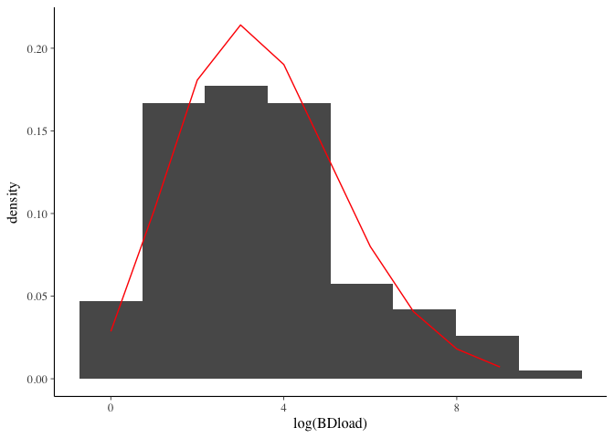

What we see above is that BD load (when not zero) is, in fact, modelled well by a poisson process. This means we could fit a poisson model to the aPCR results to estimate the "true" infection load (lambda) for each toad.

``` r
# Model true infection load for each toad
BD_lambda_est <- t(apply(round(log(BD+1)), MARGIN=1, FUN=function(x) {
    temp <- fitdistr(x, densfun="Poisson")
    return(c(temp$estimate,temp$sd))
})) %>%
    as_tibble() %>%
    rename(sd=lambda1) %>% 
    mutate(pval=dnorm(0,mean=lambda,sd=sd)) %>% # To estimate if lambda is significantly different from zero, we see if pval for parameter estimate different from zero
    mutate(sig=pval<=0.10)
final_BD <- cbind(BD,BD_lambda_est)

# To compare, let's see what a different filtering method yields:
# If 2 BD samples are 0 and the third is less than 50, then set to zero.
# Also, if anything is less than 5, make it zero anyway.

# BD filtering notes and thresholds:
indivTHRESH = 5 # BD individual threshold
thirdTHRESH = 50 # BD 3rd sample threshold
BD_alt <- BD
for ( r in 1:nrow(BD_alt) ) {
    for ( c in 1:ncol(BD_alt) ) {
        if ( (BD_alt[r,c] < indivTHRESH) | is.na(BD_alt[r,c]) ) {
            BD_alt[r,c] <- 0
        }
    }
    if ( (sum(BD_alt[r,] == 0) == 2) & (max(BD_alt[r,],na.rm=TRUE) < thirdTHRESH) ) {
        BD_alt[r,] <- c(0,0,0)
    }
    
}
BD_alt$infected <- rowSums(BD_alt) >0

cbind(final_BD[,c("Bd_Run_1","Bd_Run_2","Bd_Average_Run_3","pval","sig")], alt_infect =BD_alt$infected)
```

    ##    Bd_Run_1 Bd_Run_2 Bd_Average_Run_3         pval   sig alt_infect
    ## 1     10.28     0.00             5.20 8.098645e-02  TRUE       TRUE
    ## 2      0.00    10.52            16.83 4.393495e-02  TRUE       TRUE
    ## 3      0.00     7.28            16.22 4.393495e-02  TRUE       TRUE
    ## 4     71.90     5.64            23.67 4.431848e-03  TRUE       TRUE
    ## 5     15.38     4.87            25.69 7.750120e-03  TRUE       TRUE
    ## 6     77.05     0.00            54.45 7.750120e-03  TRUE       TRUE
    ## 7     64.00     0.00            38.29 7.750120e-03  TRUE       TRUE
    ## 8    189.60     0.00            95.31 2.550110e-03  TRUE       TRUE
    ## 9      0.00     1.17             0.54 7.259122e-01 FALSE      FALSE
    ## 10     0.00     6.41            13.65 4.393495e-02  TRUE       TRUE
    ## 11    10.82     0.00             6.91 8.098645e-02  TRUE       TRUE
    ## 12     0.00    16.00            44.35 1.366003e-02  TRUE       TRUE
    ## 13     0.00    33.55           108.32 4.431848e-03  TRUE       TRUE
    ## 14     0.00    55.87           225.03 4.431848e-03  TRUE       TRUE
    ## 15   296.00   229.50          3270.00 2.055213e-05  TRUE       TRUE
    ## 16     0.00     4.60            12.83 4.393495e-02  TRUE      FALSE
    ## 17     0.00     2.10             2.44 3.113306e-01 FALSE      FALSE
    ## 18    18.03     0.00            34.93 1.366003e-02  TRUE       TRUE
    ## 19     0.00   107.10           138.93 2.550110e-03  TRUE       TRUE
    ## 20   540.40    34.09           597.58 1.003727e-04  TRUE       TRUE
    ## 21    26.18     1.32            18.01 1.366003e-02  TRUE       TRUE
    ## 22  1433.00  1340.00           841.86 7.191668e-06  TRUE       TRUE
    ## 23     0.00    14.49             7.90 4.393495e-02  TRUE       TRUE
    ## 24     0.00     4.61             1.71 1.541803e-01 FALSE      FALSE
    ## 25    58.99     0.00           913.33 1.474740e-03  TRUE       TRUE
    ## 26     0.00     6.23             5.58 8.098645e-02  TRUE       TRUE
    ## 27     0.00   259.80             2.73 1.366003e-02  TRUE       TRUE
    ## 28     0.00     4.53            10.41 8.098645e-02  TRUE      FALSE
    ## 29   235.50   216.50           320.80 1.003727e-04  TRUE       TRUE
    ## 30     5.24    69.58           129.53 1.474740e-03  TRUE       TRUE
    ## 31     0.00     6.96             5.01 8.098645e-02  TRUE       TRUE
    ## 32     3.40    77.90            85.92 4.431848e-03  TRUE       TRUE
    ## 33     1.94   140.90           138.90 1.474740e-03  TRUE       TRUE
    ## 34    16.56    47.75            70.91 1.474740e-03  TRUE       TRUE
    ## 35    24.46     3.40            17.11 1.366003e-02  TRUE       TRUE
    ## 36   184.30    26.53           136.57 4.990517e-04  TRUE       TRUE
    ## 37    37.63    55.33           151.57 4.990517e-04  TRUE       TRUE
    ## 38  1975.00  2037.00          3254.00 1.501039e-06  TRUE       TRUE
    ## 39     6.40    18.86            35.65 4.431848e-03  TRUE       TRUE
    ## 40     0.00     2.17             1.83 3.113306e-01 FALSE      FALSE
    ## 41     2.24     0.00             9.35 1.541803e-01 FALSE      FALSE
    ## 42     5.37     3.70             9.74 2.432609e-02  TRUE       TRUE
    ## 43    71.51    40.15           130.99 4.990517e-04  TRUE       TRUE
    ## 44    23.24     1.86             2.91 4.393495e-02  TRUE      FALSE
    ## 45     3.62     0.00             2.07 1.541803e-01 FALSE      FALSE
    ## 46     2.05     1.22            16.83 4.393495e-02  TRUE      FALSE
    ## 47    52.59    34.16            35.52 8.563944e-04  TRUE       TRUE
    ## 48  1590.00  2544.00          4696.67 2.528022e-06  TRUE       TRUE
    ## 49    70.58    71.67            99.26 4.990517e-04  TRUE       TRUE
    ## 50  8324.00  6060.00         13977.33 1.880743e-07  TRUE       TRUE
    ## 51    18.78    28.72             7.90 7.750120e-03  TRUE       TRUE
    ## 52     0.00     3.56             8.41 8.098645e-02  TRUE      FALSE
    ## 53     0.00    83.41            53.73 7.750120e-03  TRUE       TRUE
    ## 54     0.00     0.00             4.69 3.113306e-01 FALSE      FALSE

What we see is that by using a significant threshold of p=0.1 (which is fairly relaxed), the poisson model method is less stringent than the straight threshold method. I believe the poisson model method is likely more reliable since it is able to detect cases where infection is truely low, but consistent. For example, there are some cases where all 3/3 samples were BD-positive but at low abundances; however, the straight threshold model does not recognize it as a 'positive' since the abundances are below the individual threshold. I believe the poisson model method uses more of the information in the qPCR methods than the straight threshold method.
From here, we will add in the "expected" BD load (lambda) into the mapping file for each toad.

``` r
# Insert expected BD loads for each sample
final_BD <- cbind(samples_bd, final_BD)
mf$eBD <- 0
mf[match(final_BD$samples_bd, mf$X.SampleID),"eBD"] <- final_BD$lambda

##### ADJUSTING DATA: Make same order, make 'time' variable ######

#### Edit metadata/mapping file #####
toKeepMF <-  c("X.SampleID"
               ,"eBD" # infection levels
               ,"SPEC" # Species code
               ,"TREATMENT_GROUP" # whether it was pre or post; should rename
               ,"BD100KZSP_3122011" # whether or not individual was exposed to BD: will rename
               ,"ANONYMIZED_NAME" # individual frog ID
               , "PRE_POST_BD_NUM" # timepoint
               , aHeader
               
)
newNames <- c("SampleID"
              , "eBD_log"
              , "species"
              , "prepost"
              , "BD_infected"
              , "toadID"
              , "timepoint"
              , aMetrics
)

mf <- mf %>% # mapping file with controls still in it
    as_tibble() %>% # make into tibble
    dplyr::select(one_of(toKeepMF)) %>% # filter to only relevant variables
    rename_at(vars(toKeepMF), ~ newNames) %>% #rename variable names
    filter(prepost == "Pre" | prepost == "Pos") %>% # get rid of things in "tre", which is a different experiment
    separate(timepoint, into=c("exposure","time"), sep="_", convert=TRUE) %>% # create a time variable
    mutate( time = ifelse(exposure == "Pre", time, time + 5)) %>% # time variable "restarts" at BD exposure point, but I want it to be continuous
    mutate(species=ifelse(species=="Bubo","Anbo",ifelse(species=="Buma","Anma",ifelse(species=="Raca","Lica",ifelse(species=="Rapi","Lipi",species))))) %>%
    separate(toadID, into=c("todelete","ID"), sep="_",remove=TRUE) %>%
    unite(toadID, species,ID, sep = "_", remove = FALSE) %>%
    dplyr::select(-todelete, -ID)
```

    ## Warning: Expected 2 pieces. Missing pieces filled with `NA` in 17 rows
    ## [346, 347, 348, 525, 526, 527, 588, 589, 590, 707, 708, 709, 710, 773, 774,
    ## 775, 776].

``` r
#### Adjusting values in mf for Osse and Anbo ####
```

OSSE QUIRK
So it turns out that the Osse data has this weird quirk where they weren't sampled in the first timepoint. Then, in the mapping file they were given time points 1-4 instead of 2-5, which screws up how the sampling lines up. So, I'm going to change the "pre" numbers so that they line up nicely with the rest of the samples.

``` r
# rows to change
addTime1 <- which((mf$species=="Osse") & (mf$time %in% c(1,2,3,4,5)))
mf[addTime1, "time"] <- mf[addTime1, "time"] +1 # add 1 to all pre time points so that time point 5 lines up with all other species
```

BUBO QUIRK
Additionally, there is this strange quirk with the Anbo dataset (or rather, strange quirk with every OTHER dataset) where nothing but Anbo was sampled at time point 10. Thus, let's add +1 to all time point 10's for all samples except Anbo

``` r
addTime1_notanbo <- which((mf$species!="Anbo") & (mf$time == 15))
mf[addTime1_notanbo,"time"] <- mf[addTime1_notanbo,"time"] + 1

#### filtering mapping files
mf.wcon <- mf 
mf.tb <- mf.wcon %>%
    filter(species != "None") # get rid of controls

# Number of controls lost
c(nrow(mf.wcon)-nrow(mf.tb))
```

    ## [1] 17

``` r
### Check to make sure there are no duplicates
```

Finally, there were certain individuals who actually tested positive for BD when they arrived. These were unknown until later because the PCR process takes a while, so they were included in the experiment. However, let us identify these individuals and remove them. The list below was manually curated from the spreadsheet provided by Val Mckenzie.

``` r
BD_contam_upon_arrival <- c("Anma_4"
                            , "Anma_6"
                            , "Anma_7"
                            , "Anma_10"
                            , "Anma_11"
                            , "Lipi_1"
                            , "Lipi_2"
                            , "Lipi_5"
                            , "Lipi_7"
                            , "Lipi_8"
                            , "Lipi_9"
                            , "Lipi_10"
                            , "Lipi_11"
                            , "Lipi_12")

# Add new column for individuals that were originally contamined
mf.tb$orig_contam <- 0
mf.tb[which(mf.tb$toadID %in% BD_contam_upon_arrival),"orig_contam"] <- 1

#### Other adjustments

# Make a PABD column as well as a "raw" BD counts column
mf.tb <- mf.tb %>%
    mutate(PABD=eBD_log>0, eBD_raw=exp(eBD_log)-1)

# # make diversity metrics numeric
mf.tb$shannon <- as.numeric(mf.tb$shannon)
```

    ## Warning: NAs introduced by coercion

``` r
mf.tb$observed_otus <- as.numeric(mf.tb$observed_otus)
```

    ## Warning: NAs introduced by coercion

``` r
mf.tb$logRich <- log(mf.tb$observed_otus)
# View(mf.tb %>%
         # dplyr::select(SampleID, shannon))

# filter to ONLY include those things in otu table (Raw)
mf.raw <- mf.tb %>%
    filter(SampleID %in% colnames(otu))
# How many things did we lose? Hopefully none, so that means the OTU table is complete.
c(nrow(mf.raw), nrow(mf.tb))
```

    ## [1] 780 780

``` r
# Note: This ALSO means that controls were filtered out before making the OTU table.


# Samples to keep in otu table (raw)
keepSamples <- colnames(otu_rare)[-match(c("X.OTU.ID","taxonomy"),colnames(otu_rare))]
### ** Note, this assumes that there are no samples in OTU table that are NOT in mapping file!
# If you get random warnings later on, you should come back here.
OTU_names <- otu$X.OTU.ID
otu.filt <- otu %>%
    as_tibble() %>%
    dplyr::select(one_of(keepSamples)) %>% # Use rare because it naturally cuts off for <5000
    replace(.<minOTUSample, 0) %>%
    mutate(rowsums=rowSums(.)) %>%
    mutate(OTUID = OTU_names) %>%
    filter(rowsums > minOTUTab) %>%
    dplyr::select(-rowsums) 
# Samples to keep in otu table (rarefied)
OTU_names_rare <- otu_rare$X.OTU.ID
otu.filt_rare <- otu_rare %>%
    as_tibble() %>%
    dplyr::select(one_of(keepSamples)) %>% # Use rare
    replace(.<minOTUSample, 0) %>%
    mutate(rowsums=rowSums(.)) %>%
    mutate(OTUID = OTU_names_rare) %>%
    filter(rowsums > minOTUTab) %>%
    dplyr::select(-rowsums) 
# View(otu.filt_rare)
# Check that each have the same number of samples-- should be the same.
ncol(otu.filt_rare)
```

    ## [1] 784

``` r
ncol(otu.filt)
```

    ## [1] 784

``` r
#### The mapping file already has diversity in it, so I need to add inihibitory bacterial diversity and beta diversity

#### Inhibitory bacteria ####
### Get proportion and count of inhibitory otus from inhibitory otu metadata
inhib.tb <- inhib %>%
    as_tibble() %>%
    rename(Name=V1, inhib=V2, num=V3, seq=V4,sampleID=V5, taxa=V6)
otu.tb.inhib <- otu.filt %>%
    mutate(inhib = (inhib.tb[match(otu.filt$OTUID, inhib.tb$seq),"inhib"])$inhib)
# transpose it, and then make column for "percent inhib" and "count inhib"
# total counts
sampleCounts <- otu.tb.inhib %>%
    dplyr::select(-c("inhib","OTUID")) %>%
    colSums()
# counts of total inhibitory sequences
inhibCounts <- otu.tb.inhib %>%
    filter(inhib=="inhibitory") %>%
    dplyr::select(-c("inhib","OTUID")) %>%
    colSums()
# richness of inhibitory sequences
inhibRich <- otu.tb.inhib %>%
    filter(inhib=="inhibitory") %>%
    dplyr::select(-c("inhib","OTUID")) %>%
    replace(.>0, 1) %>%
    colSums()
## Now, add this information into the mf
mf.raw <- mf.raw %>%
    mutate(n=sampleCounts[match(SampleID, names(sampleCounts))]
           ,inhibCounts =inhibCounts[match(SampleID, names(inhibCounts))]
           , inhibRich=inhibRich[match(SampleID, names(inhibRich))]) %>%
    mutate(percInhib = inhibCounts/n)


##### Adding Beta diversity turnover #####
```

Get distance to sample directly before for every sample AKA: How similar was the current sample to the sample JUST before that time point for that individual toad? This is different from beta DISPERSION. In cases where there is no sample before that sample, I omit it using NA The distance from the previous sample is also done BEFORE I filter for "contaminated" individuals-- but this should not matter because it is only dependent on the same indivdiual and all of those will be filtered out when we get rid of Bd contaminated individuals.

``` r
# Note; tried to do this with dplyr but it is VERY slow. Just used base R subsetting instead

for ( name in names(dm_all) ) {
    mf.raw[,paste0("distance_",name)] <- NA
    dm <- dm_all[[name]]
    dm <- data.frame(dm, row.names = 1)
    for ( i in 1:nrow(mf.raw) ) {
        currentSample <- mf.raw$SampleID[i]
        current <- mf.raw[i, c("toadID","time")]
        prevSample <- mf.raw$SampleID[mf.raw$toadID==as.character(current[1,1]) & mf.raw$time == as.numeric(current[1,2]-1)]
        if ( length(prevSample) > 0 & (currentSample %in% rownames(dm))) {
            distTemp <- dm[currentSample,as.character(prevSample)]
            if ( length(distTemp) > 0) {
                mf.raw[i,paste0("distance_",name)] <- distTemp
                
            }
        }
        
        # print(paste0("done",i," out of ",nrow(mf.tb)))
    }
}


##### Adding Beta dispersion #####
```

Another aspect of beta diversity that might change between species and individuals is the dispersion of an individual relative to all other individuals. That is, how much different is an individual from the centroid of all samples at that time point of that species?

``` r
# Now, filter mf to rarefied OTU tables
mf.rare <- mf.raw %>%
    filter(SampleID %in% colnames(otu_rare))

for ( name in names(dm_all) ) {
    disper <- vector()
    for ( sp in levels(factor(mf.rare$species))) {
        current.samps <- mf.rare %>%
            filter(species==sp) %>%
            dplyr::select(SampleID) %>%
            pull()
        current.dm <- dm_all$bray_curtis %>%
            filter(X %in% current.samps) %>%
            dplyr::select(one_of(c("X",current.samps)))
        current.mf <- mf.rare %>%
            filter(SampleID %in% current.samps)
        # Same order?
        # colnames(current.dm)[-1] == current.mf$SampleID
        # There might be a warning that we are missing certain samples-- this is fine.
        disp.temp <- betadisper(dist(data.frame(current.dm, row.names = 1)), group = (current.mf$time), type = "centroid")
        disper <- c(disper, disp.temp$distances)
    }
    
    # add to mf.rare and mf.raw
    mf.rare[,paste0("disper_",name)] <- data.frame(disper)[match(mf.rare$SampleID, rownames(data.frame(disper))),]
    mf.raw[,paste0("disper_",name)] <- data.frame(disper)[match(mf.raw$SampleID, rownames(data.frame(disper))),]
    
}

#### Adding NMDS ####
# MAKE NMDS
dm.filt <- dm[mf.rare$SampleID,mf.rare$SampleID]
# Make NMDS of distance matrix
set.seed(1017937)
nmds.all <- isoMDS(dist(dm.filt), k = 2)
```

    ## initial  value 23.278925 
    ## iter   5 value 19.243705
    ## iter  10 value 18.371526
    ## final  value 18.149220 
    ## converged

``` r
nmds <- nmds.all$points
colnames(nmds) <- c("NMDS1","NMDS2")
mf.rare <- cbind(mf.rare, nmds)


#### Created filtered mapping files with all extra information 
# Note which controls are contaminated; get rid of them.
# Also: check to see if any controls were infected.
controls_infected <- mf.raw %>%
    filter(BD_infected == "n", prepost == "Pos", PABD == TRUE) %>%
    dplyr::select(toadID, time) %>%
    group_by(toadID) %>%
    summarize(firstInfect = min(time))
controls_infected
```

    ## # A tibble: 5 x 2
    ##   toadID  firstInfect
    ##   <chr>         <dbl>
    ## 1 Anma_10           7
    ## 2 Anma_7            6
    ## 3 Lica_7            6
    ## 4 Lica_9            6
    ## 5 Osse_8           13

``` r
# above are the first time points that controls were found to be infected; need to get rid of samples after this point.
for ( r in 1:nrow(controls_infected)) {
    indiv <- as.character(controls_infected[r,1])
    firsttime <- as.numeric(controls_infected[r,2])
    mf.rare[which( (mf.rare$toadID == indiv) & (mf.rare$time %in% firsttime:16) ), "orig_contam"] <- 1
    mf.raw[which( (mf.raw$toadID == indiv) & (mf.raw$time %in% firsttime:16) ), "orig_contam"] <- 1
}

# Mapping file with only controls (training dataset)
# Save Rdata
save(mf.raw, file="mf.raw.RData")
save(mf.rare, file="mf.rare.RData")
# How many samples did we lose due to rarefaction?
c(nrow(mf.rare), nrow(mf.tb))
```

    ## [1] 696 780

``` r
# Which samples did we lose due to rarefaction?
mf.tb %>%
    filter(!(SampleID %in% colnames(otu_rare))) %>%
    dplyr::select(SampleID) %>%
    pull()
```

    ##  [1] "mck126Pre.3Rapi.9.452902"    "mck152Pre.4Raca.3.453474"   
    ##  [3] "mck175Pre.4Rapi.5.453228"    "mck176Pre.4Rapi.6.452851"   
    ##  [5] "mck181Pre.4Rapi.11.453526"   "mck194Pre.3Osse.2.453121"   
    ##  [7] "mck195Pre.3Osse.3.451526"    "mck196Pre.3Osse.4.453388"   
    ##  [9] "mck197Pre.3Osse.5.451509"    "mck203Pre.5Raca.1.453103"   
    ## [11] "mck207Pre.5Raca.5.453380"    "mck229Pre.5Rapi.6.451283"   
    ## [13] "mck233Pre.5Rapi.10.451961"   "mck234Pre.5Rapi.11.452358"  
    ## [15] "mck238Pre.5Bubo.3.451540"    "mck247Pre.4Osse.2.451004"   
    ## [17] "mck253Pre.4Osse.8.453340"    "mck254Pre.4Osse.9.452071"   
    ## [19] "mck255Pre.4Osse.10.453119"   "mck258Post.1Raca.3.452001"  
    ## [21] "mck265Post.1Raca.10.451311"  "mck288Post.1Rapi.12.452357" 
    ## [23] "mck28Pre.1Rapi.7.453206"     "mck337Post.2Rapi.8.452471"  
    ## [25] "mck344Post.2Bubo.3.451036"   "mck362Post.3Raca.1.452850"  
    ## [27] "mck363Post.3Raca.2.452084"   "mck364Post.3Raca.3.452312"  
    ## [29] "mck367Post.3Raca.6.451477"   "mck369Post.3Raca.8.453404"  
    ## [31] "mck389Post.3Rapi.7.452473"   "mck391Post.3Rapi.9.452135"  
    ## [33] "mck392Post.3Rapi.10.452247"  "mck393Post.3Rapi.11.453183" 
    ## [35] "mck394Post.3Rapi.12.451067"  "mck399Post.3Bubo.5.451162"  
    ## [37] "mck408Post.3Osse.4.451758"   "mck418Post.4Raca.1.452983"  
    ## [39] "mck430Post.4Buma.3.451897"   "mck466Post.4Osse.6.452900"  
    ## [41] "mck467Post.4Osse.7.452271"   "mck514Post.5Osse.1.451822"  
    ## [43] "mck519Post.5Osse.6.451428"   "mck522Post.5Osse.9.451216"  
    ## [45] "mck537Post.6Buma.4.452319"   "mck555Post.6Rapi.11.452484" 
    ## [47] "mck581Post.7Raca.2.451035"   "mck588Post.7Raca.19.451507" 
    ## [49] "mck589Post.7Raca.10.452408"  "mck5Pre.1Raca.5.452683"     
    ## [51] "mck602Post.7Rapi.2.452938"   "mck612Post.7Rapi.12.453304" 
    ## [53] "mck613Post.7Bubo.1.452541"   "mck620Post.7Bubo.8.451626"  
    ## [55] "mck629Post.7Osse.7.451230"   "mck636Post.8Raca.1.452301"  
    ## [57] "mck644Post.8Raca.20.451394"  "mck659Post.8Rapi.3.452202"  
    ## [59] "mck661Post.8Rapi.5.453015"   "mck663Post.8Rapi.7.452895"  
    ## [61] "mck665Post.8Rapi.9.452350"   "mck667Post.8Rapi.11.451440" 
    ## [63] "mck686Post.8Osse.9.451552"   "mck689Post.9Raca.2.451706"  
    ## [65] "mck692Post.9Raca.5.452632"   "mck693Post.9Raca.6.452326"  
    ## [67] "mck694Post.9Raca.7.451156"   "mck695Post.9Raca.8.452146"  
    ## [69] "mck700Post.9Buma.3.451263"   "mck712Post.9Rapi.4.453029"  
    ## [71] "mck713Post.9Rapi.5.451460"   "mck716Post.9Rapi.8.452480"  
    ## [73] "mck732Post.9Osse.3.452610"   "mck77Pre.2Bubo.1.452291"    
    ## [75] "mck787Post.11Bubo.2.452305"  "mck788Post.11Bubo.5.452623" 
    ## [77] "mck789Post.11Bubo.3.451585"  "mck795Post.10Osse.2.452404" 
    ## [79] "mck802Post.10Osse.9.451493"  "mck803Post.10Osse.10.453151"
    ## [81] "mck90Pre.1Osse.4.453179"     "mck95Pre.1Osse.9.451177"    
    ## [83] "mck96Pre.1Osse.10.451332"    "mck97Pre.3Raca.1.452248"

``` r
# View(mf_con)
mf_con <- mf.rare %>%
    filter(BD_infected=="n")
# were any controls contaminated at any point?
con_contam <- mf_con %>%
    filter(PABD==TRUE) %>%
    dplyr::select(toadID, time) %>%
    group_by(toadID) %>%
    summarise(firstinfect=min(time))
# get all time points after that
toDel <- c()
for ( n in 1:length(con_contam$toadID)) {
    toad <- con_contam$toadID[n]
    minTime <- con_contam$firstinfect[n]
    temp <- mf_con %>%
        filter(toadID==toad, time>=minTime) %>%
        dplyr::select(SampleID) %>%
        pull()
    toDel <- c(toDel, temp)
}

# Get rid of post-infected ones that weren't supposed to be infected
mf_con_without_init_infect <- mf_con %>%
    filter(orig_contam == 0, !(SampleID %in% toDel))

# Mapping file with only treatment (testing dataset)
mf_treat <- mf.rare %>%
    filter(BD_infected=="y")
mf_treat_without_init_infect <- mf_treat %>%
    filter(orig_contam == 0)
save(mf_con_without_init_infect, file="mf_con_without_init_infect.RData")
save(mf_treat_without_init_infect, file="mf_treat_without_init_infect.RData")

#### Make OTU table of JUST inhibitory bacteria ####
# Should double check this at some point
temp_char_otu <- otu.tb.inhib %>%
    dplyr::select(c(OTUID, inhib))
# Make con and treat with just inhibitory with taxa names
otu.temp <- t(otu.tb.inhib %>%
                  dplyr::select(-c(OTUID, inhib)))
otu.temp <- cbind(t(otu.temp/sampleCounts), temp_char_otu)

otu.inhibOnly.con <- otu.temp %>%
    filter(inhib=="inhibitory") %>%
    dplyr::select(mf_con_without_init_infect$SampleID, "OTUID")
otu.inhibOnly.treat <- otu.temp %>%
    filter(inhib=="inhibitory") %>%
    dplyr::select(mf_treat_without_init_infect$SampleID, "OTUID") 

# save otu tables
save(otu.inhibOnly.con, file="otu.inhibOnly.con.RData")
save(otu.inhibOnly.treat, file="otu.inhibOnly.treat.RData")


#### PLOTTING EXP DESIGN ####
```

``` r
mf.rare %>%
    separate(toadID, into=c("sp2", "indiv"), remove = FALSE) %>%
    mutate(indiv = factor(indiv, levels=c("1","2","3","4","5","6","7","8","9","10","11","12"))) %>%
    mutate(Treatment=ifelse(BD_infected=="y","Bd-exposed","Control"), "LnBd_load" = eBD_log) %>%
    mutate(Contaminated = factor(ifelse(orig_contam ==1, "!Contaminated upon arrival",NA), levels=c("!Contaminated upon arrival"))) %>%
    ggplot(aes(x=time, y=indiv)) +
    geom_line(aes(group=toadID, col=Treatment)) +
    geom_point(aes(group=toadID,bg=LnBd_load), cex=4, pch=21)+
    scale_color_manual(values=c("black","blue","orange")) +
    scale_fill_gradient(low = "white", high = "red") +
    geom_vline(aes(xintercept=5.5), col="orange")+
    geom_point(aes(group=toadID, col=Contaminated), cex=1, pch=19)+ ## NEW LINE
    facet_wrap(~species, nrow=5) +
    xlab("Time") +
    ylab("Individual Toad")
```

    ## Warning: Removed 491 rows containing missing values (geom_point).

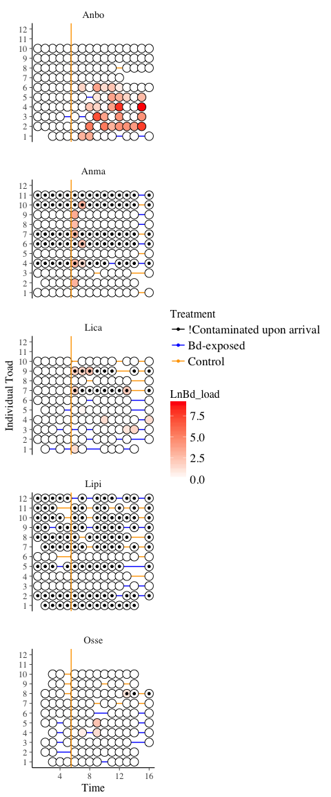

``` r
#### PLOTTING BETA COMPOSITION PLOTS ####
```

``` r
# What do different species look like? (Control only)
mf_con_without_init_infect %>%
    ggplot(aes(x=NMDS1, y=NMDS2)) +
    geom_point(aes(col=species), cex=3)
```

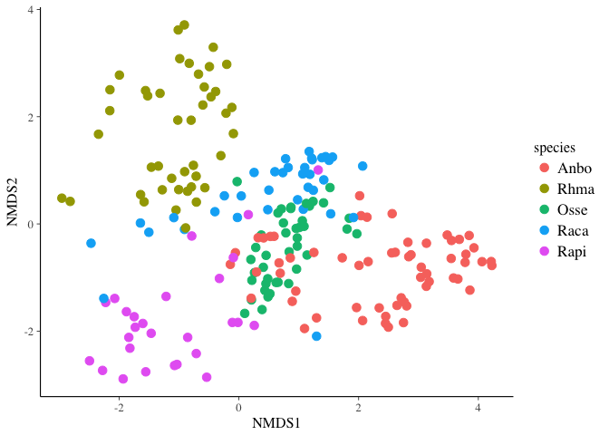

``` r
# What do different species look like? (ALL data)
mf.rare %>%
    ggplot(aes(x=NMDS1,y=NMDS2)) +
    geom_point(aes(col=species), cex=2)
```

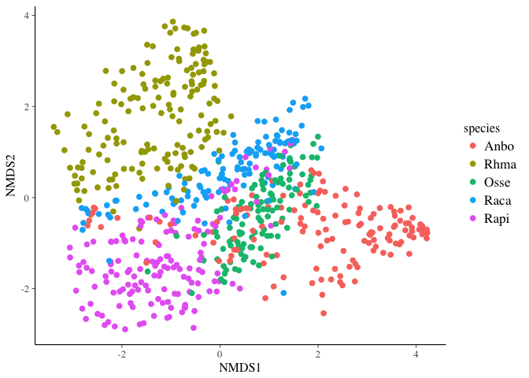

``` r
# Color dots by time
mf_con_without_init_infect %>%
    ggplot(aes(x=NMDS1, y=NMDS2)) +
    geom_point(aes(col=time), cex=3)
```

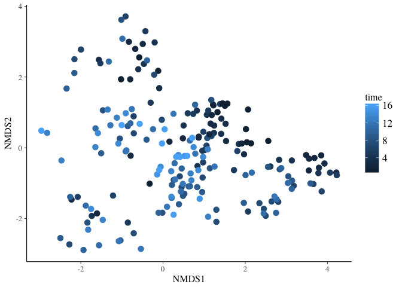

``` r
# Filtering dm to include only controls
dm.filt.con <- dm.filt[mf_con_without_init_infect$SampleID,mf_con_without_init_infect$SampleID ]
save(dm.filt.con, file="dm.filt.con.RData")


adonis2(dm.filt.con ~ species:time, data=mf_con_without_init_infect, by="margin")
```

    ## Permutation test for adonis under NA model
    ## Marginal effects of terms
    ## Permutation: free
    ## Number of permutations: 999
    ## 
    ## adonis2(formula = dm.filt.con ~ species:time, data = mf_con_without_init_infect, by = "margin")
    ##               Df SumOfSqs      F Pr(>F)    
    ## species:time   5   23.582 17.213  0.001 ***
    ## Residual     201   55.075                  
    ## ---
    ## Signif. codes:  0 '***' 0.001 '**' 0.01 '*' 0.05 '.' 0.1 ' ' 1

``` r
adonis2(dm.filt.con ~ species + time + species:time, data=mf_con_without_init_infect)
```

    ## Permutation test for adonis under reduced model
    ## Terms added sequentially (first to last)
    ## Permutation: free
    ## Number of permutations: 999
    ## 
    ## adonis2(formula = dm.filt.con ~ species + time + species:time, data = mf_con_without_init_infect)
    ##               Df SumOfSqs       F Pr(>F)    
    ## species        4   26.045 29.5041  0.001 ***
    ## time           1    3.546 16.0679  0.001 ***
    ## species:time   4    5.589  6.3311  0.001 ***
    ## Residual     197   43.476                   
    ## ---
    ## Signif. codes:  0 '***' 0.001 '**' 0.01 '*' 0.05 '.' 0.1 ' ' 1

There is a significant effect of species AND time AND interaction on COMPOSITION

``` r
rbind(mf_con_without_init_infect, mf_treat_without_init_infect) %>%
    mutate(BD_infected=ifelse(BD_infected=="y","Treatment","Control")
           , exposure = factor(exposure, levels=c("Pre","Post"))) %>%
    ggplot(aes(x=NMDS1,y=NMDS2)) +
    geom_point(aes(bg=exposure, col=PABD), cex=2, alpha=0.8, pch=21) +
    facet_grid(BD_infected ~ species) +
    scale_color_manual(values=c("white","black")) +
    scale_fill_manual(values=c("blue","red"))
```

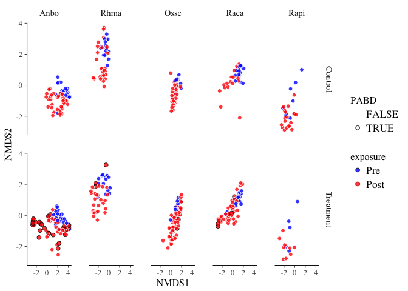

``` r
mf_treat_without_init_infect %>%
    filter(exposure=="Post") %>%
    ggplot(aes(x=NMDS1, y=NMDS2)) +
    geom_point(aes(bg=time, col=PABD), cex=3, pch=21) +
    scale_color_manual(values=c("white","red"))+
    facet_wrap(~species, nrow=1)
```

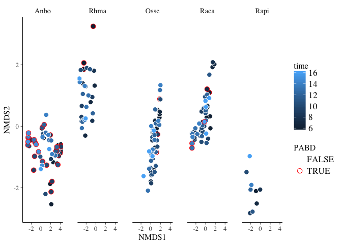

``` r
mf_treat_without_init_infect_post <- mf_treat_without_init_infect %>%
    filter(exposure=="Post")
dm.filt.treat <- dm.filt[mf_treat_without_init_infect_post$SampleID, mf_treat_without_init_infect_post$SampleID]
save(dm.filt.treat, file="dm.filt.treat.RData")

#### ALPHA DIVERISTY ####
```

### ALPHA DIVERSITY PLOTTING

First thing to do is calculated expected alpha diversity for each individual, and then calculate how for that particular sample was from the "expected" diversity. Before we do that though, let's plot alpha diversity to see how it looks.

``` r
# Fit normal and lognormal distributions to each of these
shannon_normal_param <- fitdistr(mf_con_without_init_infect$shannon, densfun="Normal")
x.fit.shannon <- seq(min(mf_con_without_init_infect$shannon)-sd(mf_con_without_init_infect$shannon)
                     , max(mf_con_without_init_infect$shannon)+sd(mf_con_without_init_infect$shannon)
                     , length.out = 100)
y.pred.shannon <- dnorm(x.fit.shannon, mean = shannon_normal_param$estimate[1], sd = shannon_normal_param$estimate[2])

obsotu_lognormal_param <- fitdistr(mf_con_without_init_infect$logRich, densfun="Normal")
x.fit.obsotu <- seq(min(mf_con_without_init_infect$logRich)-sd(mf_con_without_init_infect$logRich)
                     , max(mf_con_without_init_infect$logRich)+sd(mf_con_without_init_infect$logRich)
                     , length.out = 100)
y.pred.obsotu <- dnorm(x.fit.obsotu, mean = (obsotu_lognormal_param$estimate[1]), sd = (obsotu_lognormal_param$estimate[2]))

### new: lognormal ###
obsotu_lognormal_param <- fitdistr(mf_con_without_init_infect$observed_otus, densfun="log-normal")
obsotu_normal_param <- fitdistr(mf_con_without_init_infect$observed_otus, densfun="Normal")
x.fit.obsotu <- seq(min(mf_con_without_init_infect$observed_otus)-sd(mf_con_without_init_infect$observed_otus)
                    , max(mf_con_without_init_infect$observed_otus)+sd(mf_con_without_init_infect$observed_otus)
                    , length.out = 100)
y.pred.obsotu <- dlnorm(x.fit.obsotu, meanlog = (obsotu_lognormal_param$estimate[1]), sdlog = (obsotu_lognormal_param$estimate[2]))

 

###

gg_shannon_all <- ggplot(data=mf_con_without_init_infect, aes(x=shannon)) +
    geom_histogram(aes(y=..density..), bins=20) +
    geom_line(data=data.frame(x=x.fit.shannon, y=y.pred.shannon), aes(x=x, y=y), col="red")
gg_obsotu_all <- ggplot(data=mf_con_without_init_infect, aes(x=observed_otus)) +
    geom_histogram(aes(y=..density..), bins=20) +
    geom_line(data=data.frame(x=x.fit.obsotu, y=y.pred.obsotu), aes(x=x, y=y), col="red")
grid.arrange(gg_shannon_all, gg_obsotu_all, nrow=1)
```

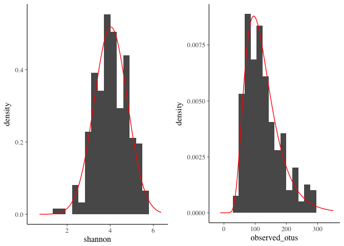

``` r
# Check to see if turnover is changing with time significantly
gg_divtime_con <- mf_con_without_init_infect %>%
    filter(!is.na(shannon)) %>%
    ggplot(aes(x=time, y=shannon)) + 
    geom_line(aes(group=toadID)) +
    geom_point(aes(col=PABD)) +
    scale_color_manual(values="blue")+
    facet_grid(~species)
gg_divtime_treat <- mf_treat_without_init_infect %>%
    filter(!is.na(shannon)) %>%
    ggplot(aes(x=time, y=shannon)) + 
    geom_line(aes(group=toadID)) +
    geom_point(aes(group=toadID, col=PABD)) +
    scale_color_manual(values=c("blue","red"))+
    geom_vline(aes(xintercept=5.5)) +
    facet_grid(~species)
grid.arrange(gg_divtime_con, gg_divtime_treat, nrow=2)
```

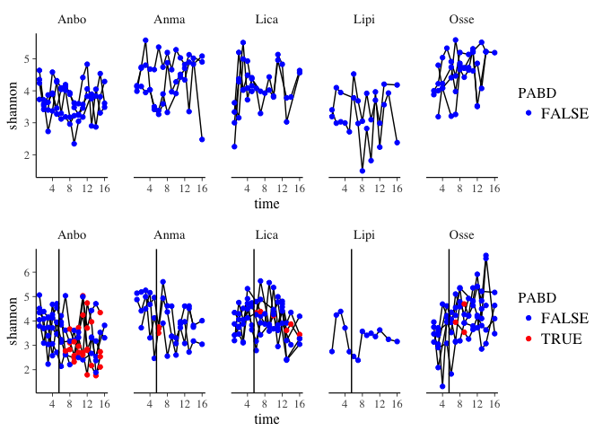

Does diversity change over time in control individuals?

``` r
# Type I ANOVA to test for interaction-- (AB | A, B)
anova(lm(shannon ~ species*time, data=mf_con_without_init_infect))
```

    ## Analysis of Variance Table
    ## 
    ## Response: shannon
    ##               Df Sum Sq Mean Sq F value Pr(>F)    
    ## species        4 39.401  9.8503 24.3888 <2e-16 ***
    ## time           1  1.060  1.0605  2.6256 0.1067    
    ## species:time   4  2.742  0.6855  1.6973 0.1521    
    ## Residuals    197 79.565  0.4039                   
    ## ---
    ## Signif. codes:  0 '***' 0.001 '**' 0.01 '*' 0.05 '.' 0.1 ' ' 1

``` r
# Use Type II ANOVA (no interaction present)
Anova(lm(shannon ~ species + time, data=mf_con_without_init_infect), type = 2)
```

    ## Anova Table (Type II tests)
    ## 
    ## Response: shannon
    ##           Sum Sq  Df F value    Pr(>F)    
    ## species   39.598   4 24.1750 2.417e-16 ***
    ## time       1.060   1  2.5897    0.1091    
    ## Residuals 82.307 201                      
    ## ---
    ## Signif. codes:  0 '***' 0.001 '**' 0.01 '*' 0.05 '.' 0.1 ' ' 1

``` r
# There is a significant effect of species but not time or interaction
```

Does richness change over time in treatment individuals?

``` r
# Type I ANOVA to test for interaction (AB | A,B)
anova(lm(shannon ~ species*time, data=mf_treat_without_init_infect))
```

    ## Analysis of Variance Table
    ## 
    ## Response: shannon
    ##               Df  Sum Sq Mean Sq F value    Pr(>F)    
    ## species        4  29.920  7.4801 12.3760 2.884e-09 ***
    ## time           1   1.654  1.6539  2.7364   0.09923 .  
    ## species:time   4  23.685  5.9213  9.7969 2.020e-07 ***
    ## Residuals    274 165.607  0.6044                      
    ## ---
    ## Signif. codes:  0 '***' 0.001 '**' 0.01 '*' 0.05 '.' 0.1 ' ' 1

``` r
# Type III ANOVA (valid in presence of interaction)
Anova(lm(shannon ~ species * time, data=mf_treat_without_init_infect, contrasts=list(species=contr.sum)), type=3)
```

    ## Anova Table (Type III tests)
    ## 
    ## Response: shannon
    ##              Sum Sq  Df   F value    Pr(>F)    
    ## (Intercept)  637.40   1 1054.5859 < 2.2e-16 ***
    ## species       14.19   4    5.8692 0.0001517 ***
    ## time           0.98   1    1.6290 0.2029166    
    ## species:time  23.69   4    9.7969  2.02e-07 ***
    ## Residuals    165.61 274                        
    ## ---
    ## Signif. codes:  0 '***' 0.001 '**' 0.01 '*' 0.05 '.' 0.1 ' ' 1

``` r
gg_richtime_con <- mf_con_without_init_infect %>%
    filter(!is.na(observed_otus)) %>%
    ggplot(aes(x=time, y=log(observed_otus))) + 
    geom_line(aes(group=toadID)) +
    geom_point(aes(group=toadID, col=PABD)) +
    scale_color_manual(values=c("blue","red"))+
    facet_grid(~species)
gg_richtime_treat <- mf_treat_without_init_infect %>%
    filter(!is.na(observed_otus)) %>%
    ggplot(aes(x=time, y=log(observed_otus))) + 
    geom_line(aes(group=toadID)) +
    geom_point(aes(group=toadID, col=PABD)) +
    geom_vline(aes(xintercept=5.5)) +
    scale_color_manual(values=c("blue","red"))+
    facet_grid(~species)
grid.arrange(gg_richtime_con, gg_richtime_treat, nrow=2)
```

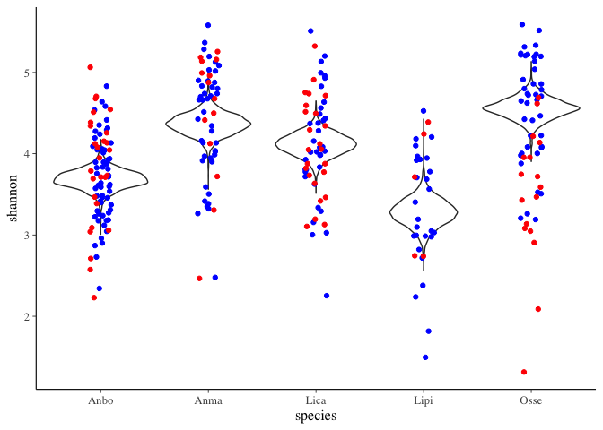

Does richness change over time in control individuals?

``` r
# Type I ANOVA to test for interaction-- (AB | A, B)
anova(lm(logRich ~ species*time, data=mf_con_without_init_infect))
```

    ## Analysis of Variance Table
    ## 
    ## Response: logRich
    ##               Df  Sum Sq Mean Sq F value    Pr(>F)    
    ## species        4  9.8448 2.46120 17.3532 3.263e-12 ***
    ## time           1  0.1974 0.19738  1.3916    0.2396    
    ## species:time   4  0.8054 0.20135  1.4197    0.2288    
    ## Residuals    197 27.9404 0.14183                      
    ## ---
    ## Signif. codes:  0 '***' 0.001 '**' 0.01 '*' 0.05 '.' 0.1 ' ' 1

``` r
# Use Type II ANOVA (no interaction present)
Anova(lm(logRich ~ species + time, data=mf_con_without_init_infect), type = 2)
```

    ## Anova Table (Type II tests)
    ## 
    ## Response: logRich
    ##            Sum Sq  Df F value    Pr(>F)    
    ## species    9.9684   4 17.4255 2.724e-12 ***
    ## time       0.1974   1  1.3801    0.2415    
    ## Residuals 28.7458 201                      
    ## ---
    ## Signif. codes:  0 '***' 0.001 '**' 0.01 '*' 0.05 '.' 0.1 ' ' 1

``` r
# There is a significant effect of species but not time or interaction
```

Does richness change over time in treatment individuals?

``` r
# Type I ANOVA to test for interaction (AB | A,B)
anova(lm(logRich ~ species*time, data=mf_treat_without_init_infect))
```

    ## Analysis of Variance Table
    ## 
    ## Response: logRich
    ##               Df Sum Sq Mean Sq F value    Pr(>F)    
    ## species        4 11.768 2.94196 18.1367  3.14e-13 ***
    ## time           1  0.000 0.00048  0.0029 0.9567623    
    ## species:time   4  3.364 0.84109  5.1852 0.0004847 ***
    ## Residuals    274 44.446 0.16221                      
    ## ---
    ## Signif. codes:  0 '***' 0.001 '**' 0.01 '*' 0.05 '.' 0.1 ' ' 1

``` r
# Type III ANOVA (valid in presence of interaction)
Anova(lm(logRich ~ species * time, data=mf_treat_without_init_infect, contrasts=list(species=contr.sum)), type=3)
```

    ## Anova Table (Type III tests)
    ## 
    ## Response: logRich
    ##              Sum Sq  Df   F value    Pr(>F)    
    ## (Intercept)  916.28   1 5648.7368 < 2.2e-16 ***
    ## species        2.44   4    3.7548 0.0054249 ** 
    ## time           0.02   1    0.1238 0.7252123    
    ## species:time   3.36   4    5.1852 0.0004847 ***
    ## Residuals     44.45 274                        
    ## ---
    ## Signif. codes:  0 '***' 0.001 '**' 0.01 '*' 0.05 '.' 0.1 ' ' 1

``` r
#### SHANNON ####
```

We see that shannon and log of observed otus look approximately normal. Great! Now, let's fit some models to this data. For shannon and logRich, we should use a LMM to find out the average richness for each species and the average richness for each individual through time.
u ~ N(u\_i, sigma\_i)
u\_i = a\_j
a\_j ~ N(u\_sp, sigma\_sp)
where i = sample, j = individual, sp = species Below, we use the dataset with JUST the controls.

``` r
# There was no effect of time
if ( RERUN_RICH ) {
    lmer_shannon <- stan_lmer(shannon ~ -1 + species + (1|toadID), data=mf_con_without_init_infect
                              , prior = normal(0, 10, autoscale = TRUE)
                              , seed = 98374)
    save(lmer_shannon, file="lmer_shannon.RData")
} else {
    load("lmer_shannon.RData")
}
prior_summary(lmer_shannon)
```

    ## Priors for model 'lmer_shannon' 
    ## ------
    ## 
    ## Coefficients
    ##  ~ normal(location = [0,0,0,...], scale = [10,10,10,...])
    ##      **adjusted scale = [7.72,7.72,7.72,...]
    ## 
    ## Auxiliary (sigma)
    ##  ~ exponential(rate = 1)
    ##      **adjusted scale = 0.77 (adjusted rate = 1/adjusted scale)
    ## 
    ## Covariance
    ##  ~ decov(reg. = 1, conc. = 1, shape = 1, scale = 1)
    ## ------
    ## See help('prior_summary.stanreg') for more details

``` r
# Look at distributions according to models
samps_lmer_shannon <- rstan::extract(lmer_shannon$stanfit)
pre_test_set <- mf_treat_without_init_infect %>%
    filter(time<6) 
## PLOT OF EXPECTED RCIHNESS FOR EACH SPECIES
samps_lmer_shannon$beta %>%
    as.data.frame() %>%
    rename(Anbo=V1, Anma=V2, Lica=V3, Lipi=V4, Osse=V5) %>%
    dplyr::select(Anbo,Anma,Lica,Lipi,Osse) %>%
    gather(key=species, value=shannon) %>%
    ggplot(mapping=aes(x=species, y=shannon))+
    geom_violin() +
    geom_point(data=mf_con_without_init_infect, aes(y=shannon, x=species), position = position_jitter(width = 0.1, height=0), col="blue") +
    geom_point(data=pre_test_set, aes(y=shannon, x=species), position=position_jitter(width = 0.1, height=0), col="red")
```

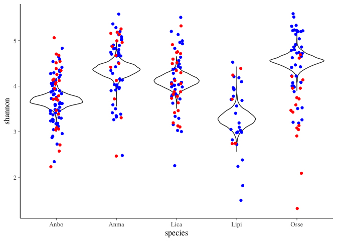

``` r
# Get standard deviation between toad individuals and samples
samp_sigma <- samps_lmer_shannon$aux
toadID_sigma <- sd(samps_lmer_shannon$b[,ncol(samps_lmer_shannon$b)])

# Now, we can calculate the probability that the "test" dataset values come from this distribution
# List of individuals
treat_indiv <- unique(mf_treat_without_init_infect$toadID)
# List of each species
species_list <- levels(factor(mf_con_without_init_infect$species))

exp_distr <- as.data.frame(matrix(ncol=length(species_list), nrow=4000, dimnames = list(1:4000, species_list)))
for ( num_sp in 1:length(species_list)) {
    exp_distr[,num_sp] <- rnorm(length(samps_lmer_shannon$beta[,num_sp]), mean=samps_lmer_shannon$beta[,num_sp], sd=toadID_sigma)
}

# Loop through and calculate probability of having diversity at that level
pre_exp_indiv <- data.frame(toadID=treat_indiv, exp_shannon=rep(NA, length(treat_indiv)), p_shannon=rep(NA, length(treat_indiv)), infect=rep(NA, length(treat_indiv)))
for ( i in treat_indiv ) {
    n_row <- match(i, treat_indiv)
    sp <- unlist(strsplit(i,"_"))
    num_sp <- match(sp[1], levels(factor(mf_con_without_init_infect$species)))
    temp_shannon <- mf_treat_without_init_infect %>%
        filter(toadID==i, time <=5 ) %>%
        dplyr::select(shannon) %>%
        pull()
    if ( length(temp_shannon)>1 ) {
        exp_shannon <-  fitdistr(temp_shannon, "normal")$estimate[1]
        
    } else {
        exp_shannon <- temp_shannon
    }
    
    # pred_distr <- rnorm(length(samps_lmer_shannon$beta[,num_sp]), mean=rnorm(length(samps_lmer_shannon$beta[,num_sp]), mean=samps_lmer_shannon$beta[,num_sp], sd=toadID_sigma), sd=samp_sigma)
    p_shannon <- sum(exp_distr[,sp[1]]<exp_shannon)/length(exp_distr[,sp[1]])
    
    ### Did they get infected?
    infect <- max(mf_treat_without_init_infect %>%
        filter(toadID==i) %>%
        dplyr::select(eBD_raw) %>%
        pull()
        )
    
    pre_exp_indiv[n_row,c("exp_shannon","p_shannon","infect")] <- c(exp_shannon, p_shannon, infect)
    
}


# Get estimates for control toads
shannon_species_exp <- fixef(lmer_shannon)  %>%
    as_tibble() %>%
    mutate(species=c("Anbo", "Anma","Lica","Lipi","Osse"))
con_toad_est_shannon <- ranef(lmer_shannon)$toadID %>%
    rename(sp_est="(Intercept)") %>%
    mutate(toadID=rownames(ranef(lmer_shannon)$toadID)) %>%
    separate(toadID, into=c("species","num"), sep="_",remove=FALSE) %>%
    dplyr::select(-num) %>%
    left_join(shannon_species_exp, by = "species") %>%
    mutate(est_shannon=sp_est+value)

con_exp_indiv_shannon <- data.frame(toadID=con_toad_est_shannon$toadID, exp_shannon=rep(NA, length(con_toad_est_shannon$toadID)), p_shannon=rep(NA, length(con_toad_est_shannon$toadID)))
for ( i in 1:nrow(con_toad_est_shannon) ) {
    s <- con_toad_est_shannon[i,"species"]
    
    exp_shannon <- con_toad_est_shannon[i,"est_shannon"]
    p_shannon <- sum(exp_distr[,s]<exp_shannon)/length(exp_distr[,s])
    
    con_exp_indiv_shannon[i,c("exp_shannon","p_shannon")] <- c(exp_shannon, p_shannon)
}


# create species column
pre_exp_indiv <- pre_exp_indiv %>%
    separate(toadID, into=c("species","indiv"), remove = FALSE)

# Plot results 
gg_shan_p <- ggplot(pre_exp_indiv, aes(x=p_shannon, y=log(infect+1))) +
    geom_smooth(aes(color=species),method=lm, se = FALSE) +
    geom_point(aes(color=species), cex=4) +
    geom_smooth(method=lm, se=FALSE, col="black")
# if we'd JUST plotted raw values
gg_shan_raw <- ggplot(pre_exp_indiv, aes(x=exp_shannon, y=log(infect+1)))+
    geom_point(aes(color=species), cex=4) +
    geom_smooth(method=lm, se=FALSE) +
    geom_smooth(aes(color=species),method=lm, se = FALSE) 
grid.arrange(gg_shan_p, gg_shan_raw, nrow=1)
```

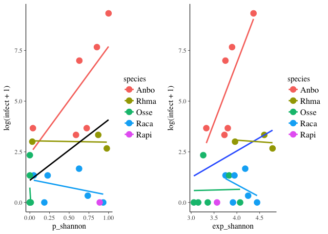

``` r
exp_distr %>%
    gather(key=species, value=shannon) %>%
    ggplot(aes(x=species, y=shannon)) +
    geom_violin() +
    geom_point(data=pre_exp_indiv, aes(x=species, y=exp_shannon, col=log(infect+1)), cex=4, position=position_jitter(height=0, width=0.1))
```

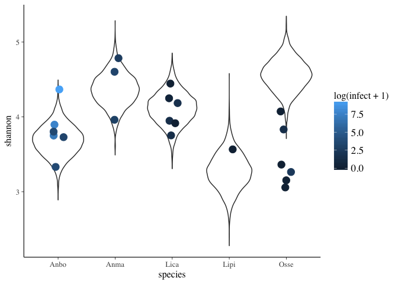

``` r
all_p <- pre_exp_indiv %>%
    dplyr::select(toadID, exp_shannon, p_shannon,infect)

#### RICHNESS (observed OTUs) ####

if (RERUN_RICH) {
    lmer_logRich <- stan_lmer(logRich ~ -1 + species + (1|toadID), data=mf_con_without_init_infect
                           , prior = normal(0, 10, autoscale = TRUE)
                           , seed = 98374)
    save(lmer_logRich, file="lmer_logRich.RData")
} else {
    load(file="lmer_logRich.RData")
}
prior_summary(lmer_logRich)
```

    ## Priors for model 'lmer_logRich' 
    ## ------
    ## 
    ## Coefficients
    ##  ~ normal(location = [0,0,0,...], scale = [10,10,10,...])
    ##      **adjusted scale = [4.34,4.34,4.34,...]
    ## 
    ## Auxiliary (sigma)
    ##  ~ exponential(rate = 1)
    ##      **adjusted scale = 0.43 (adjusted rate = 1/adjusted scale)
    ## 
    ## Covariance
    ##  ~ decov(reg. = 1, conc. = 1, shape = 1, scale = 1)
    ## ------
    ## See help('prior_summary.stanreg') for more details

``` r
# Look at distributions according to models
samps_lmer_logRich <- rstan::extract(lmer_logRich$stanfit)
pre_test_set <- mf_treat_without_init_infect %>%
    filter(time<6) 
# Plot of expected by species, and real samples
samps_lmer_logRich$beta %>%
    as.data.frame() %>%
    rename(Anbo=V1, Anma=V2, Lica=V3, Lipi=V4, Osse=V5) %>%
    dplyr::select(Anbo,Anma,Lica,Lipi,Osse) %>%
    gather(key=species, value=logRich) %>%
    ggplot(mapping=aes(x=species, y=logRich))+
    geom_violin() +
    geom_point(data=mf_con_without_init_infect, aes(y=logRich, x=species), position = position_jitter(width = 0.1, height=0), col="blue") +
    geom_point(data=pre_test_set, aes(y=logRich, x=species), position=position_jitter(width = 0.1, height=0), col="red")
```

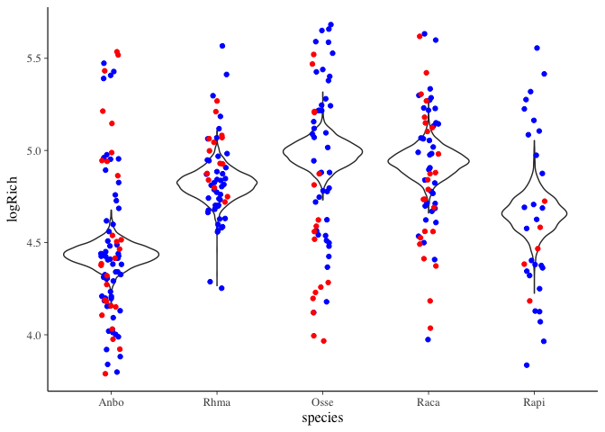

``` r
# Get standard deviation between toad individuals and samples
samp_sigma <- samps_lmer_logRich$aux
toadID_sigma <- sd(samps_lmer_logRich$b[,ncol(samps_lmer_logRich$b)])

# Now, we can calculate the probability that the "test" dataset values come from this distribution
# List of individuals
treat_indiv <- unique(mf_treat_without_init_infect$toadID)
# List of each species
species_list <- levels(factor(mf_con_without_init_infect$species))

exp_distr <- as.data.frame(matrix(ncol=length(species_list), nrow=4000, dimnames = list(1:4000, species_list)))
for ( num_sp in 1:length(species_list)) {
    exp_distr[,num_sp] <- rnorm(length(samps_lmer_logRich$beta[,num_sp]), mean=samps_lmer_logRich$beta[,num_sp], sd=toadID_sigma)
    # exp_distr[,num_sp] <- rnorm(length(samps_lmer_logRich$beta[,num_sp]), mean=rnorm(length(samps_lmer_logRich$beta[,num_sp]), mean=samps_lmer_logRich$beta[,num_sp], sd=toadID_sigma), sd=samp_sigma)
}

# Loop through and calculate probability of having diversity at that level
pre_exp_indiv <- data.frame(toadID=treat_indiv, exp_logRich=rep(NA, length(treat_indiv)), p_logRich=rep(NA, length(treat_indiv)), infect=rep(NA, length(treat_indiv)))
for ( i in treat_indiv ) {
    n_row <- match(i, treat_indiv)
    sp <- unlist(strsplit(i,"_"))
    num_sp <- match(sp[1], levels(factor(mf_con_without_init_infect$species)))
    temp_logRich <- mf_treat_without_init_infect %>%
        filter(toadID==i, time <=5 ) %>%
        dplyr::select(logRich) %>%
        pull()
    if ( length(temp_logRich)>1 ) {
        exp_logRich <-  fitdistr(temp_logRich, "normal")$estimate[1]
        
    } else {
        exp_logRich <- temp_logRich
    }
    
    # pred_distr <- rnorm(length(samps_lmer_logRich$beta[,num_sp]), mean=rnorm(length(samps_lmer_logRich$beta[,num_sp]), mean=samps_lmer_logRich$beta[,num_sp], sd=toadID_sigma), sd=samp_sigma)
    p_logRich <- sum(exp_distr[,sp[1]]<exp_logRich)/length(exp_distr[,sp[1]])
    
    ### Did they get infected?
    infect <- max(mf_treat_without_init_infect %>%
                      filter(toadID==i) %>%
                      dplyr::select(eBD_raw) %>%
                      pull()
    )
    
    pre_exp_indiv[n_row,c("exp_logRich","p_logRich","infect")] <- c(exp_logRich, p_logRich, infect)
    
}


# Get estimates for control toads
logRich_species_exp <- fixef(lmer_logRich)  %>%
    as_tibble() %>%
    mutate(species=c("Anbo", "Anma","Lica","Lipi","Osse"))
con_toad_est_logRich <- ranef(lmer_logRich)$toadID %>%
    rename(sp_est="(Intercept)") %>%
    mutate(toadID=rownames(ranef(lmer_logRich)$toadID)) %>%
    separate(toadID, into=c("species","num"), sep="_",remove=FALSE) %>%
    dplyr::select(-num) %>%
    left_join(logRich_species_exp, by = "species") %>%
    mutate(est_logRich=sp_est+value)

con_exp_indiv_logRich <- data.frame(toadID=con_toad_est_logRich$toadID, exp_logRich=rep(NA, length(con_toad_est_logRich$toadID)), p_logRich=rep(NA, length(con_toad_est_logRich$toadID)))
for ( i in 1:nrow(con_toad_est_logRich) ) {
    s <- con_toad_est_logRich[i,"species"]
    
    exp_logRich <- con_toad_est_logRich[i,"est_logRich"]
    p_logRich <- sum(exp_distr[,s]<exp_logRich)/length(exp_distr[,s])
    
    con_exp_indiv_logRich[i,c("exp_logRich","p_logRich")] <- c(exp_logRich, p_logRich)
}

# create species column
pre_exp_indiv <- pre_exp_indiv %>%
    separate(toadID, into=c("species","indiv"), remove = FALSE)

# Plot results 
gg_logRich_p <- ggplot(pre_exp_indiv, aes(x=p_logRich, y=log(infect+1))) +
    geom_smooth(aes(color=species),method=lm, se = FALSE) +
    geom_point(aes(color=species), cex=4) +
    geom_smooth(method=lm, se=FALSE, col="black")
# if we'd JUST plotted raw values
gg_logRich_raw <- ggplot(pre_exp_indiv, aes(x=exp_logRich, y=log(infect+1)))+
    geom_point(aes(color=species), cex=4) +
    geom_smooth(aes(color=species),method=lm, se = FALSE) +
    geom_smooth(method=lm, se=FALSE)
grid.arrange(gg_logRich_p, gg_logRich_raw, nrow=1)
```

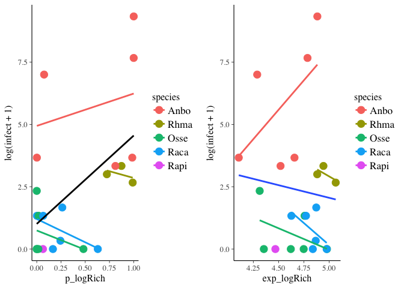

``` r
exp_distr %>%
    gather(key=species, value=logRich) %>%
    ggplot(aes(x=species, y=logRich)) +
    geom_violin() +
    geom_point(data=pre_exp_indiv, aes(x=species, y=exp_logRich, col=log(infect+1)), cex=4, position=position_jitter(height=0, width=0.1))
```

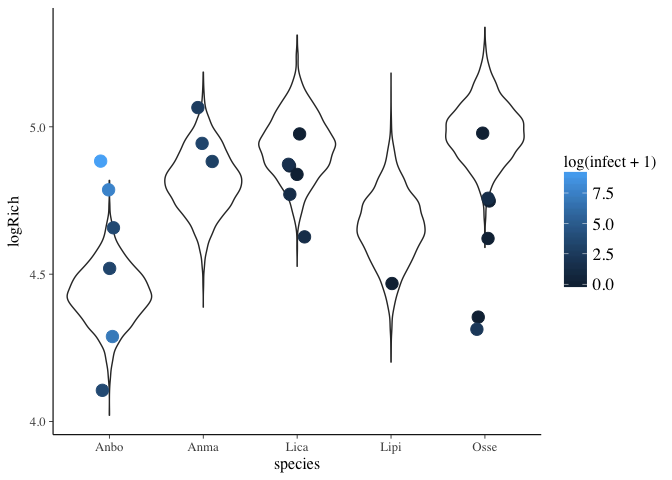

``` r
all_p <- pre_exp_indiv %>%
    dplyr::select(toadID, exp_logRich, p_logRich) %>%
    full_join(all_p, by="toadID")

#### BETA DIVERSTY ####

#### Dispersion ####
#### Beta plot
# First, fit a beta distribution
x.fit.dist <- seq(min((mf_con_without_init_infect$disper_bray_curtis), na.rm = TRUE)-sd((mf_con_without_init_infect$disper_bray_curtis), na.rm = TRUE)
                  , max((mf_con_without_init_infect$disper_bray_curtis), na.rm = TRUE)+sd((mf_con_without_init_infect$disper_bray_curtis), na.rm = TRUE)
                  , length.out = 100)
dist.fit.lognorm <- fitdistr(mf_con_without_init_infect$disper_bray_curtis[!is.na(mf_con_without_init_infect$disper_bray_curtis)]
                     , densfun="lognormal")
y.pred.dist.lognorm <- dlnorm(x.fit.dist, meanlog = dist.fit.lognorm$estimate[1], sdlog = dist.fit.lognorm$estimate[2])
# Try a normal too?
dist.fit.norm <- fitdistr((mf_con_without_init_infect$disper_bray_curtis[!is.na(mf_con_without_init_infect$disper_bray_curtis)])
                          , densfun="Normal")
y.pred.dist.norm <- dnorm(x.fit.dist, mean = dist.fit.norm$estimate[1], sd = dist.fit.norm$estimate[2])

mf_con_without_init_infect %>%
    filter(!is.na(disper_bray_curtis)) %>%
    ggplot(aes(x=disper_bray_curtis)) + 
    geom_histogram(aes(y=..density..), bins=25) +
    geom_line(data=data.frame(x=x.fit.dist, y=y.pred.dist.lognorm), aes(x=x, y=y), col="red") +
    geom_line(data=data.frame(x=x.fit.dist, y=y.pred.dist.norm), aes(x=x, y=y), col="blue") 
```

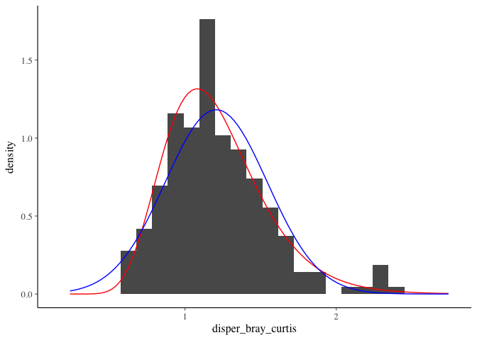

lognorml fits better.

``` r
# Check to see if turnover is changing with time significantly
gg_disttime_con <- mf_con_without_init_infect %>%
    filter(!is.na(disper_bray_curtis)) %>%
    ggplot(aes(x=time, y=disper_bray_curtis)) + 
    geom_line(aes(group=toadID)) +
    geom_point(aes(group=toadID, col=PABD)) +
    scale_color_manual(values=c("blue","red"))+
    facet_grid(~species)
gg_disttime_treat <- mf_treat_without_init_infect %>%
    filter(!is.na(disper_bray_curtis)) %>%
    ggplot(aes(x=time, y=disper_bray_curtis)) + 
    geom_line(aes(group=toadID)) +
    geom_point(aes(group=toadID, col=PABD)) +
    scale_color_manual(values=c("blue","red"))+
    geom_vline(aes(xintercept=5.5))+
    facet_grid(~species)
grid.arrange(gg_disttime_con, gg_disttime_treat, nrow=2)
```

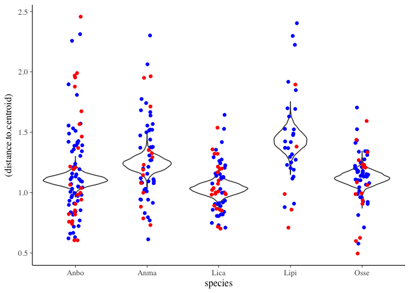

``` r
# Is there an effect of species and time on controls?
# Type I ANOVA (to check for interaction) (AB | A,B)
anova(lm(log(disper_bray_curtis) ~ species*time, data=mf_con_without_init_infect))
```

    ## Analysis of Variance Table
    ## 
    ## Response: log(disper_bray_curtis)
    ##               Df  Sum Sq Mean Sq F value    Pr(>F)    
    ## species        4  2.1129 0.52822  9.6625 3.724e-07 ***
    ## time           1  1.8197 1.81969 33.2866 3.045e-08 ***
    ## species:time   4  0.4254 0.10635  1.9455    0.1044    
    ## Residuals    197 10.7695 0.05467                      
    ## ---
    ## Signif. codes:  0 '***' 0.001 '**' 0.01 '*' 0.05 '.' 0.1 ' ' 1

``` r
# Type II ANOVA with no interaction
Anova(lm(log(disper_bray_curtis) ~ species + time, data=mf_con_without_init_infect), type = 2)
```

    ## Anova Table (Type II tests)
    ## 
    ## Response: log(disper_bray_curtis)
    ##            Sum Sq  Df F value    Pr(>F)    
    ## species    1.8582   4  8.3407 3.036e-06 ***
    ## time       1.8197   1 32.6719 3.899e-08 ***
    ## Residuals 11.1949 201                      
    ## ---
    ## Signif. codes:  0 '***' 0.001 '**' 0.01 '*' 0.05 '.' 0.1 ' ' 1

``` r
# Is there an effect of species and time on treatment??
# Type I ANOVA (to check for interaction) (AB | A,B)
anova(lm(log(distance_bray_curtis) ~ species*time, data=mf_treat_without_init_infect))
```

    ## Analysis of Variance Table
    ## 
    ## Response: log(distance_bray_curtis)
    ##               Df  Sum Sq Mean Sq F value    Pr(>F)    
    ## species        4  3.1270 0.78174  6.4247 6.663e-05 ***
    ## time           1  0.5412 0.54122  4.4480   0.03609 *  
    ## species:time   4  0.2003 0.05008  0.4116   0.80022    
    ## Residuals    216 26.2823 0.12168                      
    ## ---
    ## Signif. codes:  0 '***' 0.001 '**' 0.01 '*' 0.05 '.' 0.1 ' ' 1

``` r
# Type II ANOVA with no interaction
Anova(lm(log(distance_bray_curtis) ~ species + time, data=mf_treat_without_init_infect), type = 2)
```

    ## Anova Table (Type II tests)
    ## 
    ## Response: log(distance_bray_curtis)
    ##            Sum Sq  Df F value    Pr(>F)    
    ## species    2.9198   4  6.0640 0.0001202 ***
    ## time       0.5412   1  4.4961 0.0350924 *  
    ## Residuals 26.4826 220                      
    ## ---
    ## Signif. codes:  0 '***' 0.001 '**' 0.01 '*' 0.05 '.' 0.1 ' ' 1

We see that dist diversity is log-normal distributed Now, let's fit some models to this data. We should use a GLMM with dist distribution as the response variable to find out the average dist diversity turnover for each species and for each individual through time.
log(u) ~ N(u\_i, sigma\_i)
u\_i = a\_j
a\_j ~ N(u\_sp, sigma\_sp)
where i = sample, j = individual, sp = species Below, we use the dataset with JUST the controls.

``` r
if ( RERUN_DISP) {
    glmer_disper <- stan_glmer((disper_bray_curtis) ~ -1 + species + (1|toadID)
                           , data=mf_con_without_init_infect
                           , family = gaussian(link="log")
                           , prior_intercept = normal(location = 0,scale = 5, autoscale = TRUE)
                           , prior = normal(location=0, scale=5, autoscale=TRUE)
                           , seed= 29473
    )
    save(glmer_disper, file="glmer_disper.RData")
} else {
    load("glmer_disper.RData")
}
prior_summary(glmer_disper)
```

    ## Priors for model 'glmer_disper' 
    ## ------
    ## 
    ## Coefficients
    ##  ~ normal(location = [0,0,0,...], scale = [5,5,5,...])
    ##      **adjusted scale = [1.69,1.69,1.69,...]
    ## 
    ## Auxiliary (sigma)
    ##  ~ exponential(rate = 1)
    ##      **adjusted scale = 0.34 (adjusted rate = 1/adjusted scale)
    ## 
    ## Covariance
    ##  ~ decov(reg. = 1, conc. = 1, shape = 1, scale = 1)
    ## ------
    ## See help('prior_summary.stanreg') for more details

``` r
# Look at disperributions according to models
samps_glmer_disper<- rstan::extract(glmer_disper$stanfit)
pre_test_set <- mf_treat_without_init_infect %>%
    filter(time<=5) 
samps_glmer_disper$beta  <- samps_glmer_disper$beta %>%
    as.data.frame() %>%
    mutate(Anbo=exp(V1), Anma=exp(V2), Lica=exp(V3), Lipi=exp(V4), Osse=exp(V5)) %>%
    dplyr::select(Anbo,Anma,Lica,Lipi,Osse)
samps_glmer_disper$beta %>%
    gather(key=species, value=disper_bray_curtis) %>%
    ggplot(mapping=aes(x=species, y=(disper_bray_curtis)))+
    geom_violin() +
    geom_point(data=mf_con_without_init_infect, aes(y=(disper_bray_curtis), x=species), position = position_jitter(width = 0.1, height=0), col="blue") +
    geom_point(data=pre_test_set, aes(y=(disper_bray_curtis), x=species), position=position_jitter(width = 0.1, height=0), col="red")
```

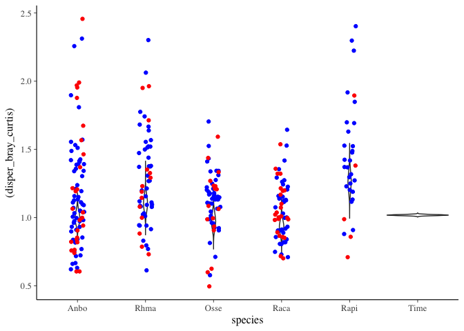

``` r
# Get standard deviation between toad individuals and samples
# samp_sigma <- sigma(glmer_BC)
toadID_sigma <- sd(samps_glmer_disper$b[,ncol(samps_glmer_disper$b)])
sigma <- samps_glmer_disper$aux

# Now, we can calculate the probability that the "test" dataset values come from this distribution
# List of individuals
treat_indiv <- unique(mf_treat_without_init_infect$toadID)
# List of each species
species_list <- levels(factor(mf_con_without_init_infect$species))

exp_distr <- as.data.frame(matrix(ncol=length(species_list), nrow=4000, dimnames = list(1:4000, species_list)))
for ( num_sp in 1:length(species_list)) {

    exp_distr[,num_sp] <- rlnorm(length(samps_glmer_disper$beta[,num_sp])
                                ,meanlog=log(rnorm(4000, mean=samps_glmer_disper$beta[,num_sp], sd=toadID_sigma))
                                ,sdlog=sigma )
    
}

exp_distr %>%
    gather(key=species, value=disper_bray_curtis) %>%
    ggplot(aes(x=species, y=disper_bray_curtis)) +
    geom_violin() +
    geom_point(data=mf_con_without_init_infect, aes(y=(disper_bray_curtis), x=species), position = position_jitter(width = 0.1, height=0), col="blue") +
    geom_point(data=pre_test_set, aes(y=(disper_bray_curtis), x=species), position=position_jitter(width = 0.1, height=0), col="red")
```

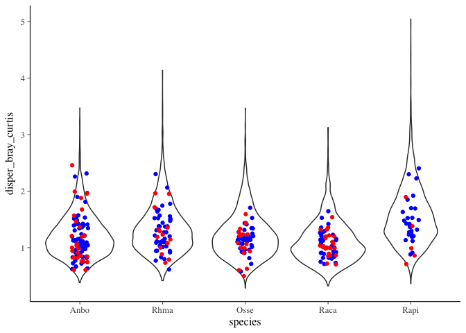

``` r
# Now, we can calculate the probability that the "test" dataset values come from this distribution
# List of individuals
treat_indiv <- unique(mf_treat_without_init_infect$toadID)
# Loop through and calculate probability of having diversity at that level
pre_exp_indiv <- data.frame(toadID=treat_indiv, exp_disper=rep(NA, length(treat_indiv)), p_disper=rep(NA, length(treat_indiv)), infect=rep(NA, length(treat_indiv)))
for ( i in treat_indiv ) {
    n_row <- match(i, treat_indiv)
    sp <- unlist(strsplit(i,"_"))
    num_sp <- match(sp[1], levels(factor(mf_con_without_init_infect$species)))
    temp_disper <- mf_treat_without_init_infect %>%
        filter(toadID==i, time <=5 ) %>%
        filter(!is.na(disper_bray_curtis))%>%
        filter(!is.na(n))%>%
        dplyr::select(disper_bray_curtis) %>%
        # mutate(disper_bray_curtis = log(disper_bray_curtis)) %>%
        pull()
    
    if ( length(temp_disper) > 1) {
        exp_disper <-  (fitdistr((temp_disper), "lognormal")$estimate[1])
        
    } else if ( length(temp_bc) == 1) {
        exp_disper <- exp(temp_disper)
    } else {
        exp_disper <- NA
    }
    
    # dm is disperance matrix; larger exp_mu means more dissimilar. We want to know if MORE dissimilar == MORE infection
    p_disper <- sum(exp_distr[,sp[1]]<exp(exp_disper), na.rm=TRUE)/length(exp_distr[,sp[1]])
    
    ### Did they get infected?
    infect <- max(mf_treat_without_init_infect %>%
                      filter(toadID==i) %>%
                      dplyr::select(eBD_raw) %>%
                      pull()
    )
    
    pre_exp_indiv[n_row,c("exp_disper","p_disper","infect")] <- c(exp_disper, p_disper, infect)
    
}


# Get estimates for control toads
disper_species_exp <- fixef(glmer_disper)  %>%
    as_tibble() %>%
    mutate(species=c("Anbo", "Anma","Lica","Lipi","Osse"))

con_toad_est_disper <- ranef(glmer_disper)$toadID %>%
    rename(sp_est="(Intercept)") %>%
    mutate(toadID=rownames(ranef(glmer_disper)$toadID)) %>%
    separate(toadID, into=c("species","num"), sep="_",remove=FALSE) %>%
    dplyr::select(-num) %>%
    left_join(disper_species_exp, by = "species") %>%
    mutate(est_disper=(sp_est+ value))

con_exp_indiv_disper <- data.frame(toadID=con_toad_est_disper$toadID, exp_disper=rep(NA, length(con_toad_est_disper$toadID)), p_disper=rep(NA, length(con_toad_est_disper$toadID)))
for ( i in 1:nrow(con_toad_est_disper) ) {
    s <- con_toad_est_disper[i,"species"]

    exp_disper <- exp(con_toad_est_disper[i,"est_disper"])
    p_disper <- sum(exp_distr[,s]<exp_disper)/length(exp_distr[,s])

    con_exp_indiv_disper[i,c("exp_disper","p_disper")] <- c(exp_disper, p_disper)
}


# create species column
pre_exp_indiv <- pre_exp_indiv %>%
    separate(toadID, into=c("species","indiv"), remove = FALSE)

# Plot results 
gg_disper_p <- pre_exp_indiv %>%
    filter(!is.na(exp_disper)) %>%
    ggplot(aes(x=p_disper, y=log(infect+1))) +
    geom_smooth(method=lm, se=FALSE) +
    geom_smooth(aes(col=species), method=lm, se=FALSE)+
    geom_point(aes(color=species), cex=4) 
# Raw numbers
gg_disper_raw <- pre_exp_indiv %>%
    filter(!is.na(exp_disper)) %>%
    ggplot(aes(x=exp_disper, y=log(infect+1))) +
    geom_smooth(method=lm, se=FALSE) +
    geom_smooth(aes(col=species), method=lm, se=FALSE)+
    geom_point(aes(color=species), cex=4)
grid.arrange(gg_disper_p, gg_disper_raw, nrow=1)
```

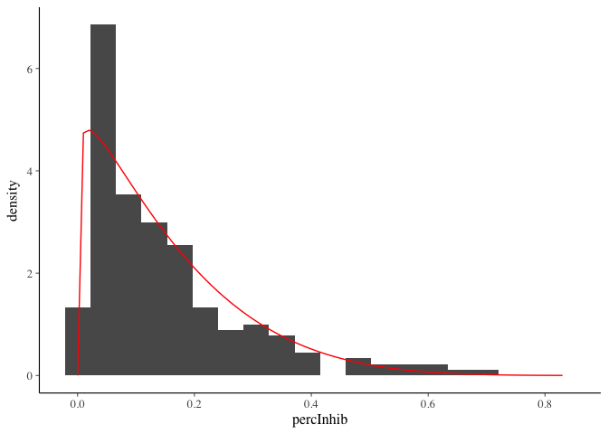

``` r
all_p <- pre_exp_indiv %>%
    dplyr::select(toadID, exp_disper, p_disper) %>%
    full_join(all_p, by="toadID")

##################

#### Distance travelled ####
#### Beta plot
# First, fit a beta distribution
x.fit.beta <- seq(min(mf_con_without_init_infect$distance_bray_curtis, na.rm = TRUE)-sd(mf_con_without_init_infect$distance_bray_curtis, na.rm = TRUE)
                  , max(mf_con_without_init_infect$distance_bray_curtis, na.rm = TRUE)+sd(mf_con_without_init_infect$distance_bray_curtis, na.rm = TRUE)
                  , length.out = 100)
beta.fit <- fitdistr(mf_con_without_init_infect$distance_bray_curtis[!is.na(mf_con_without_init_infect$distance_bray_curtis)]
, densfun="beta", start=list(shape1=6,shape2=6))
y.pred.beta <- dbeta(x.fit.beta, shape1 = beta.fit$estimate[1], shape2 = beta.fit$estimate[2])
# Try a normal too?
beta.fit.norm <- fitdistr(mf_con_without_init_infect$distance_bray_curtis[!is.na(mf_con_without_init_infect$distance_bray_curtis)]
                     , densfun="Normal")
y.pred.beta.norm <- dnorm(x.fit.beta, mean = beta.fit.norm$estimate[1], sd = beta.fit.norm$estimate[2])

mf_con_without_init_infect %>%
    filter(!is.na(distance_bray_curtis)) %>%
    ggplot(aes(x=distance_bray_curtis)) + 
    geom_histogram(aes(y=..density..), bins=25) +
    geom_line(data=data.frame(x=x.fit.beta, y=y.pred.beta), aes(x=x, y=y), col="purple") +
    geom_line(data=data.frame(x=x.fit.beta, y=y.pred.beta.norm), aes(x=x, y=y), col="blue") 
```

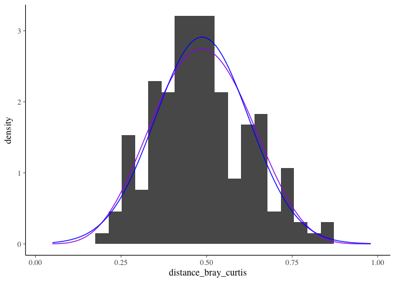

``` r
# Check to see if turnover is changing with time significantly
gg_betatime_con <- mf_con_without_init_infect %>%
    filter(!is.na(distance_bray_curtis)) %>%
    ggplot(aes(x=time, y=distance_bray_curtis)) + 
    geom_line(aes(group=toadID)) +
    geom_point(aes(group=toadID, col=PABD)) +
    scale_color_manual(values=c("blue","red"))+
    facet_grid(~species)
gg_betatime_treat <- mf_treat_without_init_infect %>%
    filter(!is.na(distance_bray_curtis)) %>%
    ggplot(aes(x=time, y=distance_bray_curtis)) + 
    geom_line(aes(group=toadID)) +
    geom_point(aes(group=toadID, col=PABD)) +
    scale_color_manual(values=c("blue","red"))+
    geom_vline(aes(xintercept=5.5))+
    facet_grid(~species)
grid.arrange(gg_betatime_con, gg_betatime_treat, nrow=2)
```

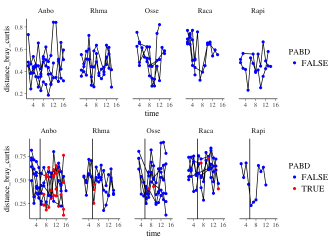

``` r
# Is there an effect of species and time on controls?
# Type I ANOVA (to check for interaction) (AB | A,B)
anova(lm(distance_bray_curtis ~ species*time, data=mf_con_without_init_infect))
```

    ## Analysis of Variance Table
    ## 
    ## Response: distance_bray_curtis
    ##               Df  Sum Sq  Mean Sq F value    Pr(>F)    
    ## species        4 0.50309 0.125772  7.6486 1.161e-05 ***
    ## time           1 0.00416 0.004155  0.2527    0.6159    
    ## species:time   4 0.05099 0.012746  0.7752    0.5429    
    ## Residuals    159 2.61456 0.016444                      
    ## ---
    ## Signif. codes:  0 '***' 0.001 '**' 0.01 '*' 0.05 '.' 0.1 ' ' 1

``` r
# Type II ANOVA with no interaction
Anova(lm(distance_bray_curtis ~ species + time, data=mf_con_without_init_infect), type = 2)
```

    ## Anova Table (Type II tests)
    ## 
    ## Response: distance_bray_curtis
    ##            Sum Sq  Df F value    Pr(>F)    
    ## species   0.47511   4  7.2633 2.086e-05 ***
    ## time      0.00416   1  0.2541    0.6149    
    ## Residuals 2.66554 163                      
    ## ---
    ## Signif. codes:  0 '***' 0.001 '**' 0.01 '*' 0.05 '.' 0.1 ' ' 1

``` r
# Is there an effect of species and time on treatment??
# Type I ANOVA (to check for interaction) (AB | A,B)
anova(lm(distance_bray_curtis ~ species*time, data=mf_treat_without_init_infect))
```

    ## Analysis of Variance Table
    ## 
    ## Response: distance_bray_curtis
    ##               Df Sum Sq  Mean Sq F value   Pr(>F)    
    ## species        4 0.6596 0.164896  6.9084 2.99e-05 ***
    ## time           1 0.0775 0.077468  3.2455  0.07301 .  
    ## species:time   4 0.0392 0.009805  0.4108  0.80078    
    ## Residuals    216 5.1557 0.023869                     
    ## ---
    ## Signif. codes:  0 '***' 0.001 '**' 0.01 '*' 0.05 '.' 0.1 ' ' 1

``` r
# Type II ANOVA with no interaction
Anova(lm(distance_bray_curtis ~ species + time, data=mf_treat_without_init_infect), type = 2)
```

    ## Anova Table (Type II tests)
    ## 
    ## Response: distance_bray_curtis
    ##           Sum Sq  Df F value    Pr(>F)    
    ## species   0.6256   4  6.6233 4.742e-05 ***
    ## time      0.0775   1  3.2807   0.07146 .  
    ## Residuals 5.1949 220                      
    ## ---
    ## Signif. codes:  0 '***' 0.001 '**' 0.01 '*' 0.05 '.' 0.1 ' ' 1

We see that beta diversity is fairly normal, but we probably want to use a beta distribution since it's continuous and bound between 0 and 1. Now, let's fit some models to this data. We should use a GLMM with beta distribution as the response variable to find out the average beta diversity turnover for each species and for each individual through time.
u ~ beta(u\_i, sigma\_i)
u\_i = a\_j
a\_j ~ N(u\_sp, sigma\_sp)
where i = sample, j = individual, sp = species Below, we use the dataset with JUST the controls.

``` r
if ( RERUN_DIST) {
    glmer_dist <- stan_glmer(distance_bray_curtis ~ -1 + species + (1|toadID)
                           , data=mf_con_without_init_infect
                           , family =mgcv::betar
                           , prior_intercept = normal(location = 0.5,scale = 2.5, autoscale = TRUE)
                           , prior = normal(location=0.5, scale=2.5, autoscale=TRUE)
                           , seed= 623445
    )
    save(glmer_dist, file="glmer_dist.RData")
    } else {
        load("glmer_dist.RData")
    }


prior_summary(glmer_dist)
```

    ## Priors for model 'glmer_dist' 
    ## ------
    ## 
    ## Coefficients
    ##  ~ normal(location = [0.5,0.5,0.5,...], scale = [2.5,2.5,2.5,...])
    ## 
    ## Covariance
    ##  ~ decov(reg. = 1, conc. = 1, shape = 1, scale = 1)
    ## ------
    ## See help('prior_summary.stanreg') for more details

``` r
# rbeta has a strange parameterization using a nd b so need to convert mu and phi to this.
a <- function(mu,phi){
    mu*phi
}
b <- function(mu,phi) {
    phi-mu*phi
}
mu <- function(a,phi) {
    a/phi
}
inv_logit <- function(x) {
    exp(x)/(exp(x)+1)
}
logit <- function(p) {
    log(p/(1-p))
}


# Look at distributions according to models
samps_glmer_dist<- rstan::extract(glmer_dist$stanfit)
pre_test_set <- mf_treat_without_init_infect %>%
    filter(time<=5) 
samps_glmer_dist$beta %>%
    as.data.frame() %>%
    rename(Anbo=V1, Anma=V2, Lica=V3, Lipi=V4, Osse=V5) %>%
    mutate(Anbo=inv_logit(Anbo)
           ,Anma=inv_logit(Anma)
           ,Lica=inv_logit(Lica)
           ,Lipi=inv_logit(Lipi)
           ,Osse=inv_logit(Osse)) %>%
    dplyr::select(Anbo,Anma,Lica,Lipi,Osse) %>%
    gather(key=species, value=distance_bray_curtis) %>%
    ggplot(mapping=aes(x=species, y=distance_bray_curtis))+
    geom_violin() +
    geom_point(data=mf_con_without_init_infect, aes(y=distance_bray_curtis, x=species), position = position_jitter(width = 0.1, height=0), col="blue") +
    geom_point(data=pre_test_set, aes(y=distance_bray_curtis, x=species), position=position_jitter(width = 0.1, height=0), col="red")
```

    ## Warning: Removed 38 rows containing missing values (geom_point).

    ## Warning: Removed 27 rows containing missing values (geom_point).

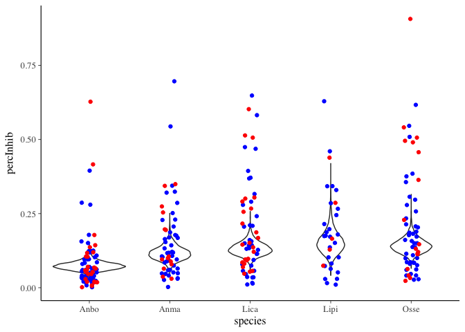

``` r
# Get standard deviation between toad individuals and samples
# samp_sigma <- sigma(glmer_dist)
toadID_sigma <- sd(samps_glmer_dist$b[,ncol(samps_glmer_dist$b)])
phi <- samps_glmer_dist$aux

# Now, we can calculate the probability that the "test" dataset values come from this distribution
# List of individuals
treat_indiv <- unique(mf_treat_without_init_infect$toadID)
# List of each species
species_list <- levels(factor(mf_con_without_init_infect$species))


exp_distr <- as.data.frame(matrix(ncol=length(species_list), nrow=4000, dimnames = list(1:4000, species_list)))
for ( num_sp in 1:length(species_list)) {
    mu <- inv_logit(rnorm(4000, mean=samps_glmer_dist$beta[,num_sp], sd=toadID_sigma))
    
    # exp_distr[,nump_sp] <- mu
    exp_distr[,num_sp] <- rbeta(length(samps_glmer_dist$beta[,num_sp])
                                ,shape1=a(mu,samps_glmer_dist$aux)
                                ,shape2=b(mu,samps_glmer_dist$aux))
    
}


# Now, we can calculate the probability that the "test" dataset values come from this distribution
# List of individuals
treat_indiv <- unique(mf_treat_without_init_infect$toadID)
# Loop through and calculate probability of having diversity at that level
pre_exp_indiv <- data.frame(toadID=treat_indiv, exp_dist=rep(NA, length(treat_indiv)), p_dist=rep(NA, length(treat_indiv)), infect=rep(NA, length(treat_indiv)))
for ( i in treat_indiv ) {
    n_row <- match(i, treat_indiv)
    sp <- unlist(strsplit(i,"_"))
    num_sp <- match(sp[1], levels(factor(mf_con_without_init_infect$species)))
    temp_dist <- mf_treat_without_init_infect %>%
        filter(toadID==i, time <=5 ) %>%
        filter(!is.na(distance_bray_curtis))%>%
        filter(!is.na(n))%>%
        dplyr::select(distance_bray_curtis) %>%
        pull()
    
    if ( length(temp_dist) > 1) {
        exp_dist <-  fitdistr(temp_dist, "normal")$estimate[1]
        # exp_mu <-  fitdistr(temp_dist, "beta", start=list(shape1=1, shape2=1))$estimate[1]
 
    } else if ( length(temp_dist) == 1) {
        exp_dist <- temp_dist
    } else {
        exp_dist <- NA
    }
    
    # dm is distance matrix; larger exp_mu means more dissimilar. We want to know if MORE dissimilar == MORE infection
    p_dist <- sum(exp_distr[,sp[1]]<exp_dist, na.rm=TRUE)/length(exp_distr[,sp[1]])

    ### Did they get infected?
    infect <- max(mf_treat_without_init_infect %>%
                      filter(toadID==i) %>%
                      dplyr::select(eBD_raw) %>%
                      pull()
    )

    pre_exp_indiv[n_row,c("exp_dist","p_dist","infect")] <- c(exp_dist, p_dist, infect)
    
}


# Get estimates for control toads
dist_species_exp <- fixef(glmer_dist)  %>%
    as_tibble() %>%
    mutate(species=c("Anbo", "Anma","Lica","Lipi","Osse","phi")) %>%
    filter(species!="phi")


con_toad_est_dist <- ranef(glmer_dist)$toadID %>%
    rename(sp_est="(Intercept)") %>%
    mutate(toadID=rownames(ranef(glmer_dist)$toadID)) %>%
    separate(toadID, into=c("species","num"), sep="_",remove=FALSE) %>%
    dplyr::select(-num) %>%
    left_join(dist_species_exp, by = "species") %>%
    mutate(est_dist=sp_est+value)

con_exp_indiv_dist <- data.frame(toadID=con_toad_est_dist$toadID, exp_dist=rep(NA, length(con_toad_est_dist$toadID)), p_dist=rep(NA, length(con_toad_est_dist$toadID)))
for ( i in 1:nrow(con_toad_est_dist) ) {
    s <- con_toad_est_dist[i,"species"]
    
    exp_dist <- inv_logit(con_toad_est_dist[i,"est_dist"])
    p_dist <- sum(exp_distr[,s]<exp_dist)/length(exp_distr[,s])
    
    con_exp_indiv_dist[i,c("exp_dist","p_dist")] <- c(exp_dist, p_dist)
}


# create species column
pre_exp_indiv <- pre_exp_indiv %>%
    separate(toadID, into=c("species","indiv"), remove = FALSE)

exp_distr %>%
    gather(key="species",value="d") %>%
    ggplot(aes(x=species, y=d)) +
    geom_violin() +
    geom_point(data=pre_exp_indiv, aes(x=species, y=exp_dist), col="red", position=position_jitter(width=0.1, height=0)) +
    geom_point(data=mf_con_without_init_infect, aes(x=species, y=distance_bray_curtis), col="blue", position=position_jitter(width=0.1, height=0))
```

    ## Warning: Removed 2 rows containing missing values (geom_point).

    ## Warning: Removed 38 rows containing missing values (geom_point).

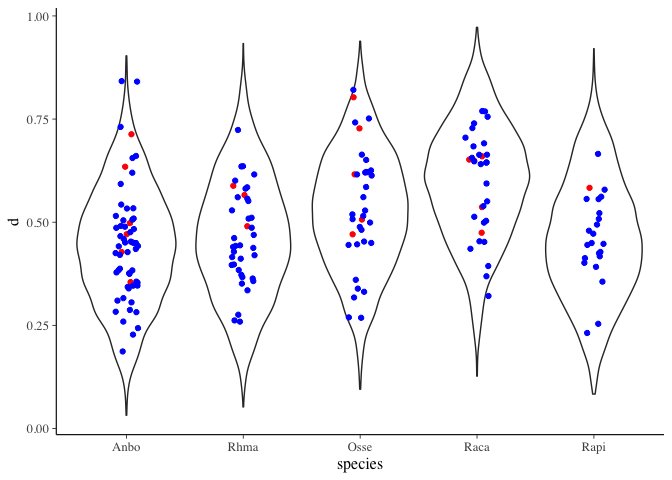

``` r
# Plot results 
gg_beta_p <- pre_exp_indiv %>%
    filter(!is.na(p_dist)) %>%
    ggplot(aes(x=p_dist, y=log(infect+1))) +
    geom_smooth(method=lm, se=FALSE) +
    geom_smooth(aes(col=species), method=lm, se=FALSE)+
    geom_point(aes(color=species), cex=4) 
# Raw numbers
gg_beta_raw <- pre_exp_indiv %>%
    filter(!is.na(exp_dist)) %>%
    ggplot(aes(x=exp_dist, y=log(infect+1))) +
    geom_smooth(method=lm, se=FALSE) +
    geom_smooth(aes(col=species), method=lm, se=FALSE)+
    geom_point(aes(color=species), cex=4)
grid.arrange(gg_beta_p, gg_beta_raw, nrow=1)
```

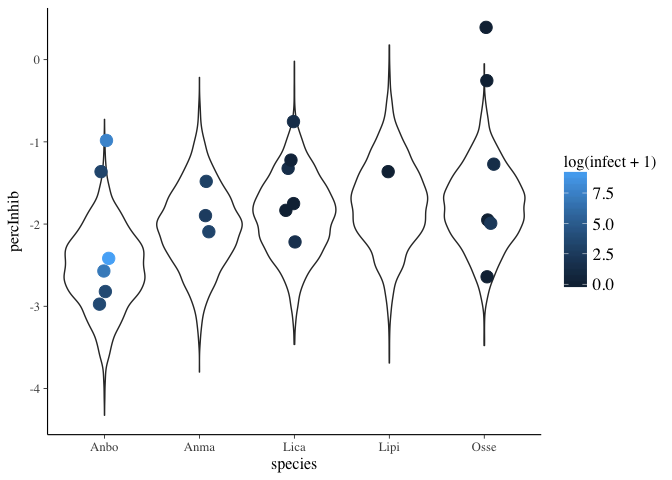

``` r
all_p <- pre_exp_indiv %>%
    dplyr::select(toadID, exp_dist, p_dist) %>%
    full_join(all_p, by="toadID")


#### PERCENT INHIBITORY BETA ####
x.fit.percInhib <- seq(max(min(mf_con_without_init_infect$percInhib, na.rm=TRUE)-sd(mf_con_without_init_infect$percInhib, na.rm=TRUE),0)
                             , max(mf_con_without_init_infect$percInhib, na.rm=TRUE)+sd(mf_con_without_init_infect$percInhib, na.rm=TRUE), length.out = 100)
percInhib.fit <- fitdistr(mf_con_without_init_infect$percInhib[!is.na(mf_con_without_init_infect$percInhib)], densfun = "beta", start=list(shape1=1, shape2=6))
# percInhib.fit <- fitdistr(mf_con_without_init_infect$percInhib[!is.na(mf_con_without_init_infect$percInhib)], densfun = "gamma", start=list(shape=1, rate=8))
y.pred.percInhib <- dbeta(x.fit.percInhib, shape1=percInhib.fit$estimate[1], shape2=percInhib.fit$estimate[2])
# y.pred.percInhib <- dgamma(x.fit.percInhib, shape=percInhib.fit$estimate[1], rate=percInhib.fit$estimate[2])

mf_con_without_init_infect %>%
    filter(!is.na(percInhib)) %>%
    ggplot(aes(y=..density.., x=percInhib)) + 
    geom_histogram(bins=20) +
    geom_line(data=data.frame(x=x.fit.percInhib, y=y.pred.percInhib), aes(x=x,y=y), col="red")
```

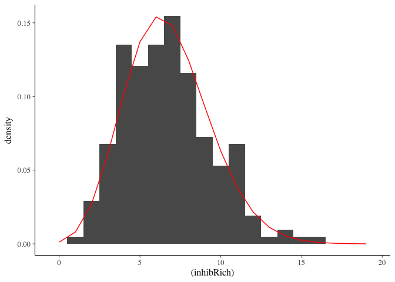

``` r
mf_con_without_init_infect %>%
    filter(!is.na(percInhib)) %>%
    ggplot(aes(x=percInhib)) + 
    geom_histogram(aes(color=species), bins=20,show.legend = FALSE) +
    facet_grid(~species)
```

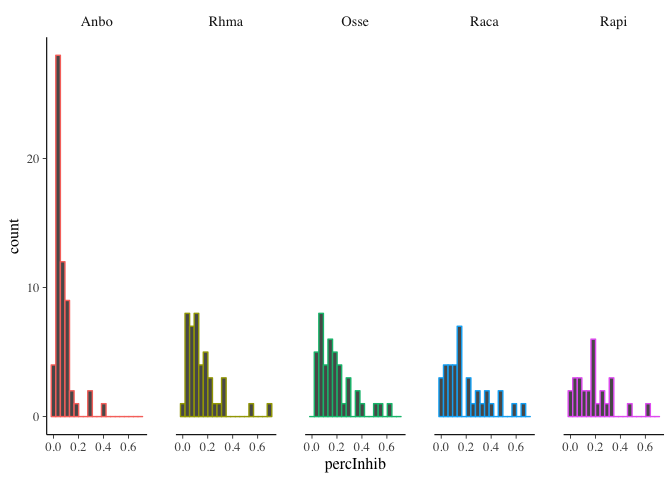

``` r
# Check to see if turnover is changing with time significantly
gg_perctime_con <- mf_con_without_init_infect %>%
    filter(!is.na(percInhib)) %>%
    ggplot(aes(x=time, y=percInhib)) + 
    geom_line(aes(group=toadID)) +
    geom_point(aes(col=PABD)) +
    scale_color_manual(values=c("blue","red"))+
    facet_grid(~species)
gg_perctime_treat <- mf_treat_without_init_infect %>%
    filter(!is.na(percInhib)) %>%
    ggplot(aes(x=time, y=percInhib)) + 
    geom_line(aes(group=toadID)) +
    geom_point(aes(col=PABD)) +
    geom_vline(aes(xintercept=5.5))+
    scale_color_manual(values=c("blue","red"))+
    facet_grid(~species)
grid.arrange(gg_perctime_con, gg_perctime_treat, nrow=2)
```

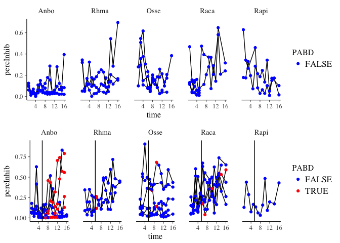

``` r
# Does percent inhibitory change with species or time?
# Type I ANOVA (to test for interaction) in control group?
anova(glm(percInhib ~ species*time, family = binomial(), data=mf_con_without_init_infect, weights=mf_con_without_init_infect$n), test = "Chisq")
```

    ## Analysis of Deviance Table
    ## 
    ## Model: binomial, link: logit
    ## 
    ## Response: percInhib
    ## 
    ## Terms added sequentially (first to last)
    ## 
    ## 
    ##              Df Deviance Resid. Df Resid. Dev  Pr(>Chi)    
    ## NULL                           206     505798              
    ## species       4    73171       202     432627 < 2.2e-16 ***
    ## time          1     4778       201     427849 < 2.2e-16 ***
    ## species:time  4    80748       197     347101 < 2.2e-16 ***
    ## ---
    ## Signif. codes:  0 '***' 0.001 '**' 0.01 '*' 0.05 '.' 0.1 ' ' 1

``` r
# Type III ANOVA (to test for main effects, given interaction) in control group?
Anova(glm(percInhib ~ species*time, family = binomial(), data=mf_con_without_init_infect, weights=mf_con_without_init_infect$n, contrasts=list(species=contr.sum)), type=3)
```

    ## Analysis of Deviance Table (Type III tests)
    ## 
    ## Response: percInhib
    ##              LR Chisq Df Pr(>Chisq)    
    ## species         81206  4     <2e-16 ***
    ## time                0  1     0.7259    
    ## species:time    80748  4     <2e-16 ***
    ## ---
    ## Signif. codes:  0 '***' 0.001 '**' 0.01 '*' 0.05 '.' 0.1 ' ' 1

``` r
# Does percent inhibitory change with species or time in treatment group?
# Type I ANOVA (to test for interaction) in control group?
anova(glm(percInhib ~ species*time, family = binomial(), data=mf_treat_without_init_infect, weights=mf_treat_without_init_infect$n), test = "Chisq")
```

    ## Analysis of Deviance Table
    ## 
    ## Model: binomial, link: logit
    ## 
    ## Response: percInhib
    ## 
    ## Terms added sequentially (first to last)
    ## 
    ## 
    ##              Df Deviance Resid. Df Resid. Dev  Pr(>Chi)    
    ## NULL                           283    1273299              
    ## species       4   163434       279    1109865 < 2.2e-16 ***
    ## time          1   107035       278    1002830 < 2.2e-16 ***
    ## species:time  4    50701       274     952129 < 2.2e-16 ***
    ## ---
    ## Signif. codes:  0 '***' 0.001 '**' 0.01 '*' 0.05 '.' 0.1 ' ' 1

``` r
# Type III ANOVA (to test for main effects, given interaction) in control group?
Anova(glm(percInhib ~ species*time, family = binomial(), data=mf_treat_without_init_infect, weights=mf_treat_without_init_infect$n, contrasts = list(species=contr.sum)), type=3)
```

    ## Analysis of Deviance Table (Type III tests)
    ## 
    ## Response: percInhib
    ##              LR Chisq Df Pr(>Chisq)    
    ## species         42348  4  < 2.2e-16 ***
    ## time            57575  1  < 2.2e-16 ***
    ## species:time    50701  4  < 2.2e-16 ***
    ## ---
    ## Signif. codes:  0 '***' 0.001 '**' 0.01 '*' 0.05 '.' 0.1 ' ' 1

We see that beta diversity is fairly normal. Now, let's fit some models to this data. We should use a GLMM with binomial as the response variable to find out the average beta diversity turnover for each species and for each individual through time.
u ~ BETA(s1\_i, s1\_i)
s1\_i = a\_j
a\_j ~ N(u\_sp, sigma\_sp)
s2\_i = b\_j
b\_j ~ N(u\_sp, sigma\_sp)  where i = sample, j = individual, sp = species Below, we use the dataset with JUST the controls.

``` r
if ( RERUN_PERCINHIB) {
    glmer_percInhib <- stan_glmer(percInhib ~ -1 + species + (1|toadID)
                           , data=mf_con_without_init_infect
                           , family =mgcv::betar
                           , prior_intercept = normal(location = 0.5,scale = 2.5, autoscale = TRUE)
                           , prior = normal(location=0.5, scale=2.5, autoscale=TRUE)
                           , seed= 54392
    )
    save(glmer_percInhib, file="glmer_percInhib.RData")
} else {
    load("glmer_percInhib.RData")
}
prior_summary(glmer_percInhib)
```

    ## Priors for model 'glmer_percInhib' 
    ## ------
    ## 
    ## Coefficients
    ##  ~ normal(location = [0.5,0.5,0.5,...], scale = [2.5,2.5,2.5,...])
    ## 
    ## Covariance
    ##  ~ decov(reg. = 1, conc. = 1, shape = 1, scale = 1)
    ## ------
    ## See help('prior_summary.stanreg') for more details

``` r
# rbeta has a strange parameterization using a nd b so need to convert mu and phi to this.
a <- function(mu,phi){
    mu*phi
}
b <- function(mu,phi) {
    phi-mu*phi
}
mu <- function(a,phi) {
    a/phi
}
inv_logit <- function(x) {
    exp(x)/(exp(x)+1)
}
logit <- function(p) {
    log(p/(1-p))
}

# Look at distributions according to models
samps_glmer_percInhib<- rstan::extract(glmer_percInhib$stanfit)
pre_test_set <- mf_treat_without_init_infect %>%
    filter(time<=5) 
samps_glmer_percInhib$beta %>%
    as.data.frame() %>%
    rename(Anbo=V1, Anma=V2, Lica=V3, Lipi=V4, Osse=V5) %>%
    mutate(Anbo=inv_logit(Anbo)
           ,Anma=inv_logit(Anma)
           ,Lica=inv_logit(Lica)
           ,Lipi=inv_logit(Lipi)
           ,Osse=inv_logit(Osse)) %>%
    dplyr::select(Anbo,Anma,Lica,Lipi,Osse) %>%
    gather(key=species, value=percInhib) %>%
    ggplot(mapping=aes(x=species, y=percInhib))+
    geom_violin() +
    geom_point(data=mf_con_without_init_infect, aes(y=percInhib, x=species), position = position_jitter(width = 0.1, height=0), col="blue") +
    geom_point(data=pre_test_set, aes(y=percInhib, x=species), position=position_jitter(width = 0.1, height=0), col="red")
```

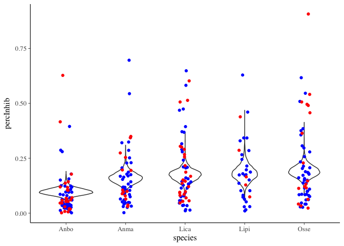

``` r
# Get standard deviation between toad individuals and samples
# samp_sigma <- sigma(glmer_BC)
toadID_sigma <- sd(samps_glmer_percInhib$b[,ncol(samps_glmer_percInhib$b)])
phi <- samps_glmer_percInhib$aux

# Now, we can calculate the probability that the "test" dataset values come from this distribution
# List of individuals
treat_indiv <- unique(mf_treat_without_init_infect$toadID)
# List of each species
species_list <- levels(factor(mf_con_without_init_infect$species))

exp_distr <- as.data.frame(matrix(ncol=length(species_list), nrow=4000, dimnames = list(1:4000, species_list)))
for ( num_sp in 1:length(species_list)) {
    mu <- inv_logit(rnorm(4000, mean=samps_glmer_percInhib$beta[,num_sp], sd=toadID_sigma))
    # exp_distr[,nump_sp] <- mu
    exp_distr[,num_sp] <- rbeta(length(samps_glmer_percInhib$beta[,num_sp])
                                ,shape1=a(mu,samps_glmer_percInhib$aux)
                                ,shape2=b(mu,samps_glmer_percInhib$aux))
    
    # exp_distr[,num_sp] <- rnorm(length(samps_glmer_BC$beta[,num_sp]), mean=rnorm(length(samps_glmer_BC$beta[,num_sp]), mean=samps_glmer_BC$beta[,num_sp], sd=toadID_sigma), sd=samp_sigma)
}


# Now, we can calculate the probability that the "test" dataset values come from this distribution
# List of individuals
treat_indiv <- unique(mf_treat_without_init_infect$toadID)
# Loop through and calculate probability of having diversity at that level
pre_exp_indiv <- data.frame(toadID=treat_indiv, exp_percInhib=rep(NA, length(treat_indiv)), p_percInhib=rep(NA, length(treat_indiv)), infect=rep(NA, length(treat_indiv)))
for ( i in treat_indiv ) {
    n_row <- match(i, treat_indiv)
    sp <- unlist(strsplit(i,"_"))
    num_sp <- match(sp[1], levels(factor(mf_con_without_init_infect$species)))
    temp_percInhib <- mf_treat_without_init_infect %>%
        filter(toadID==i, time <=5 ) %>%
        filter(!is.na(percInhib))%>%
        filter(!is.na(n))%>%
        dplyr::select(percInhib) %>%
        pull()
    
    if ( length(temp_percInhib) > 1) {
        exp_percInhib <-  fitdistr(temp_percInhib, "normal")$estimate[1]
        # exp_mu <-  fitdistr(temp_bc, "beta", start=list(shape1=0.1, shape2=0.1))$estimate[1]
    } else if ( length(temp_percInhib) == 1) {
        exp_percInhib <- temp_percInhib
    } else {
        exp_percInhib <- NA
    }
    
    # dm is distance matrix; larger exp_percInhib means more dissimilar. We want to know if MORE dissimilar == MORE infection
    p_percInhib <- sum(exp_distr[,sp[1]]<exp_percInhib, na.rm=TRUE)/length(exp_distr[,sp[1]])
    
    ### Did they get infected?
    infect <- max(mf_treat_without_init_infect %>%
                      filter(toadID==i) %>%
                      dplyr::select(eBD_raw) %>%
                      pull()
    )
    
    pre_exp_indiv[n_row,c("exp_percInhib","p_percInhib","infect")] <- c(exp_percInhib, p_percInhib, infect)
    
}


# Get estimates for control toads
percInhib_species_exp <- fixef(glmer_percInhib)  %>%
    as_tibble() %>%
    mutate(species=c("Anbo", "Anma","Lica","Lipi","Osse","phi")) 


con_toad_est_percInhib <- ranef(glmer_percInhib)$toadID %>%
    rename(sp_est="(Intercept)") %>%
    mutate(toadID=rownames(ranef(glmer_percInhib)$toadID)) %>%
    separate(toadID, into=c("species","num"), sep="_",remove=FALSE) %>%
    dplyr::select(-num) %>%
    left_join(percInhib_species_exp, by = "species") %>%
    mutate(est_percInhib=sp_est+value)

con_exp_indiv_percInhib <- data.frame(toadID=con_toad_est_percInhib$toadID, exp_percInhib=rep(NA, length(con_toad_est_percInhib$toadID)), p_percInhib=rep(NA, length(con_toad_est_percInhib$toadID)))
for ( i in 1:nrow(con_toad_est_percInhib) ) {
    s <- con_toad_est_percInhib[i,"species"]
    
    exp_percInhib <- inv_logit(con_toad_est_percInhib[i,"est_percInhib"])
    p_percInhib <- sum(exp_distr[,s]<exp_percInhib)/length(exp_distr[,s])
    
    con_exp_indiv_percInhib[i,c("exp_percInhib","p_percInhib")] <- c(exp_percInhib, p_percInhib)
}


# create species column
pre_exp_indiv <- pre_exp_indiv %>%
    separate(toadID, into=c("species","indiv"), remove = FALSE)

exp_distr %>%
    gather(key="species",value="d") %>%
    ggplot(aes(x=species, y=d)) +
    geom_violin() +
    geom_point(data=pre_exp_indiv, aes(x=species, y=exp_percInhib), col="red", position=position_jitter(width=0.1, height=0)) +
    geom_point(data=mf_con_without_init_infect, aes(x=species, y=percInhib), col="blue", position=position_jitter(width=0.1, height=0))
```

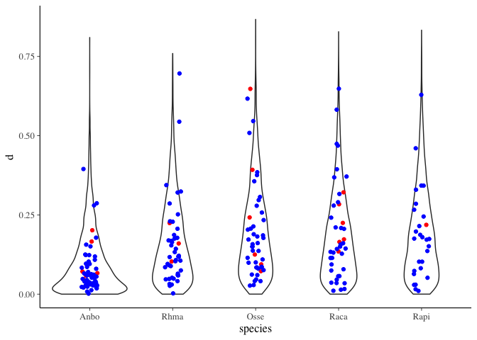

``` r
# Plot results 
gg_pinhib_p <- pre_exp_indiv %>%
    filter(!is.na(p_percInhib)) %>%
    ggplot(aes(x=p_percInhib, y=log(infect+1))) +
    geom_smooth(method=lm, se=FALSE) +
    geom_smooth(aes(col=species), method=lm, se=FALSE)+
    geom_point(aes(color=species), cex=4) 
# Raw numbers
gg_pinhib_raw <- pre_exp_indiv %>%
    filter(!is.na(exp_percInhib)) %>%
    ggplot(aes(x=exp_percInhib, y=log(infect+1))) +
    geom_smooth(method=lm, se=FALSE) +
    geom_smooth(aes(col=species), method=lm, se=FALSE)+
    geom_point(aes(color=species), cex=4)
grid.arrange(gg_pinhib_p, gg_pinhib_raw, nrow=1)
```

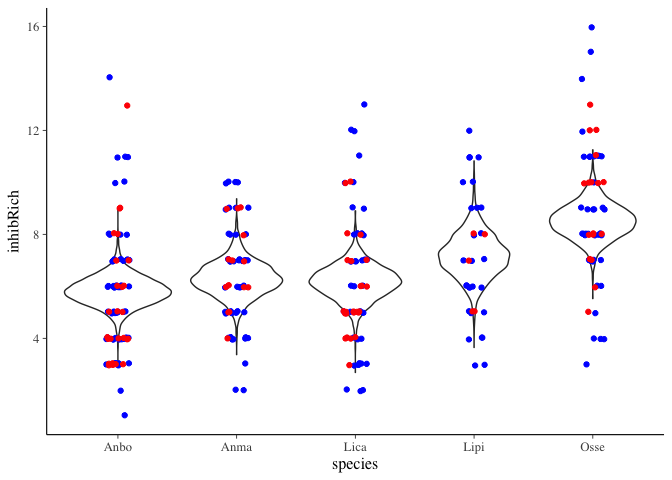

``` r
all_p <- pre_exp_indiv %>%
    dplyr::select(toadID, exp_percInhib, p_percInhib) %>%
    full_join(all_p, by="toadID")

#### INHIB RICHNESS ####

### Fit a poisson and log poisson to see fit
x.fit.inhibRich <- round(seq(0,max((mf_con_without_init_infect$inhibRich), na.rm=TRUE)+sd((mf_con_without_init_infect$inhibRich), na.rm=TRUE), length.out = 100))

inhibRich.fit <- fitdistr((mf_con_without_init_infect$inhibRich), densfun = "Poisson")
y.pred.inhibRich <- dpois(x.fit.inhibRich, lambda = (inhibRich.fit$estimate[1]))

ggplot(data=mf_con_without_init_infect, aes(x=(inhibRich))) +
    geom_histogram(aes(y=..density..), bins=20, show.legend = FALSE) +
    geom_line(data=data.frame(x=(x.fit.inhibRich), y=y.pred.inhibRich), aes(x=x,y=y), col="red")
```

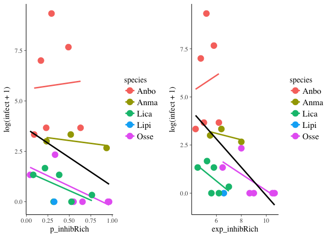

``` r
# Check to see if turnover is changing with time significantly
gg_inhibtime_con <- mf_con_without_init_infect %>%
    filter(!is.na(inhibRich)) %>%
    ggplot(aes(x=time, y=inhibRich)) + 
    geom_line(aes(group=toadID)) +
    geom_point(aes(col=PABD))+
    scale_color_manual(values=c("blue","red"))+
    facet_grid(~species)
gg_inhibtime_treat <- mf_treat_without_init_infect %>%
    filter(!is.na(inhibRich)) %>%
    ggplot(aes(x=time, y=inhibRich)) + 
    geom_line(aes(group=toadID)) +
    geom_point(aes(col=PABD))+
    geom_vline(aes(xintercept=5.5))+
    scale_color_manual(values=c("blue","red"))+
    facet_grid(~species)
grid.arrange(gg_inhibtime_con, gg_inhibtime_treat, nrow=2)
```

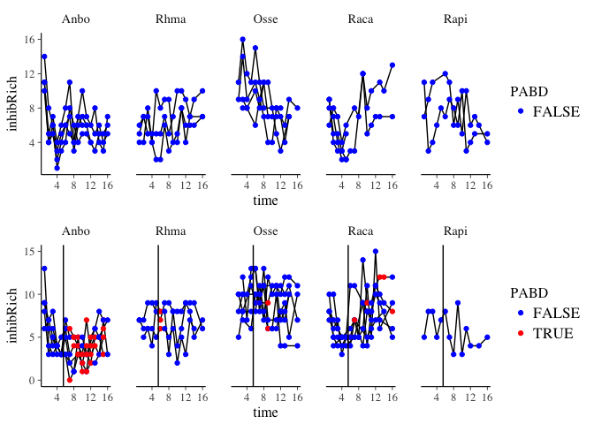

``` r
# Does proportion of inhibitory bacteria differ betwen species and time points?
# Type I ANOVA to test for interactions in control
anova(glm(inhibRich ~ species*time, data=mf_con_without_init_infect, family=poisson()), test="Chisq")
```

    ## Analysis of Deviance Table
    ## 
    ## Model: poisson, link: log
    ## 
    ## Response: inhibRich
    ## 
    ## Terms added sequentially (first to last)
    ## 
    ## 
    ##              Df Deviance Resid. Df Resid. Dev  Pr(>Chi)    
    ## NULL                           206     232.35              
    ## species       4  29.2924       202     203.06 6.818e-06 ***
    ## time          1   0.6686       201     202.39    0.4135    
    ## species:time  4  31.3583       197     171.03 2.587e-06 ***
    ## ---
    ## Signif. codes:  0 '***' 0.001 '**' 0.01 '*' 0.05 '.' 0.1 ' ' 1

``` r
# TYpe III ANOVA to test for main effects with interactions in control
Anova(glm(inhibRich ~ species*time, data=mf_con_without_init_infect, family=poisson(), contrasts=list(species=contr.sum)),type=3)
```

    ## Analysis of Deviance Table (Type III tests)
    ## 
    ## Response: inhibRich
    ##              LR Chisq Df Pr(>Chisq)    
    ## species        42.494  4  1.318e-08 ***
    ## time            0.726  1     0.3942    
    ## species:time   31.358  4  2.587e-06 ***
    ## ---
    ## Signif. codes:  0 '***' 0.001 '**' 0.01 '*' 0.05 '.' 0.1 ' ' 1

``` r
# Type I ANOVA to test for interactions
anova(glm(inhibRich ~ species*time, data=mf_treat_without_init_infect, family=poisson()), test="Chisq")
```

    ## Analysis of Deviance Table
    ## 
    ## Model: poisson, link: log
    ## 
    ## Response: inhibRich
    ## 
    ## Terms added sequentially (first to last)
    ## 
    ## 
    ##              Df Deviance Resid. Df Resid. Dev  Pr(>Chi)    
    ## NULL                           283     361.86              
    ## species       4  130.642       279     231.22 < 2.2e-16 ***
    ## time          1    0.033       278     231.19  0.856329    
    ## species:time  4   18.271       274     212.92  0.001092 ** 
    ## ---
    ## Signif. codes:  0 '***' 0.001 '**' 0.01 '*' 0.05 '.' 0.1 ' ' 1

``` r
# TYpe III ANOVA to test for main effects with interactions
Anova(glm(inhibRich ~ species*time, data=mf_treat_without_init_infect, family=poisson(), contrasts = list(species=contr.sum)),type=3)
```

    ## Analysis of Deviance Table (Type III tests)
    ## 
    ## Response: inhibRich
    ##              LR Chisq Df Pr(>Chisq)    
    ## species       23.8941  4  8.387e-05 ***
    ## time           0.7994  1   0.371281    
    ## species:time  18.2715  4   0.001092 ** 
    ## ---
    ## Signif. codes:  0 '***' 0.001 '**' 0.01 '*' 0.05 '.' 0.1 ' ' 1

``` r
if (RERUN_INHIBRICH) {
    glmer_inhibRich <- stan_glmer(inhibRich ~ species + (1|toadID), data=mf_con_without_init_infect
                                  , prior = normal(0, 10, autoscale = TRUE)
                                  , family= poisson(link="identity")
                                  , seed = 5423409)
    save(glmer_inhibRich, file="glmer_inhibRich.RData")
} else {
    load(file="glmer_inhibRich.RData")

}
prior_summary(glmer_inhibRich)
```

    ## Priors for model 'glmer_inhibRich' 
    ## ------
    ## Intercept (after predictors centered)
    ##  ~ normal(location = 0, scale = 10)
    ## 
    ## Coefficients
    ##  ~ normal(location = [0,0,0,...], scale = [10,10,10,...])
    ## 
    ## Covariance
    ##  ~ decov(reg. = 1, conc. = 1, shape = 1, scale = 1)
    ## ------
    ## See help('prior_summary.stanreg') for more details

``` r
# Look at distributions according to models
samps_glmer_inhibRich <- rstan::extract(glmer_inhibRich$stanfit)
pre_test_set <- mf_treat_without_init_infect %>%
    filter(time<6) 

new_samps_beta <- samps_glmer_inhibRich$beta %>%
    as.data.frame() %>%
    mutate(V0=samps_glmer_inhibRich$alpha[,1]) %>%
    transmute(Anbo=V0, Anma=V0+V1, Lica=V0+V2, Lipi=V0+V3, Osse=V0+V4) %>%
    dplyr::select(Anbo,Anma,Lica,Lipi,Osse)
new_samps_beta %>% 
    gather(key=species, value=inhibRich) %>%
    ggplot(mapping=aes(x=species, y=inhibRich))+
    geom_violin() +
    geom_point(data=mf_con_without_init_infect, aes(y=(inhibRich), x=species), position = position_jitter(width = 0.1, height=0.05), col="blue") +
    geom_point(data=pre_test_set, aes(y=(inhibRich), x=species), position=position_jitter(width = 0.1, height=0.05), col="red")
```

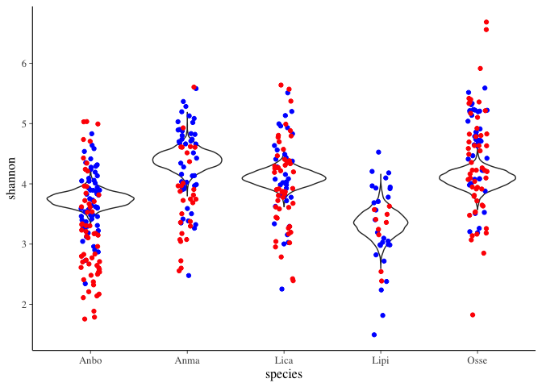

``` r
# Get standard deviation between toad individuals and samples
toadID_sigma <- sd(samps_glmer_inhibRich$b[,ncol(samps_glmer_inhibRich$b)])

# Now, we can calculate the probability that the "test" dataset values come from this distribution
# List of individuals
treat_indiv <- unique(mf_treat_without_init_infect$toadID)
# List of each species
species_list <- levels(factor(mf_con_without_init_infect$species))

exp_distr <- as.data.frame(matrix(ncol=length(species_list), nrow=4000, dimnames = list(1:4000, species_list)))
for ( num_sp in 1:length(species_list)) {
    exp_distr[,num_sp] <- rnorm(length(new_samps_beta[,num_sp]), mean=new_samps_beta[,num_sp], sd=toadID_sigma)
}

# Loop through and calculate probability of having diversity at that level
pre_exp_indiv <- data.frame(toadID=treat_indiv, exp_inhibRich=rep(NA, length(treat_indiv)), p_inhibRich=rep(NA, length(treat_indiv)), infect=rep(NA, length(treat_indiv)))
for ( i in treat_indiv ) {
    n_row <- match(i, treat_indiv)
    sp <- unlist(strsplit(i,"_"))
    num_sp <- match(sp[1], levels(factor(mf_con_without_init_infect$species)))
    temp_rich <- mf_treat_without_init_infect %>%
        filter(toadID==i, time <=5 ) %>%
        dplyr::select(inhibRich) %>%
        pull()
    if ( length(temp_rich)>1 ) {
        exp_inhibRich <-  fitdistr((temp_rich), "Poisson")$estimate[1]
        
    } else {
        exp_inhibRich <- log(temp_rich)
    }
    
    p_inhibRich <- sum(exp_distr[,sp[1]]<exp_inhibRich)/length(exp_distr[,sp[1]])
    
    ### Did they get infected? 
    infect <- max(mf_treat_without_init_infect %>%
                      filter(toadID==i) %>%
                      dplyr::select(eBD_raw) %>%
                      pull()
    )
    
    pre_exp_indiv[n_row,c("exp_inhibRich","p_inhibRich","infect")] <- c(exp_inhibRich, p_inhibRich, infect)
    
}

# Get estimates for control toads
inhib_species_exp <- fixef(glmer_inhibRich)  %>%
    as_tibble() %>%
    mutate(species=c("Anbo", "Anma","Lica","Lipi","Osse"))
inhib_species_exp$value[2:5] <- unlist(c(inhib_species_exp[1,1]+inhib_species_exp[2,1]
                                         , inhib_species_exp[1,1]+inhib_species_exp[3,1]
                                         , inhib_species_exp[1,1]+inhib_species_exp[4,1]
                                         , inhib_species_exp[1,1]+inhib_species_exp[5,1]))

con_toad_est_inhib <- ranef(glmer_inhibRich)$toadID %>%
    rename(sp_est="(Intercept)") %>%
    mutate(toadID=rownames(ranef(glmer_inhibRich)$toadID)) %>%
    separate(toadID, into=c("species","num"), sep="_",remove=FALSE) %>%
    dplyr::select(-num) %>%
    left_join(inhib_species_exp, by = "species") %>%
    mutate(est_inhib=sp_est+value)

con_exp_indiv_inhib <- data.frame(toadID=con_toad_est_inhib$toadID, exp_inhibRich=rep(NA, length(con_toad_est_inhib$toadID)), p_inhibRich=rep(NA, length(con_toad_est_inhib$toadID)))
for ( i in 1:nrow(con_toad_est_inhib) ) {
    s <- con_toad_est_inhib[i,"species"]
    
    exp_rich <- con_toad_est_inhib[i,"est_inhib"]
    p_rich <- sum(exp_distr[,s]<exp_rich)/length(exp_distr[,s])
    
    con_exp_indiv_inhib[i,c("exp_inhibRich","p_inhibRich")] <- c(exp_rich, p_rich)
}

# create species column
pre_exp_indiv <- pre_exp_indiv %>%
    separate(toadID, into=c("species","indiv"), remove = FALSE)

# Plot results 
gg_inhibRich_p <- ggplot(pre_exp_indiv, aes(x=p_inhibRich, y=log(infect+1))) +
    geom_smooth(aes(color=species),method=lm, se = FALSE) +
    geom_point(aes(color=species), cex=4) +
    geom_smooth(method=lm, se=FALSE, col="black")
gg_inhibRich_raw <- ggplot(pre_exp_indiv, aes(x=exp_inhibRich, y=log(infect+1))) +
    geom_smooth(aes(color=species),method=lm, se = FALSE) +
    geom_point(aes(color=species), cex=4) +
    geom_smooth(method=lm, se=FALSE, col="black")
grid.arrange(gg_inhibRich_p, gg_inhibRich_raw, nrow=1)
```

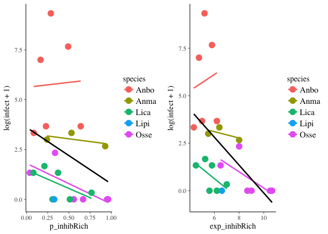

``` r
exp_distr %>%
    gather(key=species, value=loginhibRich) %>%
    ggplot(aes(x=species, y=loginhibRich)) +
    geom_violin() +
    geom_point(data=pre_exp_indiv, aes(x=species, y=exp_inhibRich, col=log(infect+1)), cex=4, position=position_jitter(height=0, width=0.1))
```

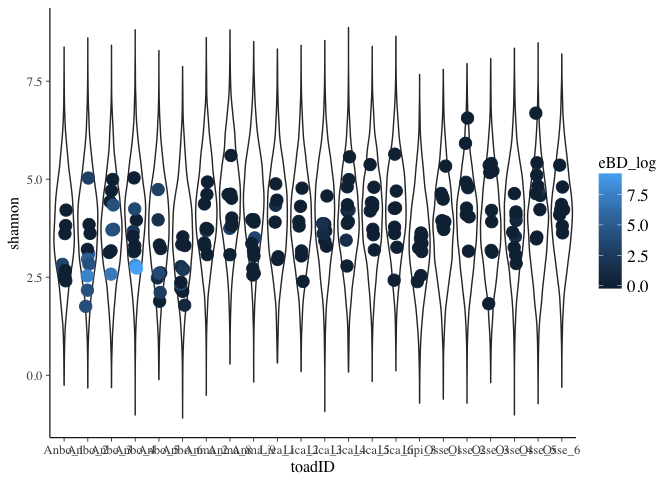

``` r
all_p <- pre_exp_indiv %>%
    dplyr::select(toadID, exp_inhibRich, p_inhibRich) %>%
    full_join(all_p, by="toadID")

##### Save all work #####
save(all_p, file="all_p.RData")

##### PART II: Now, how does infection itself affect the microbiome? #####
mf_all_noinfect <-rbind(mf_treat_without_init_infect, mf_con_without_init_infect) %>%
    filter(!(BD_infected=="y" & exposure=="Post")) 

##### SHANNON ####

if ( RERUN_RICH ) {
    lmer_shannon_all <- stan_lmer(shannon ~ -1 + species + (1|toadID), data=mf_all_noinfect
                              , prior = normal(0, 10, autoscale = TRUE)
                              , seed = 98374)
    save(lmer_shannon_all, file="lmer_shannon_all.RData")
} else {
    load("lmer_shannon_all.RData")
}
prior_summary(lmer_shannon_all)
```

    ## Priors for model 'lmer_shannon_all' 
    ## ------
    ## 
    ## Coefficients
    ##  ~ normal(location = [0,0,0,...], scale = [10,10,10,...])
    ##      **adjusted scale = [7.77,7.77,7.77,...]
    ## 
    ## Auxiliary (sigma)
    ##  ~ exponential(rate = 1)
    ##      **adjusted scale = 0.78 (adjusted rate = 1/adjusted scale)
    ## 
    ## Covariance
    ##  ~ decov(reg. = 1, conc. = 1, shape = 1, scale = 1)
    ## ------
    ## See help('prior_summary.stanreg') for more details

``` r
# Look at distributions according to models
samps_lmer_shannon_all <- rstan::extract(lmer_shannon_all$stanfit)
post_test_set <- mf_treat_without_init_infect %>%
    filter(time>=6) 
## PLOT OF EXPECTED RCIHNESS FOR EACH SPECIES
samps_lmer_shannon_all$beta %>%
    as.data.frame() %>%
    rename(Anbo=V1, Anma=V2, Lica=V3, Lipi=V4, Osse=V5) %>%
    dplyr::select(Anbo,Anma,Lica,Lipi,Osse) %>%
    gather(key=species, value=shannon) %>%
    ggplot(mapping=aes(x=species, y=shannon))+
    geom_violin() +
    geom_point(data=mf_con_without_init_infect, aes(y=shannon, x=species), position = position_jitter(width = 0.1, height=0), col="blue") +
    geom_point(data=post_test_set, aes(y=shannon, x=species), position=position_jitter(width = 0.1, height=0), col="red")
```

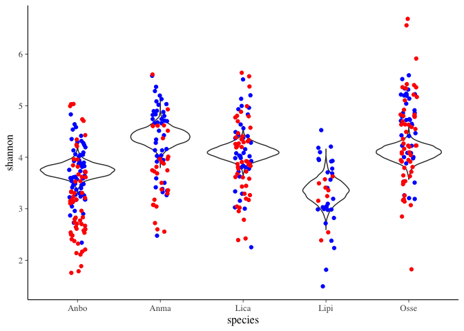

``` r
# Get standard deviation between toad individuals and samples
samp_sigma <- samps_lmer_shannon_all$aux
toad_intercept <- ranef(lmer_shannon_all)$toadID
# toadID_sigma <- sd(samps_lmer_shannon_all$b[,ncol(samps_lmer_shannon_all$b)])
samp_toad <- samps_lmer_shannon_all$b[,1:nrow(toad_intercept)]
colnames(samp_toad) <- rownames(toad_intercept)

# Now, we can calculate the probability that the "test" dataset values come from this distribution
# List of individuals
treat_indiv <- unique(mf_treat_without_init_infect$toadID)
# Make key of species for each individual?
species_key <- treat_indiv %>%
    as_tibble() %>%
    rename(toadID=value) %>%
    separate(toadID,into=c("species","indiv"), remove=FALSE)
species_order <- levels(as.factor(mf_all_noinfect$species))

exp_distr <- as.data.frame(matrix(ncol=length(treat_indiv), nrow=4000, dimnames = list(1:4000, treat_indiv)))
for ( num_indiv in 1:length(treat_indiv)) {
    indiv <- treat_indiv[num_indiv]
    sp <- pull(species_key[num_indiv,"species"])
    num_sp <- match(sp, species_order)
    exp_distr[,num_indiv] <- rnorm(4000, mean=rnorm(4000, mean=(samps_lmer_shannon_all$beta[,num_sp]+samp_toad[,indiv]), sd=samp_sigma))
}

pos_exp_indiv <- mf_treat_without_init_infect %>%
    filter(time>5) %>%
    dplyr::select(toadID, time, species, shannon, eBD_log) %>%
    mutate(p_shan=NA)
for ( r in 1:nrow(pos_exp_indiv)) {
    pos_exp_indiv[r,"p_shan"] <- sum(exp_distr[,pos_exp_indiv$toadID[r]]<pos_exp_indiv[r,"shannon"])/4000
}

gg_shan_pos_p <- pos_exp_indiv %>%
    ggplot(aes(x=p_shan, y=eBD_log)) +
    geom_point(aes(col=species), cex=3, position=position_jitter(height=0.15)) +
    geom_smooth(aes(col=species), method="lm",se=FALSE) +
    geom_smooth(method="lm", se=FALSE, col="black")
gg_shan_pos_raw <- pos_exp_indiv %>%
    ggplot(aes(x=shannon, y=eBD_log)) +
    geom_point(aes(col=species), cex=3, position=position_jitter(height=0.15)) +
    geom_smooth(aes(col=species), method="lm",se=FALSE) +
    geom_smooth(method="lm", se=FALSE, col="black")
grid.arrange(gg_shan_pos_p, gg_shan_pos_raw, nrow=1)
```

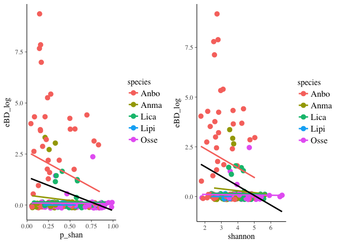

``` r
exp_distr %>%
    gather(key=toadID, value=shannon) %>%
    ggplot(aes(x=toadID, y=shannon)) +
    geom_violin() +
    geom_point(data=pos_exp_indiv, aes(x=toadID, y=shannon, col=eBD_log),cex=4, position=position_jitter(height=0, width=0.1))
```

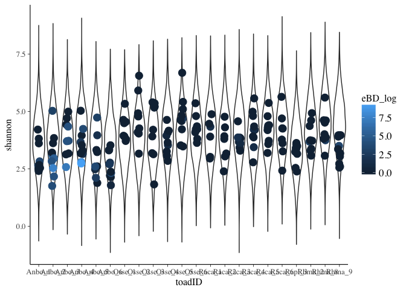

``` r
all_p_infected <- pos_exp_indiv


#### RICHNESS (observed otus) #####

if ( RERUN_RICH ) {
    lmer_rich_all <- stan_lmer(logRich ~ -1 + species + (1|toadID), data=mf_all_noinfect
                           , prior = normal(0, 10, autoscale = TRUE)
                           , seed = 98374)
    save(lmer_rich_all, file="lmer_rich_all.RData")
} else {
    load(file="lmer_rich_all.RData")
}
prior_summary(lmer_rich_all)
```

    ## Priors for model 'lmer_rich_all' 
    ## ------
    ## 
    ## Coefficients
    ##  ~ normal(location = [0,0,0,...], scale = [10,10,10,...])
    ##      **adjusted scale = [4.37,4.37,4.37,...]
    ## 
    ## Auxiliary (sigma)
    ##  ~ exponential(rate = 1)
    ##      **adjusted scale = 0.44 (adjusted rate = 1/adjusted scale)
    ## 
    ## Covariance
    ##  ~ decov(reg. = 1, conc. = 1, shape = 1, scale = 1)
    ## ------
    ## See help('prior_summary.stanreg') for more details

``` r
# Look at distributions according to models
samps_lmer_rich_all <- rstan::extract(lmer_rich_all$stanfit)
pos_test_set <- mf_treat_without_init_infect %>%
    filter(time>=6) 
# Plot of expected by species, and real samples
samps_lmer_rich_all$beta %>%
    as.data.frame() %>%
    rename(Anbo=V1, Anma=V2, Lica=V3, Lipi=V4, Osse=V5) %>%
    dplyr::select(Anbo,Anma,Lica,Lipi,Osse) %>%
    gather(key=species, value=logRich) %>%
    ggplot(mapping=aes(x=species, y=logRich))+
    geom_violin() +
    geom_point(data=mf_all_noinfect, aes(y=logRich, x=species), position = position_jitter(width = 0.1, height=0), col="blue") +
    geom_point(data=pos_test_set, aes(y=logRich, x=species), position=position_jitter(width = 0.1, height=0), col="red")
```

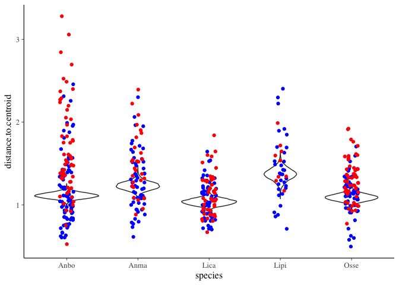

``` r
# Get standard deviation between toad individuals and samples
samp_sigma <- samps_lmer_rich_all$aux
toad_intercept <- ranef(lmer_rich_all)$toadID
samp_toad <- samps_lmer_rich_all$b[,1:nrow(toad_intercept)]
colnames(samp_toad) <- rownames(toad_intercept)

# Now, we can calculate the probability that the "test" dataset values come from this distribution
# List of individuals
treat_indiv <- unique(mf_treat_without_init_infect$toadID)
# Make key of species for each individual?
species_key <- treat_indiv %>%
    as_tibble() %>%
    rename(toadID=value) %>%
    separate(toadID,into=c("species","indiv"), remove=FALSE)
species_order <- levels(as.factor(mf_all_noinfect$species))

exp_distr <- as.data.frame(matrix(ncol=length(treat_indiv), nrow=4000, dimnames = list(1:4000, treat_indiv)))
for ( num_indiv in 1:length(treat_indiv)) {
    indiv <- treat_indiv[num_indiv]
    sp <- pull(species_key[num_indiv,"species"])
    num_sp <- match(sp, species_order)
    exp_distr[,num_indiv] <- rnorm(4000, mean=rnorm(4000, mean=(samps_lmer_rich_all$beta[,num_sp]+samp_toad[,indiv]), sd=samp_sigma))
}

pos_exp_indiv <- mf_treat_without_init_infect %>%
    filter(time>5) %>%
    dplyr::select(toadID, time, species, logRich, eBD_log) %>%
    mutate(p_rich=NA)
for ( r in 1:nrow(pos_exp_indiv)) {
    pos_exp_indiv[r,"p_rich"] <- sum(exp_distr[,pos_exp_indiv$toadID[r]]<pos_exp_indiv[r,"logRich"])/4000
}

gg_logRich_pos_p <- pos_exp_indiv %>%
    ggplot(aes(x=p_rich, y=eBD_log)) +
    geom_point(aes(col=species), cex=3, position=position_jitter(height=0.15))+
    geom_smooth(aes(col=species), method="lm",se=FALSE) +
    geom_smooth(method="lm", se=FALSE, col="black")
gg_logRich_pos_raw <- pos_exp_indiv %>%
    ggplot(aes(x=logRich, y=eBD_log)) +
    geom_point(aes(col=species), cex=3, position=position_jitter(height=0.15))+
    geom_smooth(aes(col=species), method="lm",se=FALSE) +
    geom_smooth(method="lm", se=FALSE, col="black")
grid.arrange(gg_logRich_pos_p, gg_logRich_pos_raw, nrow=1)
```

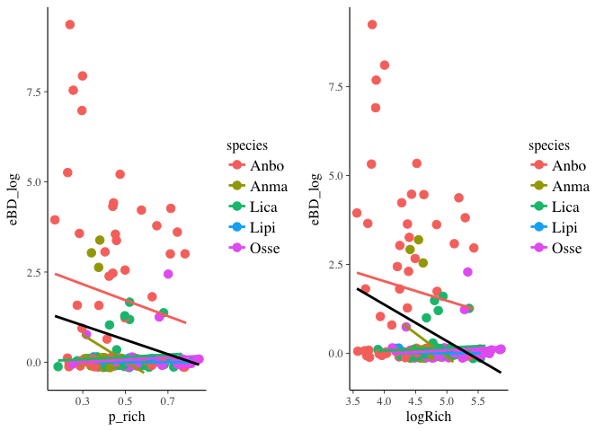

``` r
exp_distr %>%
    gather(key=toadID, value=logRich) %>%
    ggplot(aes(x=toadID, y=logRich)) +
    geom_violin() +
    geom_point(data=pos_exp_indiv, aes(x=toadID, y=logRich, col=eBD_log),cex=4, position=position_jitter(height=0, width=0.1))
```

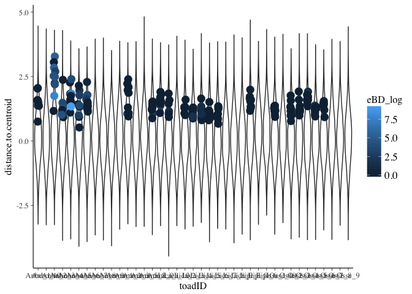

``` r
all_p_infected <- pos_exp_indiv %>%
    dplyr::select(toadID, time, logRich, p_rich) %>%
    full_join(all_p_infected, by=c("toadID","time"))


##### BETA DIVERSITY ####

#### Dispersion ####
if ( RERUN_DISP ) {
    glmer_disper_all <- stan_glmer(disper_bray_curtis ~ -1 + species + (1|toadID)
                               , data=mf_all_noinfect
                               , family = gaussian(link="log")
                               , prior_intercept = normal(location = 0,scale = 2.5, autoscale = TRUE)
                               , prior = normal(location=0, scale=2.5, autoscale=TRUE)
                               , seed= 623445
    )
    save(glmer_disper_all, file="glmer_disper_all.RData")
} else {
    load("glmer_disper_all.RData")
}
prior_summary(glmer_disper_all)
```

    ## Priors for model 'glmer_disper_all' 
    ## ------
    ## 
    ## Coefficients
    ##  ~ normal(location = [0,0,0,...], scale = [2.5,2.5,2.5,...])
    ##      **adjusted scale = [0.88,0.88,0.88,...]
    ## 
    ## Auxiliary (sigma)
    ##  ~ exponential(rate = 1)
    ##      **adjusted scale = 0.35 (adjusted rate = 1/adjusted scale)
    ## 
    ## Covariance
    ##  ~ decov(reg. = 1, conc. = 1, shape = 1, scale = 1)
    ## ------
    ## See help('prior_summary.stanreg') for more details

``` r
# Look at distributions according to models
samps_glmer_disper_all<- rstan::extract(glmer_disper_all$stanfit)
pos_test_set <- mf_treat_without_init_infect %>%
    filter(time>5) 
samps_glmer_disper_all$beta %>%
    as.data.frame() %>%
    rename(Anbo=V1, Anma=V2, Lica=V3, Lipi=V4, Osse=V5) %>%
    mutate(Anbo=exp((Anbo))
           ,Anma=exp((Anma))
           ,Lica=exp((Lica))
           ,Lipi=exp((Lipi))
           ,Osse=exp((Osse))) %>%
    dplyr::select(Anbo,Anma,Osse,Lica,Lipi) %>%
    gather(key=species, value=disper_bray_curtis) %>%
    ggplot(mapping=aes(x=species, y=disper_bray_curtis))+
    geom_violin() +
    geom_point(data=mf_all_noinfect, aes(y=disper_bray_curtis, x=species), position = position_jitter(width = 0.1, height=0), col="blue") +
    geom_point(data=pos_test_set, aes(y=disper_bray_curtis, x=species), position=position_jitter(width = 0.1, height=0), col="red")
```

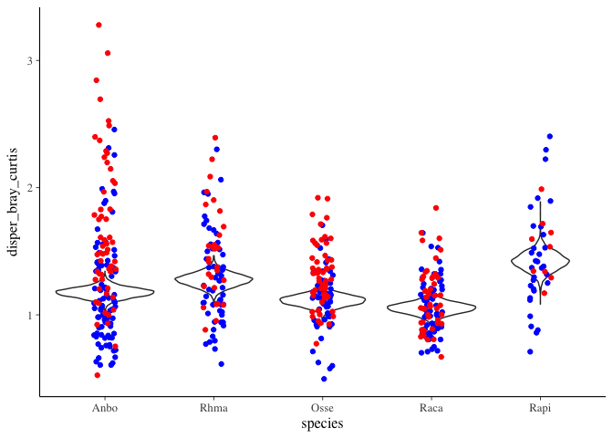

``` r
toad_intercept <- ranef(glmer_disper_all)$toadID
samp_toad <- samps_glmer_disper_all$b[,1:nrow(toad_intercept)]
colnames(samp_toad) <- rownames(toad_intercept)
# toadID_sigma <- sd(samps_glmer_BC_all$b[,ncol(samps_glmer_BC_all$b)])
samp_sigma <- samps_glmer_disper_all$aux

# Now, we can calculate the probability that the "test" dataset values come from this distribution
# List of individuals (different here bc some individuals don't have bray-curtis values)
treat_indiv <- colnames(samp_toad)

# Make key of species for each individual
species_key <- treat_indiv %>%
    as_tibble() %>%
    rename(toadID=value) %>%
    separate(toadID,into=c("species","indiv"), remove=FALSE)
species_order <- levels(as.factor(mf_all_noinfect$species))

exp_distr <- as.data.frame(matrix(ncol=length(treat_indiv), nrow=4000, dimnames = list(1:4000, treat_indiv)))
for ( num_indiv in 1:length(treat_indiv)) {
    indiv <- treat_indiv[num_indiv]
    sp <- pull(species_key[num_indiv,"species"])
    num_sp <- match(sp, species_order)
    exp_distr[,num_indiv] <- rnorm(4000, mean=rnorm(4000, mean=(samps_glmer_disper_all$beta[,num_sp]+samp_toad[,indiv]), sd=samp_sigma))
}

pos_exp_indiv <- mf_treat_without_init_infect %>%
    filter(time>5, !is.na(disper_bray_curtis), toadID %in% colnames(samp_toad)) %>%
    dplyr::select(toadID, time, species, disper_bray_curtis, eBD_log) %>%
    mutate(p_disper=NA)
for ( r in 1:nrow(pos_exp_indiv)) {
    pos_exp_indiv[r,"p_disper"] <- sum(exp_distr[,pos_exp_indiv$toadID[r]]<pos_exp_indiv[r,"disper_bray_curtis"])/4000
}

gg_beta_pos_p <- pos_exp_indiv %>%
    ggplot(aes(x=p_disper, y=eBD_log)) +
    geom_point(aes(col=species), cex=3, position=position_jitter(height=0.15))+
    geom_smooth(aes(col=species), method="lm",se=FALSE) +
    geom_smooth(method="lm", se=FALSE, col="black")
gg_beta_pos_raw <- pos_exp_indiv %>%
    ggplot(aes(x=disper_bray_curtis, y=eBD_log)) +
    geom_point(aes(col=species), cex=3, position=position_jitter(height=0.15))+
    geom_smooth(aes(col=species), method="lm",se=FALSE) +
    geom_smooth(method="lm", se=FALSE, col="black")
grid.arrange(gg_beta_pos_p, gg_beta_pos_raw, nrow=1)
```

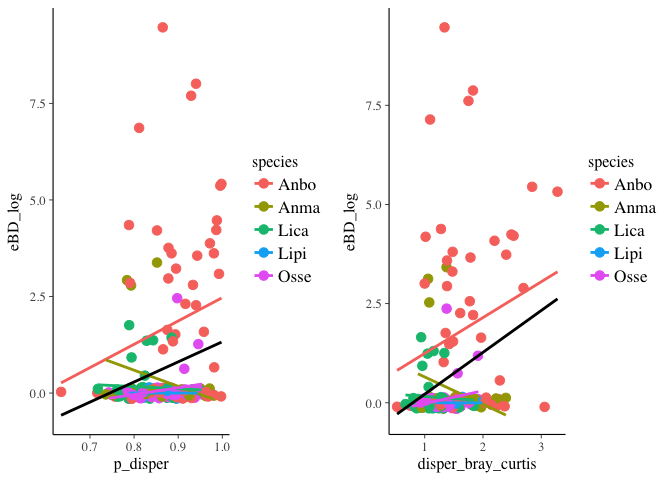

``` r
exp_distr %>%
    gather(key=toadID, value=disper_bray_curtis) %>%
    ggplot(aes(x=toadID, y=disper_bray_curtis)) +
    geom_violin() +
    geom_point(data=pos_exp_indiv, aes(x=toadID, y=disper_bray_curtis, col=eBD_log),cex=4, position=position_jitter(height=0, width=0.1))
```

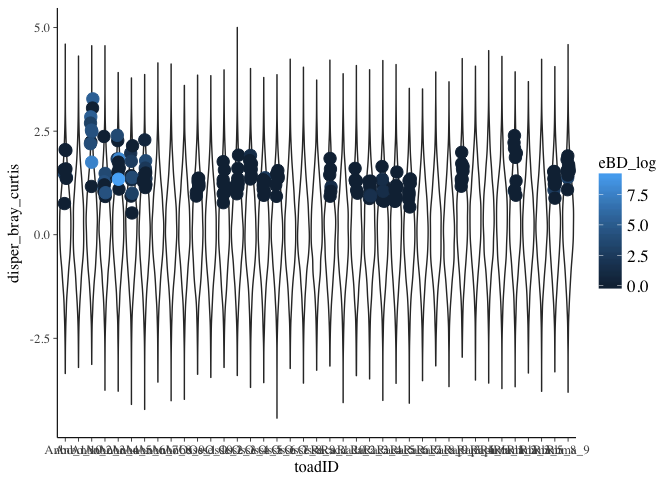

``` r
all_p_infected <- pos_exp_indiv %>%
    dplyr::select(toadID, time, disper_bray_curtis, p_disper) %>%
    full_join(all_p_infected, by=c("toadID","time"))


#### Distance Travelled ####
if ( RERUN_DIST) {
    glmer_dist_all <- stan_glmer(distance_bray_curtis ~ -1 + species + (1|toadID)
                           , data=mf_all_noinfect
                           , family =mgcv::betar
                           , prior_intercept = normal(location = 0.5,scale = 2.5, autoscale = TRUE)
                           , prior = normal(location=0.5, scale=2.5, autoscale=TRUE)
                           , seed= 623445
    )
    save(glmer_dist_all, file="glmer_dist_all.RData")
} else {
    load("glmer_dist_all.RData")
}
prior_summary(glmer_dist_all)
```

    ## Priors for model 'glmer_dist_all' 
    ## ------
    ## 
    ## Coefficients
    ##  ~ normal(location = [0.5,0.5,0.5,...], scale = [2.5,2.5,2.5,...])
    ## 
    ## Covariance
    ##  ~ decov(reg. = 1, conc. = 1, shape = 1, scale = 1)
    ## ------
    ## See help('prior_summary.stanreg') for more details

``` r
# rbeta has a strange parameterization using a nd b so need to convert mu and phi to this.
a <- function(mu,phi){
    mu*phi
}
b <- function(mu,phi) {
    phi-mu*phi
}
mu <- function(a,phi) {
    a/phi
}
inv_logit <- function(x) {
    exp(x)/(exp(x)+1)
}
logit <- function(p) {
    log(p/(1-p))
}

# Look at distributions according to models
samps_glmer_dist_all<- rstan::extract(glmer_dist_all$stanfit)
pos_test_set <- mf_treat_without_init_infect %>%
    filter(time>5) 
samps_glmer_dist_all$beta %>%
    as.data.frame() %>%
    rename(Anbo=V1, Anma=V2, Lica=V3, Lipi=V4, Osse=V5) %>%
    mutate(Anbo=inv_logit(Anbo)
           ,Anma=inv_logit(Anma)
           ,Lica=inv_logit(Lica)
           ,Lipi=inv_logit(Lipi)
           ,Osse=inv_logit(Osse)) %>%
    dplyr::select(Anbo,Anma,Osse,Lica,Lipi) %>%
    gather(key=species, value=distance_bray_curtis) %>%
    ggplot(mapping=aes(x=species, y=distance_bray_curtis))+
    geom_violin() +
    geom_point(data=mf_all_noinfect, aes(y=distance_bray_curtis, x=species), position = position_jitter(width = 0.1, height=0), col="blue") +
    geom_point(data=pos_test_set, aes(y=distance_bray_curtis, x=species), position=position_jitter(width = 0.1, height=0), col="red")
```

    ## Warning: Removed 65 rows containing missing values (geom_point).

    ## Warning: Removed 31 rows containing missing values (geom_point).

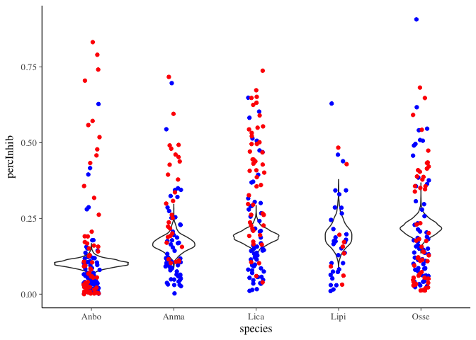

``` r
toad_intercept <- ranef(glmer_dist_all)$toadID
samp_toad <- samps_glmer_dist_all$b[,1:nrow(toad_intercept)]
colnames(samp_toad) <- rownames(toad_intercept)
# toadID_sigma <- sd(samps_glmer_dist_all$b[,ncol(samps_glmer_dist_all$b)])
phi <- samps_glmer_dist_all$aux

# Now, we can calculate the probability that the "test" dataset values come from this distribution
# List of individuals (different here dist some individuals don't have bray-curtis values)
treat_indiv <- colnames(samp_toad)

# Make key of species for each individual
species_key <- treat_indiv %>%
    as_tibble() %>%
    rename(toadID=value) %>%
    separate(toadID,into=c("species","indiv"), remove=FALSE)
species_order <- levels(as.factor(mf_all_noinfect$species))

exp_distr <- as.data.frame(matrix(ncol=length(treat_indiv), nrow=4000, dimnames = list(1:4000, treat_indiv)))
for ( num_indiv in 1:length(treat_indiv)) {
    indiv <- treat_indiv[num_indiv]
    sp <- pull(species_key[num_indiv,"species"])
    num_sp <- match(sp, species_order)
    
    mu <- inv_logit(samps_glmer_dist_all$beta[,num_sp]+samp_toad[,indiv])
    exp_distr[,num_indiv] <- rbeta(4000
                                ,shape1=a(mu,samps_glmer_dist_all$aux)
                                ,shape2=b(mu,samps_glmer_dist_all$aux))
}

pos_exp_indiv <- mf_treat_without_init_infect %>%
    filter(time>5, !is.na(distance_bray_curtis), toadID %in% colnames(samp_toad)) %>%
    dplyr::select(toadID, time, species, distance_bray_curtis, eBD_log) %>%
    mutate(p_dist=NA)
for ( r in 1:nrow(pos_exp_indiv)) {
    pos_exp_indiv[r,"p_dist"] <- sum(exp_distr[,pos_exp_indiv$toadID[r]]<pos_exp_indiv[r,"distance_bray_curtis"])/4000
}

gg_beta_pos_p <- pos_exp_indiv %>%
    ggplot(aes(x=p_dist, y=eBD_log)) +
    geom_point(aes(col=species), cex=3, position=position_jitter(height=0.15))+
    geom_smooth(aes(col=species), method="lm",se=FALSE) +
    geom_smooth(method="lm", se=FALSE, col="black")
gg_beta_pos_raw <- pos_exp_indiv %>%
    ggplot(aes(x=distance_bray_curtis, y=eBD_log)) +
    geom_point(aes(col=species), cex=3, position=position_jitter(height=0.15))+
    geom_smooth(aes(col=species), method="lm",se=FALSE) +
    geom_smooth(method="lm", se=FALSE, col="black")
grid.arrange(gg_beta_pos_p, gg_beta_pos_raw, nrow=1)
```

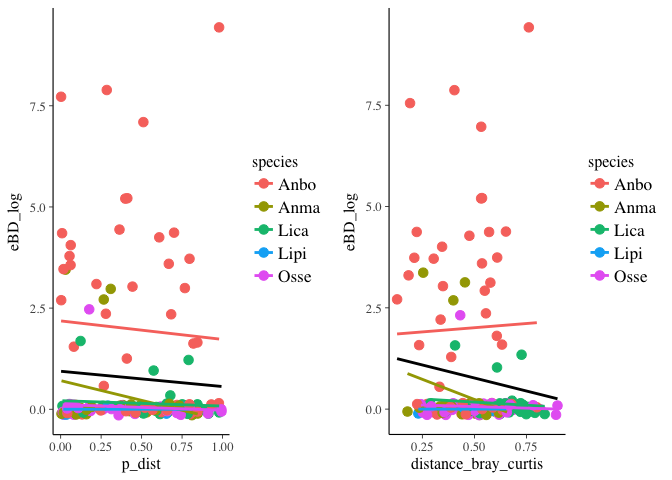

``` r
exp_distr %>%
    gather(key=toadID, value=distance_bray_curtis) %>%
    ggplot(aes(x=toadID, y=distance_bray_curtis)) +
    geom_violin() +
    geom_point(data=pos_exp_indiv, aes(x=toadID, y=distance_bray_curtis, col=eBD_log),cex=4, position=position_jitter(height=0, width=0.1))
```

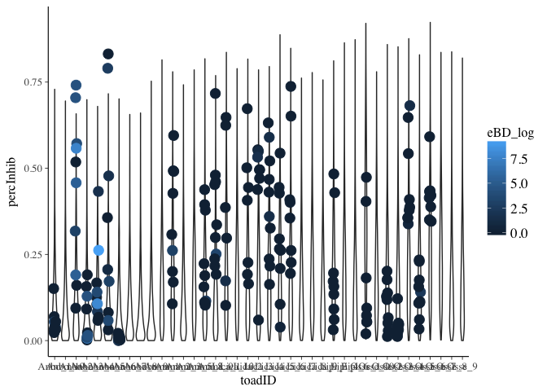

``` r
all_p_infected <- pos_exp_indiv %>%
    dplyr::select(toadID, time, distance_bray_curtis, p_dist) %>%
    full_join(all_p_infected, by=c("toadID","time"))


##### PERCENT INHIBITORY #####

if ( RERUN_PERCINHIB) {
    glmer_percInhib_all <- stan_glmer(percInhib ~ -1 + species + (1|toadID)
                                  , data=mf_all_noinfect
                                  , family =mgcv::betar
                                  , prior_intercept = normal(location = 0.5,scale = 2.5, autoscale = TRUE)
                                  , prior = normal(location=0.5, scale=2.5, autoscale=TRUE)
                                  , seed= 9837423
    )
    save(glmer_percInhib_all, file="glmer_percInhib_all.RData")
} else {
    load("glmer_percInhib_all.RData")
}
prior_summary(glmer_percInhib_all)
```

    ## Priors for model 'glmer_percInhib_all' 
    ## ------
    ## 
    ## Coefficients
    ##  ~ normal(location = [0.5,0.5,0.5,...], scale = [2.5,2.5,2.5,...])
    ## 
    ## Covariance
    ##  ~ decov(reg. = 1, conc. = 1, shape = 1, scale = 1)
    ## ------
    ## See help('prior_summary.stanreg') for more details

``` r
# rbeta has a strange parameterization using a nd b so need to convert mu and phi to this.
a <- function(mu,phi){
    mu*phi
}
b <- function(mu,phi) {
    phi-mu*phi
}
mu <- function(a,phi) {
    a/phi
}
inv_logit <- function(x) {
    exp(x)/(exp(x)+1)
}
logit <- function(p) {
    log(p/(1-p))
}

# Look at distributions according to models
samps_glmer_percInhib_all<- rstan::extract(glmer_percInhib_all$stanfit)
pos_test_set <- mf_treat_without_init_infect %>%
    filter(time>5) 
samps_glmer_percInhib_all$beta %>%
    as.data.frame() %>%
    rename(Anbo=V1, Anma=V2, Lica=V3, Lipi=V4, Osse=V5) %>%
    mutate(Anbo=inv_logit((Anbo))
           ,Anma=inv_logit((Anma))
           ,Lica=inv_logit((Lica))
           ,Lipi=inv_logit((Lipi))
           ,Osse=inv_logit((Osse))) %>%
    dplyr::select(Anbo,Anma,Osse,Lica,Lipi) %>%
    gather(key=species, value=percInhib) %>%
    ggplot(mapping=aes(x=species, y=percInhib))+
    geom_violin() +
    geom_point(data=mf_all_noinfect, aes(y=percInhib, x=species), position = position_jitter(width = 0.1, height=0), col="blue") +
    geom_point(data=pos_test_set, aes(y=percInhib, x=species), position=position_jitter(width = 0.1, height=0), col="red")
```

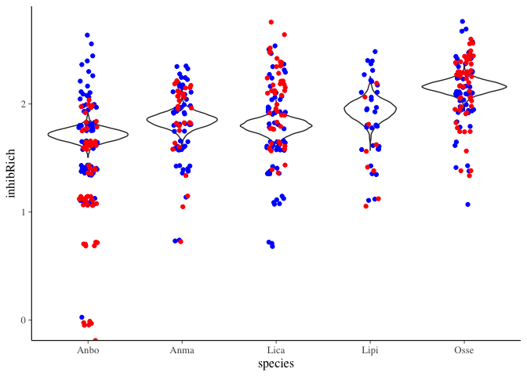

``` r
toad_intercept <- ranef(glmer_percInhib_all)$toadID
samp_toad <- samps_glmer_percInhib_all$b[,1:nrow(toad_intercept)]
colnames(samp_toad) <- rownames(toad_intercept)
# toadID_sigma <- sd(samps_glmer_BC_all$b[,ncol(samps_glmer_BC_all$b)])
phi <- samps_glmer_percInhib_all$aux

# Now, we can calculate the probability that the "test" dataset values come from this distribution
# List of individuals (different here bc some individuals don't have bray-curtis values)
treat_indiv <- colnames(samp_toad)

# Make key of species for each individual
species_key <- treat_indiv %>%
    as_tibble() %>%
    rename(toadID=value) %>%
    separate(toadID,into=c("species","indiv"), remove=FALSE)
species_order <- levels(as.factor(mf_all_noinfect$species))

exp_distr <- as.data.frame(matrix(ncol=length(treat_indiv), nrow=4000, dimnames = list(1:4000, treat_indiv)))
for ( num_indiv in 1:length(treat_indiv)) {
    indiv <- treat_indiv[num_indiv]
    sp <- pull(species_key[num_indiv,"species"])
    num_sp <- match(sp, species_order)
    
    mu <- inv_logit(samps_glmer_percInhib_all$beta[,num_sp]+samp_toad[,indiv])
    exp_distr[,num_indiv] <- rbeta(4000
                                   ,shape1=a(mu,samps_glmer_percInhib_all$aux)
                                   ,shape2=b(mu,samps_glmer_percInhib_all$aux))
}

pos_exp_indiv <- mf_treat_without_init_infect %>%
    filter(time>5, !is.na(percInhib), toadID %in% colnames(samp_toad)) %>%
    dplyr::select(toadID, time, species, percInhib, eBD_log) %>%
    mutate(p_pinhib=NA)
for ( r in 1:nrow(pos_exp_indiv)) {
    pos_exp_indiv[r,"p_percInhib"] <- sum(exp_distr[,pos_exp_indiv$toadID[r]]<pos_exp_indiv[r,"percInhib"])/4000
}

gg_percInhibd_pos_p <- pos_exp_indiv %>%
    ggplot(aes(x=p_percInhib, y=eBD_log)) +
    geom_point(aes(col=species), cex=3, position=position_jitter(height=0.15))+
    geom_smooth(aes(col=species), method="lm",se=FALSE) +
    geom_smooth(method="lm", se=FALSE, col="black")
gg_percInhibd_pos_raw <- pos_exp_indiv %>%
    ggplot(aes(x=percInhib, y=eBD_log)) +
    geom_point(aes(col=species), cex=3, position=position_jitter(height=0.15))+
    geom_smooth(aes(col=species), method="lm",se=FALSE) +
    geom_smooth(method="lm", se=FALSE, col="black")
grid.arrange(gg_percInhibd_pos_p, gg_percInhibd_pos_raw, nrow=1)
```

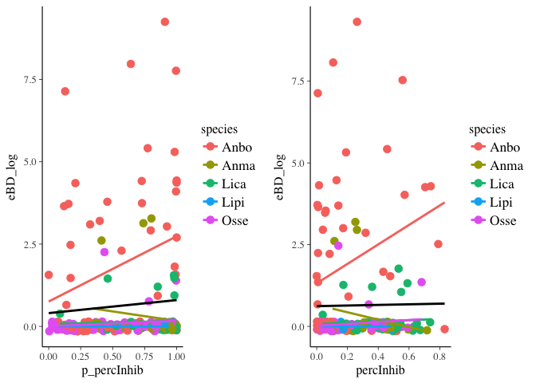

``` r
exp_distr %>%
    gather(key=toadID, value=percInhib) %>%
    ggplot(aes(x=toadID, y=percInhib)) +
    geom_violin() +
    geom_point(data=pos_exp_indiv, aes(x=toadID, y=percInhib, col=eBD_log),cex=4, position=position_jitter(height=0, width=0.1))
```

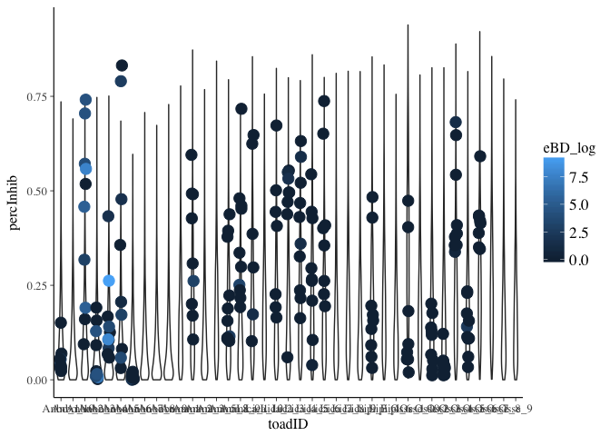

``` r
all_p_infected <- pos_exp_indiv %>%
    dplyr::select(toadID, time, percInhib, p_percInhib) %>%
    full_join(all_p_infected, by=c("toadID","time"))

######## INHIB RICHNESS ############


if (RERUN_INHIBRICH) {
    glmer_inhibRich_all <- stan_glmer(inhibRich ~ -1 + species + (1|toadID) + (1|SampleID), data=mf_all_noinfect
                                  , prior = normal(0, 10, autoscale = TRUE)
                                  , family= poisson(link="log")
                                  , seed = 5423409)
    save(glmer_inhibRich_all, file="glmer_inhibRich_all.RData")
} else {
    load(file="glmer_inhibRich_all.RData")
}
prior_summary(glmer_inhibRich_all)
```

    ## Priors for model 'glmer_inhibRich_all' 
    ## ------
    ## 
    ## Coefficients
    ##  ~ normal(location = [0,0,0,...], scale = [10,10,10,...])
    ## 
    ## Covariance
    ##  ~ decov(reg. = 1, conc. = 1, shape = 1, scale = 1)
    ## ------
    ## See help('prior_summary.stanreg') for more details

``` r
# Look at distributions according to models
samps_glmer_inhibRich_all <- rstan::extract(glmer_inhibRich_all$stanfit)
pos_test_set <- mf_treat_without_init_infect %>%
    filter(time>=6) 
samps_glmer_inhibRich_all$beta %>%
    as.data.frame() %>%
    rename(Anbo=V1, Anma=V2, Lica=V3, Lipi=V4, Osse=V5) %>%
    dplyr::select(Anbo,Anma,Lica,Lipi,Osse) %>%
    gather(key=species, value=inhibRich) %>%
    ggplot(mapping=aes(x=species, y=inhibRich))+
    geom_violin() +
    geom_point(data=mf_all_noinfect, aes(y=log(inhibRich), x=species), position = position_jitter(width = 0.1, height=0.05), col="blue") +
    geom_point(data=pos_test_set, aes(y=log(inhibRich), x=species), position=position_jitter(width = 0.1, height=0.05), col="red")
```

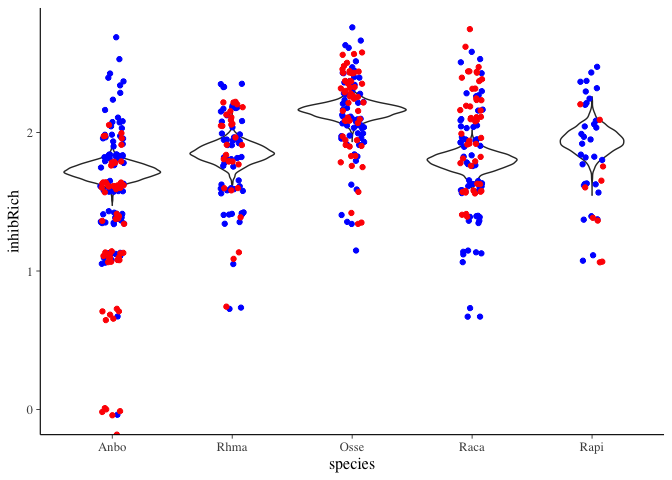

``` r
# Get standard deviation between toad individuals and samples
samp_intercept <- ranef(glmer_inhibRich_all)$SampleID
toad_intercept <- ranef(glmer_inhibRich_all)$toadID

sample_sigma <- sd(samps_glmer_inhibRich_all$b[,nrow(samp_intercept)+1])
toadID_sigma <- sd(samps_glmer_inhibRich_all$b[,ncol(samps_glmer_inhibRich_all$b)])

samp_toad <- samps_glmer_inhibRich_all$b[,(nrow(samp_intercept)+2):(nrow(samp_intercept)+1+nrow(toad_intercept))]
colnames(samp_toad) <- rownames(toad_intercept)

# Now, we can calculate the probability that the "test" dataset values come from this distribution
# List of individuals (different here bc some individuals don't have bray-curtis values)
treat_indiv <- colnames(samp_toad)

# Make key of species for each individual
species_key <- treat_indiv %>%
    as_tibble() %>%
    rename(toadID=value) %>%
    separate(toadID,into=c("species","indiv"), remove=FALSE)
species_order <- levels(as.factor(mf_all_noinfect$species))

exp_distr <- as.data.frame(matrix(ncol=length(treat_indiv), nrow=4000, dimnames = list(1:4000, treat_indiv)))
for ( num_indiv in 1:length(treat_indiv)) {
    indiv <- treat_indiv[num_indiv]
    sp <- pull(species_key[num_indiv,"species"])
    num_sp <- match(sp, species_order)
    
    exp_distr[,num_indiv] <- exp(rnorm(4000, mean=samps_glmer_inhibRich_all$beta[,num_sp]+samp_toad[,indiv], sd=sample_sigma))
    
}

pos_exp_indiv <- mf_treat_without_init_infect %>%
    filter(time>5) %>%
    dplyr::select(toadID, time, species, inhibRich, eBD_log) %>%
    mutate(p_inhibRich=NA)
for ( r in 1:nrow(pos_exp_indiv)) {
    temp_samp <- rpois(n=4000, lambda = exp_distr[,pos_exp_indiv[r,"toadID"]])
    
    pos_exp_indiv[r,"p_inhibRich"] <- sum(temp_samp < pos_exp_indiv[r,"inhibRich"])/4000
}


gg_inhibRich_pos_p <- pos_exp_indiv %>%
    ggplot(aes(x=p_inhibRich, y=eBD_log)) +
    geom_point(aes(col=species), cex=3, position=position_jitter(height=0.15))+
    geom_smooth(aes(col=species), method="lm",se=FALSE) +
    geom_smooth(method="lm", se=FALSE, col="black")
gg_inhibRich_pos_raw <- pos_exp_indiv %>%
    ggplot(aes(x=inhibRich, y=eBD_log)) +
    geom_point(aes(col=species), cex=3, position=position_jitter(height=0.15))+
    geom_smooth(aes(col=species), method="lm",se=FALSE) +
    geom_smooth(method="lm", se=FALSE, col="black")
grid.arrange(gg_inhibRich_pos_p, gg_inhibRich_pos_raw, nrow=1)
```

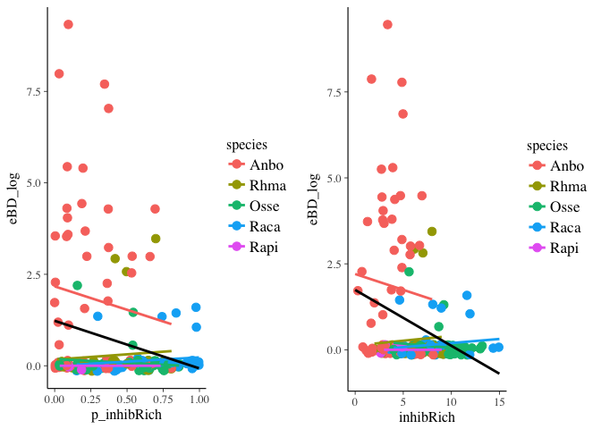

``` r
exp_distr %>%
    gather(key=toadID, value=inhibRich) %>%
    ggplot(aes(x=toadID, y=inhibRich)) +
    geom_violin() +
    geom_point(data=pos_exp_indiv, aes(x=toadID, y=inhibRich, col=eBD_log),cex=4, position=position_jitter(height=0, width=0.1))
```

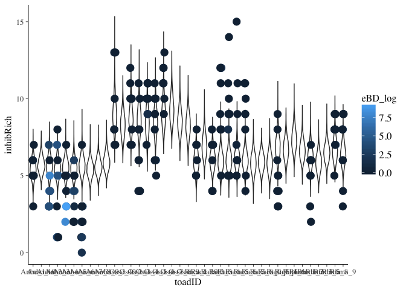

``` r
all_p_infected <- pos_exp_indiv %>%
    dplyr::select(toadID, time, inhibRich, p_inhibRich) %>%
    full_join(all_p_infected, by=c("toadID","time"))

#### save work #####
save(all_p_infected, file="all_p_infected.RData")


#### Are inhibRich and overall rich correlated? ####

# Extract estimates for each control toad and see if inhibitory richness and overall richness is correlated
con_exp_indiv <- con_exp_indiv_logRich %>%
    full_join(con_exp_indiv_disper, by="toadID")%>%
    full_join(con_exp_indiv_dist, by="toadID") %>%
    full_join(con_exp_indiv_inhib, by="toadID")%>%
    full_join(con_exp_indiv_percInhib, by="toadID")
save(con_exp_indiv, file="con_exp_indiv.RData")

all_p_withcon <- all_p %>%
    dplyr::select(toadID, exp_logRich, p_logRich, exp_disper, p_disper, exp_dist, p_dist, exp_inhibRich, p_inhibRich, exp_percInhib, p_percInhib) %>%
    rbind(con_exp_indiv)

all_p_withcon %>%
    dplyr::select(p_inhibRich, p_logRich, toadID) %>%
    separate(toadID, into=c("species","n"), remove=FALSE) %>%
    ggplot(aes(x=p_logRich, y=p_inhibRich)) +
    geom_point(aes(col=species), cex=3)
```

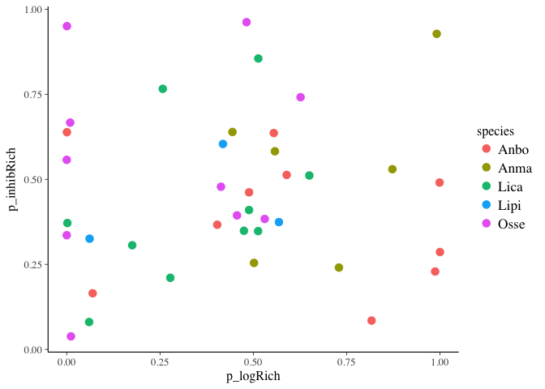

``` r
# anova(lm(p_inhib ~ p_rich, data=con_exp_indiv))

#### Inhibitory Bacteria ####

#Exact same?
otu.inhibOnly.con$OTUID == otu.inhibOnly.treat$OTUID
```

    ##  [1] TRUE TRUE TRUE TRUE TRUE TRUE TRUE TRUE TRUE TRUE TRUE TRUE TRUE TRUE
    ## [15] TRUE TRUE TRUE TRUE TRUE TRUE TRUE TRUE TRUE TRUE TRUE TRUE TRUE TRUE
    ## [29] TRUE TRUE TRUE TRUE TRUE TRUE TRUE TRUE TRUE TRUE TRUE TRUE TRUE TRUE
    ## [43] TRUE TRUE TRUE TRUE TRUE TRUE TRUE TRUE

``` r
# Good

# Look at "must abundant" otus
combined_otu_inhibOnly <- cbind(otu.inhibOnly.con, otu.inhibOnly.treat)[,-(ncol(otu.inhibOnly.con)+ncol(otu.inhibOnly.treat))]
OTUs_temp <- combined_otu_inhibOnly %>%
    dplyr::select(OTUID) %>%
    mutate(taxa = (inhib.tb[match(OTUID, inhib.tb$seq),"taxa"])$taxa ) 
    
OTUs_temp[order(combined_otu_inhibOnly %>%
                    dplyr::select(-OTUID) %>%
                    rowSums(.), decreasing = TRUE),]
```

    ##                                                                                         OTUID
    ## 3  TACGTAGGGTGCGAGCGTTAATCGGAATTACTGGGCGTAAAGCGTGCGCAGGCGGTTATGTAAGACAGATGTGAAATCCCCGGGCTCAAC
    ## 4  TACGTAGGGTGCAAGCGTTAATCGGAATTACTGGGCGTAAAGCGTGCGCAGGCGGCTTTGTAAGACAGATGTGAAATCCCCGGGCTCAAC
    ## 2  TACAGAGGGTGCGAGCGTTAATCGGATTTACTGGGCGTAAAGCGTGCGTAGGCGGCTTTTTAAGTCGGATGTGAAATCCCCGAGCTTAAC
    ## 1  TACGAAGGGTGCAAGCGTTAATCGGAATTACTGGGCGTAAAGCGCGCGTAGGTGGTTCAGCAAGTTGGATGTGAAAGCCCCGGGCTCAAC
    ## 20 TACGAAGGGGGCTAGCGTTGTTCGGAATTACTGGGCGTAAAGCGCACGTAGGCGGATATTTAAGTCAGGGGTGAAATCCCGCAGCTCAAC
    ## 13 TACGTAGGGTGCAAGCGTTAATCGGAATTACTGGGCGTAAAGCGTGCGCAGGCGGTTATGCAAGACAGATGTGAAATCCCCGGGCTCAAC
    ## 10 TACGAAGGGGGCTAGCGTTGCTCGGAATTACTGGGCGTAAAGGGAGCGTAGGCGGACATTTAAGTCAGGGGTGAAATCCCGGGGCTCAAC
    ## 35 TACGGAGGGTGCAAGCGTTATCCGGATTTATTGGGTTTAAAGGGTCCGTAGGCGGACTGATAAGTCAGTGGTGAAATCCGACAGCTTAAC
    ## 31 TACGGAGGGTGCAAGCGTTATCCGGATTCACTGGGTTTAAAGGGTGCGTAGGTGGGTTAGTAAGTCAGTGGTGAAATCTTCGAGCTTAAC
    ## 11 TACGGAGGATCCAAGCGTTATCCGGATTTATTGGGTTTAAAGGGTGCGTAGGCGGCCTGTTAAGTCAGGGGTGAAAGACGGTAGCTCAAC
    ## 22 TACGTAGGGTGCAAGCGTTAATCGGAATTACTGGGCGTAAAGCGTGCGCAGGCGGTGATGTAAGACAGTTGTGAAATCCCCGGGCTCAAC
    ## 12 TACGGAGGATCCGAGCGTTATCCGGATTTATTGGGTTTAAAGGGTGCGTAGGCGGCCTATTAAGTCAGGGGTGAAATACGGTGGCTCAAC
    ## 17 TACGAAGGGTGCAAGCGTTACTCGGAATTACTGGGCGTAAAGCGTGCGTAGGTGGTCGTTTAAGTCCGTTGTGAAAGCCCTGGGCTCAAC
    ## 36 TACGGAGGGTGCAAGCGTTATCCGGATTTATTGGGTTTAAAGGGTCCGTAGGCGGACTAGTAAGTCAGTGGTGAAATCCGACAGCTTAAC
    ## 24 TACGTAGGGTACGAGCGTTGTCCGGAATTATTGGGCGTAAAGAGCTCGTAGGTGGTTGGTCACGTCTGCTGTGGAAACGCAACGCTTAAC
    ## 18 TACGAAGGGGGCTAGCGTTGCTCGGAATTACTGGGCGTAAAGGGCGCGTAGGCGGATCGTTAAGTCAGAGGTGAAATCCCGGAGCTCAAC
    ## 30 TACAGAGGGTGCAAGCGTTAATCGGATTTACTGGGCGTAAAGCGCGCGTAGGCGGCTAATTAAGTCAAATGTGAAATCCCCGAGCTTAAC
    ## 16 TACGGAGGGAGCTAGCGTTGTTCGGAATTACTGGGCGTAAAGCGCGCGTAGGCGGTTACTCAAGTCAGAGGTGAAAGCCCGGGGCTCAAC
    ## 48 TACAGAGGGTGCAAGCGTTAATCGGATTTACTGGGCGTAAAGCGCGCGTAGGCGGCCAATTAAGTCAAATGTGAAATCCCCGAGCTTAAC
    ## 41 TACGGAGGGTGCAAGCGTTATCCGGATTTATTGGGTTTAAAGGGTCCGTAGGCGGATTTGTAAGTCAGTGGTGAAATCTCACAGCTTAAC
    ## 21 TACGAAGGGTGCAAGCGTTACTCGGAATTACTGGGCGTAAAGCGTGCGTAGGTGGTTTGTTAAGTCTGATGTGAAAGCCCTGGGCTCAAC
    ## 42 TACGGAGGGTGCAAGCGTTAATCGGAATTACTGGGCGTAAAGCGCACGCAGGCGGTTTGTTAAGTCAGATGTGAAATCCCCGGGCTCAAC
    ## 28 TACGAAGGGTGCAAGCGTTAATCGGAATTACTGGGCGTAAAGCGCGCGTAGGTGGTTCAGCAAGTTGAAGGTGAAATCCCCGGGCTCAAC
    ## 38 TACAGAGGGTGCAAGCGTTAATCGGAATTACTGGGCGTAAAGCGCGCGTAGGTGGTTTGTTAAGTTGGATGTGAAATCCCCGGGCTCAAC
    ## 32 TACGTAGGGTGCAAGCGTTAATCGGAATTACTGGGCGTAAAGCGTGCGCAGGCGGTTATGTAAGACAGTTGTGAAATCCCCGGGCTCAAC
    ## 19 TACGGAGGATCCAAGCGTTATCCGGAATCATTGGGTTTAAAGGGTCCGTAGGCGGTTTAGTAAGTCAGTGGTGAAAGCCCATCGCTCAAC
    ## 23 TACGAAGGGTGCAAGCGTTACTCGGAATTACTGGGCGTAAAGCGTGCGTAGGTGGTTATTTAAGTCCGTTGTGAAAGCCCTGGGCTCAAC
    ## 37 TACGAAGGGTGCAAGCGTTAATCGGAATTACTGGGCGTAAAGCGCGCGTAGGTGGTTCAGCAAGTTGGAGGTGAAATCCCCGGGCTCAAC
    ## 33 TACGGAGGGTGCAAGCGTTATCCGGATTTATTGGGTTTAAAGGGTCCGTAGGCGGATTAATCAGTCAGTGGTGAAATCCCGCAGCTTAAC
    ## 14 TACGGAGGATCCAAGCGTTATCCGGAATCATTGGGTTTAAAGGGTCCGTAGGCGGTTTAATAAGTCAGTGGTGAAAGCCCATCGCTCAAC
    ## 9  TACGAAGGGTGCAAGCGTTACTCGGAATTACTGGGCGTAAAGCGTGCGTAGGTGGTTGTTTAAGTCTGTTGTGAAAGCCCTGGGCTCAAC
    ## 7  TACGTAGGGTGCAAGCGTTAATCGGAATTACTGGGCGTAAAGCGTGCGCAGGCGGTTTTGTAAGTCTGATGTGAAATCCCCGGGCTCAAC
    ## 34 TACGAAGGGGGCTAGCGTTGCTCGGAATTACTGGGCGTAAAGGGAGCGTAGGCGGACATTTAAGTCAGGGGTGAAATCCCGGAGCTCAAC
    ## 29 TACAGAGGGTGCAAGCGTTAATCGGAATTACTGGGCGTAAAGCGCGCGTAGGTGGTTAGTTAAGTTGGATGTGAAATCCCCGGGCTCAAC
    ## 8  TACGTAGGGTGCAAGCGTTAATCGGAATTACTGGGCGTAAAGCGTGCGCAGGCGGTTTTGTAAGACTGTCGTGAAATCCCCGGGCTCAAC
    ## 6  TACGTAGGGCGCAAGCGTTATCCGGAATTATTGGGCGTAAAGAGCTCGTAGGCGGTTTGTCGCGTCTGCTGTGAAATCCCGAGGCTCAAC
    ## 26 TACGTAGGGTGCGAGCGTTAATCGGAATTACTGGGCGTAAAGCGTGCGCAGGCGGTTATGTAAGACAGTTGTGAAATCCCCGGGCTCAAC
    ## 15 TACGAAGGGGGCTAGCGTTGTTCGGATTTACTGGGCGTAAAGCGCACGTAGGCGGATCGATCAGTCAGGGGTGAAATCCCAGAGCTCAAC
    ## 5  TACGAAGGGGGCTAGCGTTGTTCGGATTTACTGGGCGTAAAGCGCACGTAGGCGGATCGATCAGTCAGGGGTGAAATCCCAGGGCTCAAC
    ## 46 TACGGAGGGTGCAAGCGTTAATCGGAATTACTGGGCGTAAAGCGTGCGTAGGCGGTTCGTTAAGTCTGCTGTGAAAGCCCCGGGCTCAAC
    ## 44 TACGTAGGTGGCAAGCGTTATCCGGAATTATTGGGCGTAAAGCGCGCGCAGGTGGTTTCTTAAGTCTGATGTGAAAGCCCACGGCTCAAC
    ## 43 TACGTAGGGTCCAAGCGTTAATCGGAATTACTGGGCGTAAAGCGTGCGCAGGCGGTTGTGCAAGACCGATGTGAAATCCCCGAGCTTAAC
    ## 39 TACGTAGGGCGCAAGCGTTATCCGGAATTATTGGGCGTAAAGAGCTCGTAGGCGGTTTGTCGCGTCTGCCGTGAAAGTCCGGGGCTCAAC
    ## 40 TACGTAGGGTGCGAGCGTTAATCGGAATTACTGGGCGTAAAGGGTGCGCAGGTGGTTACGTAAGTCTGATGTGAAAGCCCCGGGCTCAAC
    ## 27 TACGTAGGTCCCGAGCGTTGTCCGGATTTATTGGGCGTAAAGCGAGCGCAGGTGGTTTATTAAGTCTGGTGTAAAAGGCAGTGGCTCAAC
    ## 47 TACGGAGGGTGCAAGCGTTATCCGGATTTATTGGGTTTAAAGGGTCCGTAGGCTGATCTGTAAGTCAGTGGTGAAATCTCACAGCTTAAC
    ## 25 TACGGAGGATCCAAGCGTTATCCGGAATCATTGGGTTTAAAGGGTCCGTAGGCGGTTTGGTAAGTCAGTGGTGAAAGCCCATCGCTCAAC
    ## 49 TACGAAGGGTGCAAGCGTTAATCGGAATTACTGGGCGTAAAGCGCGCGTAGGTGGTTCAGCAAGTTGGATGTGAAATCCCCGGGCTCAAC
    ## 45 TACGTAGGGTGCAAGCGTTAATCGGAATTACTGGGCGTAAAGCGTGCGCAGGCGGTTTTATAAGTCTGATGTGAAATCCCCGGGCTCAAC
    ## 50 TACGGAGGGTGCAAGCGTTAATCGGAATTACTGGGCGTAAAGCGCACGCAGGCGGTTGATTAAGTCAGATGTGAAATCCCCGAGCTTAAC
    ##                                                                                                   taxa
    ## 3                    Bacteria;Proteobacteria;Betaproteobacteria;Burkholderiales;Comamonadaceae;Delftia
    ## 4            Bacteria;Proteobacteria;Betaproteobacteria;Burkholderiales;Burkholderiales_incertae_sedis
    ## 2              Bacteria;Proteobacteria;Gammaproteobacteria;Pseudomonadales;Moraxellaceae;Acinetobacter
    ## 1             Bacteria;Proteobacteria;Gammaproteobacteria;Pseudomonadales;Pseudomonadaceae;Pseudomonas
    ## 20                      Bacteria;Proteobacteria;Alphaproteobacteria;Rhizobiales;Rhizobiaceae;Rhizobium
    ## 13 Bacteria;Proteobacteria;Betaproteobacteria;Burkholderiales;Burkholderiales_incertae_sedis;Mitsuaria
    ## 10          Bacteria;Proteobacteria;Alphaproteobacteria;Caulobacterales;Caulobacteraceae;Brevundimonas
    ## 35             Bacteria;Bacteroidetes;Flavobacteria;Flavobacteriales;Flavobacteriaceae;Elizabethkingia
    ## 31               Bacteria;Bacteroidetes;Sphingobacteria;Sphingobacteriales;Chitinophagaceae;Terrimonas
    ## 11            Bacteria;Bacteroidetes;Sphingobacteria;Sphingobacteriales;Sphingobacteriaceae;Pedobacter
    ## 22                Bacteria;Proteobacteria;Betaproteobacteria;Burkholderiales;Comamonadaceae;Variovorax
    ## 12      Bacteria;Bacteroidetes;Sphingobacteria;Sphingobacteriales;Sphingobacteriaceae;Sphingobacterium
    ## 17       Bacteria;Proteobacteria;Gammaproteobacteria;Xanthomonadales;Xanthomonadaceae;Stenotrophomonas
    ## 36             Bacteria;Bacteroidetes;Flavobacteria;Flavobacteriales;Flavobacteriaceae;Elizabethkingia
    ## 24             Bacteria;Actinobacteria;Actinobacteria;Actinomycetales;Brevibacteriaceae;Brevibacterium
    ## 18          Bacteria;Proteobacteria;Alphaproteobacteria;Caulobacterales;Caulobacteraceae;Brevundimonas
    ## 30             Bacteria;Proteobacteria;Gammaproteobacteria;Pseudomonadales;Moraxellaceae;Acinetobacter
    ## 16      Bacteria;Proteobacteria;Alphaproteobacteria;Sphingomonadales;Sphingomonadaceae;Novosphingobium
    ## 48             Bacteria;Proteobacteria;Gammaproteobacteria;Pseudomonadales;Moraxellaceae;Acinetobacter
    ## 41            Bacteria;Bacteroidetes;Flavobacteria;Flavobacteriales;Flavobacteriaceae;Chryseobacterium
    ## 21             Bacteria;Proteobacteria;Gammaproteobacteria;Xanthomonadales;Xanthomonadaceae;Lysobacter
    ## 42           Bacteria;Proteobacteria;Gammaproteobacteria;Enterobacteriales;Enterobacteriaceae;Serratia
    ## 28            Bacteria;Proteobacteria;Gammaproteobacteria;Pseudomonadales;Pseudomonadaceae;Pseudomonas
    ## 38            Bacteria;Proteobacteria;Gammaproteobacteria;Pseudomonadales;Pseudomonadaceae;Pseudomonas
    ## 32                Bacteria;Proteobacteria;Betaproteobacteria;Burkholderiales;Comamonadaceae;Variovorax
    ## 19              Bacteria;Bacteroidetes;Flavobacteria;Flavobacteriales;Flavobacteriaceae;Flavobacterium
    ## 23       Bacteria;Proteobacteria;Gammaproteobacteria;Xanthomonadales;Xanthomonadaceae;Stenotrophomonas
    ## 37            Bacteria;Proteobacteria;Gammaproteobacteria;Pseudomonadales;Pseudomonadaceae;Pseudomonas
    ## 33                Bacteria;Bacteroidetes;Flavobacteria;Flavobacteriales;Flavobacteriaceae;Empedobacter
    ## 14              Bacteria;Bacteroidetes;Flavobacteria;Flavobacteriales;Flavobacteriaceae;Flavobacterium
    ## 9        Bacteria;Proteobacteria;Gammaproteobacteria;Xanthomonadales;Xanthomonadaceae;Stenotrophomonas
    ## 7        Bacteria;Proteobacteria;Betaproteobacteria;Burkholderiales;Oxalobacteraceae;Janthinobacterium
    ## 34          Bacteria;Proteobacteria;Alphaproteobacteria;Caulobacterales;Caulobacteraceae;Brevundimonas
    ## 29            Bacteria;Proteobacteria;Gammaproteobacteria;Pseudomonadales;Pseudomonadaceae;Pseudomonas
    ## 8                Bacteria;Proteobacteria;Betaproteobacteria;Burkholderiales;Oxalobacteraceae;Duganella
    ## 6              Bacteria;Actinobacteria;Actinobacteria;Actinomycetales;Microbacteriaceae;Microbacterium
    ## 26                Bacteria;Proteobacteria;Betaproteobacteria;Burkholderiales;Comamonadaceae;Variovorax
    ## 15                      Bacteria;Proteobacteria;Alphaproteobacteria;Rhizobiales;Rhizobiaceae;Rhizobium
    ## 5                       Bacteria;Proteobacteria;Alphaproteobacteria;Rhizobiales;Rhizobiaceae;Rhizobium
    ## 46                 Bacteria;Proteobacteria;Gammaproteobacteria;Xanthomonadales;Xanthomonadaceae;Dyella
    ## 44                                         Bacteria;Firmicutes;Bacilli;Bacillales;Bacillaceae;Bacillus
    ## 43               Bacteria;Proteobacteria;Betaproteobacteria;Burkholderiales;Burkholderiaceae;Ralstonia
    ## 39                  Bacteria;Actinobacteria;Actinobacteria;Actinomycetales;Micrococcaceae;Arthrobacter
    ## 40            Bacteria;Proteobacteria;Betaproteobacteria;Burkholderiales;Burkholderiaceae;Chitinimonas
    ## 27                            Bacteria;Firmicutes;Bacilli;Lactobacillales;Streptococcaceae;Lactococcus
    ## 47            Bacteria;Bacteroidetes;Flavobacteria;Flavobacteriales;Flavobacteriaceae;Chryseobacterium
    ## 25              Bacteria;Bacteroidetes;Flavobacteria;Flavobacteriales;Flavobacteriaceae;Flavobacterium
    ## 49            Bacteria;Proteobacteria;Gammaproteobacteria;Pseudomonadales;Pseudomonadaceae;Pseudomonas
    ## 45                         Bacteria;Proteobacteria;Betaproteobacteria;Burkholderiales;Oxalobacteraceae
    ## 50                    Bacteria;Proteobacteria;Gammaproteobacteria;Enterobacteriales;Enterobacteriaceae

``` r
# chosen colors
brewer.pal.info
```

    ##          maxcolors category colorblind
    ## BrBG            11      div       TRUE
    ## PiYG            11      div       TRUE
    ## PRGn            11      div       TRUE
    ## PuOr            11      div       TRUE
    ## RdBu            11      div       TRUE
    ## RdGy            11      div      FALSE
    ## RdYlBu          11      div       TRUE
    ## RdYlGn          11      div      FALSE
    ## Spectral        11      div      FALSE
    ## Accent           8     qual      FALSE
    ## Dark2            8     qual       TRUE
    ## Paired          12     qual       TRUE
    ## Pastel1          9     qual      FALSE
    ## Pastel2          8     qual      FALSE
    ## Set1             9     qual      FALSE
    ## Set2             8     qual       TRUE
    ## Set3            12     qual      FALSE
    ## Blues            9      seq       TRUE
    ## BuGn             9      seq       TRUE
    ## BuPu             9      seq       TRUE
    ## GnBu             9      seq       TRUE
    ## Greens           9      seq       TRUE
    ## Greys            9      seq       TRUE
    ## Oranges          9      seq       TRUE
    ## OrRd             9      seq       TRUE
    ## PuBu             9      seq       TRUE
    ## PuBuGn           9      seq       TRUE
    ## PuRd             9      seq       TRUE
    ## Purples          9      seq       TRUE
    ## RdPu             9      seq       TRUE
    ## Reds             9      seq       TRUE
    ## YlGn             9      seq       TRUE
    ## YlGnBu           9      seq       TRUE
    ## YlOrBr           9      seq       TRUE
    ## YlOrRd           9      seq       TRUE

``` r
set.seed(8984)
set_col <- unique(c(brewer.pal(12,"Set3"), brewer.pal(8,"Spectral"), brewer.pal(8,"Dark2"), brewer.pal(8,"Accent")))
set_col <- set_col[c(1,35,34,3,33,4,5,30,7,29,8,28,9,27,26,10,11,25,12,24,13,23,14,22,15,21,16,20,17,19,18)]

#### CONTROL ####
# Going to leave zeros in for now, bc only 3-5 in each control and con
temp <- otu.inhibOnly.con %>%
    dplyr::select(-c(OTUID)) %>%
    unlist()
# THE ABOVE LISTS BY STACKING COL ON TOP OF EACH OTHER (not by stacking rows beside each other)

otu_long_con <- cbind(rep(colnames(otu.inhibOnly.con)[-ncol(otu.inhibOnly.con)], each=nrow(otu.inhibOnly.con))
                        ,temp
                        ,rep(otu.inhibOnly.con$OTUID,times=ncol(otu.inhibOnly.con)-1)) %>%
    as_tibble() %>%
    rename(SampleID=V1, reads=temp, OTUID=V2) %>%
    mutate(reads=as.numeric(reads))
mf_con_with_inhibOTUs <- mf_con_without_init_infect %>%
    dplyr::select(SampleID, species, time, toadID, eBD_log, PABD, prepost, BD_infected) %>%
    left_join(otu_long_con) %>%
    mutate(taxa = (inhib.tb[match(OTUID, inhib.tb$seq),"taxa"])$taxa ) %>%
    separate(taxa, into = c("K","P","C","O","F","G"), sep = ";", remove = FALSE, fill="left")
```

    ## Joining, by = "SampleID"

``` r
mf_con_with_inhibOTUs %>%
    group_by(toadID, time, species, G) %>%
    summarise(AverageProportion = mean(reads)) %>%
    ggplot(aes(x=time, y=AverageProportion)) +
    geom_bar(aes(fill=G), stat="identity") +
    theme(axis.text.x = element_text(angle = 90, hjust = 1), legend.key.size =  unit(0.2, "cm") ) +
    facet_wrap(~species, nrow=2) +
    scale_fill_manual(values=set_col)
```

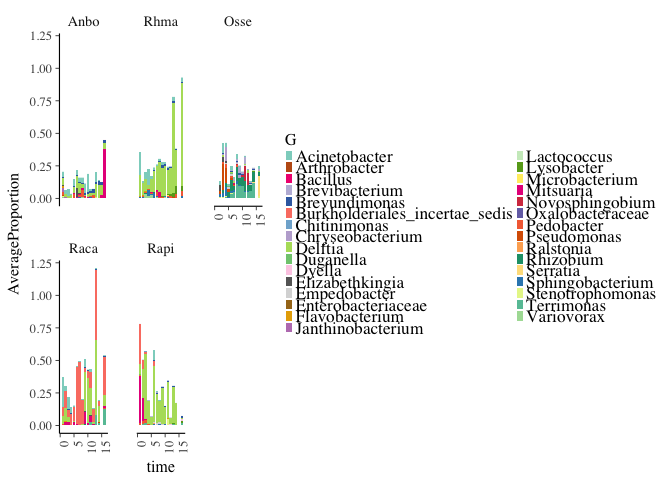

``` r
#### TREATMENT ####
# Going to leave zeros in for now, bc only 3-5 in each control and treatment
temp <- otu.inhibOnly.treat %>%
    dplyr::select(-OTUID) %>%
    unlist()
# THE ABOVE LISTS BY STACKING COL ON TOP OF EACH OTHER (not by stacking rows beside each other)

otu_long_treat <- cbind(rep(colnames(otu.inhibOnly.treat)[-ncol(otu.inhibOnly.treat)], each=nrow(otu.inhibOnly.treat))
                        ,temp
                        ,rep(otu.inhibOnly.treat$OTUID,times=ncol(otu.inhibOnly.treat)-1)) %>%
    as_tibble() %>%
    rename(SampleID=V1, reads=temp, OTUID=V2) %>%
    mutate(reads=as.numeric(reads))
mf_treat_with_inhibOTUs <- mf_treat_without_init_infect %>%
    dplyr::select(SampleID, species, time, toadID, eBD_log, PABD, prepost, BD_infected) %>%
    left_join(otu_long_treat)%>%
    mutate(taxa = (inhib.tb[match(OTUID, inhib.tb$seq),"taxa"])$taxa ) %>%
    separate(taxa, into = c("K","P","C","O","F","G"), sep = ";", remove = FALSE, fill="left")
```

    ## Joining, by = "SampleID"

``` r
mf_treat_with_inhibOTUs %>%
    group_by(toadID, time, species, G) %>%
    summarise(AverageProportion = mean(reads)) %>%
    ggplot(aes(x=time, y=AverageProportion)) +
    geom_bar(aes(fill=G), stat="identity") +
    theme(axis.text.x = element_text(angle = 90, hjust = 1), legend.key.size =  unit(0.2, "cm") ) +
    facet_wrap(~species, nrow=2) +
    scale_fill_manual(values=set_col) +
    geom_vline(aes(xintercept=5.5), col="grey", lty=2)
```

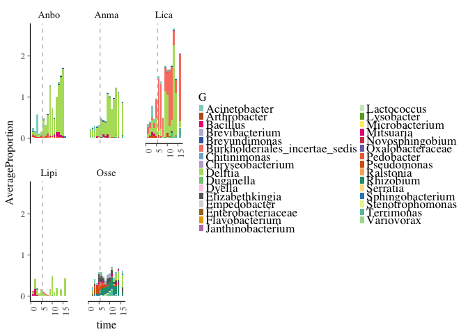

``` r
g_legend <- function(a.gplot){ # from stack overflow
    tmp <- ggplot_gtable(ggplot_build(a.gplot)) 
    leg <- which(sapply(tmp$grobs, function(x) x$name) == "guide-box") 
    legend <- tmp$grobs[[leg]] 
    return(legend)} 

### Goal: plot abundance of inhibitory bacteria over time for each individual of each species
anbo_con <- mf_con_with_inhibOTUs %>%
    filter(species=="Anbo") %>%
    group_by(species, toadID, G, time) %>%
    summarise(reads=mean(reads)) %>%
    ggplot(aes(x=time, y=reads)) +
    geom_line(aes(col=G), stat = "identity", show.legend = FALSE) +
    theme(axis.text.x = element_text(angle = 90, hjust = 1)) +
    facet_wrap(~toadID, nrow=1) +
    scale_fill_manual(values=set_col) + 
    scale_color_manual(values=set_col) + 
    ylab("Anbo") +
    xlab("")
anma_con <- mf_con_with_inhibOTUs %>%
    filter(species=="Anma") %>%
    group_by(species, toadID, G, time) %>%
    summarise(reads=mean(reads)) %>%
    ggplot(aes(x=time, y=reads)) +
    geom_line(aes(col=G), stat = "identity", show.legend = FALSE) +
    theme(axis.text.x = element_text(angle = 90, hjust = 1)) +
    facet_wrap(~toadID, nrow=1) +
    scale_fill_manual(values=set_col) + 
    scale_color_manual(values=set_col) + 
    ylab("Anma")+
    xlab("")
lica_con <- mf_con_with_inhibOTUs %>%
    filter(species=="Lica") %>%
    group_by(species, toadID, G, time) %>%
    summarise(reads=mean(reads)) %>%
    ggplot(aes(x=time, y=reads)) +
    geom_line(aes(col=G), stat = "identity", show.legend = FALSE) +
    theme(axis.text.x = element_text(angle = 90, hjust = 1)) +
    facet_wrap(~toadID, nrow=1) +
    scale_fill_manual(values=set_col) + 
    scale_color_manual(values=set_col) + 
    ylab("Lica")+
    xlab("")
lipi_con <- mf_con_with_inhibOTUs %>%
    filter(species=="Lipi") %>%
    group_by(species, toadID, G, time) %>%
    summarise(reads=mean(reads)) %>%
    ggplot(aes(x=time, y=reads)) +
    geom_line(aes(col=G), stat = "identity", show.legend = FALSE) +
    theme(axis.text.x = element_text(angle = 90, hjust = 1)) +
    facet_wrap(~toadID, nrow=1) +
    scale_fill_manual(values=set_col) + 
    scale_color_manual(values=set_col) + 
    ylab("Lipi")+
    xlab("")
osse_con <- mf_con_with_inhibOTUs %>%
    filter(species=="Osse") %>%
    group_by(species, toadID, G, time) %>%
    summarise(reads=mean(reads)) %>%
    ggplot(aes(x=time, y=reads)) +
    geom_line(aes(col=G), stat = "identity", show.legend = FALSE) +
    theme(axis.text.x = element_text(angle = 90, hjust = 1)) +
    facet_wrap(~toadID, nrow=1) +
    scale_fill_manual(values=set_col) + 
    scale_color_manual(values=set_col) + 
    ylab("Osse")+
    xlab("")
lay_con <- rbind(c(1,1,1,1)
                 ,c(2,2,2,6)
                 ,c(3,3,3,3)
                 , c(4,4,7,7)
                 , c(5,5,5,5))
grid.arrange(anbo_con, anma_con, lica_con, lipi_con, osse_con
             , layout_matrix=lay_con
             , left = textGrob("Average proportion of reads", rot = 90, vjust = 1)
             , bottom = textGrob("Time", vjust=1))
```

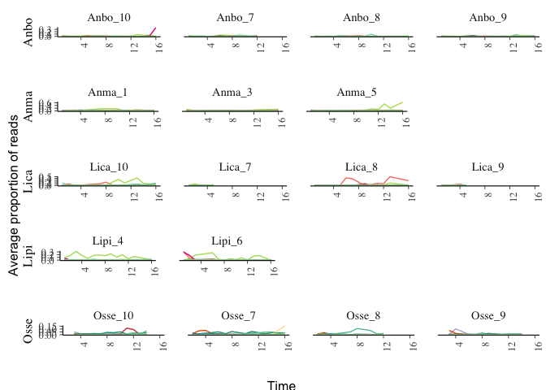

``` r
# Now for treatment 
### Goal: plot abundance of inhibitory bacteria over time for each individual of each species
anbo_treat <- mf_treat_with_inhibOTUs %>%
    filter(species=="Anbo") %>%
    group_by(species, toadID, G, time) %>%
    summarise(reads=mean(reads)) %>%
    ggplot(aes(x=time, y=reads)) +
    geom_line(aes(col=G), stat = "identity", show.legend = FALSE) +
    theme(axis.text.x = element_text(angle = 90, hjust = 1)) +
    facet_wrap(~toadID, nrow=1) +
    scale_fill_manual(values=set_col) + 
    scale_color_manual(values=set_col) + 
    ylab("Anbo") +
    xlab("")
anma_treat <- mf_treat_with_inhibOTUs %>%
    filter(species=="Anma") %>%
    group_by(species, toadID, G, time) %>%
    summarise(reads=mean(reads)) %>%
    ggplot(aes(x=time, y=reads)) +
    geom_line(aes(col=G), stat = "identity", show.legend = FALSE) +
    theme(axis.text.x = element_text(angle = 90, hjust = 1)) +
    facet_wrap(~toadID, nrow=1) +
    scale_fill_manual(values=set_col) + 
    scale_color_manual(values=set_col) + 
    ylab("Anma") +
    xlab("")
lica_treat <- mf_treat_with_inhibOTUs %>%
    filter(species=="Lica") %>%
    group_by(species, toadID, G, time) %>%
    summarise(reads=mean(reads)) %>%
    ggplot(aes(x=time, y=reads)) +
    geom_line(aes(col=G), stat = "identity", show.legend = FALSE) +
    theme(axis.text.x = element_text(angle = 90, hjust = 1)) +
    facet_wrap(~toadID, nrow=1) +
    scale_fill_manual(values=set_col) + 
    scale_color_manual(values=set_col) + 
    ylab("Lica") +
    xlab("")
lipi_treat <- mf_treat_with_inhibOTUs %>%
    filter(species=="Lipi") %>%
    group_by(species, toadID, G, time) %>%
    summarise(reads=mean(reads)) %>%
    ggplot(aes(x=time, y=reads)) +
    geom_line(aes(col=G), stat = "identity", show.legend = FALSE) +
    theme(axis.text.x = element_text(angle = 90, hjust = 1)) +
    facet_wrap(~toadID, nrow=1) +
    scale_fill_manual(values=set_col) + 
    scale_color_manual(values=set_col) + 
    ylab("Lipi") +
    xlab("")
osse_treat <- mf_treat_with_inhibOTUs %>%
    filter(species=="Osse") %>%
    group_by(species, toadID, G, time) %>%
    summarise(reads=mean(reads)) %>%
    ggplot(aes(x=time, y=reads)) +
    geom_line(aes(col=G), stat = "identity", show.legend = FALSE) +
    theme(axis.text.x = element_text(angle = 90, hjust = 1)) +
    facet_wrap(~toadID, nrow=1) +
    scale_fill_manual(values=set_col) + 
    scale_color_manual(values=set_col) + 
    ylab("Osse") +
    xlab("")
lay_treat <- rbind(c(1,1,1,1,1,1)
                 ,c(2,2,2,6,6,6)
                 ,c(3,3,3,3,3,3)
                 , c(4,7,7,7,7,7)
                 , c(5,5,5,5,5,5))
grid.arrange(anbo_treat, anma_treat, lica_treat, lipi_treat, osse_treat
             , layout_matrix=lay_treat
             , left = textGrob("Average proportion of reads", rot = 90, vjust = 1)
             , bottom = textGrob("Time", vjust=1))
```

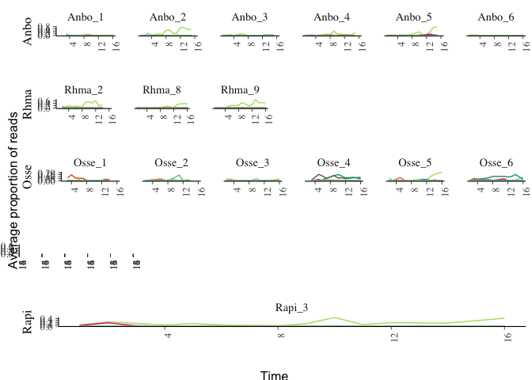

``` r
### Summraizing before and after exposure ####

# CONTROL 
mf_con_statdiff <- mf_con_with_inhibOTUs %>%
    group_by(toadID, species, prepost, G) %>%
    summarize(meanReads=mean(reads), meanBd = mean(eBD_log)) %>%
    dplyr::select(-meanBd) %>%
    spread(key=prepost, value=meanReads) %>%
    mutate(fc=log((Pos-Pre)/Pre +1), significant = NA, p=NA) %>%
    mutate(temp= ifelse(is.finite(fc), fc, ifelse(is.infinite(fc), 10, 0)))
```

``` r
allInhibTaxa <- unique(mf_con_with_inhibOTUs$G)
allIndiv <- unique(mf_con_with_inhibOTUs$toadID)
for ( inhib in allInhibTaxa) {
    # inhib <- allInhibTaxa[1]
    # inhib <- "Arthrobacter"
    for ( indiv in allIndiv) {
        if (exists("stat_temp")) {
            remove(stat_temp)
        }
        # indiv <- allIndiv[1]
        # indiv <- "Anbo_2"
        mf_temp <- mf_con_with_inhibOTUs %>%
            filter(G==inhib, toadID==indiv) %>%
            group_by(toadID, G, prepost, time) %>%
            summarise(reads=mean(reads)) %>%
            spread(key=prepost, value=reads)
        # stat_temp <- anova(lm(reads ~ prepost, data=mf_temp))
        #+ warning=FALSE, message=FALSE
        stat_temp <- wilcox.test(mf_temp$Pre, mf_temp$Pos)
        mf_con_statdiff[which(mf_con_statdiff$toadID==indiv & mf_con_statdiff$G == inhib),"p"] <- (stat_temp$p.value)
        mf_con_statdiff[which(mf_con_statdiff$toadID==indiv & mf_con_statdiff$G == inhib),"significant"] <- (stat_temp$p.value<0.05)
        
    }
}

mf_con_statdiff %>%
    filter(!is.na(significant)) %>%
    ggplot(aes(x=G)) +
    geom_point(aes(y=temp, col=species, pch=significant), cex=2, position=position_jitter(width=0, height=0.25)) +
    theme(axis.text.x = element_text(angle = 90, hjust = 1)) +
    scale_shape_manual(values=c(21,19)) +
    geom_hline(aes(yintercept=0))
```

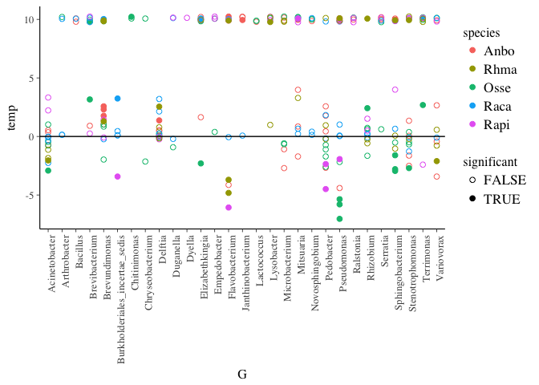

``` r
# TREAT

mf_treat_statdiff <- mf_treat_with_inhibOTUs %>%
    group_by(toadID, species, prepost, G) %>%
    summarize(meanReads=mean(reads), meanBd = mean(eBD_log)) %>%
    dplyr::select(-meanBd) %>%
    spread(key=prepost, value=meanReads) %>%
    # mutate(diff=Pos-Pre, significant = NA, p=NA) %>%
    mutate(fc=log((Pos-Pre)/Pre +1), significant = NA, p=NA) %>%
    mutate(temp= ifelse(is.finite(fc), fc, ifelse(is.infinite(fc), 10, 0)))
```

``` r
allInhibTaxa <- unique(mf_treat_with_inhibOTUs$G)
allIndiv <- unique(mf_treat_with_inhibOTUs$toadID)
for ( inhib in allInhibTaxa) {
    # inhib <- allInhibTaxa[1]
    # inhib <- "Arthrobacter"
    for ( indiv in allIndiv) {
        if (exists("stat_temp")) {
            remove(stat_temp)
        }
        # indiv <- allIndiv[1]
        # indiv <- "Anbo_2"
        mf_temp <- mf_treat_with_inhibOTUs %>%
            filter(G==inhib, toadID==indiv) %>%
            group_by(toadID, G, prepost, time) %>%
            summarise(reads=mean(reads)) %>%
            spread(key=prepost, value=reads)
        # stat_temp <- anova(lm(reads ~ prepost, data=mf_temp))
        #+ warning=FALSE, message=FALSE
        stat_temp <- wilcox.test(mf_temp$Pre, mf_temp$Pos)
        mf_treat_statdiff[which(mf_treat_statdiff$toadID==indiv & mf_treat_statdiff$G == inhib),"p"] <- (stat_temp$p.value)
        mf_treat_statdiff[which(mf_treat_statdiff$toadID==indiv & mf_treat_statdiff$G == inhib),"significant"] <- (stat_temp$p.value<0.05)
        
    }
}

mf_treat_statdiff %>%
    filter(!is.na(significant)) %>%
    ggplot(aes(x=G)) +
    geom_point(aes(y=temp, col=species, pch=significant), cex=2, position=position_jitter(width=0, height=0.25)) +
    theme(axis.text.x = element_text(angle = 90, hjust = 1)) +
    scale_shape_manual(values=c(21,19)) +
    geom_hline(aes(yintercept=0))
```

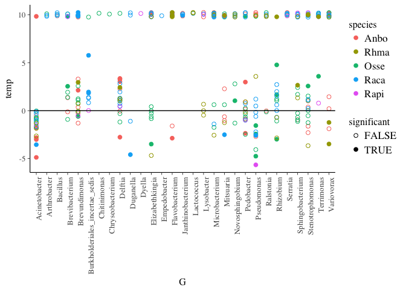

``` r
### TEsting presence absence BD

# TREAT
mf_treat_statdiff <- mf_treat_with_inhibOTUs %>%
    filter(prepost=="Pre" | (prepost == "Pos" & PABD == TRUE)) %>%
    group_by(toadID, species, prepost, G) %>%
    summarize(meanReads=mean(reads), meanBd = mean(eBD_log)) %>%
    dplyr::select(-meanBd) %>%
    spread(key=prepost, value=meanReads) %>%
    # mutate(diff=Pos-Pre, significant = NA, p=NA) %>%
    mutate(fc=log((Pos-Pre)/Pre +1), significant = NA, p=NA) %>%
    mutate(temp= ifelse(is.finite(fc), fc, ifelse(is.infinite(fc), 10, 0)))
```

``` r
allInhibTaxa <- unique(mf_treat_with_inhibOTUs$G)
allIndiv <- unique(mf_treat_with_inhibOTUs$toadID)
for ( inhib in allInhibTaxa) {
    # inhib <- allInhibTaxa[1]
    # inhib <- "Flavobacterium"
    for ( indiv in allIndiv) {
        if (exists("stat_temp")) {
            remove(stat_temp)
        }
        # indiv <- allIndiv[1]
        # indiv <- "Lipi_3"
        mf_temp <- mf_treat_with_inhibOTUs %>%
            filter(prepost=="Pre" | (prepost == "Pos" & PABD == TRUE)) %>%
            filter(G==inhib, toadID==indiv) %>%
            group_by(toadID, G, prepost, time) %>%
            summarise(reads=mean(reads)) %>%
            spread(key=prepost, value=reads)
        # stat_temp <- anova(lm(reads ~ prepost, data=mf_temp))
        if ( any(!is.na(mf_temp$Pre)) & any(!is.na(mf_temp$Pos)) ) {
            #+ warning=FALSE, message=FALSE
            stat_temp <- wilcox.test(mf_temp$Pre, mf_temp$Pos)
            mf_treat_statdiff[which(mf_treat_statdiff$toadID==indiv & mf_treat_statdiff$G == inhib),"p"] <- (stat_temp$p.value)
            mf_treat_statdiff[which(mf_treat_statdiff$toadID==indiv & mf_treat_statdiff$G == inhib),"significant"] <- (stat_temp$p.value<0.05)
        } else {
            mf_treat_statdiff[which(mf_treat_statdiff$toadID==indiv & mf_treat_statdiff$G == inhib),"p"] <- NA
            mf_treat_statdiff[which(mf_treat_statdiff$toadID==indiv & mf_treat_statdiff$G == inhib),"significant"] <- NA        
            }
        
        
    }
}

mf_treat_statdiff %>%
    # filter(!is.na(significant)) %>%
    ggplot(aes(x=G)) +
    geom_point(aes(y=temp, col=species, pch=significant), cex=2, position=position_jitter(width=0, height=0.25)) +
    theme(axis.text.x = element_text(angle = 90, hjust = 1)) +
    scale_shape_manual(values=c(21,19)) +
    geom_hline(aes(yintercept=0))
```

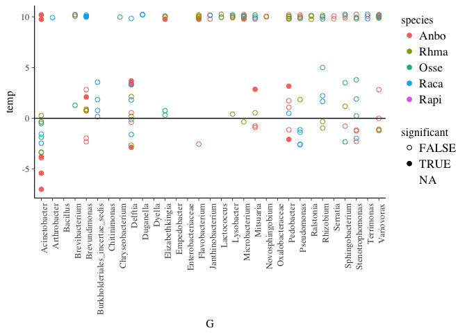
