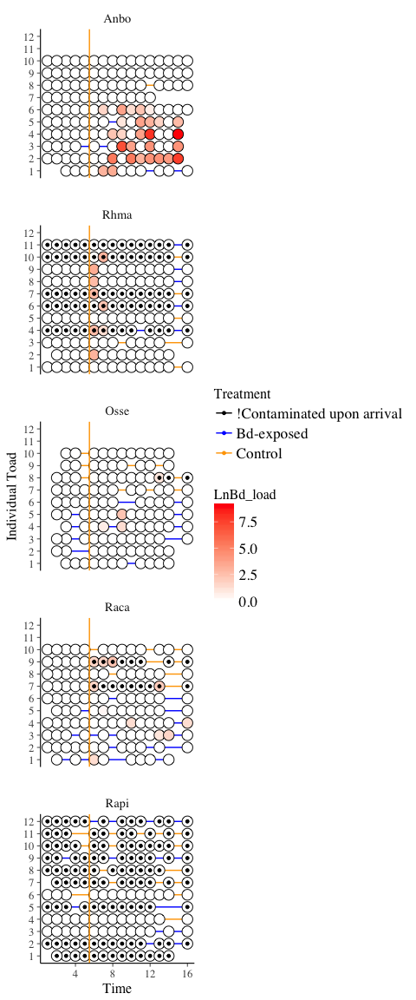

Exploratory Data Analysis for 5Sp Dataset
================
Melissa Chen
Wed Feb 6 17:43:51 2019

First, load required packages
-----------------------------

``` r
#### Load packages ####
library(tidyverse) # for data manipulation
```

    ## ── Attaching packages ────────────────────────────────── tidyverse 1.2.1 ──

    ## ✔ ggplot2 2.2.1     ✔ purrr   0.2.4
    ## ✔ tibble  1.4.2     ✔ dplyr   0.7.5
    ## ✔ tidyr   0.8.1     ✔ stringr 1.3.1
    ## ✔ readr   1.1.1     ✔ forcats 0.3.0

    ## ── Conflicts ───────────────────────────────────── tidyverse_conflicts() ──
    ## ✖ dplyr::filter() masks stats::filter()
    ## ✖ dplyr::lag()    masks stats::lag()

``` r
library(MASS) # For fitting distributions
```

    ## 
    ## Attaching package: 'MASS'

    ## The following object is masked from 'package:dplyr':
    ## 
    ##     select

``` r
library(rstanarm) # For calculated expected alpha and beta diversity
```

    ## Loading required package: Rcpp

    ## rstanarm (Version 2.17.4, packaged: 2018-04-13 01:51:52 UTC)

    ## - Do not expect the default priors to remain the same in future rstanarm versions.

    ## Thus, R scripts should specify priors explicitly, even if they are just the defaults.

    ## - For execution on a local, multicore CPU with excess RAM we recommend calling

    ## options(mc.cores = parallel::detectCores())

    ## - Plotting theme set to bayesplot::theme_default().

``` r
library(gridExtra) # For arranging ggplots
```

    ## 
    ## Attaching package: 'gridExtra'

    ## The following object is masked from 'package:dplyr':
    ## 
    ##     combine

``` r
library(mgcv) # For beta distribution (beta diversity)
```

    ## Loading required package: nlme

    ## 
    ## Attaching package: 'nlme'

    ## The following object is masked from 'package:dplyr':
    ## 
    ##     collapse

    ## This is mgcv 1.8-17. For overview type 'help("mgcv-package")'.

Define pathways for input files

``` r
#### Pathways ####
# OTU table in text format; rarefied to 'rared' OTUs
oturarePWD="../MF_and_OTU_edited/otu_table_r5000.txt"
# rarefaction depth
rared <- 5000
# OTU table in text format; not rarefied
otuPWD = "../MF_and_OTU_edited/otu_table_text.txt"
# FULL Mapping file; with alpha diversity added-- must have all columns described in aMetrics
mfPWD = "../MF_and_OTU_edited/MF_withalpha.txt"
# aMetrics
aMetrics <- c("observed_otus","shannon")
# Get header names for all alpha metrics
aHeader <- paste0(aMetrics,"_even_",rared,"_alpha")

# Inhibitory metadata; columns must be "host","inhib status","isolate number","OTU ID", "fulldescrp","OTU taxonomy"
inhibPWD <- "../ANTIFUNGAL/inhibitory_metadata_MANUAL.txt"

# folder with distance matrices
dmPWD <- "../beta_div/"
# distance metrics
dmMetrics <- c("bray_curtis")

thresh = 1 # number of OTUs in the table for OTU to be kept
minOTUSample = 5
minOTUTab = 100
otuCutoff = 5000 # cutoff to discard sample


#### FILTERING BD NOTES:
# First, checks all numbers to see if less than indivTHRESH. If less than indivTHRESH, it is changed to '0'
# Then, it see is if at least 2 are NOT zero and the third is more than 50. 
# If the third is less than 50 AND the other two measurements are zero, they are all changed to zeros./


#### LOAD DATA ####

# Load mappingfile 
mf <- read.delim(paste0(mfPWD), header=TRUE, as.is=TRUE)
# Load full OTU table
otu <- read.delim(paste0(otuPWD), header=TRUE, as.is=TRUE, skip=1)
# Load rarefied OTU table
otu_rare <- read.delim(paste0(oturarePWD), header=TRUE, as.is=TRUE, skip=1)
# Loop through DMs
dm_all <- list()
for ( d in dmMetrics) {
    dm_all[[d]] <-  read.delim(paste0(dmPWD,dmMetrics,"_dm.txt"), header=TRUE)
}
# inhib
inhib <- read.delim(paste0(inhibPWD), header=FALSE, as.is=TRUE)
```

Determining BD infection loads \#\#
One of the problems with the BD qPCR results is that we get very irregular results. I would expect BD load to be modelled by
----------------------------------------------------------------------------------------------------------------------------

an approximately poisson process; here, we check if this is true.

``` r
# Filter out all information except BD-positive scenarios
BD <- mf %>%
    as_tibble() %>%
    dplyr::select(X.SampleID, Bd_Run_1,Bd_Run_2, Bd_Average_Run_3) %>%
    filter(!is.na(Bd_Average_Run_3), !is.na(Bd_Run_1), !is.na(Bd_Run_2))
samples_bd <- BD$X.SampleID
BD <- BD %>%
    dplyr::select(-X.SampleID)
BD12 <- c(BD$Bd_Run_1, BD$Bd_Run_2, BD$Bd_Average_Run_3)
# Get rid of zeros due to overinflation
BD12 <- BD12[BD12!=0]
# Fit a poisson model to log BD
poisfit <- MASS::fitdistr(round(log(BD12)), densfun = "Poisson")
# Set new range of X's to test
xfit <- seq(0,(max(log(BD12))))
# Predict y
pred.y <- data.frame(y.pred=dpois(x=xfit, poisfit$estimate), xfit=xfit)
# Plot histogram with poisson distribution fit
BD12 %>%
    as_tibble() %>%
    rename(BDload=value)%>%
    ggplot(aes(x=log(BDload))) +
    geom_histogram(aes(y=..density..), bins=8) +
    geom_line(data=pred.y,aes(x=xfit, y=y.pred), col="red")
```


What we see above is that BD load (when not zero) is, in fact, modelled well by a poisson process. This means we could fit a poisson model to the aPCR results to estimate the "true" infection load (lambda) for each toad.

``` r
# Model true infection load for each toad
BD_lambda_est <- t(apply(round(log(BD+1)), MARGIN=1, FUN=function(x) {
    temp <- fitdistr(x, densfun="Poisson")
    return(c(temp$estimate,temp$sd))
})) %>%
    as_tibble() %>%
    rename(sd=lambda1) %>% 
    mutate(pval=dnorm(0,mean=lambda,sd=sd)) %>% # To estimate if lambda is significantly different from zero, we see if pval for parameter estimate different from zero
    mutate(sig=pval<=0.10)
final_BD <- cbind(BD,BD_lambda_est)

# To compare, let's see what a different filtering method yields:
# If 2 BD samples are 0 and the third is less than 50, then set to zero.
# Also, if anything is less than 5, make it zero anyway.

# BD filtering notes and thresholds:
indivTHRESH = 5 # BD individual threshold
thirdTHRESH = 50 # BD 3rd sample threshold
BD_alt <- BD
for ( r in 1:nrow(BD_alt) ) {
    for ( c in 1:ncol(BD_alt) ) {
        if ( (BD_alt[r,c] < indivTHRESH) | is.na(BD_alt[r,c]) ) {
            BD_alt[r,c] <- 0
        }
    }
    if ( (sum(BD_alt[r,] == 0) == 2) & (max(BD_alt[r,],na.rm=TRUE) < thirdTHRESH) ) {
        BD_alt[r,] <- c(0,0,0)
    }
    
}
BD_alt$infected <- rowSums(BD_alt) >0

cbind(final_BD[,c("Bd_Run_1","Bd_Run_2","Bd_Average_Run_3","pval","sig")], alt_infect =BD_alt$infected)
```

    ##    Bd_Run_1 Bd_Run_2 Bd_Average_Run_3         pval   sig alt_infect
    ## 1     10.28     0.00             5.20 8.098645e-02  TRUE       TRUE
    ## 2      0.00    10.52            16.83 4.393495e-02  TRUE       TRUE
    ## 3      0.00     7.28            16.22 4.393495e-02  TRUE       TRUE
    ## 4     71.90     5.64            23.67 4.431848e-03  TRUE       TRUE
    ## 5     15.38     4.87            25.69 7.750120e-03  TRUE       TRUE
    ## 6     77.05     0.00            54.45 7.750120e-03  TRUE       TRUE
    ## 7     64.00     0.00            38.29 7.750120e-03  TRUE       TRUE
    ## 8    189.60     0.00            95.31 2.550110e-03  TRUE       TRUE
    ## 9      0.00     1.17             0.54 7.259122e-01 FALSE      FALSE
    ## 10     0.00     6.41            13.65 4.393495e-02  TRUE       TRUE
    ## 11    10.82     0.00             6.91 8.098645e-02  TRUE       TRUE
    ## 12     0.00    16.00            44.35 1.366003e-02  TRUE       TRUE
    ## 13     0.00    33.55           108.32 4.431848e-03  TRUE       TRUE
    ## 14     0.00    55.87           225.03 4.431848e-03  TRUE       TRUE
    ## 15   296.00   229.50          3270.00 2.055213e-05  TRUE       TRUE
    ## 16     0.00     4.60            12.83 4.393495e-02  TRUE      FALSE
    ## 17     0.00     2.10             2.44 3.113306e-01 FALSE      FALSE
    ## 18    18.03     0.00            34.93 1.366003e-02  TRUE       TRUE
    ## 19     0.00   107.10           138.93 2.550110e-03  TRUE       TRUE
    ## 20   540.40    34.09           597.58 1.003727e-04  TRUE       TRUE
    ## 21    26.18     1.32            18.01 1.366003e-02  TRUE       TRUE
    ## 22  1433.00  1340.00           841.86 7.191668e-06  TRUE       TRUE
    ## 23     0.00    14.49             7.90 4.393495e-02  TRUE       TRUE
    ## 24     0.00     4.61             1.71 1.541803e-01 FALSE      FALSE
    ## 25    58.99     0.00           913.33 1.474740e-03  TRUE       TRUE
    ## 26     0.00     6.23             5.58 8.098645e-02  TRUE       TRUE
    ## 27     0.00   259.80             2.73 1.366003e-02  TRUE       TRUE
    ## 28     0.00     4.53            10.41 8.098645e-02  TRUE      FALSE
    ## 29   235.50   216.50           320.80 1.003727e-04  TRUE       TRUE
    ## 30     5.24    69.58           129.53 1.474740e-03  TRUE       TRUE
    ## 31     0.00     6.96             5.01 8.098645e-02  TRUE       TRUE
    ## 32     3.40    77.90            85.92 4.431848e-03  TRUE       TRUE
    ## 33     1.94   140.90           138.90 1.474740e-03  TRUE       TRUE
    ## 34    16.56    47.75            70.91 1.474740e-03  TRUE       TRUE
    ## 35    24.46     3.40            17.11 1.366003e-02  TRUE       TRUE
    ## 36   184.30    26.53           136.57 4.990517e-04  TRUE       TRUE
    ## 37    37.63    55.33           151.57 4.990517e-04  TRUE       TRUE
    ## 38  1975.00  2037.00          3254.00 1.501039e-06  TRUE       TRUE
    ## 39     6.40    18.86            35.65 4.431848e-03  TRUE       TRUE
    ## 40     0.00     2.17             1.83 3.113306e-01 FALSE      FALSE
    ## 41     2.24     0.00             9.35 1.541803e-01 FALSE      FALSE
    ## 42     5.37     3.70             9.74 2.432609e-02  TRUE       TRUE
    ## 43    71.51    40.15           130.99 4.990517e-04  TRUE       TRUE
    ## 44    23.24     1.86             2.91 4.393495e-02  TRUE      FALSE
    ## 45     3.62     0.00             2.07 1.541803e-01 FALSE      FALSE
    ## 46     2.05     1.22            16.83 4.393495e-02  TRUE      FALSE
    ## 47    52.59    34.16            35.52 8.563944e-04  TRUE       TRUE
    ## 48  1590.00  2544.00          4696.67 2.528022e-06  TRUE       TRUE
    ## 49    70.58    71.67            99.26 4.990517e-04  TRUE       TRUE
    ## 50  8324.00  6060.00         13977.33 1.880743e-07  TRUE       TRUE
    ## 51    18.78    28.72             7.90 7.750120e-03  TRUE       TRUE
    ## 52     0.00     3.56             8.41 8.098645e-02  TRUE      FALSE
    ## 53     0.00    83.41            53.73 7.750120e-03  TRUE       TRUE
    ## 54     0.00     0.00             4.69 3.113306e-01 FALSE      FALSE

What we see is that by using a significant threshold of p=0.1 (which is fairly relaxed), the poisson model method is less stringent than the straight threshold method. I believe the poisson model method is likely more reliable since it is able to detect cases where infeciton is truely low, but consistent. For example, there are some cases where all 3/3 samples were BD-positive but at low abundances; however, the straight threshold model does not recognize it as a 'positive' since the abundances are below the individual threshold. I believe the poisson model method uses more of the information in the qPCR methods than the straight threshold method.
From here, we will add in the "expected" BD load (lambda) into the mapping file for each toad.

``` r
# Insert expected BD loads for each sample
final_BD <- cbind(samples_bd, final_BD)
mf$eBD <- 0
mf[match(final_BD$samples_bd, mf$X.SampleID),"eBD"] <- final_BD$lambda

##### ADJUSTING DATA: Make same order, make 'time' variable ######

#### Edit metadata/mapping file #####
toKeepMF <-  c("X.SampleID"
               ,"eBD" # infection levels
               ,"SPEC" # Species code
               ,"TREATMENT_GROUP" # whether it was pre or post; should rename
               ,"BD100KZSP_3122011" # whether or not individual was exposed to BD: will rename
               ,"ANONYMIZED_NAME" # individual frog ID
               , "PRE_POST_BD_NUM" # timepoint
               , aHeader
               
)
newNames <- c("SampleID"
              , "eBD_log"
              , "species"
              , "prepost"
              , "BD_infected"
              , "toadID"
              , "timepoint"
              , aMetrics
)

mf <- mf %>% # mapping file with controls still in it
    as_tibble() %>% # make into tibble
    dplyr::select(one_of(toKeepMF)) %>% # filter to only relevant variables
    rename_at(vars(toKeepMF), ~ newNames) %>% #rename variable names
    filter(prepost == "Pre" | prepost == "Pos") %>% # get rid of things in "tre", which is a different experiment
    separate(timepoint, into=c("exposure","time"), sep="_", convert=TRUE) %>% # create a time variable
    mutate( time = ifelse(exposure == "Pre", time, time + 5)) # time variable "restarts" at BD exposure point, but I want it to be continuous


#### Adjusting values in mf for Osse and Bubo ####
```

OSSE QUIRK
So it turns out that Osse has this weird quirk where they weren't sampled in the first timepoint. Then, in the mapping file they were given time points 1-4 instead of 2-5, which screws up how the sampling lines up. So, I'm going to change the "pre" numbeers so that they line up nicely with the rest of the samples.

``` r
# rows to change
addTime1 <- which((mf$species=="Osse") & (mf$time %in% c(1,2,3,4,5)))
mf[addTime1, "time"] <- mf[addTime1, "time"] +1 # add 1 to all pre time points so that time point 5 lines up with all other species
```

BUBO QUIRK
Additionally, there is this strange quirk with the Bubo dataset (or rather, strange quirk with every OTHER dataset) where nothing but Bubo was sampled at time point 10. Thus, let's add +1 to all time point 10's for all samples except Bubo

``` r
addTime1_notbubo <- which((mf$species!="Bubo") & (mf$time == 15))
mf[addTime1_notbubo,"time"] <- mf[addTime1_notbubo,"time"] + 1

#### filtering mapping files
mf.wcon <- mf 
mf.tb <- mf.wcon %>%
    filter(species != "None") # get rid of controls

# Number of controls lost
c(nrow(mf.wcon)-nrow(mf.tb))
```

    ## [1] 17

``` r
### Check to make sure there are no duplicates
```

Finally, there were certain individuals who actually tested positive for BD when they arrived. These were unknown until later because the PCR process takes a while, so they were included in the experiment. However, let us identify these individuals and remove them. The list below was manually curated from the spreadsheet provided by Val.

``` r
BD_contam_upon_arrival <- c("Buma_4"
                            , "Buma_6"
                            , "Buma_7"
                            , "Buma_10"
                            , "Buma_11"
                            , "Rapi_1"
                            , "Rapi_2"
                            , "Rapi_5"
                            , "Rapi_7"
                            , "Rapi_8"
                            , "Rapi_9"
                            , "Rapi_10"
                            , "Rapi_11"
                            , "Rapi_12")

# Add new column for individuals that were originally contamined
mf.tb$orig_contam <- 0
mf.tb[which(mf.tb$toadID %in% BD_contam_upon_arrival),"orig_contam"] <- 1

#### Other adjustments

# Make a PABD column as well as a "raw" BD counts column
mf.tb <- mf.tb %>%
    mutate(PABD=eBD_log>0, eBD_raw=exp(eBD_log)-1)

# # make diversity metrics numeric
mf.tb$shannon <- as.numeric(mf.tb$shannon)
```

    ## Warning: NAs introduced by coercion

``` r
mf.tb$observed_otus <- as.numeric(mf.tb$observed_otus)
```

    ## Warning: NAs introduced by coercion

``` r
mf.tb$logRich <- log(mf.tb$observed_otus)
# View(mf.tb %>%
         # dplyr::select(SampleID, shannon))

# filter to ONLY include those things in otu table (Raw)
mf.raw <- mf.tb %>%
    filter(SampleID %in% colnames(otu))
# How many things did we lose? Hopefully none, so that means the OTU table is complete.
c(nrow(mf.raw), nrow(mf.tb))
```

    ## [1] 780 780

``` r
# Note: This ALSO means that controls were filtered out before making the OTU table.


# Samples to keep in otu table (raw)
keepSamples <- colnames(otu_rare)[-match(c("X.OTU.ID","taxonomy"),colnames(otu_rare))]
### ** Note, this assumes that there are no samples in OTU table that are NOT in mapping file!
# If you get random warnings later on, you should come back here.
OTU_names <- otu$X.OTU.ID
otu.filt <- otu %>%
    as_tibble() %>%
    dplyr::select(one_of(keepSamples)) %>% # Use rare because it naturally cuts off for <5000
    replace(.<minOTUSample, 0) %>%
    mutate(rowsums=rowSums(.)) %>%
    mutate(OTUID = OTU_names) %>%
    filter(rowsums > minOTUTab) %>%
    dplyr::select(-rowsums) 
# Samples to keep in otu table (rarefied)
OTU_names_rare <- otu_rare$X.OTU.ID
otu.filt_rare <- otu %>%
    as_tibble() %>%
    dplyr::select(one_of(keepSamples)) %>% # Use rare
    replace(.<minOTUSample, 0) %>%
    mutate(rowsums=rowSums(.)) %>%
    mutate(OTUID = OTU_names) %>%
    filter(rowsums > minOTUTab) %>%
    dplyr::select(-rowsums) 
# View(otu.filt_rare)
# Check that each have the same number of samples
ncol(otu.filt_rare)
```

    ## [1] 784

``` r
ncol(otu.filt)
```

    ## [1] 784

``` r
#### The mapping file already has diversity in it, so I need to add beta diversity and inihibitory bacterial diversity

##### Beta diversity turnover #####
# Get distance to sample directly before for every sample
# AKA: How similar was the current sample to the sample JUST before that time point for that individual toad?
# Note; tried to do this with dplyr but it is VERY slow. Just used base R subsetting instead

for ( name in names(dm_all) ) {
    mf.raw[,paste0("distance_",name)] <- NA
    dm <- dm_all[[name]]
    dm <- data.frame(dm, row.names = 1)
    for ( i in 1:nrow(mf.raw) ) {
        currentSample <- mf.raw$SampleID[i]
        current <- mf.raw[i, c("toadID","time")]
        prevSample <- mf.raw$SampleID[mf.raw$toadID==as.character(current[1,1]) & mf.raw$time == as.numeric(current[1,2]-1)]
        if ( length(prevSample) > 0 & (currentSample %in% rownames(dm))) {
            distTemp <- dm[currentSample,as.character(prevSample)]
            if ( length(distTemp) > 0) {
                mf.raw[i,paste0("distance_",name)] <- distTemp
                
            }
        }
        
        # print(paste0("done",i," out of ",nrow(mf.tb)))
    }
}

## 


### Get proportion and count of inhibitory otus from inhibitory otu metadata
inhib.tb <- inhib %>%
    as_tibble() %>%
    rename(Name=V1, inhib=V2, num=V3, seq=V4,sampleID=V5, taxa=V6)
otu.tb.inhib <- otu.filt %>%
    mutate(inhib = (inhib.tb[match(otu.filt$OTUID, inhib.tb$seq),"inhib"])$inhib)
# transpose it, and then make column for "percent inhib" and "count inhib"
# total counts
sampleCounts <- otu.tb.inhib %>%
    dplyr::select(-c("inhib","OTUID")) %>%
    colSums()
# counts of total inhibitory sequences
inhibCounts <- otu.tb.inhib %>%
    filter(inhib=="inhibitory") %>%
    dplyr::select(-c("inhib","OTUID")) %>%
    colSums()
# richness of inhibitory sequences
inhibRich <- otu.tb.inhib %>%
    filter(inhib=="inhibitory") %>%
    dplyr::select(-c("inhib","OTUID")) %>%
    replace(.>0, 1) %>%
    colSums()
## Now, add this information into the mf
mf.raw <- mf.raw %>%
    mutate(n=sampleCounts[match(SampleID, names(sampleCounts))]
           ,inhibCounts =inhibCounts[match(SampleID, names(inhibCounts))]
           , inhibRich=inhibRich[match(SampleID, names(inhibRich))]) %>%
    mutate(percInhib = inhibCounts/n)
# Now, filter mf to rarefied OTU table
mf.rare <- mf.raw %>%
    filter(SampleID %in% colnames(otu_rare))


#### Adding NMDS ####
# MAKE NMDS
dm.filt <- dm[mf.rare$SampleID,mf.rare$SampleID]
# Make NMDS of distance matrix
set.seed(1017937)
nmds.all <- isoMDS(dist(dm.filt), k = 2)
```

    ## initial  value 23.278925 
    ## iter   5 value 19.243705
    ## iter  10 value 18.371526
    ## final  value 18.149220 
    ## converged

``` r
nmds <- nmds.all$points
colnames(nmds) <- c("NMDS1","NMDS2")
mf.rare <- cbind(mf.rare, nmds)


#### Created filtered mapping files with all extra information
# Mapping file with only controls (training dataset)
# Save Rdata
save(mf.raw, file="mf.raw.RData")
save(mf.rare, file="mf.rare.RData")
# How many samples did we lose due to rarefaction?
c(nrow(mf.rare), nrow(mf.tb))
```

    ## [1] 696 780

``` r
# Which samples did we lose due to rarefaction?
mf.tb %>%
    filter(!(SampleID %in% colnames(otu_rare))) %>%
    dplyr::select(SampleID) %>%
    pull()
```

    ##  [1] "mck126Pre.3Rapi.9.452902"    "mck152Pre.4Raca.3.453474"   
    ##  [3] "mck175Pre.4Rapi.5.453228"    "mck176Pre.4Rapi.6.452851"   
    ##  [5] "mck181Pre.4Rapi.11.453526"   "mck194Pre.3Osse.2.453121"   
    ##  [7] "mck195Pre.3Osse.3.451526"    "mck196Pre.3Osse.4.453388"   
    ##  [9] "mck197Pre.3Osse.5.451509"    "mck203Pre.5Raca.1.453103"   
    ## [11] "mck207Pre.5Raca.5.453380"    "mck229Pre.5Rapi.6.451283"   
    ## [13] "mck233Pre.5Rapi.10.451961"   "mck234Pre.5Rapi.11.452358"  
    ## [15] "mck238Pre.5Bubo.3.451540"    "mck247Pre.4Osse.2.451004"   
    ## [17] "mck253Pre.4Osse.8.453340"    "mck254Pre.4Osse.9.452071"   
    ## [19] "mck255Pre.4Osse.10.453119"   "mck258Post.1Raca.3.452001"  
    ## [21] "mck265Post.1Raca.10.451311"  "mck288Post.1Rapi.12.452357" 
    ## [23] "mck28Pre.1Rapi.7.453206"     "mck337Post.2Rapi.8.452471"  
    ## [25] "mck344Post.2Bubo.3.451036"   "mck362Post.3Raca.1.452850"  
    ## [27] "mck363Post.3Raca.2.452084"   "mck364Post.3Raca.3.452312"  
    ## [29] "mck367Post.3Raca.6.451477"   "mck369Post.3Raca.8.453404"  
    ## [31] "mck389Post.3Rapi.7.452473"   "mck391Post.3Rapi.9.452135"  
    ## [33] "mck392Post.3Rapi.10.452247"  "mck393Post.3Rapi.11.453183" 
    ## [35] "mck394Post.3Rapi.12.451067"  "mck399Post.3Bubo.5.451162"  
    ## [37] "mck408Post.3Osse.4.451758"   "mck418Post.4Raca.1.452983"  
    ## [39] "mck430Post.4Buma.3.451897"   "mck466Post.4Osse.6.452900"  
    ## [41] "mck467Post.4Osse.7.452271"   "mck514Post.5Osse.1.451822"  
    ## [43] "mck519Post.5Osse.6.451428"   "mck522Post.5Osse.9.451216"  
    ## [45] "mck537Post.6Buma.4.452319"   "mck555Post.6Rapi.11.452484" 
    ## [47] "mck581Post.7Raca.2.451035"   "mck588Post.7Raca.19.451507" 
    ## [49] "mck589Post.7Raca.10.452408"  "mck5Pre.1Raca.5.452683"     
    ## [51] "mck602Post.7Rapi.2.452938"   "mck612Post.7Rapi.12.453304" 
    ## [53] "mck613Post.7Bubo.1.452541"   "mck620Post.7Bubo.8.451626"  
    ## [55] "mck629Post.7Osse.7.451230"   "mck636Post.8Raca.1.452301"  
    ## [57] "mck644Post.8Raca.20.451394"  "mck659Post.8Rapi.3.452202"  
    ## [59] "mck661Post.8Rapi.5.453015"   "mck663Post.8Rapi.7.452895"  
    ## [61] "mck665Post.8Rapi.9.452350"   "mck667Post.8Rapi.11.451440" 
    ## [63] "mck686Post.8Osse.9.451552"   "mck689Post.9Raca.2.451706"  
    ## [65] "mck692Post.9Raca.5.452632"   "mck693Post.9Raca.6.452326"  
    ## [67] "mck694Post.9Raca.7.451156"   "mck695Post.9Raca.8.452146"  
    ## [69] "mck700Post.9Buma.3.451263"   "mck712Post.9Rapi.4.453029"  
    ## [71] "mck713Post.9Rapi.5.451460"   "mck716Post.9Rapi.8.452480"  
    ## [73] "mck732Post.9Osse.3.452610"   "mck77Pre.2Bubo.1.452291"    
    ## [75] "mck787Post.11Bubo.2.452305"  "mck788Post.11Bubo.5.452623" 
    ## [77] "mck789Post.11Bubo.3.451585"  "mck795Post.10Osse.2.452404" 
    ## [79] "mck802Post.10Osse.9.451493"  "mck803Post.10Osse.10.453151"
    ## [81] "mck90Pre.1Osse.4.453179"     "mck95Pre.1Osse.9.451177"    
    ## [83] "mck96Pre.1Osse.10.451332"    "mck97Pre.3Raca.1.452248"

``` r
# View(mf_con)
mf_con <- mf.rare %>%
    filter(BD_infected=="n")
# were any controls contaminated at any point?
con_contam <- mf_con %>%
    filter(PABD==TRUE) %>%
    dplyr::select(toadID, time) %>%
    group_by(toadID) %>%
    summarise(firstinfect=min(time))
# get all time points after that
toDel <- c()
for ( n in 1:length(con_contam$toadID)) {
    toad <- con_contam$toadID[n]
    minTime <- con_contam$firstinfect[n]
    temp <- mf_con %>%
        filter(toadID==toad, time>=minTime) %>%
        dplyr::select(SampleID) %>%
        pull()
    toDel <- c(toDel, temp)
}

# Get rid of post-infected ones that weren't supposed to be infected
mf_con_without_init_infect <- mf_con %>%
    filter(orig_contam == 0, !(SampleID %in% toDel))

# Mapping file with only treatment (testing dataset)
mf_treat <- mf.rare %>%
    filter(BD_infected=="y")
mf_treat_without_init_infect <- mf_treat %>%
    filter(orig_contam == 0)
save(mf_con_without_init_infect, file="mf_con_without_init_infect.RData")
save(mf_treat_without_init_infect, file="mf_treat_without_init_infect.RData")

#### PLOTTING EXP DESIGN ####
mf.rare %>%
    separate(toadID, into=c("sp2", "indiv"), remove = FALSE) %>%
    mutate(indiv = factor(indiv, levels=c("1","2","3","4","5","6","7","8","9","10","11","12"))) %>%
    ggplot(aes(x=time, y=indiv)) +
    theme_bw() +
    geom_tile(aes(group=toadID,col=BD_infected, fill=eBD_log), lwd=0.5)+
    scale_color_manual(values=c("grey","black")) +
    geom_vline(aes(xintercept=5.5), col="orange")+
    facet_wrap(~species, nrow=5)
```


``` r
mf_treat_without_init_infect %>%
    separate(toadID, into=c("sp2", "indiv"), remove = FALSE) %>%
    mutate(indiv = factor(indiv, levels=c("1","2","3","4","5","6","7","8","9","10","11","12"))) %>%
    ggplot(aes(x=time, y=indiv)) +
    theme_bw() +
    geom_tile(aes(group=toadID,fill=eBD_log), lwd=0.5)+
    scale_color_manual(values=c("grey","black")) +
    geom_vline(aes(xintercept=5.5), col="orange")+
    facet_wrap(~species, nrow=5)
```


``` r
#### PLOTTING BETA PLOTS ####

mf.rare %>%
    ggplot(aes(x=NMDS1,y=NMDS2)) +
    geom_point(aes(col=species), cex=2)
```


``` r
rbind(mf_con_without_init_infect, mf_treat_without_init_infect) %>%
    mutate(BD_infected=ifelse(BD_infected=="y","Treatment","Control")
           , exposure = factor(exposure, levels=c("Pre","Post"))) %>%
    ggplot(aes(x=NMDS1*(-1),y=NMDS2)) +
    geom_point(aes(bg=exposure, col=PABD), cex=2, alpha=0.8, pch=21) +
    facet_grid(BD_infected ~ species) +
    scale_color_manual(values=c("white","black")) +
    scale_fill_manual(values=c("blue","red"))
```


``` r
mf_treat_without_init_infect %>%
    filter(exposure=="Post") %>%
    ggplot(aes(x=NMDS1, y=NMDS2)) +
    geom_point(aes(bg=inhibRich, col=PABD), cex=3, pch=21) +
    scale_color_manual(values=c("white","red"))+
    facet_wrap(~species, nrow=1)
```


``` r
#### ALPHA DIVERISTY ####
```

### ALPHA DIVERSITY PLOTTING

First thing to do is calculated expected alpha diversity for each individual, and then calculate how for that particular sample was from the "expected" diversity. Before we do that though, let's plot alpha diversity to see how it looks.

``` r
gg_shannon <- ggplot(data=mf_con_without_init_infect, aes(x=shannon)) +
    geom_histogram(aes(color=species), bins=20, show.legend = FALSE) +
    facet_grid(~species)
gg_obsOTUs <- ggplot(data=mf_con_without_init_infect, aes(x=observed_otus)) +
    geom_histogram(aes(color=species), bins=20, show.legend = FALSE) +
    facet_grid(~species)
gg_logRich <- ggplot(data=mf_con_without_init_infect, aes(x=logRich)) +
    geom_histogram(aes(color=species), bins=20, show.legend = FALSE) +
    facet_grid(~species)
grid.arrange(gg_shannon, gg_obsOTUs, gg_logRich, nrow=3)
```


``` r
# Check to see if turnover is changing with time significantly

gg_divtime_con <- mf_con_without_init_infect %>%
    filter(!is.na(shannon)) %>%
    ggplot(aes(x=time, y=shannon)) + 
    # geom_smooth(aes(group=toadID, col=species), method=loess) +
    geom_line(aes(group=toadID, col=species)) +
    geom_point(aes(col=PABD)) +
    # scale_color_manual(values=c("red","blue","gold","green","purple","black")) +
    facet_grid(~species)
gg_divtime_treat <- mf_treat_without_init_infect %>%
    filter(!is.na(shannon)) %>%
    ggplot(aes(x=time, y=shannon)) + 
    # geom_smooth(aes(group=toadID, col=species), method=loess) +
    geom_line(aes(group=toadID, col=species)) +
    geom_point(aes(group=toadID, col=PABD)) +
    geom_vline(aes(xintercept=5.5)) +
    facet_grid(~species)
grid.arrange(gg_divtime_con, gg_divtime_treat, nrow=2)
```


``` r
gg_richtime_con <- mf_con_without_init_infect %>%
    filter(!is.na(logRich)) %>%
    ggplot(aes(x=time, y=logRich)) + 
    # geom_smooth(aes(group=toadID), method=loess) +
    geom_line(aes(group=toadID, col=species)) +
    geom_point(aes(group=toadID, col=PABD)) +
    facet_grid(~species)
gg_richtime_treat <- mf_treat_without_init_infect %>%
    filter(!is.na(logRich)) %>%
    ggplot(aes(x=time, y=logRich)) + 
    # geom_smooth(aes(group=toadID), method=loess) +
    geom_line(aes(group=toadID, col=species)) +
    geom_point(aes(group=toadID, col=PABD)) +
    geom_vline(aes(xintercept=5.5)) +
    facet_grid(~species)
grid.arrange(gg_richtime_con, gg_richtime_treat, nrow=2)
```


``` r
#### SHANNON ####
```

We see that shannon and log of observed otus look approximately normal. Great! Now, let's fit some models to this data. For shannon and logRich, we should use a LMM to find out the average richness for each species and the average richness for each individual through time.
u ~ N(u\_i, sigma\_i)
u\_i = a\_j
a\_j ~ N(u\_sp, sigma\_sp)
where i = sample, j = individual, sp = species Below, we use the dataset with JUST the controls.

``` r
if ( FALSE ) {
    lmer_shannon <- stan_lmer(shannon ~ -1 + species + (1|toadID), data=mf_con_without_init_infect
                              , prior = normal(0, 10, autoscale = TRUE)
                              , seed = 98374)
    save(lmer_shannon, file="lmer_shannon.RData")
} else {
    load("lmer_shannon.RData")
}
prior_summary(lmer_shannon)
```

    ## Priors for model 'lmer_shannon' 
    ## ------
    ## 
    ## Coefficients
    ##  ~ normal(location = [0,0,0,...], scale = [10,10,10,...])
    ##      **adjusted scale = [7.72,7.72,7.72,...]
    ## 
    ## Auxiliary (sigma)
    ##  ~ exponential(rate = 1)
    ##      **adjusted scale = 0.77 (adjusted rate = 1/adjusted scale)
    ## 
    ## Covariance
    ##  ~ decov(reg. = 1, conc. = 1, shape = 1, scale = 1)
    ## ------
    ## See help('prior_summary.stanreg') for more details

``` r
# Look at distributions according to models
samps_lmer_shannon <- rstan::extract(lmer_shannon$stanfit)
pre_test_set <- mf_treat_without_init_infect %>%
    filter(time<6) 
## PLOT OF EXPECTED RCIHNESS FOR EACH SPECIES
samps_lmer_shannon$beta %>%
    as.data.frame() %>%
    rename(Bubo=V1, Buma=V2, Osse=V3, Raca=V4, Rapi=V5) %>%
    dplyr::select(Bubo,Buma,Osse,Raca,Rapi) %>%
    gather(key=species, value=shannon) %>%
    ggplot(mapping=aes(x=species, y=shannon))+
    geom_violin() +
    geom_point(data=mf_con_without_init_infect, aes(y=shannon, x=species), position = position_jitter(width = 0.1, height=0), col="blue") +
    geom_point(data=pre_test_set, aes(y=shannon, x=species), position=position_jitter(width = 0.1, height=0), col="red")
```


``` r
# legend("topright", legend=c("Control (all)","Treatment (Pre)"), pch=21, col=c("blue","red"))

# indiv_mu <- ranef(lmer_shannon)$toadID
# sp_mu <- fixef(lmer_shannon)
# Get standard deviation between toad individuals and samples
samp_sigma <- samps_lmer_shannon$aux
toadID_sigma <- sd(samps_lmer_shannon$b[,ncol(samps_lmer_shannon$b)])


# Now, we can calculate the probability that the "test" dataset values come from this distribution
# List of individuals
treat_indiv <- unique(mf_treat_without_init_infect$toadID)
# Get distribution for each species
species_list <- levels(factor(mf_con_without_init_infect$species))

exp_distr <- as.data.frame(matrix(ncol=length(species_list), nrow=4000, dimnames = list(1:4000, species_list)))
for ( num_sp in 1:length(species_list)) {
    exp_distr[,num_sp] <- rnorm(length(samps_lmer_shannon$beta[,num_sp]), mean=rnorm(length(samps_lmer_shannon$beta[,num_sp]), mean=samps_lmer_shannon$beta[,num_sp], sd=toadID_sigma), sd=samp_sigma)
}

# Loop through and calculate probability of having diversity at that level
pre_exp_indiv <- data.frame(toadID=treat_indiv, exp_shan=rep(NA, length(treat_indiv)), p_shan=rep(NA, length(treat_indiv)), infect=rep(NA, length(treat_indiv)))
for ( i in treat_indiv ) {
    n_row <- match(i, treat_indiv)
    sp <- unlist(strsplit(i,"_"))
    num_sp <- match(sp[1], levels(factor(mf_con_without_init_infect$species)))
    temp_shan <- mf_treat_without_init_infect %>%
        filter(toadID==i, time <=5 ) %>%
        dplyr::select(shannon) %>%
        pull()
    if ( length(temp_shan)>1 ) {
        exp_shan <-  fitdistr(temp_shan, "normal")$estimate[1]
        
    } else {
        exp_shan <- temp_shan
    }
    
    # pred_distr <- rnorm(length(samps_lmer_shannon$beta[,num_sp]), mean=rnorm(length(samps_lmer_shannon$beta[,num_sp]), mean=samps_lmer_shannon$beta[,num_sp], sd=toadID_sigma), sd=samp_sigma)
    p_shan <- sum(exp_distr[,sp[1]]<exp_shan)/length(exp_distr[,sp[1]])
    
    ### Did they get infected?
    infect <- max(mf_treat_without_init_infect %>%
        filter(toadID==i) %>%
        dplyr::select(eBD_raw) %>%
        pull()
        )
    
    pre_exp_indiv[n_row,c("exp_shan","p_shan","infect")] <- c(exp_shan, p_shan, infect)
    
}
# create species column
pre_exp_indiv <- pre_exp_indiv %>%
    separate(toadID, into=c("species","indiv"), remove = FALSE)

# Plot results 
ggplot(pre_exp_indiv, aes(x=p_shan, y=log(infect+1))) +
    geom_smooth(aes(color=species),method=lm, se = FALSE) +
    geom_point(aes(color=species), cex=4) +
    geom_smooth(method=lm, se=FALSE, col="black")
```


``` r
# if we'd JUST plotted raw values
ggplot(pre_exp_indiv, aes(x=exp_shan, y=log(infect+1)))+
    geom_point(aes(color=species), cex=4) +
    geom_smooth(method=lm, se=FALSE) +
    geom_smooth(aes(color=species),method=lm, se = FALSE) 
```


``` r
exp_distr %>%
    gather(key=species, value=shannon) %>%
    ggplot(aes(x=species, y=shannon)) +
    geom_violin() +
    geom_point(data=pre_exp_indiv, aes(x=species, y=exp_shan, col=log(infect+1)), cex=4, position=position_jitter(height=0, width=0.1))
```


``` r
all_p <- pre_exp_indiv %>%
    dplyr::select(toadID, exp_shan, p_shan,infect)

#### RICHNESS (observed OTUs) ####

if (FALSE) {
    lmer_rich <- stan_lmer(logRich ~ -1 + species + (1|toadID), data=mf_con_without_init_infect
                           , prior = normal(0, 10, autoscale = TRUE)
                           , seed = 98374)
    save(lmer_rich, file="lmer_rich.RData")
} else {
    load(file="lmer_rich.RData")
}
prior_summary(lmer_rich)
```

    ## Priors for model 'lmer_rich' 
    ## ------
    ## 
    ## Coefficients
    ##  ~ normal(location = [0,0,0,...], scale = [10,10,10,...])
    ##      **adjusted scale = [4.34,4.34,4.34,...]
    ## 
    ## Auxiliary (sigma)
    ##  ~ exponential(rate = 1)
    ##      **adjusted scale = 0.43 (adjusted rate = 1/adjusted scale)
    ## 
    ## Covariance
    ##  ~ decov(reg. = 1, conc. = 1, shape = 1, scale = 1)
    ## ------
    ## See help('prior_summary.stanreg') for more details

``` r
# Look at distributions according to models
samps_lmer_rich <- rstan::extract(lmer_rich$stanfit)
pre_test_set <- mf_treat_without_init_infect %>%
    filter(time<6) 
# Plot of expected by species, and real samples
samps_lmer_rich$beta %>%
    as.data.frame() %>%
    rename(Bubo=V1, Buma=V2, Osse=V3, Raca=V4, Rapi=V5) %>%
    dplyr::select(Bubo,Buma,Osse,Raca,Rapi) %>%
    gather(key=species, value=logRich) %>%
    ggplot(mapping=aes(x=species, y=logRich))+
    geom_violin() +
    geom_point(data=mf_con_without_init_infect, aes(y=logRich, x=species), position = position_jitter(width = 0.1, height=0), col="blue") +
    geom_point(data=pre_test_set, aes(y=logRich, x=species), position=position_jitter(width = 0.1, height=0), col="red")
```


``` r
# legend("topright", legend=c("Control (all)","Treatment (Pre)"), pch=21, col=c("blue","red"))

# indiv_mu <- ranef(lmer_shannon)$toadID
# sp_mu <- fixef(lmer_shannon)
# Get standard deviation between toad individuals and samples
samp_sigma <- samps_lmer_rich$aux
toadID_sigma <- sd(samps_lmer_rich$b[,ncol(samps_lmer_rich$b)])

# Now, we can calculate the probability that the "test" dataset values come from this distribution
# List of individuals
treat_indiv <- unique(mf_treat_without_init_infect$toadID)
# Get distribution for each species
species_list <- levels(factor(mf_con_without_init_infect$species))

exp_distr <- as.data.frame(matrix(ncol=length(species_list), nrow=4000, dimnames = list(1:4000, species_list)))
for ( num_sp in 1:length(species_list)) {
    exp_distr[,num_sp] <- rnorm(length(samps_lmer_rich$beta[,num_sp]), mean=rnorm(length(samps_lmer_rich$beta[,num_sp]), mean=samps_lmer_rich$beta[,num_sp], sd=toadID_sigma), sd=samp_sigma)
}

# Loop through and calculate probability of having diversity at that level
pre_exp_indiv <- data.frame(toadID=treat_indiv, exp_rich=rep(NA, length(treat_indiv)), p_rich=rep(NA, length(treat_indiv)), infect=rep(NA, length(treat_indiv)))
for ( i in treat_indiv ) {
    n_row <- match(i, treat_indiv)
    sp <- unlist(strsplit(i,"_"))
    num_sp <- match(sp[1], levels(factor(mf_con_without_init_infect$species)))
    temp_rich <- mf_treat_without_init_infect %>%
        filter(toadID==i, time <=5 ) %>%
        dplyr::select(logRich) %>%
        pull()
    if ( length(temp_rich)>1 ) {
        exp_rich <-  fitdistr(temp_rich, "normal")$estimate[1]
        
    } else {
        exp_rich <- temp_rich
    }
    
    pred_distr <- rnorm(length(samps_lmer_rich$beta[,num_sp]), mean=rnorm(length(samps_lmer_rich$beta[,num_sp]), mean=samps_lmer_rich$beta[,num_sp], sd=toadID_sigma), sd=samp_sigma)
    p_rich <- sum(pred_distr<exp_rich)/length(pred_distr)
    
    ### Did they get infected?
    infect <- max(mf_treat_without_init_infect %>%
                      filter(toadID==i) %>%
                      dplyr::select(eBD_raw) %>%
                      pull()
    )
    
    pre_exp_indiv[n_row,c("exp_rich","p_rich","infect")] <- c(exp_rich, p_rich, infect)
    
}
# create species column
pre_exp_indiv <- pre_exp_indiv %>%
    separate(toadID, into=c("species","indiv"), remove = FALSE)

# Plot results 
ggplot(pre_exp_indiv, aes(x=p_rich, y=log(infect+1))) +
    geom_smooth(aes(color=species),method=lm, se = FALSE) +
    geom_point(aes(color=species), cex=4) +
    geom_smooth(method=lm, se=FALSE, col="black")
```


``` r
# if we'd JUST plotted raw values
ggplot(pre_exp_indiv, aes(x=exp_rich, y=log(infect+1)))+
    geom_point(aes(color=species), cex=4) +
    geom_smooth(aes(color=species),method=lm, se = FALSE) +
    geom_smooth(method=lm, se=FALSE)
```


``` r
exp_distr %>%
    gather(key=species, value=logRich) %>%
    ggplot(aes(x=species, y=logRich)) +
    geom_violin() +
    geom_point(data=pre_exp_indiv, aes(x=species, y=exp_rich, col=log(infect+1)), cex=4, position=position_jitter(height=0, width=0.1))
```


``` r
all_p <- pre_exp_indiv %>%
    dplyr::select(toadID, exp_rich, p_rich) %>%
    full_join(all_p, by="toadID")
#### BETA DIVERSTY ####

#### Beta plot
mf_con_without_init_infect %>%
    filter(!is.na(distance_bray_curtis)) %>%
    ggplot(aes(x=distance_bray_curtis)) + 
    geom_histogram(bins=20) 
```


``` r
mf_con_without_init_infect %>%
    filter(!is.na(distance_bray_curtis)) %>%
    ggplot(aes(x=distance_bray_curtis)) + 
    geom_histogram(aes(color=species), bins=20,show.legend = FALSE) +
    facet_grid(~species)
```


``` r
# Check to see if turnover is changing with time significantly
gg_betatime_con <- mf_con_without_init_infect %>%
    filter(!is.na(distance_bray_curtis)) %>%
    ggplot(aes(x=time, y=distance_bray_curtis)) + 
    # geom_smooth(aes(group=toadID), method=loess) +
    geom_line(aes(group=toadID, col=species)) +
    geom_point(aes(group=toadID, col=PABD)) +
    facet_grid(~species)
gg_betatime_treat <- mf_treat_without_init_infect %>%
    filter(!is.na(distance_bray_curtis)) %>%
    ggplot(aes(x=time, y=distance_bray_curtis)) + 
    # geom_smooth(aes(group=toadID), method=loess) +
    geom_line(aes(group=toadID, col=species)) +
    geom_point(aes(group=toadID, col=PABD)) +
    geom_vline(aes(xintercept=5.5))+
    facet_grid(~species)
grid.arrange(gg_betatime_con, gg_betatime_treat, nrow=2)
```


We see that beta diversity is fairly normal, but we probably want to use a beta distribution since it's continuous and bound between o and 1. Now, let's fit some models to this data. We should use a GLMM with beta distribution as the response variable to find out the average beta diversity turnover for each species and for each individual through time.
u ~ beta(u\_i, sigma\_i)
u\_i = a\_j
a\_j ~ N(u\_sp, sigma\_sp)
where i = sample, j = individual, sp = species Below, we use the dataset with JUST the controls.

``` r
# inhibBin <- cbind(inhibCount=mf_con_without_init_infect$inhibCounts, noninhibCount=mf_con_without_init_infect$n)

    
if ( FALSE) {
    glmer_BC <- stan_glmer(distance_bray_curtis ~ -1 + species + (1|toadID)
                           , data=mf_con_without_init_infect
                           , family =mgcv::betar
                           , prior_intercept = normal(location = 0.5,scale = 0.1, autoscale = TRUE)
                           , prior = normal(location=0.5, scale=0.1, autoscale=TRUE)
                           , seed= 623445
    )
    save(glmer_BC, file="glmer_BC.RData")
    } else {
        load("glmer_BC.RData")
    }
prior_summary(glmer_BC)
```

    ## Priors for model 'glmer_BC' 
    ## ------
    ## 
    ## Coefficients
    ##  ~ normal(location = [0.5,0.5,0.5,...], scale = [0.1,0.1,0.1,...])
    ## 
    ## Covariance
    ##  ~ decov(reg. = 1, conc. = 1, shape = 1, scale = 1)
    ## ------
    ## See help('prior_summary.stanreg') for more details

``` r
# rbeta has a strange parameterization using a nd b so need to convert mu and phi to this.
a <- function(mu,phi){
    mu*phi
}
b <- function(mu,phi) {
    phi-mu*phi
}
mu <- function(a,phi) {
    a/phi
}
inv_logit <- function(x) {
    exp(x)/(exp(x)+1)
}
logit <- function(p) {
    log(p/(1-p))
}


# Look at distributions according to models
samps_glmer_BC<- rstan::extract(glmer_BC$stanfit)
pre_test_set <- mf_treat_without_init_infect %>%
    filter(time<=5) 
samps_glmer_BC$beta %>%
    as.data.frame() %>%
    rename(Bubo=V1, Buma=V2, Osse=V3, Raca=V4, Rapi=V5) %>%
    mutate(Bubo=inv_logit(mu(Bubo, samps_glmer_BC$aux))
           ,Buma=inv_logit(mu(Buma, samps_glmer_BC$aux))
           ,Osse=inv_logit(mu(Osse, samps_glmer_BC$aux))
           ,Raca=inv_logit(mu(Raca, samps_glmer_BC$aux))
           ,Rapi=inv_logit(mu(Rapi, samps_glmer_BC$aux))) %>%
    dplyr::select(Bubo,Buma,Osse,Raca,Rapi) %>%
    gather(key=species, value=distance_bray_curtis) %>%
    ggplot(mapping=aes(x=species, y=distance_bray_curtis))+
    geom_violin() +
    geom_point(data=mf_con_without_init_infect, aes(y=distance_bray_curtis, x=species), position = position_jitter(width = 0.1, height=0), col="blue") +
    geom_point(data=pre_test_set, aes(y=distance_bray_curtis, x=species), position=position_jitter(width = 0.1, height=0), col="red")
```

    ## Warning: Removed 38 rows containing missing values (geom_point).

    ## Warning: Removed 27 rows containing missing values (geom_point).


``` r
# legend("topright", legend=c("Control (all)","Treatment (Pre)"), pch=21, col=c("blue","red"))

# indiv_mu <- ranef(lmer_shannon)$toadID
# sp_mu <- fixef(lmer_shannon)
# Get standard deviation between toad individuals and samples
# samp_sigma <- sigma(glmer_BC)
toadID_sigma <- sd(samps_glmer_BC$b[,ncol(samps_glmer_BC$b)])
phi <- samps_glmer_BC$aux

# Now, we can calculate the probability that the "test" dataset values come from this distribution
# List of individuals
treat_indiv <- unique(mf_treat_without_init_infect$toadID)
# Get distribution for each species
species_list <- levels(factor(mf_con_without_init_infect$species))

exp_distr <- as.data.frame(matrix(ncol=length(species_list), nrow=4000, dimnames = list(1:4000, species_list)))
for ( num_sp in 1:length(species_list)) {
    mu <- inv_logit(rnorm(4000, mean=samps_glmer_BC$beta[,num_sp], sd=toadID_sigma))
    exp_distr[,num_sp] <- rbeta(length(samps_glmer_BC$beta[,num_sp])
                                ,shape1=a(mu,samps_glmer_BC$aux)
                                ,shape2=b(mu,samps_glmer_BC$aux))
    
    # exp_distr[,num_sp] <- rnorm(length(samps_glmer_BC$beta[,num_sp]), mean=rnorm(length(samps_glmer_BC$beta[,num_sp]), mean=samps_glmer_BC$beta[,num_sp], sd=toadID_sigma), sd=samp_sigma)
}


# Now, we can calculate the probability that the "test" dataset values come from this distribution
# List of individuals
treat_indiv <- unique(mf_treat_without_init_infect$toadID)
# Loop through and calculate probability of having diversity at that level
pre_exp_indiv <- data.frame(toadID=treat_indiv, exp_mu=rep(NA, length(treat_indiv)), p_mu=rep(NA, length(treat_indiv)), infect=rep(NA, length(treat_indiv)))
for ( i in treat_indiv ) {
    n_row <- match(i, treat_indiv)
    sp <- unlist(strsplit(i,"_"))
    num_sp <- match(sp[1], levels(factor(mf_con_without_init_infect$species)))
    temp_bc <- mf_treat_without_init_infect %>%
        filter(toadID==i, time <=5 ) %>%
        filter(!is.na(distance_bray_curtis))%>%
        filter(!is.na(n))%>%
        dplyr::select(distance_bray_curtis) %>%
        pull()
    
    if ( length(temp_bc) > 1) {
        exp_mu <-  fitdistr(temp_bc, "normal")$estimate[1]
    } else if ( length(temp_bc) == 1) {
        exp_mu <- temp_bc
    } else {
        exp_mu <- NA
    }
    
    # mu_vec <- rnorm(length(samps_glmer_BC$beta[,num_sp]), mean=samps_glmer_BC$beta[,num_sp], sd=toadID_sigma)
    # pred_distr <- rbeta(length(samps_glmer_BC$beta[,num_sp]), shape1=a(mu_vec,phi), shape2=b(mu_vec,phi))
    
    # dm is distance matrix; larger exp_mu means more dissimilar. We want to know if MORE dissimilar == MORE infection
    p_mu <- sum(exp_distr[,sp[1]]<exp_mu, na.rm=TRUE)/length(pred_distr)

    ### Did they get infected?
    infect <- max(mf_treat_without_init_infect %>%
                      filter(toadID==i) %>%
                      dplyr::select(eBD_raw) %>%
                      pull()
    )

    pre_exp_indiv[n_row,c("exp_mu","p_mu","infect")] <- c(exp_mu, p_mu, infect)
    
}
# create species column
pre_exp_indiv <- pre_exp_indiv %>%
    separate(toadID, into=c("species","indiv"), remove = FALSE)

# Plot results 
pre_exp_indiv %>%
    filter(!is.na(exp_mu)) %>%
    ggplot(aes(x=p_mu, y=log(infect+1))) +
    geom_smooth(method=lm, se=FALSE) +
    geom_smooth(aes(col=species), method=lm, se=FALSE)+
    geom_point(aes(color=species), cex=4) 
```


``` r
pre_exp_indiv %>%
    filter(!is.na(exp_mu)) %>%
    ggplot(aes(x=exp_mu, y=log(infect+1))) +
    geom_smooth(method=lm, se=FALSE) +
    geom_smooth(aes(col=species), method=lm, se=FALSE)+
    geom_point(aes(color=species), cex=4)
```


``` r
all_p <- pre_exp_indiv %>%
    dplyr::select(toadID, exp_mu, p_mu) %>%
    full_join(all_p, by="toadID")

#### PERCENT INHIBITORY ####
mf_con_without_init_infect %>%
    filter(!is.na(percInhib)) %>%
    ggplot(aes(x=percInhib)) + 
    geom_histogram(bins=20) 
```


``` r
mf_con_without_init_infect %>%
    filter(!is.na(percInhib)) %>%
    ggplot(aes(x=percInhib)) + 
    geom_histogram(aes(color=species), bins=20,show.legend = FALSE) +
    facet_grid(~species)
```


``` r
# Check to see if turnover is changing with time significantly
gg_perctime_con <- mf_con_without_init_infect %>%
    filter(!is.na(percInhib)) %>%
    ggplot(aes(x=time, y=percInhib)) + 
    # geom_smooth(aes(group=toadID), method=loess) +
    geom_line(aes(group=toadID, col=species)) +
    geom_point(aes(col=PABD)) +
    facet_grid(~species)
gg_perctime_treat <- mf_treat_without_init_infect %>%
    filter(!is.na(percInhib)) %>%
    ggplot(aes(x=time, y=percInhib)) + 
    # geom_smooth(aes(group=toadID), method=loess) +
    geom_line(aes(group=toadID, col=species)) +
    geom_point(aes(col=PABD)) +
    geom_vline(aes(xintercept=5.5))+
    facet_grid(~species)

grid.arrange(gg_perctime_con, gg_perctime_treat, nrow=2)
```


We see that beta diversity is fairly normal, but we probably want to use binomial since it's a proportion. Now, let's fit some models to this data. We should use a GLMM with binomial as the response variable to find out the average beta diversity turnover for each species and for each individual through time.
u ~ BIN(u\_i, sigma\_i)
u\_i = a\_j
a\_j ~ N(u\_sp, sigma\_sp)
where i = sample, j = individual, sp = species Below, we use the dataset with JUST the controls.

``` r
inhibBin <- cbind(inhibCount=mf_con_without_init_infect$inhibCounts, noninhibCount=mf_con_without_init_infect$n)

if ( FALSE) {
    glmer_percInhib <- stan_glmer(inhibBin ~ -1 + species + (1|toadID)
                           , data=mf_con_without_init_infect
                           , family = 'binomial'
                           , seed= 9837423)
    save(glmer_percInhib, file="glmer_percInhib.RData")
} else {
    load("glmer_percInhib.RData")
}
prior_summary(glmer_percInhib)
```

    ## Priors for model 'glmer_percInhib' 
    ## ------
    ## 
    ## Coefficients
    ##  ~ normal(location = [0,0,0,...], scale = [2.5,2.5,2.5,...])
    ## 
    ## Covariance
    ##  ~ decov(reg. = 1, conc. = 1, shape = 1, scale = 1)
    ## ------
    ## See help('prior_summary.stanreg') for more details

``` r
# Look at distributions according to models
samps_glmer_percInhib<- rstan::extract(glmer_percInhib$stanfit)
pre_test_set <- mf_treat_without_init_infect %>%
    filter(time<=5) 
samps_glmer_percInhib$beta %>%
    as.data.frame() %>%
    rename(Bubo=V1, Buma=V2, Osse=V3, Raca=V4, Rapi=V5) %>%
    mutate(Bubo=inv_logit(Bubo)
           ,Buma=inv_logit(Buma)
           ,Osse=inv_logit(Osse)
           ,Raca=inv_logit(Raca)
           ,Rapi=inv_logit(Rapi)) %>%
    dplyr::select(Bubo,Buma,Osse,Raca,Rapi) %>%
    gather(key=species, value=percInhib) %>%
    ggplot(mapping=aes(x=species, y=percInhib))+
    geom_violin() +
    geom_point(data=mf_con_without_init_infect, aes(y=percInhib, x=species), position = position_jitter(width = 0.1, height=0), col="blue") +
    geom_point(data=pre_test_set, aes(y=percInhib, x=species), position=position_jitter(width = 0.1, height=0), col="red")
```



``` r
# legend("topright", legend=c("Control (all)","Treatment (Pre)"), pch=21, col=c("blue","red"))


# indiv_mu <- ranef(glmer_percInhib)$toadID
# sp_mu <- fixef(glmer_BC)
toadID_sigma <- sd(samps_glmer_percInhib$b[,ncol(samps_glmer_percInhib$b)])

# instead of predicted distr, we get predicted mu 
# Get distribution for each species
species_list <- levels(factor(mf_con_without_init_infect$species))
# Get predicted distribuion
mu_exp_distr <- as.data.frame(matrix(ncol=length(species_list), nrow=4000, dimnames = list(1:4000, species_list)))
for ( num_sp in 1:length(species_list)) {
    mu_exp_distr[,num_sp] <- rnorm(4000, mean=samps_glmer_percInhib$beta[,num_sp], sd=toadID_sigma)
}


# Loop through and calculate probability of having diversity at that level
pre_exp_indiv <- data.frame(toadID=treat_indiv, exp_pinhib=rep(NA, length(treat_indiv)), p_pinhib=rep(NA, length(treat_indiv)), infect=rep(NA, length(treat_indiv)))
for ( i in treat_indiv ) {
    n_row <- match(i, treat_indiv)
    sp <- unlist(strsplit(i,"_"))
    num_sp <- match(sp[1], levels(factor(mf_con_without_init_infect$species)))
    temp_p <- mf_treat_without_init_infect %>%
        filter(toadID==i, time <=5 ) %>%
        filter(!is.na(percInhib))%>%
        filter(!is.na(n))%>%
        dplyr::select(percInhib) %>%
        pull()
    temp_size <- mf_treat_without_init_infect %>%
        filter(toadID==i, time <=5 ) %>%
        filter(!is.na(percInhib))%>%
        filter(!is.na(n))%>%
        dplyr::select(n) %>%
        pull()
    
        exp_pinhib <- glm(cbind(temp_p*temp_size, temp_size-temp_p*temp_size) ~ 1, family="binomial")$coefficients
        p_pinhib <- sum(mu_exp_distr[,sp[1]]<exp_pinhib)/length(mu_exp_distr[,sp[1]])
        
        ### Did they get infected?
        infect <- max(mf_treat_without_init_infect %>%
                          filter(toadID==i) %>%
                          dplyr::select(eBD_raw) %>%
                          pull()
        )
        
        pre_exp_indiv[n_row,c("exp_pinhib","p_pinhib","infect")] <- c(exp_pinhib, p_pinhib, infect)

    
}
# create species column
pre_exp_indiv <- pre_exp_indiv %>%
    separate(toadID, into=c("species","indiv"), remove = FALSE)

# Plot results 
ggplot(pre_exp_indiv, aes(x=p_pinhib, y=log(infect+1))) +
    geom_smooth(aes(col=species),method=lm, se=FALSE) +
    geom_point(aes(color=species), cex=4)+
    geom_smooth(method=lm, se=FALSE, col="black")
```


``` r
ggplot(pre_exp_indiv, aes(x=inv_logit(exp_pinhib), y=log(infect+1)))+
    geom_smooth(aes(col=species),method=lm, se=FALSE) +
    geom_point(aes(color=species), cex=4)+
    geom_smooth(method=lm, se=FALSE, col="black")
```


``` r
mu_exp_distr %>%
    gather(key=species, value=percInhib) %>%
    ggplot(aes(x=species, y=percInhib)) +
    geom_violin() +
    geom_point(data=pre_exp_indiv, aes(x=species, y=exp_pinhib, col=log(infect+1)), cex=4, position=position_jitter(height=0, width=0.1))
```


``` r
all_p <- pre_exp_indiv %>%
    dplyr::select(toadID, exp_pinhib, p_pinhib) %>%
    full_join(all_p, by="toadID")

#### INHIB RICHNESS ####

### Fit a poisson and log poisson to see fit
ggplot(data=mf_con_without_init_infect, aes(x=log(inhibRich))) +
    geom_histogram(aes(color=species), bins=20, show.legend = FALSE) +
    facet_grid(~species)
```


``` r
# Check to see if turnover is changing with time significantly
gg_inhibtime_con <- mf_con_without_init_infect %>%
    filter(!is.na(inhibRich)) %>%
    ggplot(aes(x=time, y=inhibRich)) + 
    # geom_smooth(aes(group=toadID), method=loess) +
    geom_line(aes(group=toadID, col=species)) +
    geom_point(aes(col=PABD))+
    facet_grid(~species)
gg_inhibtime_treat <- mf_treat_without_init_infect %>%
    filter(!is.na(inhibRich)) %>%
    ggplot(aes(x=time, y=inhibRich)) + 
    # geom_smooth(aes(group=toadID), method=loess) +
    geom_line(aes(group=toadID, col=species)) +
    geom_point(aes(col=PABD))+
    geom_vline(aes(xintercept=5.5))+
    facet_grid(~species)
grid.arrange(gg_inhibtime_con, gg_inhibtime_treat, nrow=2)
```


``` r
if (FALSE) {
    glmer_inhibRich <- stan_glmer(inhibRich ~ -1 + species + (1|toadID), data=mf_con_without_init_infect
                           , prior = normal(0, 10, autoscale = TRUE)
                           , family= poisson(link="log")
                           , seed = 5423409)
    save(glmer_inhibRich, file="glmer_inhibRich.RData")
} else {
    load(file="glmer_inhibRich.RData")
}
prior_summary(glmer_inhibRich)
```

    ## Priors for model 'glmer_inhibRich' 
    ## ------
    ## 
    ## Coefficients
    ##  ~ normal(location = [0,0,0,...], scale = [10,10,10,...])
    ## 
    ## Covariance
    ##  ~ decov(reg. = 1, conc. = 1, shape = 1, scale = 1)
    ## ------
    ## See help('prior_summary.stanreg') for more details

``` r
# Look at distributions according to models
samps_glmer_inhibRich <- rstan::extract(glmer_inhibRich$stanfit)
pre_test_set <- mf_treat_without_init_infect %>%
    filter(time<6) 
samps_glmer_inhibRich$beta %>%
    as.data.frame() %>%
    rename(Bubo=V1, Buma=V2, Osse=V3, Raca=V4, Rapi=V5) %>%
    dplyr::select(Bubo,Buma,Osse,Raca,Rapi) %>%
    gather(key=species, value=inhibRich) %>%
    ggplot(mapping=aes(x=species, y=inhibRich))+
    geom_violin() +
    geom_point(data=mf_con_without_init_infect, aes(y=log(inhibRich), x=species), position = position_jitter(width = 0.1, height=0.05), col="blue") +
    geom_point(data=pre_test_set, aes(y=log(inhibRich), x=species), position=position_jitter(width = 0.1, height=0.05), col="red")
```


``` r
# legend("topright", legend=c("Control (all)","Treatment (Pre)"), pch=21, col=c("blue","red"))

# indiv_mu <- ranef(lmer_shannon)$toadID
# sp_mu <- fixef(lmer_shannon)
# Get standard deviation between toad individuals and samples
toadID_sigma <- sd(samps_glmer_inhibRich$b[,ncol(samps_glmer_inhibRich$b)])

# Now, we can calculate the probability that the "test" dataset values come from this distribution
# List of individuals
treat_indiv <- unique(mf_treat_without_init_infect$toadID)
# Get distribution for each species
species_list <- levels(factor(mf_con_without_init_infect$species))

exp_distr <- as.data.frame(matrix(ncol=length(species_list), nrow=4000, dimnames = list(1:4000, species_list)))
for ( num_sp in 1:length(species_list)) {
    exp_distr[,num_sp] <- rnorm(length(samps_glmer_inhibRich$beta[,num_sp]), mean=samps_glmer_inhibRich$beta[,num_sp], sd=toadID_sigma)
}

# Loop through and calculate probability of having diversity at that level
pre_exp_indiv <- data.frame(toadID=treat_indiv, exp_inhibRich=rep(NA, length(treat_indiv)), p_inhibRich=rep(NA, length(treat_indiv)), infect=rep(NA, length(treat_indiv)))
for ( i in treat_indiv ) {
    n_row <- match(i, treat_indiv)
    sp <- unlist(strsplit(i,"_"))
    num_sp <- match(sp[1], levels(factor(mf_con_without_init_infect$species)))
    temp_rich <- mf_treat_without_init_infect %>%
        filter(toadID==i, time <=5 ) %>%
        dplyr::select(inhibRich) %>%
        pull()
    if ( length(temp_rich)>1 ) {
        exp_inhibRich <-  fitdistr(temp_rich, "lognormal")$estimate[1]
        
    } else {
        exp_inhibRich <- log(temp_rich)
    }
    
    p_inhibRich <- sum(exp_distr[,sp[1]]<exp_inhibRich)/length(exp_distr[,sp[1]])
    
    ### Did they get infected? 
    infect <- max(mf_treat_without_init_infect %>%
                      filter(toadID==i) %>%
                      dplyr::select(eBD_raw) %>%
                      pull()
    )
    
    pre_exp_indiv[n_row,c("exp_inhibRich","p_inhibRich","infect")] <- c(exp_inhibRich, p_inhibRich, infect)
    
}
# create species column
pre_exp_indiv <- pre_exp_indiv %>%
    separate(toadID, into=c("species","indiv"), remove = FALSE)

# Plot results 
ggplot(pre_exp_indiv, aes(x=p_inhibRich, y=log(infect+1))) +
    geom_smooth(aes(color=species),method=lm, se = FALSE) +
    geom_point(aes(color=species), cex=4) +
    geom_smooth(method=lm, se=FALSE, col="black")
```


``` r
ggplot(pre_exp_indiv, aes(x=exp_inhibRich, y=log(infect+1))) +
    geom_smooth(aes(color=species),method=lm, se = FALSE) +
    geom_point(aes(color=species), cex=4) +
    geom_smooth(method=lm, se=FALSE, col="black")
```


``` r
exp_distr %>%
    gather(key=species, value=loginhibRich) %>%
    ggplot(aes(x=species, y=loginhibRich)) +
    geom_violin() +
    geom_point(data=pre_exp_indiv, aes(x=species, y=exp_inhibRich, col=log(infect+1)), cex=4, position=position_jitter(height=0, width=0.1))
```


``` r
all_p <- pre_exp_indiv %>%
    dplyr::select(toadID, exp_inhibRich, p_inhibRich) %>%
    full_join(all_p, by="toadID")

##### Save all work #####
save(all_p, file="all_p.RData")

##### Now, how does infection itself affect the microbiome? #####
mf_all_noinfect <-rbind(mf_treat_without_init_infect, mf_con_without_init_infect) %>%
    filter(!(BD_infected=="y" & exposure=="Post")) 

##### SHANNON ####

if ( FALSE ) {
    lmer_shannon_all <- stan_lmer(shannon ~ -1 + species + (1|toadID), data=mf_all_noinfect
                              , prior = normal(0, 10, autoscale = TRUE)
                              , seed = 98374)
    save(lmer_shannon_all, file="lmer_shannon_all.RData")
} else {
    load("lmer_shannon_all.RData")
}
prior_summary(lmer_shannon_all)
```

    ## Priors for model 'lmer_shannon_all' 
    ## ------
    ## 
    ## Coefficients
    ##  ~ normal(location = [0,0,0,...], scale = [10,10,10,...])
    ##      **adjusted scale = [7.77,7.77,7.77,...]
    ## 
    ## Auxiliary (sigma)
    ##  ~ exponential(rate = 1)
    ##      **adjusted scale = 0.78 (adjusted rate = 1/adjusted scale)
    ## 
    ## Covariance
    ##  ~ decov(reg. = 1, conc. = 1, shape = 1, scale = 1)
    ## ------
    ## See help('prior_summary.stanreg') for more details

``` r
# Look at distributions according to models
samps_lmer_shannon_all <- rstan::extract(lmer_shannon_all$stanfit)
post_test_set <- mf_treat_without_init_infect %>%
    filter(time>=6) 
## PLOT OF EXPECTED RCIHNESS FOR EACH SPECIES
samps_lmer_shannon_all$beta %>%
    as.data.frame() %>%
    rename(Bubo=V1, Buma=V2, Osse=V3, Raca=V4, Rapi=V5) %>%
    dplyr::select(Bubo,Buma,Osse,Raca,Rapi) %>%
    gather(key=species, value=shannon) %>%
    ggplot(mapping=aes(x=species, y=shannon))+
    geom_violin() +
    geom_point(data=mf_con_without_init_infect, aes(y=shannon, x=species), position = position_jitter(width = 0.1, height=0), col="blue") +
    geom_point(data=post_test_set, aes(y=shannon, x=species), position=position_jitter(width = 0.1, height=0), col="red")
```


``` r
# legend("topright", legend=c("Control (all)","Treatment (Pre)"), pch=21, col=c("blue","red"))

# indiv_mu <- ranef(lmer_shannon_all)$toadID
# sp_mu <- fixef(lmer_shannon_all)
# Get standard deviation between toad individuals and samples
samp_sigma <- samps_lmer_shannon_all$aux
toad_intercept <- ranef(lmer_shannon_all)$toadID
# toadID_sigma <- sd(samps_lmer_shannon_all$b[,ncol(samps_lmer_shannon_all$b)])
samp_toad <- samps_lmer_shannon_all$b[,1:nrow(toad_intercept)]
colnames(samp_toad) <- rownames(toad_intercept)

# Now, we can calculate the probability that the "test" dataset values come from this distribution
# List of individuals
treat_indiv <- unique(mf_treat_without_init_infect$toadID)
# Make key of species for each individual?
species_key <- treat_indiv %>%
    as_tibble() %>%
    rename(toadID=value) %>%
    separate(toadID,into=c("species","indiv"), remove=FALSE)
species_order <- levels(as.factor(mf_all_noinfect$species))

exp_distr <- as.data.frame(matrix(ncol=length(treat_indiv), nrow=4000, dimnames = list(1:4000, treat_indiv)))
for ( num_indiv in 1:length(treat_indiv)) {
    indiv <- treat_indiv[num_indiv]
    sp <- pull(species_key[num_indiv,"species"])
    num_sp <- match(sp, species_order)
    exp_distr[,num_indiv] <- rnorm(4000, mean=rnorm(4000, mean=(samps_lmer_shannon_all$beta[,num_sp]+samp_toad[,indiv]), sd=samp_sigma))
}

pos_exp_indiv <- mf_treat_without_init_infect %>%
    filter(time>5) %>%
    dplyr::select(toadID, time, species, shannon, eBD_log) %>%
    mutate(p_shan=NA)
for ( r in 1:nrow(pos_exp_indiv)) {
    pos_exp_indiv[r,"p_shan"] <- sum(exp_distr[,pos_exp_indiv$toadID[r]]<pos_exp_indiv[r,"shannon"])/4000
}

pos_exp_indiv %>%
    ggplot(aes(x=p_shan, y=eBD_log)) +
    geom_point(aes(col=species), cex=3, position=position_jitter(height=0.15)) +
    geom_smooth(aes(col=species), method="lm",se=FALSE) +
    geom_smooth(method="lm", se=FALSE, col="black")
```


``` r
pos_exp_indiv %>%
    ggplot(aes(x=shannon, y=eBD_log)) +
    geom_point(aes(col=species), cex=3, position=position_jitter(height=0.15)) +
    geom_smooth(aes(col=species), method="lm",se=FALSE) +
    geom_smooth(method="lm", se=FALSE, col="black")
```


``` r
exp_distr %>%
    gather(key=toadID, value=shannon) %>%
    ggplot(aes(x=toadID, y=shannon)) +
    geom_violin() +
    geom_point(data=pos_exp_indiv, aes(x=toadID, y=shannon, col=eBD_log),cex=4, position=position_jitter(height=0, width=0.1))
```


``` r
all_p_infected <- pos_exp_indiv


#### RICHNESS (observed otus) #####

if (FALSE) {
    lmer_rich_all <- stan_lmer(logRich ~ -1 + species + (1|toadID), data=mf_all_noinfect
                           , prior = normal(0, 10, autoscale = TRUE)
                           , seed = 98374)
    save(lmer_rich_all, file="lmer_rich_all.RData")
} else {
    load(file="lmer_rich_all.RData")
}
prior_summary(lmer_rich_all)
```

    ## Priors for model 'lmer_rich_all' 
    ## ------
    ## 
    ## Coefficients
    ##  ~ normal(location = [0,0,0,...], scale = [10,10,10,...])
    ##      **adjusted scale = [4.37,4.37,4.37,...]
    ## 
    ## Auxiliary (sigma)
    ##  ~ exponential(rate = 1)
    ##      **adjusted scale = 0.44 (adjusted rate = 1/adjusted scale)
    ## 
    ## Covariance
    ##  ~ decov(reg. = 1, conc. = 1, shape = 1, scale = 1)
    ## ------
    ## See help('prior_summary.stanreg') for more details

``` r
# Look at distributions according to models
samps_lmer_rich_all <- rstan::extract(lmer_rich_all$stanfit)
pos_test_set <- mf_treat_without_init_infect %>%
    filter(time>=6) 
# Plot of expected by species, and real samples
samps_lmer_rich_all$beta %>%
    as.data.frame() %>%
    rename(Bubo=V1, Buma=V2, Osse=V3, Raca=V4, Rapi=V5) %>%
    dplyr::select(Bubo,Buma,Osse,Raca,Rapi) %>%
    gather(key=species, value=logRich) %>%
    ggplot(mapping=aes(x=species, y=logRich))+
    geom_violin() +
    geom_point(data=mf_all_noinfect, aes(y=logRich, x=species), position = position_jitter(width = 0.1, height=0), col="blue") +
    geom_point(data=pos_test_set, aes(y=logRich, x=species), position=position_jitter(width = 0.1, height=0), col="red")
```


``` r
# legend("topright", legend=c("Control (all)","Treatment (Pre)"), pch=21, col=c("blue","red"))

# indiv_mu <- ranef(lmer_shannon)$toadID
# sp_mu <- fixef(lmer_shannon)
# Get standard deviation between toad individuals and samples
samp_sigma <- samps_lmer_rich_all$aux
toad_intercept <- ranef(lmer_rich_all)$toadID
samp_toad <- samps_lmer_rich_all$b[,1:nrow(toad_intercept)]
colnames(samp_toad) <- rownames(toad_intercept)

# Now, we can calculate the probability that the "test" dataset values come from this distribution
# List of individuals
treat_indiv <- unique(mf_treat_without_init_infect$toadID)
# Make key of species for each individual?
species_key <- treat_indiv %>%
    as_tibble() %>%
    rename(toadID=value) %>%
    separate(toadID,into=c("species","indiv"), remove=FALSE)
species_order <- levels(as.factor(mf_all_noinfect$species))

exp_distr <- as.data.frame(matrix(ncol=length(treat_indiv), nrow=4000, dimnames = list(1:4000, treat_indiv)))
for ( num_indiv in 1:length(treat_indiv)) {
    indiv <- treat_indiv[num_indiv]
    sp <- pull(species_key[num_indiv,"species"])
    num_sp <- match(sp, species_order)
    exp_distr[,num_indiv] <- rnorm(4000, mean=rnorm(4000, mean=(samps_lmer_rich_all$beta[,num_sp]+samp_toad[,indiv]), sd=samp_sigma))
}

pos_exp_indiv <- mf_treat_without_init_infect %>%
    filter(time>5) %>%
    dplyr::select(toadID, time, species, logRich, eBD_log) %>%
    mutate(p_rich=NA)
for ( r in 1:nrow(pos_exp_indiv)) {
    pos_exp_indiv[r,"p_rich"] <- sum(exp_distr[,pos_exp_indiv$toadID[r]]<pos_exp_indiv[r,"logRich"])/4000
}

pos_exp_indiv %>%
    ggplot(aes(x=p_rich, y=eBD_log)) +
    geom_point(aes(col=species), cex=3, position=position_jitter(height=0.15))+
    geom_smooth(aes(col=species), method="lm",se=FALSE) +
    geom_smooth(method="lm", se=FALSE, col="black")
```


``` r
pos_exp_indiv %>%
    ggplot(aes(x=logRich, y=eBD_log)) +
    geom_point(aes(col=species), cex=3, position=position_jitter(height=0.15))+
    geom_smooth(aes(col=species), method="lm",se=FALSE) +
    geom_smooth(method="lm", se=FALSE, col="black")
```


``` r
exp_distr %>%
    gather(key=toadID, value=logRich) %>%
    ggplot(aes(x=toadID, y=logRich)) +
    geom_violin() +
    geom_point(data=pos_exp_indiv, aes(x=toadID, y=logRich, col=eBD_log),cex=4, position=position_jitter(height=0, width=0.1))
```


``` r
all_p_infected <- pos_exp_indiv %>%
    dplyr::select(toadID, time, logRich, p_rich) %>%
    full_join(all_p_infected, by=c("toadID","time"))


##### BETA DIVERSITY ####
if ( FALSE) {
    glmer_BC_all <- stan_glmer(distance_bray_curtis ~ -1 + species + (1|toadID)
                           , data=mf_all_noinfect
                           , family =mgcv::betar
                           , prior_intercept = normal(location = 0.5,scale = 0.1, autoscale = TRUE)
                           , prior = normal(location=0.5, scale=0.1, autoscale=TRUE)
                           , seed= 623445
    )
    save(glmer_BC_all, file="glmer_BC_all.RData")
} else {
    load("glmer_BC_all.RData")
}
prior_summary(glmer_BC_all)
```

    ## Priors for model 'glmer_BC_all' 
    ## ------
    ## 
    ## Coefficients
    ##  ~ normal(location = [0.5,0.5,0.5,...], scale = [0.1,0.1,0.1,...])
    ## 
    ## Covariance
    ##  ~ decov(reg. = 1, conc. = 1, shape = 1, scale = 1)
    ## ------
    ## See help('prior_summary.stanreg') for more details

``` r
# rbeta has a strange parameterization using a nd b so need to convert mu and phi to this.
a <- function(mu,phi){
    mu*phi
}
b <- function(mu,phi) {
    phi-mu*phi
}
mu <- function(a,phi) {
    a/phi
}
inv_logit <- function(x) {
    exp(x)/(exp(x)+1)
}
logit <- function(p) {
    log(p/(1-p))
}

# Look at distributions according to models
samps_glmer_BC_all<- rstan::extract(glmer_BC_all$stanfit)
pos_test_set <- mf_treat_without_init_infect %>%
    filter(time>5) 
samps_glmer_BC_all$beta %>%
    as.data.frame() %>%
    rename(Bubo=V1, Buma=V2, Osse=V3, Raca=V4, Rapi=V5) %>%
    mutate(Bubo=inv_logit(mu(Bubo, samps_glmer_BC_all$aux))
           ,Buma=inv_logit(mu(Buma, samps_glmer_BC_all$aux))
           ,Osse=inv_logit(mu(Osse, samps_glmer_BC_all$aux))
           ,Raca=inv_logit(mu(Raca, samps_glmer_BC_all$aux))
           ,Rapi=inv_logit(mu(Rapi, samps_glmer_BC_all$aux))) %>%
    dplyr::select(Bubo,Buma,Osse,Raca,Rapi) %>%
    gather(key=species, value=distance_bray_curtis) %>%
    ggplot(mapping=aes(x=species, y=distance_bray_curtis))+
    geom_violin() +
    geom_point(data=mf_all_noinfect, aes(y=distance_bray_curtis, x=species), position = position_jitter(width = 0.1, height=0), col="blue") +
    geom_point(data=pos_test_set, aes(y=distance_bray_curtis, x=species), position=position_jitter(width = 0.1, height=0), col="red")
```

    ## Warning: Removed 65 rows containing missing values (geom_point).

    ## Warning: Removed 31 rows containing missing values (geom_point).


``` r
toad_intercept <- ranef(glmer_BC_all)$toadID
samp_toad <- samps_glmer_BC_all$b[,1:nrow(toad_intercept)]
colnames(samp_toad) <- rownames(toad_intercept)
# toadID_sigma <- sd(samps_glmer_BC_all$b[,ncol(samps_glmer_BC_all$b)])
phi <- samps_glmer_BC_all$aux

# Now, we can calculate the probability that the "test" dataset values come from this distribution
# List of individuals (different here bc some individuals don't have bray-curtis values)
treat_indiv <- colnames(samp_toad)

# Make key of species for each individual
species_key <- treat_indiv %>%
    as_tibble() %>%
    rename(toadID=value) %>%
    separate(toadID,into=c("species","indiv"), remove=FALSE)
species_order <- levels(as.factor(mf_all_noinfect$species))

exp_distr <- as.data.frame(matrix(ncol=length(treat_indiv), nrow=4000, dimnames = list(1:4000, treat_indiv)))
for ( num_indiv in 1:length(treat_indiv)) {
    indiv <- treat_indiv[num_indiv]
    sp <- pull(species_key[num_indiv,"species"])
    num_sp <- match(sp, species_order)
    
    mu <- inv_logit(samps_glmer_BC_all$beta[,num_sp]+samp_toad[,indiv])
    exp_distr[,num_indiv] <- rbeta(4000
                                ,shape1=a(mu,samps_glmer_BC_all$aux)
                                ,shape2=b(mu,samps_glmer_BC_all$aux))
}

pos_exp_indiv <- mf_treat_without_init_infect %>%
    filter(time>5, !is.na(distance_bray_curtis), toadID %in% colnames(samp_toad)) %>%
    dplyr::select(toadID, time, species, distance_bray_curtis, eBD_log) %>%
    mutate(p_BC=NA)
for ( r in 1:nrow(pos_exp_indiv)) {
    pos_exp_indiv[r,"p_BC"] <- sum(exp_distr[,pos_exp_indiv$toadID[r]]<pos_exp_indiv[r,"distance_bray_curtis"])/4000
}

pos_exp_indiv %>%
    ggplot(aes(x=p_BC, y=eBD_log)) +
    geom_point(aes(col=species), cex=3, position=position_jitter(height=0.15))+
    geom_smooth(aes(col=species), method="lm",se=FALSE) +
    geom_smooth(method="lm", se=FALSE, col="black")
```


``` r
pos_exp_indiv %>%
    ggplot(aes(x=distance_bray_curtis, y=eBD_log)) +
    geom_point(aes(col=species), cex=3, position=position_jitter(height=0.15))+
    geom_smooth(aes(col=species), method="lm",se=FALSE) +
    geom_smooth(method="lm", se=FALSE, col="black")
```


``` r
exp_distr %>%
    gather(key=toadID, value=distance_bray_curtis) %>%
    ggplot(aes(x=toadID, y=distance_bray_curtis)) +
    geom_violin() +
    geom_point(data=pos_exp_indiv, aes(x=toadID, y=distance_bray_curtis, col=eBD_log),cex=4, position=position_jitter(height=0, width=0.1))
```


``` r
all_p_infected <- pos_exp_indiv %>%
    dplyr::select(toadID, time, distance_bray_curtis, p_BC) %>%
    full_join(all_p_infected, by=c("toadID","time"))


##### PERCENT INHIBITORY #####

inhibBin <- cbind(inhibCount=mf_all_noinfect$inhibCounts, noninhibCount=mf_all_noinfect$n)

if ( FALSE) {
    glmer_percInhib_all <- stan_glmer(inhibBin ~ -1 + species + (1|toadID) +(1|SampleID)
                                  , data=mf_all_noinfect
                                  , family = 'binomial'
                                  , seed= 9837423)
    save(glmer_percInhib_all, file="glmer_percInhib_all.RData")
} else {
    load("glmer_percInhib_all.RData")
}
prior_summary(glmer_percInhib_all)
```

    ## Priors for model 'glmer_percInhib_all' 
    ## ------
    ## 
    ## Coefficients
    ##  ~ normal(location = [0,0,0,...], scale = [2.5,2.5,2.5,...])
    ## 
    ## Covariance
    ##  ~ decov(reg. = 1, conc. = 1, shape = 1, scale = 1)
    ## ------
    ## See help('prior_summary.stanreg') for more details

``` r
# Look at distributions according to models
samps_glmer_percInhib_all<- rstan::extract(glmer_percInhib_all$stanfit)
pos_test_set <- mf_treat_without_init_infect %>%
    filter(time>5) 
samps_glmer_percInhib_all$beta %>%
    as.data.frame() %>%
    rename(Bubo=V1, Buma=V2, Osse=V3, Raca=V4, Rapi=V5) %>%
    mutate(Bubo=inv_logit(Bubo)
           ,Buma=inv_logit(Buma)
           ,Osse=inv_logit(Osse)
           ,Raca=inv_logit(Raca)
           ,Rapi=inv_logit(Rapi)) %>%
    dplyr::select(Bubo,Buma,Osse,Raca,Rapi) %>%
    gather(key=species, value=percInhib) %>%
    ggplot(mapping=aes(x=species, y=percInhib))+
    geom_violin() +
    geom_point(data=mf_all_noinfect, aes(y=percInhib, x=species), position = position_jitter(width = 0.1, height=0), col="blue") +
    geom_point(data=pos_test_set, aes(y=percInhib, x=species), position=position_jitter(width = 0.1, height=0), col="red")
```


``` r
# legend("topright", legend=c("Control (all)","Treatment (Pre)"), pch=21, col=c("blue","red"))


# indiv_mu <- ranef(glmer_percInhib_all)$toadID
# sp_mu <- fixef(glmer_BC)
toad_intercept <- ranef(glmer_percInhib_all)$toadID
sample_intercept <- ranef(glmer_percInhib_all)$SampleID

samp_toad <- samps_glmer_percInhib_all$b[,(nrow(sample_intercept)+2):(nrow(sample_intercept)+1+nrow(toad_intercept))]
colnames(samp_toad) <- rownames(toad_intercept)

sample_sigma <- sd(samps_glmer_percInhib_all$b[,nrow(sample_intercept)+1])

# Now, we can calculate the probability that the "test" dataset values come from this distribution
# List of individuals (different here bc some individuals don't have bray-curtis values)
treat_indiv <- colnames(samp_toad)

# Make key of species for each individual
species_key <- treat_indiv %>%
    as_tibble() %>%
    rename(toadID=value) %>%
    separate(toadID,into=c("species","indiv"), remove=FALSE)
species_order <- levels(as.factor(mf_all_noinfect$species))

mu_exp_distr <- as.data.frame(matrix(ncol=length(treat_indiv), nrow=4000, dimnames = list(1:4000, treat_indiv)))
for ( num_indiv in 1:length(treat_indiv)) {
    indiv <- treat_indiv[num_indiv]
    sp <- pull(species_key[num_indiv,"species"])
    num_sp <- match(sp, species_order)
    
    mu_exp_distr[,num_indiv] <- inv_logit(rnorm(4000, mean=samps_glmer_percInhib_all$beta[,num_sp] + samp_toad[,indiv], sd=sample_sigma))
    
}

pos_exp_indiv <- mf_treat_without_init_infect %>%
    filter(time>5) %>%
    dplyr::select(toadID, time, species, percInhib, inhibCounts,n, eBD_log) %>%
    mutate(p_percInhib=NA)
for ( r in 1:nrow(pos_exp_indiv)) {
    temp_samp <- rbinom(n=4000, size=pos_exp_indiv[r,"n"], prob = mu_exp_distr[,pos_exp_indiv$toadID[r]])
    
    pos_exp_indiv[r,"p_percInhib"] <- sum(temp_samp < pos_exp_indiv[r,"inhibCounts"])/4000
}


pos_exp_indiv %>%
    ggplot(aes(x=p_percInhib, y=eBD_log)) +
    geom_point(aes(col=species), cex=3, position=position_jitter(height=0.15))+
    geom_smooth(aes(col=species), method="lm",se=FALSE) +
    geom_smooth(method="lm", se=FALSE, col="black")
```


``` r
pos_exp_indiv %>%
    ggplot(aes(x=percInhib, y=eBD_log)) +
    geom_point(aes(col=species), cex=3, position=position_jitter(height=0.15))+
    geom_smooth(aes(col=species), method="lm",se=FALSE) +
    geom_smooth(method="lm", se=FALSE, col="black")
```


``` r
mu_exp_distr %>%
    gather(key=toadID, value=percInhib) %>%
    ggplot(aes(x=toadID, y=percInhib)) +
    geom_violin() +
    geom_point(data=pos_exp_indiv, aes(x=toadID, y=percInhib, col=eBD_log),cex=4, position=position_jitter(height=0, width=0.1))
```


``` r
all_p_infected <- pos_exp_indiv %>%
    dplyr::select(toadID, time, percInhib, p_percInhib) %>%
    full_join(all_p_infected, by=c("toadID","time"))


######## INHIB RICHNESS ############


if (FALSE) {
    glmer_inhibRich_all <- stan_glmer(inhibRich ~ -1 + species + (1|toadID) + (1|SampleID), data=mf_all_noinfect
                                  , prior = normal(0, 10, autoscale = TRUE)
                                  , family= poisson(link="log")
                                  , seed = 5423409)
    save(glmer_inhibRich_all, file="glmer_inhibRich_all.RData")
} else {
    load(file="glmer_inhibRich_all.RData")
}
prior_summary(glmer_inhibRich_all)
```

    ## Priors for model 'glmer_inhibRich_all' 
    ## ------
    ## 
    ## Coefficients
    ##  ~ normal(location = [0,0,0,...], scale = [10,10,10,...])
    ## 
    ## Covariance
    ##  ~ decov(reg. = 1, conc. = 1, shape = 1, scale = 1)
    ## ------
    ## See help('prior_summary.stanreg') for more details

``` r
# Look at distributions according to models
samps_glmer_inhibRich_all <- rstan::extract(glmer_inhibRich_all$stanfit)
pos_test_set <- mf_treat_without_init_infect %>%
    filter(time>=6) 
samps_glmer_inhibRich_all$beta %>%
    as.data.frame() %>%
    rename(Bubo=V1, Buma=V2, Osse=V3, Raca=V4, Rapi=V5) %>%
    dplyr::select(Bubo,Buma,Osse,Raca,Rapi) %>%
    gather(key=species, value=inhibRich) %>%
    ggplot(mapping=aes(x=species, y=inhibRich))+
    geom_violin() +
    geom_point(data=mf_all_noinfect, aes(y=log(inhibRich), x=species), position = position_jitter(width = 0.1, height=0.05), col="blue") +
    geom_point(data=pos_test_set, aes(y=log(inhibRich), x=species), position=position_jitter(width = 0.1, height=0.05), col="red")
```


``` r
# legend("topright", legend=c("Control (all)","Treatment (Pre)"), pch=21, col=c("blue","red"))

# indiv_mu <- ranef(lmer_shannon)$toadID
# sp_mu <- fixef(lmer_shannon)
# Get standard deviation between toad individuals and samples
samp_intercept <- ranef(glmer_inhibRich_all)$SampleID
toad_intercept <- ranef(glmer_inhibRich_all)$toadID

sample_sigma <- sd(samps_glmer_inhibRich_all$b[,nrow(samp_intercept)+1])
toadID_sigma <- sd(samps_glmer_inhibRich_all$b[,ncol(samps_glmer_inhibRich_all$b)])

samp_toad <- samps_glmer_inhibRich_all$b[,(nrow(samp_intercept)+2):(nrow(samp_intercept)+1+nrow(toad_intercept))]
colnames(samp_toad) <- rownames(toad_intercept)

# Now, we can calculate the probability that the "test" dataset values come from this distribution
# List of individuals (different here bc some individuals don't have bray-curtis values)
treat_indiv <- colnames(samp_toad)

# Make key of species for each individual
species_key <- treat_indiv %>%
    as_tibble() %>%
    rename(toadID=value) %>%
    separate(toadID,into=c("species","indiv"), remove=FALSE)
species_order <- levels(as.factor(mf_all_noinfect$species))

exp_distr <- as.data.frame(matrix(ncol=length(treat_indiv), nrow=4000, dimnames = list(1:4000, treat_indiv)))
for ( num_indiv in 1:length(treat_indiv)) {
    indiv <- treat_indiv[num_indiv]
    sp <- pull(species_key[num_indiv,"species"])
    num_sp <- match(sp, species_order)
    
    exp_distr[,num_indiv] <- exp(rnorm(4000, mean=samps_glmer_inhibRich_all$beta[,num_sp]+samp_toad[,indiv], sd=sample_sigma))
    
}

pos_exp_indiv <- mf_treat_without_init_infect %>%
    filter(time>5) %>%
    dplyr::select(toadID, time, species, inhibRich, eBD_log) %>%
    mutate(p_inhibRich=NA)
for ( r in 1:nrow(pos_exp_indiv)) {
    temp_samp <- rpois(n=4000, lambda = exp_distr[,pos_exp_indiv[r,"toadID"]])
    
    pos_exp_indiv[r,"p_inhibRich"] <- sum(temp_samp < pos_exp_indiv[r,"inhibRich"])/4000
}


pos_exp_indiv %>%
    ggplot(aes(x=p_inhibRich, y=eBD_log)) +
    geom_point(aes(col=species), cex=3, position=position_jitter(height=0.15))+
    geom_smooth(aes(col=species), method="lm",se=FALSE) +
    geom_smooth(method="lm", se=FALSE, col="black")
```


``` r
pos_exp_indiv %>%
    ggplot(aes(x=inhibRich, y=eBD_log)) +
    geom_point(aes(col=species), cex=3, position=position_jitter(height=0.15))+
    geom_smooth(aes(col=species), method="lm",se=FALSE) +
    geom_smooth(method="lm", se=FALSE, col="black")
```


``` r
exp_distr %>%
    gather(key=toadID, value=inhibRich) %>%
    ggplot(aes(x=toadID, y=inhibRich)) +
    geom_violin() +
    geom_point(data=pos_exp_indiv, aes(x=toadID, y=inhibRich, col=eBD_log),cex=4, position=position_jitter(height=0, width=0.1))
```


``` r
all_p_infected <- pos_exp_indiv %>%
    dplyr::select(toadID, time, inhibRich, p_inhibRich) %>%
    full_join(all_p_infected, by=c("toadID","time"))

#### save work #####
save(all_p_infected, file="all_p_infected.RData")


### Are inhibRich and overall rich correlated?

all_p %>%
    separate(toadID, into=c("species","indiv"), remove=FALSE) %>%
    ggplot(aes(x=exp_rich, y=exp_inhibRich)) +
    geom_point(aes(col=species), cex=4)
```


``` r
all_p %>%
    separate(toadID, into=c("species","indiv"), remove=FALSE) %>%
    ggplot(aes(x=p_rich, y=p_inhibRich)) +
    geom_point(aes(col=species), cex=4)
```


