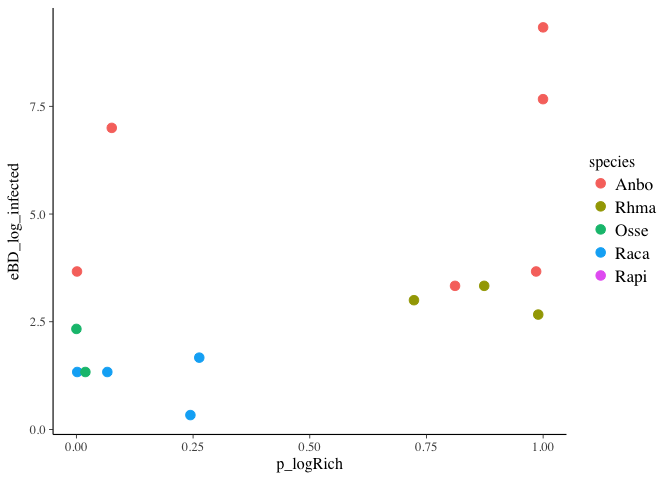
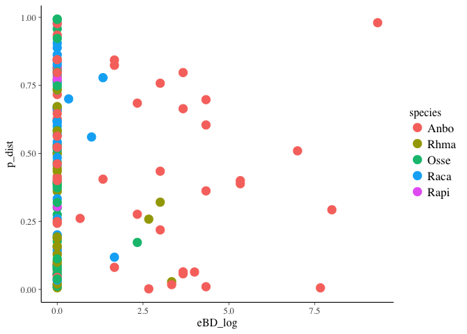
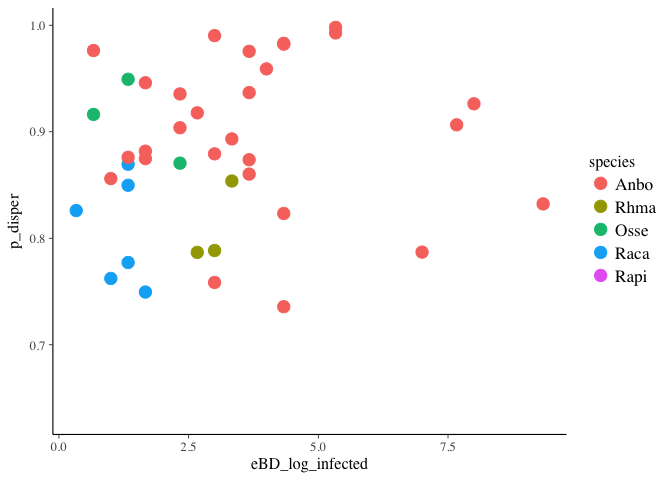
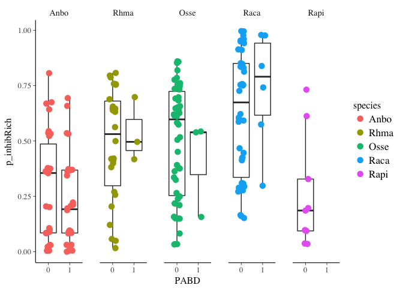
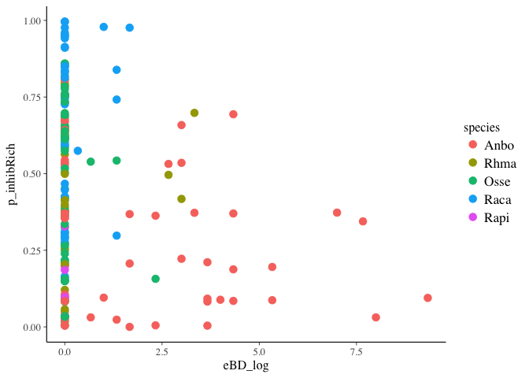
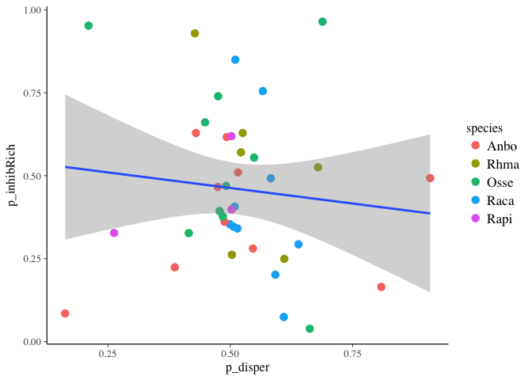
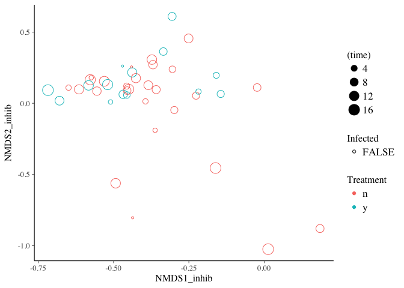

Statistical Analysis for 5Sp Dataset
================
Melissa Chen
Wed Jul 31 09:50:26 2019

``` r
# Load packages
library(tidyverse)
```

    ## ── Attaching packages ────────────────────────────────── tidyverse 1.2.1 ──

    ## ✔ ggplot2 2.2.1     ✔ purrr   0.2.4
    ## ✔ tibble  1.4.2     ✔ dplyr   0.7.5
    ## ✔ tidyr   0.8.1     ✔ stringr 1.3.1
    ## ✔ readr   1.1.1     ✔ forcats 0.3.0

    ## ── Conflicts ───────────────────────────────────── tidyverse_conflicts() ──
    ## ✖ dplyr::filter() masks stats::filter()
    ## ✖ dplyr::lag()    masks stats::lag()

``` r
library(rstanarm)
```

    ## Loading required package: Rcpp

    ## rstanarm (Version 2.17.4, packaged: 2018-04-13 01:51:52 UTC)

    ## - Do not expect the default priors to remain the same in future rstanarm versions.

    ## Thus, R scripts should specify priors explicitly, even if they are just the defaults.

    ## - For execution on a local, multicore CPU with excess RAM we recommend calling

    ## options(mc.cores = parallel::detectCores())

    ## - Plotting theme set to bayesplot::theme_default().

``` r
library(car) #Anova
```

    ## Loading required package: carData

    ## 
    ## Attaching package: 'car'

    ## The following object is masked from 'package:dplyr':
    ## 
    ##     recode

    ## The following object is masked from 'package:purrr':
    ## 
    ##     some

``` r
library(vegan) # for permanova and bray curtis
```

    ## Loading required package: permute

    ## Loading required package: lattice

    ## This is vegan 2.4-5

``` r
library(gridExtra)
```

    ## 
    ## Attaching package: 'gridExtra'

    ## The following object is masked from 'package:dplyr':
    ## 
    ##     combine

``` r
library(betareg) # for beta distr
library(lmtest) # for beta analysis
```

    ## Loading required package: zoo

    ## 
    ## Attaching package: 'zoo'

    ## The following objects are masked from 'package:base':
    ## 
    ##     as.Date, as.Date.numeric

``` r
library(MASS) # for isMDS
```

    ## 
    ## Attaching package: 'MASS'

    ## The following object is masked from 'package:dplyr':
    ## 
    ##     select

``` r
# Mapping files
load("mf_con_without_init_infect.RData")
load("mf_treat_without_init_infect.RData")
load("mf.rare.RData")
# OTU table of inhibitory bacteria
load("otu.inhibOnly.treat.RData")
load("otu.inhibOnly.con.RData")
# Distance matrices
load("dm.filt.con.RData")
load("dm.filt.treat.RData")

# Previous analyses summaries
load("all_p.RData")
load("all_p_infected.RData")
load("all_p_withcon.RData")

# Inhibitory OTUs
load("mf_con_with_inhibOTUs.RData")
load("mf_treat_with_inhibOTUs.RData")

# OTU table for inhibitory OTUs
load("otu.inhibOnly.treat.RData")
load("otu.inhibOnly.con.RData")

# add a species column and PABD column
all_p <- all_p %>%
    mutate(PABD=ifelse(infect>0,1,0), infect = log(infect+1)) %>%
    rename(eBD_log=infect) %>%
    separate(toadID, into=c("species","indiv"), remove=FALSE) %>%
    mutate(species=factor(species, levels=c("Anbo","Rhma","Osse","Raca","Rapi"))) %>%
    mutate(p_dist =ifelse(is.na(exp_dist),NA,p_dist))
all_p_infected <- all_p_infected %>%
    mutate(PABD=ifelse(eBD_log>0,1,0)) %>%
    separate(toadID, into=c("species","indiv"), remove=FALSE) %>%
    mutate(species=factor(species, levels=c("Anbo","Rhma","Osse","Raca","Rapi")))

### TESTING: Remove 0 values to test intensity
all_p <- all_p %>%
    mutate(eBD_log_infected = ifelse(eBD_log>0,eBD_log,NA))
all_p_infected <- all_p_infected %>%
    mutate(eBD_log_infected = ifelse(eBD_log>0,eBD_log,NA))

#### CURSORY GLANCE AT DATA ####
gg_NMDS <- mf_con_without_init_infect %>%
    ggplot(aes(x=NMDS1, y=NMDS2)) +
    geom_point(aes(col=species), cex=3, show.legend = FALSE)
gg_infect <- mf_treat_without_init_infect  %>%
    ggplot(aes(x=species, y=eBD_log)) +
    geom_point(aes(col=species), cex=3, position = position_jitter(width=0.1, height=0.05), show.legend = FALSE)

temp1 <- mf_con_without_init_infect %>%
    dplyr::select(species, logRich) %>%
    mutate(metric="log_OTU_Richness") %>%
    rename(value=logRich)
temp2 <- mf_con_without_init_infect %>%
    dplyr::select(species, inhibRich) %>%
    mutate(metric="Inhibitory_OTU_Richness")%>%
    rename(value=inhibRich)
temp3 <- mf_con_without_init_infect %>%
    dplyr::select(species, percInhib) %>%
    mutate(metric="Percent_Inhibitory")%>%
    rename(value=percInhib)
temp4 <- mf_con_without_init_infect %>%
    dplyr::select(species, disper_bray_curtis) %>%
    mutate(metric="Dispersion_from_centroid")%>%
    rename(value=disper_bray_curtis)
temp5 <- mf_con_without_init_infect %>%
    dplyr::select(species, distance_bray_curtis) %>%
    mutate(metric="Distance_from_previous_timepoint")%>%
    rename(value=distance_bray_curtis)


gg_all <- rbind(temp1,temp2,temp3,temp4, temp5) %>%
    rename(Species=species) %>%
    mutate(Metric = gsub("_"," ",metric, fixed=TRUE)) %>%
    mutate(Metric = factor(Metric, levels=c("log OTU Richness","Dispersion from centroid", "Distance from previous timepoint","Inhibitory OTU Richness","Percent Inhibitory"))) %>%
    ggplot(aes(x=Species, y=value)) +
    geom_boxplot() +
    geom_point(aes(col=Species), position = position_jitter(width=0.1, height=0), alpha=1/3)+
    facet_grid(Metric~., scales = "free", switch="y") +
    ylab("")+
    xlab("Species") 
lay <- rbind(c(1,2),
             c(3,2))
```

``` r
grid.arrange(gg_NMDS, gg_all, gg_infect, layout_matrix = lay)
```

    ## Warning: Removed 38 rows containing non-finite values (stat_boxplot).

    ## Warning: Removed 38 rows containing missing values (geom_point).


``` r
#### Stats ####
does_comp_differ_btwn_sp_and_across_time_con <- adonis2(dist(dm.filt.con) ~ species*time, data=mf_con_without_init_infect)
does_comp_differ_btwn_sp_and_across_time_con
```

    ## Permutation test for adonis under reduced model
    ## Terms added sequentially (first to last)
    ## Permutation: free
    ## Number of permutations: 999
    ## 
    ## adonis2(formula = dist(dm.filt.con) ~ species * time, data = mf_con_without_init_infect)
    ##               Df SumOfSqs      F Pr(>F)    
    ## species        4   424.12 78.785  0.001 ***
    ## time           1    39.03 29.000  0.001 ***
    ## species:time   4    41.22  7.657  0.001 ***
    ## Residual     197   265.12                  
    ## ---
    ## Signif. codes:  0 '***' 0.001 '**' 0.01 '*' 0.05 '.' 0.1 ' ' 1

``` r
beta_con_main_p <- does_comp_differ_btwn_sp_and_across_time_con$`Pr(>F)`[1:2]
beta_con_main_df1 <- does_comp_differ_btwn_sp_and_across_time_con$Df[1:2]
beta_con_main_df2 <- does_comp_differ_btwn_sp_and_across_time_con$Df[4]

beta_con_interaction_p <- does_comp_differ_btwn_sp_and_across_time_con$`Pr(>F)`[3]
beta_con_interaction_df1 <- does_comp_differ_btwn_sp_and_across_time_con$Df[3]
beta_con_interaction_df2 <- does_comp_differ_btwn_sp_and_across_time_con$Df[4]

beta_con_main_f <- does_comp_differ_btwn_sp_and_across_time_con$`F`[1:2]
beta_con_interaction_f <- does_comp_differ_btwn_sp_and_across_time_con$`F`[3]


mf_treat_without_init_infect_post <- mf_treat_without_init_infect %>%
    filter(prepost == "Pos")
does_comp_differ_btwn_sp_and_across_time_and_infect_treat <- adonis2(dist(dm.filt.treat) ~ species*time*PABD, data=mf_treat_without_init_infect_post)
does_comp_differ_btwn_sp_and_across_time_and_infect_treat
```

    ## Permutation test for adonis under reduced model
    ## Terms added sequentially (first to last)
    ## Permutation: free
    ## Number of permutations: 999
    ## 
    ## adonis2(formula = dist(dm.filt.treat) ~ species * time * PABD, data = mf_treat_without_init_infect_post)
    ##                    Df SumOfSqs       F Pr(>F)    
    ## species             4   344.67 43.6313  0.001 ***
    ## time                1    24.55 12.4311  0.001 ***
    ## PABD                1     5.91  2.9942  0.016 *  
    ## species:time        4    28.21  3.5707  0.001 ***
    ## species:PABD        3     6.42  1.0835  0.338    
    ## time:PABD           1     9.80  4.9597  0.001 ***
    ## species:time:PABD   2     5.67  1.4353  0.125    
    ## Residual          180   355.48                   
    ## ---
    ## Signif. codes:  0 '***' 0.001 '**' 0.01 '*' 0.05 '.' 0.1 ' ' 1

``` r
beta_treat_main_p <- does_comp_differ_btwn_sp_and_across_time_and_infect_treat$`Pr(>F)`[1:2]
beta_treat_main_df1 <- does_comp_differ_btwn_sp_and_across_time_and_infect_treat$Df[1:2]
beta_treat_main_df2 <- does_comp_differ_btwn_sp_and_across_time_and_infect_treat$Df[8]

beta_treat_interaction_p <- does_comp_differ_btwn_sp_and_across_time_and_infect_treat$`Pr(>F)`[4]
beta_treat_interaction_df1 <- does_comp_differ_btwn_sp_and_across_time_and_infect_treat$Df[4]
beta_treat_interaction_df2 <- does_comp_differ_btwn_sp_and_across_time_and_infect_treat$Df[8]

beta_treat_main_f <- does_comp_differ_btwn_sp_and_across_time_and_infect_treat$`F`[1:2]
beta_treat_interaction_f <- does_comp_differ_btwn_sp_and_across_time_and_infect_treat$`F`[4]

beta_con_time_eff <- ""
beta_treat_time_eff <- ""
```

There is a significant effect of species, time, and PABD; all of these things also significantly interact EXCEPT species and PABD and all 3 together, which suggests species microbiomes change in the "same way" when infected

``` r
#### Preliminary stats on broad patterns ####

### RICHNESS AND TIME ###
```

Does richness change over time in control individuals?

``` r
# Type I ANOVA to test for interaction-- (AB | A, B)
rich_con_interaction_lm <- lm(logRich ~ species*time, data=mf_con_without_init_infect)
rich_con_interaction <- anova(rich_con_interaction_lm)
rich_con_interaction
```

    ## Analysis of Variance Table
    ## 
    ## Response: logRich
    ##               Df  Sum Sq Mean Sq F value    Pr(>F)    
    ## species        4  9.8448 2.46120 17.3532 3.263e-12 ***
    ## time           1  0.1974 0.19738  1.3916    0.2396    
    ## species:time   4  0.8054 0.20135  1.4197    0.2288    
    ## Residuals    197 27.9404 0.14183                      
    ## ---
    ## Signif. codes:  0 '***' 0.001 '**' 0.01 '*' 0.05 '.' 0.1 ' ' 1

``` r
# Use Type II ANOVA (no interaction present)
rich_con_main_lm <- lm(logRich ~ species + time, data=mf_con_without_init_infect)
rich_con_main <- Anova(rich_con_main_lm, type = 2)
rich_con_main
```

    ## Anova Table (Type II tests)
    ## 
    ## Response: logRich
    ##            Sum Sq  Df F value    Pr(>F)    
    ## species    9.9684   4 17.4255 2.724e-12 ***
    ## time       0.1974   1  1.3801    0.2415    
    ## Residuals 28.7458 201                      
    ## ---
    ## Signif. codes:  0 '***' 0.001 '**' 0.01 '*' 0.05 '.' 0.1 ' ' 1

``` r
# There is a significant effect of species but not time or interaction
```

Does richness change over time in treatment individuals?

``` r
# Type I ANOVA to test for interaction (AB | A,B)
rich_treat_interaction_lm <- lm(logRich ~ species*time, data=mf_treat_without_init_infect)
rich_treat_interaction <- anova(rich_treat_interaction_lm)
rich_treat_interaction
```

    ## Analysis of Variance Table
    ## 
    ## Response: logRich
    ##               Df Sum Sq Mean Sq F value    Pr(>F)    
    ## species        4 11.768 2.94196 18.1367  3.14e-13 ***
    ## time           1  0.000 0.00048  0.0029 0.9567623    
    ## species:time   4  3.364 0.84109  5.1852 0.0004847 ***
    ## Residuals    274 44.446 0.16221                      
    ## ---
    ## Signif. codes:  0 '***' 0.001 '**' 0.01 '*' 0.05 '.' 0.1 ' ' 1

``` r
# Type III ANOVA (valid in presence of interaction)
rich_treat_main_lm <- lm(logRich ~ species * time, data=mf_treat_without_init_infect, contrasts=list(species=contr.sum))
rich_treat_main <- Anova(rich_treat_main_lm, type=3)
rich_treat_main
```

    ## Anova Table (Type III tests)
    ## 
    ## Response: logRich
    ##              Sum Sq  Df   F value    Pr(>F)    
    ## (Intercept)  916.28   1 5648.7368 < 2.2e-16 ***
    ## species        2.44   4    3.7548 0.0054249 ** 
    ## time           0.02   1    0.1238 0.7252123    
    ## species:time   3.36   4    5.1852 0.0004847 ***
    ## Residuals     44.45 274                        
    ## ---
    ## Signif. codes:  0 '***' 0.001 '**' 0.01 '*' 0.05 '.' 0.1 ' ' 1

``` r
### DISTANCE TO CENTROID AND TIME ####
```

Is there an effect of species and time on controls?

``` r
# Type I ANOVA (to check for interaction) (AB | A,B)
centroid_con_interaction_lm <- lm(log(disper_bray_curtis) ~ species*time, data=mf_con_without_init_infect)
centroid_con_interaction <- anova(centroid_con_interaction_lm)
centroid_con_interaction
```

    ## Analysis of Variance Table
    ## 
    ## Response: log(disper_bray_curtis)
    ##               Df  Sum Sq Mean Sq F value    Pr(>F)    
    ## species        4  2.1129 0.52822  9.6625 3.724e-07 ***
    ## time           1  1.8197 1.81969 33.2866 3.045e-08 ***
    ## species:time   4  0.4254 0.10635  1.9455    0.1044    
    ## Residuals    197 10.7695 0.05467                      
    ## ---
    ## Signif. codes:  0 '***' 0.001 '**' 0.01 '*' 0.05 '.' 0.1 ' ' 1

``` r
# Type II ANOVA with no interaction
centroid_con_main_lm <- lm(log(disper_bray_curtis) ~ species + time, data=mf_con_without_init_infect)
centroid_con_main <- Anova(centroid_con_main_lm, type = 2)
centroid_con_main
```

    ## Anova Table (Type II tests)
    ## 
    ## Response: log(disper_bray_curtis)
    ##            Sum Sq  Df F value    Pr(>F)    
    ## species    1.8582   4  8.3407 3.036e-06 ***
    ## time       1.8197   1 32.6719 3.899e-08 ***
    ## Residuals 11.1949 201                      
    ## ---
    ## Signif. codes:  0 '***' 0.001 '**' 0.01 '*' 0.05 '.' 0.1 ' ' 1

Is there an effect of species and time on treatment??

``` r
# Type I ANOVA (to check for interaction) (AB | A,B)
centroid_treat_interaction_lm <- lm(log(disper_bray_curtis) ~ species*time, data=mf_treat_without_init_infect)
centroid_treat_interaction <- anova(centroid_treat_interaction_lm)
centroid_treat_interaction
```

    ## Analysis of Variance Table
    ## 
    ## Response: log(disper_bray_curtis)
    ##               Df  Sum Sq Mean Sq F value    Pr(>F)    
    ## species        4  3.0350 0.75876  9.5458 3.070e-07 ***
    ## time           1  1.9747 1.97470 24.8432 1.104e-06 ***
    ## species:time   4  1.1038 0.27595  3.4716  0.008706 ** 
    ## Residuals    274 21.7794 0.07949                      
    ## ---
    ## Signif. codes:  0 '***' 0.001 '**' 0.01 '*' 0.05 '.' 0.1 ' ' 1

``` r
# Type II ANOVA with no interaction
centroid_treat_main_lm <- lm(log(disper_bray_curtis) ~ species + time, data=mf_treat_without_init_infect)
centroid_treat_main <- Anova(centroid_treat_main_lm, type = 2)
centroid_treat_main
```

    ## Anova Table (Type II tests)
    ## 
    ## Response: log(disper_bray_curtis)
    ##            Sum Sq  Df F value    Pr(>F)    
    ## species    3.0312   4  9.2062 5.342e-07 ***
    ## time       1.9747   1 23.9900 1.646e-06 ***
    ## Residuals 22.8831 278                      
    ## ---
    ## Signif. codes:  0 '***' 0.001 '**' 0.01 '*' 0.05 '.' 0.1 ' ' 1

``` r
### DISPERSAL AND TIME ###
```

Is there an effect of species and time on controls?

``` r
# Type I ANOVA (to check for interaction) (AB | A,B)
# disp_con_interaction_glm <- betareg(distance_bray_curtis ~ species*time, data=mf_con_without_init_infect)
# disp_con_interaction_lm <- lm(distance_bray_curtis ~ species*time, data=mf_con_without_init_infect)

disp_con_interaction_glmmain <- betareg(distance_bray_curtis ~ species + time, data=mf_con_without_init_infect)
disp_con_interaction_glminter <- betareg(distance_bray_curtis ~ species*time, data=mf_con_without_init_infect)
disp_con_interaction <- lrtest(disp_con_interaction_glmmain,disp_con_interaction_glminter) # plus species

# Type II ANOVA with no interaction

disp_con_main_glmtonly <- betareg(distance_bray_curtis ~ time, data=mf_con_without_init_infect)
disp_con_main_glmsponly <- betareg(distance_bray_curtis ~ species, data=mf_con_without_init_infect)

disp_con_main_sp <- lrtest(disp_con_main_glmtonly,disp_con_interaction_glmmain) # plus species
disp_con_main_time <- lrtest(disp_con_main_glmsponly,disp_con_interaction_glmmain) # plus time
```

Is there an effect of species and time on treatment??

``` r
# Type I ANOVA (to check for interaction) (AB | A,B)
# disp_treat_interaction_lm <- lm(distance_bray_curtis ~ species*time, data=mf_treat_without_init_infect)
# disp_treat_interaction <- anova(disp_treat_interaction_lm)
# disp_treat_interaction
disp_treat_interaction_glmmain <- betareg(distance_bray_curtis ~ species + time, data=mf_treat_without_init_infect)
disp_treat_interaction_glminter <- betareg(distance_bray_curtis ~ species*time, data=mf_treat_without_init_infect)
disp_treat_interaction <- lrtest(disp_treat_interaction_glmmain,disp_treat_interaction_glminter) # plus species
disp_treat_interaction
```

    ## Likelihood ratio test
    ## 
    ## Model 1: distance_bray_curtis ~ species + time
    ## Model 2: distance_bray_curtis ~ species * time
    ##   #Df LogLik Df  Chisq Pr(>Chisq)
    ## 1   7 108.33                     
    ## 2  11 109.19  4 1.7143     0.7881

``` r
# Type II ANOVA with no interaction

disp_treat_main_glmtonly <- betareg(distance_bray_curtis ~ time, data=mf_treat_without_init_infect)
disp_treat_main_glmsponly <- betareg(distance_bray_curtis ~ species, data=mf_treat_without_init_infect)

disp_treat_main_sp <- lrtest(disp_treat_main_glmtonly,disp_treat_interaction_glmmain) # plus species
disp_treat_main_time <- lrtest(disp_treat_main_glmsponly,disp_treat_interaction_glmmain) # plus time
disp_treat_main_sp
```

    ## Likelihood ratio test
    ## 
    ## Model 1: distance_bray_curtis ~ time
    ## Model 2: distance_bray_curtis ~ species + time
    ##   #Df  LogLik Df  Chisq Pr(>Chisq)    
    ## 1   3  96.148                         
    ## 2   7 108.327  4 24.359  6.768e-05 ***
    ## ---
    ## Signif. codes:  0 '***' 0.001 '**' 0.01 '*' 0.05 '.' 0.1 ' ' 1

``` r
disp_treat_main_time
```

    ## Likelihood ratio test
    ## 
    ## Model 1: distance_bray_curtis ~ species
    ## Model 2: distance_bray_curtis ~ species + time
    ##   #Df LogLik Df  Chisq Pr(>Chisq)  
    ## 1   6 106.69                       
    ## 2   7 108.33  1 3.2762    0.07029 .
    ## ---
    ## Signif. codes:  0 '***' 0.001 '**' 0.01 '*' 0.05 '.' 0.1 ' ' 1

``` r
### PERCENT INHIB ###
```

Does percent inhibitory change with species or time?

``` r
# # Type I ANOVA (to test for interaction) in control group?
# pinhib_con_interaction_glm <- glm(percInhib ~ species*time, family = binomial(), data=mf_con_without_init_infect, weights=mf_con_without_init_infect$n)
# pinhib_con_interaction <- anova(pinhib_con_interaction_glm, test = "Chisq")
# pinhib_con_interaction
# # Type III ANOVA (to test for main effects, given interaction) in control group?
# pinhib_con_main_glm <- glm(percInhib ~ species*time, family = binomial(), data=mf_con_without_init_infect, weights=mf_con_without_init_infect$n, contrasts=list(species=contr.sum))
# pinhib_con_main <- Anova(pinhib_con_main_glm, type=3)
# pinhib_con_main
# 
# # Does percent inhibitory change with species or time in treatment group?
# # Type I ANOVA (to test for interaction) in control group?
# pinhib_treat_interaction_glm <- glm(percInhib ~ species*time, family = binomial(), data=mf_treat_without_init_infect, weights=mf_treat_without_init_infect$n)
# pinhib_treat_interaction <- anova(pinhib_treat_interaction_glm, test = "Chisq")
# pinhib_treat_interaction
# # Type III ANOVA (to test for main effects, given interaction) in control group?
# pinhib_treat_main_glm <- glm(percInhib ~ species*time, family = binomial(), data=mf_treat_without_init_infect, weights=mf_treat_without_init_infect$n, contrasts = list(species=contr.sum))
# pinhib_treat_main <- Anova(pinhib_treat_main_glm, type=3)
# pinhib_treat_main

# There is ONE zero... so need to transform data to be between 0 and 1. Super annoying. 
y.transf.betareg <- function(y){
    n.obs <- sum(!is.na(y))
    (y * (n.obs - 1) + 0.5) / n.obs
}

# Type I ANOVA (to check for interaction) (AB | A,B)
pinhib_con_interaction_glmmain <- betareg(y.transf.betareg(percInhib) ~ species + time, data=mf_con_without_init_infect)
pinhib_con_interaction_glminter <- betareg(y.transf.betareg(percInhib) ~ species*time, data=mf_con_without_init_infect)
pinhib_con_interaction <- lrtest(pinhib_con_interaction_glmmain,pinhib_con_interaction_glminter) # plus species
pinhib_con_interaction
```

    ## Likelihood ratio test
    ## 
    ## Model 1: y.transf.betareg(percInhib) ~ species + time
    ## Model 2: y.transf.betareg(percInhib) ~ species * time
    ##   #Df LogLik Df  Chisq Pr(>Chisq)    
    ## 1   7 201.98                         
    ## 2  11 221.63  4 39.301  6.037e-08 ***
    ## ---
    ## Signif. codes:  0 '***' 0.001 '**' 0.01 '*' 0.05 '.' 0.1 ' ' 1

``` r
# Type III ANOVA to test for main effects

pinhib_con_main_glmtonly <- betareg(y.transf.betareg(percInhib) ~ time , data=mf_con_without_init_infect)
pinhib_con_main_glmsponly <- betareg(y.transf.betareg(percInhib) ~ species , data=mf_con_without_init_infect)

pinhib_con_main_sp <- lrtest(pinhib_con_main_glmtonly,pinhib_con_interaction_glmmain) # plus species
pinhib_con_main_time <- lrtest(pinhib_con_main_glmsponly,pinhib_con_interaction_glmmain) # plus time
pinhib_con_main_sp
```

    ## Likelihood ratio test
    ## 
    ## Model 1: y.transf.betareg(percInhib) ~ time
    ## Model 2: y.transf.betareg(percInhib) ~ species + time
    ##   #Df LogLik Df  Chisq Pr(>Chisq)    
    ## 1   3 186.97                         
    ## 2   7 201.98  4 30.032  4.822e-06 ***
    ## ---
    ## Signif. codes:  0 '***' 0.001 '**' 0.01 '*' 0.05 '.' 0.1 ' ' 1

``` r
pinhib_con_main_time
```

    ## Likelihood ratio test
    ## 
    ## Model 1: y.transf.betareg(percInhib) ~ species
    ## Model 2: y.transf.betareg(percInhib) ~ species + time
    ##   #Df LogLik Df  Chisq Pr(>Chisq)
    ## 1   6 201.78                     
    ## 2   7 201.98  1 0.4047     0.5247

Is there an effect of species and time on treatment??

``` r
# Type I ANOVA (to check for interaction) (AB | A,B)
# pinhib_treat_interaction_lm <- lm(percInhib ~ species*time, data=mf_treat_without_init_infect)
# pinhib_treat_interaction <- anova(pinhib_treat_interaction_lm)
# pinhib_treat_interaction
#

pinhib_treat_interaction_glmmain <- betareg(y.transf.betareg(percInhib) ~ species + time, data=mf_treat_without_init_infect)
pinhib_treat_interaction_glminter <- betareg(y.transf.betareg(percInhib) ~ species*time, data=mf_treat_without_init_infect)
pinhib_treat_interaction <- lrtest(pinhib_treat_interaction_glmmain,pinhib_treat_interaction_glminter) # plus species
pinhib_treat_interaction
```

    ## Likelihood ratio test
    ## 
    ## Model 1: y.transf.betareg(percInhib) ~ species + time
    ## Model 2: y.transf.betareg(percInhib) ~ species * time
    ##   #Df LogLik Df  Chisq Pr(>Chisq)  
    ## 1   7 169.63                       
    ## 2  11 175.54  4 11.829    0.01867 *
    ## ---
    ## Signif. codes:  0 '***' 0.001 '**' 0.01 '*' 0.05 '.' 0.1 ' ' 1

``` r
# Type II ANOVA with no interaction

pinhib_treat_main_glmtonly <- betareg(y.transf.betareg(percInhib) ~ time, data=mf_treat_without_init_infect)
pinhib_treat_main_glmsponly <- betareg(y.transf.betareg(percInhib) ~ species, data=mf_treat_without_init_infect)

pinhib_treat_main_sp <- lrtest(pinhib_treat_main_glmtonly,pinhib_treat_interaction_glmmain) # plus species
pinhib_treat_main_time <- lrtest(pinhib_treat_main_glmsponly,pinhib_treat_interaction_glmmain) # plus time
pinhib_treat_main_sp
```

    ## Likelihood ratio test
    ## 
    ## Model 1: y.transf.betareg(percInhib) ~ time
    ## Model 2: y.transf.betareg(percInhib) ~ species + time
    ##   #Df LogLik Df  Chisq Pr(>Chisq)    
    ## 1   3 141.47                         
    ## 2   7 169.63  4 56.309  1.727e-11 ***
    ## ---
    ## Signif. codes:  0 '***' 0.001 '**' 0.01 '*' 0.05 '.' 0.1 ' ' 1

``` r
pinhib_treat_main_time
```

    ## Likelihood ratio test
    ## 
    ## Model 1: y.transf.betareg(percInhib) ~ species
    ## Model 2: y.transf.betareg(percInhib) ~ species + time
    ##   #Df LogLik Df  Chisq Pr(>Chisq)    
    ## 1   6 161.89                         
    ## 2   7 169.63  1 15.474  8.366e-05 ***
    ## ---
    ## Signif. codes:  0 '***' 0.001 '**' 0.01 '*' 0.05 '.' 0.1 ' ' 1

``` r
### INHIB RICH ###
# Does richness of inhibitory bacteria differ betwen species and time points?
# Type I ANOVA to test for interactions in control
inhibRich_con_interaction_glm <- glm(inhibRich ~ species*time, data=mf_con_without_init_infect, family=poisson())
inhibRich_con_interaction <- anova(inhibRich_con_interaction_glm, test="Chisq")
inhibRich_con_interaction
```

    ## Analysis of Deviance Table
    ## 
    ## Model: poisson, link: log
    ## 
    ## Response: inhibRich
    ## 
    ## Terms added sequentially (first to last)
    ## 
    ## 
    ##              Df Deviance Resid. Df Resid. Dev  Pr(>Chi)    
    ## NULL                           206     232.35              
    ## species       4  29.2924       202     203.06 6.818e-06 ***
    ## time          1   0.6686       201     202.39    0.4135    
    ## species:time  4  31.3583       197     171.03 2.587e-06 ***
    ## ---
    ## Signif. codes:  0 '***' 0.001 '**' 0.01 '*' 0.05 '.' 0.1 ' ' 1

``` r
# TYpe III ANOVA to test for main effects with interactions in control
inhibRich_con_main_glm <- glm(inhibRich ~ species*time, data=mf_con_without_init_infect, family=poisson(), contrasts=list(species=contr.sum))
inhibRich_con_main <- Anova(inhibRich_con_main_glm,type=3)
inhibRich_con_main
```

    ## Analysis of Deviance Table (Type III tests)
    ## 
    ## Response: inhibRich
    ##              LR Chisq Df Pr(>Chisq)    
    ## species        42.494  4  1.318e-08 ***
    ## time            0.726  1     0.3942    
    ## species:time   31.358  4  2.587e-06 ***
    ## ---
    ## Signif. codes:  0 '***' 0.001 '**' 0.01 '*' 0.05 '.' 0.1 ' ' 1

``` r
# Type I ANOVA to test for interactions
inhibRich_treat_interaction_glm <- glm(inhibRich ~ species*time, data=mf_treat_without_init_infect, family=poisson())
inhibRich_treat_interaction <- anova(inhibRich_treat_interaction_glm, test="Chisq")
inhibRich_treat_interaction
```

    ## Analysis of Deviance Table
    ## 
    ## Model: poisson, link: log
    ## 
    ## Response: inhibRich
    ## 
    ## Terms added sequentially (first to last)
    ## 
    ## 
    ##              Df Deviance Resid. Df Resid. Dev  Pr(>Chi)    
    ## NULL                           283     361.86              
    ## species       4  130.642       279     231.22 < 2.2e-16 ***
    ## time          1    0.033       278     231.19  0.856329    
    ## species:time  4   18.271       274     212.92  0.001092 ** 
    ## ---
    ## Signif. codes:  0 '***' 0.001 '**' 0.01 '*' 0.05 '.' 0.1 ' ' 1

``` r
# TYpe III ANOVA to test for main effects with interactions
inhibRich_treat_main_glm <- glm(inhibRich ~ species*time, data=mf_treat_without_init_infect, family=poisson(), contrasts = list(species=contr.sum))
inhibRich_treat_main <- Anova(inhibRich_treat_main_glm,type=3)
inhibRich_treat_main
```

    ## Analysis of Deviance Table (Type III tests)
    ## 
    ## Response: inhibRich
    ##              LR Chisq Df Pr(>Chisq)    
    ## species       23.8941  4  8.387e-05 ***
    ## time           0.7994  1   0.371281    
    ## species:time  18.2715  4   0.001092 ** 
    ## ---
    ## Signif. codes:  0 '***' 0.001 '**' 0.01 '*' 0.05 '.' 0.1 ' ' 1

``` r
#### Summarize overall trends into table ####

# RICHNESS
rich_con_main_p <- rich_con_main$`Pr(>F)`[1:2]
rich_con_main_df1 <- rich_con_main$Df[1:2]
rich_con_main_df2 <- rich_con_main$Df[3]

rich_con_interaction_p <- rich_con_interaction$`Pr(>F)`[3]
rich_con_interaction_df1 <- rich_con_interaction$Df[3]
rich_con_interaction_df2 <- rich_con_interaction$Df[4]

rich_treat_main_p <- rich_treat_main$`Pr(>F)`[2:3]
rich_treat_main_df1 <- rich_treat_main$Df[2:3]
rich_treat_main_df2 <- rich_treat_main$Df[5]

rich_treat_interaction_p <- rich_treat_interaction$`Pr(>F)`[3]
rich_treat_interaction_df1 <- rich_treat_interaction$Df[3]
rich_treat_interaction_df2 <- rich_treat_interaction$Df[4]

rich_con_main_f <- rich_con_main$`F value`[1:2]
rich_con_interaction_f <- rich_con_interaction$`F value`[3]

rich_treat_main_f <- rich_treat_main$`F value`[2:3]
rich_treat_interaction_f <- rich_treat_interaction$`F value`[3]

rich_con_time_eff <- ifelse(rich_con_main_lm$coefficients["time"]>0,"(+)","(-)")
rich_treat_time_eff <- ifelse(rich_treat_main_lm$coefficients["time"]>0,"(+)","(-)")

# CENTROID
centroid_con_main_p <- centroid_con_main$`Pr(>F)`[1:2]
centroid_con_main_df1 <- centroid_con_main$Df[1:2]
centroid_con_main_df2 <- centroid_con_main$Df[3]

centroid_con_interaction_p <- centroid_con_interaction$`Pr(>F)`[3]
centroid_con_interaction_df1 <- centroid_con_interaction$Df[3]
centroid_con_interaction_df2 <- centroid_con_interaction$Df[4]

centroid_treat_main_p <- centroid_treat_main$`Pr(>F)`[1:2]
centroid_treat_main_df1 <- centroid_treat_main$Df[1:2]
centroid_treat_main_df2 <- centroid_treat_main$Df[3]

centroid_treat_interaction_p <- centroid_treat_interaction$`Pr(>F)`[3]
centroid_treat_interaction_df1 <- centroid_treat_interaction$Df[3]
centroid_treat_interaction_df2 <- centroid_treat_interaction$Df[4]

centroid_con_main_f <- centroid_con_main$`F value`[1:2]
centroid_con_interaction_f <- centroid_con_interaction$`F value`[3]

centroid_treat_main_f <- centroid_treat_main$`F value`[1:2]
centroid_treat_interaction_f <- centroid_treat_interaction$`F value`[3]

centroid_con_time_eff <- ifelse(centroid_con_main_lm$coefficients["time"]>0,"(+)","(-)")
centroid_treat_time_eff <- ifelse(centroid_treat_main_lm$coefficients["time"]>0,"(+)","(-)")


# DISPERSION
disp_con_main_p <- c(disp_con_main_sp$`Pr(>Chisq)`[2], disp_con_main_time$`Pr(>Chisq)`[2])
# disp_con_main_p <- disp_con_main$`Pr(>F)`[1:2]
disp_con_main_df1 <- c(disp_con_main_sp$Df[2], disp_con_main_time$Df[2])
disp_con_main_n <- sum(!is.na(mf_con_without_init_infect$distance_bray_curtis))-1-7

disp_con_interaction_p <- disp_con_interaction$`Pr(>Chisq)`[2]
disp_con_interaction_df1 <- disp_con_interaction$Df[2]
disp_con_interaction_n <- sum(!is.na(mf_con_without_init_infect$distance_bray_curtis))-1-11

disp_treat_main_p <- c(disp_treat_main_sp$`Pr(>Chisq)`[2], disp_treat_main_time$`Pr(>Chisq)`[2])
# disp_treat_main_p <- disp_treat_main$`Pr(>F)`[1:2]
disp_treat_main_df1 <- c(disp_treat_main_sp$Df[2], disp_treat_main_time$Df[2])
disp_treat_main_n <- sum(!is.na(mf_treat_without_init_infect$distance_bray_curtis))-1-7

disp_treat_interaction_p <- disp_treat_interaction$`Pr(>Chisq)`[2]
disp_treat_interaction_df1 <- disp_treat_interaction$Df[2]
disp_treat_interaction_n <- sum(!is.na(mf_treat_without_init_infect$distance_bray_curtis))-1-11

disp_con_main_f <- c(disp_con_main_sp$Chisq[2], disp_con_main_time$Chisq[2])
disp_con_interaction_f <- disp_con_interaction$Chisq[2]

disp_treat_main_f <- c(disp_treat_main_sp$Chisq[2], disp_treat_main_time$Chisq[2])
disp_treat_interaction_f <- disp_treat_interaction$Chisq[2]

# disp_con_time_eff <- ifelse(disp_con_main_lm$coefficients["time"]>0,"(+)","(-)")
disp_con_time_eff <- ifelse(disp_con_main_glmtonly$coefficients$mean[2]>0,"(+)","(-)")
# disp_treat_time_eff <- ifelse(disp_treat_main_lm$coefficients["time"]>0,"(+)","(-)")
disp_treat_time_eff <- ifelse(disp_treat_main_glmtonly$coefficients$mean[2]>0,"(+)","(-)")


# INHIB RICH
inhibRich_con_main_p <- inhibRich_con_main$`Pr(>Chisq)`[1:2]
inhibRich_con_main_df1 <- inhibRich_con_main$Df[1:2]

inhibRich_con_interaction_p <- inhibRich_con_interaction$`Pr(>Chi)`[4]
inhibRich_con_interaction_df1 <- inhibRich_con_interaction$Df[4]
inhibRich_con_interaction_n <- inhibRich_con_interaction$`Resid. Df`[1]

inhibRich_treat_main_p <- inhibRich_treat_main$`Pr(>Chisq)`[1:2]
inhibRich_treat_main_df1 <- inhibRich_treat_main$Df[1:2]

inhibRich_treat_interaction_p <- inhibRich_treat_interaction$`Pr(>Chi)`[4]
inhibRich_treat_interaction_df1 <- inhibRich_treat_interaction$Df[4]
inhibRich_treat_interaction_n <- inhibRich_treat_interaction$`Resid. Df`[1]

inhibRich_con_main_f <- inhibRich_con_main$`LR Chisq`[1:2]
inhibRich_con_interaction_f <- inhibRich_con_interaction$Deviance[4]

inhibRich_treat_main_f <- inhibRich_treat_main$`LR Chisq`[1:2]
inhibRich_treat_interaction_f <- inhibRich_treat_interaction$Deviance[4]

inhibRich_con_time_eff <- ifelse(inhibRich_con_main_glm$coefficients["time"]>0,"(+)","(-)")
inhibRich_treat_time_eff <- ifelse(inhibRich_treat_main_glm$coefficients["time"]>0,"(+)","(-)")


# PERCENT
pinhib_con_main_p <- c(pinhib_con_main_sp$`Pr(>Chisq)`[2], pinhib_con_main_time$`Pr(>Chisq)`[2])
# pinhib_con_main_p <- pinhib_con_main$`Pr(>F)`[1:2]
pinhib_con_main_df1 <- c(pinhib_con_main_sp$Df[2], pinhib_con_main_time$Df[2])
pinhib_con_main_n <- sum(!is.na(mf_con_without_init_infect$distance_bray_curtis))-1-7

pinhib_con_interaction_p <- pinhib_con_interaction$`Pr(>Chisq)`[2]
pinhib_con_interaction_df1 <- pinhib_con_interaction$Df[2]
pinhib_con_interaction_n <- sum(!is.na(mf_con_without_init_infect$distance_bray_curtis))-1-11

pinhib_treat_main_p <- c(pinhib_treat_main_sp$`Pr(>Chisq)`[2], pinhib_treat_main_time$`Pr(>Chisq)`[2])
# pinhib_treat_main_p <- pinhib_treat_main$`Pr(>F)`[1:2]
pinhib_treat_main_df1 <- c(pinhib_treat_main_sp$Df[2], pinhib_treat_main_time$Df[2])
pinhib_treat_main_n <- sum(!is.na(mf_treat_without_init_infect$distance_bray_curtis))-1-7

pinhib_treat_interaction_p <- pinhib_treat_interaction$`Pr(>Chisq)`[2]
pinhib_treat_interaction_df1 <- pinhib_treat_interaction$Df[2]
pinhib_treat_interaction_n <- sum(!is.na(mf_treat_without_init_infect$distance_bray_curtis))-1-11

pinhib_con_main_f <- c(pinhib_con_main_sp$Chisq[2], pinhib_con_main_time$Chisq[2])
pinhib_con_interaction_f <- pinhib_con_interaction$Chisq[2]

pinhib_treat_main_f <- c(pinhib_treat_main_sp$Chisq[2], pinhib_treat_main_time$Chisq[2])
pinhib_treat_interaction_f <- pinhib_treat_interaction$Chisq[2]

# pinhib_con_time_eff <- ifelse(pinhib_con_main_lm$coefficients["time"]>0,"(+)","(-)")
pinhib_con_time_eff <- ifelse(pinhib_con_main_glmtonly$coefficients$mean[2]>0,"(+)","(-)")
# pinhib_treat_time_eff <- ifelse(pinhib_treat_main_lm$coefficients["time"]>0,"(+)","(-)")
pinhib_treat_time_eff <- ifelse(pinhib_treat_main_glmtonly$coefficients$mean[2]>0,"(+)","(-)")

stat_results <- as.data.frame(matrix(ncol=5, nrow=12, dimnames = list(NULL,c("Microbiome metric","Control or Treatment","Main effect: species","Main effect: time", "Interaction: species x time"))), check.names=FALSE)
stat_results$`Microbiome metric` <- c("Beta Diversity"
                                      , "Beta Diversity"
                                      , "OTU Richness"
                                      , "OTU RIchness"
                                      , "Distance to centroid"
                                      , "Distance to centroid"
                                      , "Stability (BC distance)"
                                      , "Stability (BC distance)"
                                      , "Percent Inhibitory"
                                      , "Percent Inhibitory"
                                      ,"Inhibitory Richness"
                                      ,"Inhibitory Richness"
                                      )
stat_results$`Control or Treatment` <- rep(c("Control","Treatment"), 6)
current_row <- 1

for ( test in c("beta","rich","centroid","disp","pinhib","inhibRich") ) {
    for ( ct in c("con","treat")) {
        if (test %in% c("beta","rich","centroid")) {
            df1_sp <- get(paste(test, ct, "main_df1", sep="_"))[1] # species
            df2_sp <- get(paste(test, ct, "main_df2", sep="_")) # species
            
            df1_t <- get(paste(test, ct, "main_df1", sep="_"))[2] # time
            df2_t <- get(paste(test, ct, "main_df2", sep="_")) # time
            
            df1_inter <- get(paste(test, ct, "interaction_df1", sep="_"))
            df2_inter <- get(paste(test, ct, "interaction_df2", sep="_"))
            
            stat_main_sp<- paste0(", F(",df1_sp,",",df2_sp,")=")
            stat_main_t<- paste0(", F(",df1_t,",",df2_t,")=")
            
            stat_interaction <- paste0(", F(",df1_inter,",",df2_inter,")=")
            
        } else if ( test %in% c("disp","pinhib")) {
            df1_sp <- get(paste(test, ct, "main_df1", sep="_"))[1] # species
            n_sp <- get(paste(test, ct, "main_n", sep="_")) # species
            
            df1_t <- get(paste(test, ct, "main_df1", sep="_"))[2] # time
            n_t <- get(paste(test, ct, "main_n", sep="_")) # time
            
            df1_inter <- get(paste(test, ct, "interaction_df1", sep="_"))
            n_inter <- get(paste(test, ct, "interaction_n", sep="_"))
            
            stat_main_sp<- paste0(", Chisq(",df1_sp,",N=",df2_sp,")=")
            stat_main_t<- paste0(", Chisq(",df1_t,",N=",df2_t,")=")
            
            stat_interaction <- paste0(", Chisq(",df1_inter,",N=",df2_inter,")=")
            
        } else {
            
            df1_sp <- get(paste(test, ct, "main_df1", sep="_"))[1] # species

            df1_t <- get(paste(test, ct, "main_df1", sep="_"))[2] # time

            df1_inter <- get(paste(test, ct, "interaction_df1", sep="_"))
            n_inter <- get(paste(test, ct, "interaction_n", sep="_"))
            
            stat_main_sp <- paste0(", Chisq(",df1_sp,")=")
            stat_main_t <- paste0(", Chisq(",df1_t,")=")
            stat_interaction <- paste0(", LRChi(",df1_inter,",N=",n_inter,")=")
        }
        
            stat_results[current_row, 3:5] <- c(paste0("p=", signif(get(paste(test, ct, "main_p", sep="_"))[1],3), stat_main_sp, signif(get(paste(test, ct, "main_f", sep="_"))[1],2))
              , paste0("p=", signif(get(paste(test, ct, "main_p", sep="_"))[2],3), stat_main_t, signif(get(paste(test, ct, "main_f", sep="_"))[2],3),get(paste(test, ct, "time_eff", sep="_")) )
              , paste0("p=", signif(get(paste(test, ct, "interaction_p", sep="_")),3), stat_interaction, signif(get(paste(test, ct, "interaction_f", sep="_"))[1],2))
            )
        
        current_row <- current_row+1
    }
}


stat_results
```

    ##          Microbiome metric Control or Treatment
    ## 1           Beta Diversity              Control
    ## 2           Beta Diversity            Treatment
    ## 3             OTU Richness              Control
    ## 4             OTU RIchness            Treatment
    ## 5     Distance to centroid              Control
    ## 6     Distance to centroid            Treatment
    ## 7  Stability (BC distance)              Control
    ## 8  Stability (BC distance)            Treatment
    ## 9       Percent Inhibitory              Control
    ## 10      Percent Inhibitory            Treatment
    ## 11     Inhibitory Richness              Control
    ## 12     Inhibitory Richness            Treatment
    ##             Main effect: species                  Main effect: time
    ## 1           p=0.001, F(4,197)=79               p=0.001, F(1,197)=29
    ## 2           p=0.001, F(4,180)=44             p=0.001, F(1,180)=12.4
    ## 3        p=2.72e-12, F(4,201)=17          p=0.241, F(1,201)=1.38(+)
    ## 4        p=0.00542, F(4,274)=3.8         p=0.725, F(1,274)=0.124(+)
    ## 5       p=3.04e-06, F(4,201)=8.3        p=3.9e-08, F(1,201)=32.7(+)
    ## 6       p=5.34e-07, F(4,278)=9.2         p=1.65e-06, F(1,278)=24(+)
    ## 7  p=2.57e-05, Chisq(4,N=278)=26   p=0.644, Chisq(1,N=278)=0.214(-)
    ## 8  p=6.77e-05, Chisq(4,N=278)=24   p=0.0703, Chisq(1,N=278)=3.28(-)
    ## 9  p=4.82e-06, Chisq(4,N=278)=30   p=0.525, Chisq(1,N=278)=0.405(+)
    ## 10 p=1.73e-11, Chisq(4,N=278)=56 p=8.37e-05, Chisq(1,N=278)=15.5(+)
    ## 11       p=1.32e-08, Chisq(4)=42         p=0.394, Chisq(1)=0.726(-)
    ## 12       p=8.39e-05, Chisq(4)=24         p=0.371, Chisq(1)=0.799(-)
    ##      Interaction: species x time
    ## 1          p=0.001, F(4,197)=7.7
    ## 2          p=0.001, F(4,180)=3.6
    ## 3          p=0.229, F(4,197)=1.4
    ## 4       p=0.000485, F(4,274)=5.2
    ## 5          p=0.104, F(4,197)=1.9
    ## 6        p=0.00871, F(4,274)=3.5
    ## 7    p=0.513, Chisq(4,N=274)=3.3
    ## 8    p=0.788, Chisq(4,N=274)=1.7
    ## 9  p=6.04e-08, Chisq(4,N=274)=39
    ## 10   p=0.0187, Chisq(4,N=274)=12
    ## 11 p=2.59e-06, LRChi(4,N=206)=31
    ## 12  p=0.00109, LRChi(4,N=283)=18

``` r
write_csv(stat_results, path = "stats_table.csv")


#### PART I ####
```

PART I
======

Part I: Microbiome state and effect on infection risk and intensity
-------------------------------------------------------------------

``` r
# CREATE TABLE for statistics
all_stats <- matrix(ncol=7, nrow=6, dimnames = list(c("","ASV Richness","Inhibitory ASV Richness","Proportion Inhibitory","Dispersion","Instability")
                                       ,c("","","Effect on infection risk","","","Effect of infection","")))
all_stats[1,] <- c("","Infection presence/absence","Infection intensity (with zeros)","Infection intensity (no zeros)","Infection presence/absence","Infection intensity (with zeros)","Infection intensity (no zeros)")
# all_stats[,1] <- c("","ASV Richness","Inhibitory ASV Richness","Proportion Inhibitory","Dispersion","Instability")
#### PABD and OTU Richness ####
```

### (1a) Does overall diversity of microbiome influence BD infection rate?
The first thing we would like to know is whether microbiome richness of an individual influences

its risk of becoming infected by BD. The most simple way to look at this would be to plot OTU richness VS presence/absence of BD Below, we fitted normal and lognormal distributions, respectively, to diversity (shannon) and otu richness to individuals prior to BD infection. Now, we fit a binomial general linearized model to see if there is a relationship between diversity and infection rate.

``` r
glm_PABD_prich <- glm(PABD ~ species*p_logRich, data=all_p, family=binomial(link="logit"))
PABD_rich_inter <- anova(glm_PABD_prich, test="Chisq") # test for interaction
PABD_rich_inter
```

    ## Analysis of Deviance Table
    ## 
    ## Model: binomial, link: logit
    ## 
    ## Response: PABD
    ## 
    ## Terms added sequentially (first to last)
    ## 
    ## 
    ##                   Df Deviance Resid. Df Resid. Dev Pr(>Chi)  
    ## NULL                                 21     27.522           
    ## species            4  12.2453        17     15.276  0.01562 *
    ## p_logRich          1   3.0623        16     12.214  0.08013 .
    ## species:p_logRich  3   0.0006        13     12.213  1.00000  
    ## ---
    ## Signif. codes:  0 '***' 0.001 '**' 0.01 '*' 0.05 '.' 0.1 ' ' 1

``` r
PABD_rich_main <- Anova(glm_PABD_prich, type=2) # test for main effects
PABD_rich_main
```

    ## Analysis of Deviance Table (Type II tests)
    ## 
    ## Response: PABD
    ##                   LR Chisq Df Pr(>Chisq)  
    ## species            12.7874  4    0.01236 *
    ## p_logRich           3.0623  1    0.08013 .
    ## species:p_logRich   0.0006  3    1.00000  
    ## ---
    ## Signif. codes:  0 '***' 0.001 '**' 0.01 '*' 0.05 '.' 0.1 ' ' 1

``` r
all_p %>%
    ggplot(aes(x=p_logRich, y=PABD)) +
    geom_point(aes(col=species), cex=3)  
```


If anything, it looks like increased diversity and richness might increase infection risk

``` r
#### eBD and OTU Richness ####
```

(1b) Does overall diversity of microbiome influence BD infection intensity?
The next thing we would like to know is if richness of the microbiome influences infection intensity.
Now let's do richness-- without zeros

``` r
lm_eBD_prich <- lm(eBD_log_infected ~ species*p_logRich, data=all_p)
eBD_rich_inter1 <- anova(lm_eBD_prich)
eBD_rich_inter1
```

    ## Analysis of Variance Table
    ## 
    ## Response: eBD_log_infected
    ##                   Df Sum Sq Mean Sq F value  Pr(>F)  
    ## species            3 59.196 19.7321  4.3448 0.05005 .
    ## p_logRich          1  1.522  1.5220  0.3351 0.58080  
    ## species:p_logRich  3  1.002  0.3341  0.0736 0.97228  
    ## Residuals          7 31.790  4.5415                  
    ## ---
    ## Signif. codes:  0 '***' 0.001 '**' 0.01 '*' 0.05 '.' 0.1 ' ' 1

``` r
eBD_rich_main1 <- Anova(lm_eBD_prich, type=2)
eBD_rich_main1
```

    ## Anova Table (Type II tests)
    ## 
    ## Response: eBD_log_infected
    ##                   Sum Sq Df F value Pr(>F)
    ## species           38.591  3  2.8325 0.1159
    ## p_logRich          1.522  1  0.3351 0.5808
    ## species:p_logRich  1.002  3  0.0736 0.9723
    ## Residuals         31.790  7

``` r
all_p %>%
    ggplot(aes(x=p_logRich, y=eBD_log_infected)) +
    geom_point(aes(col=species), cex=3) 
```

    ## Warning: Removed 7 rows containing missing values (geom_point).



Try a version where we keep zeros

``` r
lm_eBD_prich_nozeros <- lm(eBD_log ~ species*p_logRich, data=all_p)
eBD_rich_inter <- anova(lm_eBD_prich_nozeros)
eBD_rich_inter
```

    ## Analysis of Variance Table
    ## 
    ## Response: eBD_log
    ##                   Df  Sum Sq Mean Sq F value    Pr(>F)    
    ## species            4 110.258 27.5644  9.5925 0.0007737 ***
    ## p_logRich          1   0.294  0.2938  0.1022 0.7542447    
    ## species:p_logRich  3   2.961  0.9871  0.3435 0.7943759    
    ## Residuals         13  37.356  2.8735                      
    ## ---
    ## Signif. codes:  0 '***' 0.001 '**' 0.01 '*' 0.05 '.' 0.1 ' ' 1

``` r
eBD_rich_main <- Anova(lm_eBD_prich_nozeros, type=2)
```

    ## Note: model has aliased coefficients
    ##       sums of squares computed by model comparison

``` r
eBD_rich_main
```

    ## Anova Table (Type II tests)
    ## 
    ## Response: eBD_log
    ##                   Sum Sq Df F value   Pr(>F)   
    ## species           66.885  4  5.8191 0.006556 **
    ## p_logRich          0.294  1  0.1022 0.754245   
    ## species:p_logRich  2.961  3  0.3435 0.794376   
    ## Residuals         37.356 13                    
    ## ---
    ## Signif. codes:  0 '***' 0.001 '**' 0.01 '*' 0.05 '.' 0.1 ' ' 1

``` r
all_p %>%
    ggplot(aes(x=p_logRich, y=eBD_log)) +
    geom_point(aes(col=species), cex=3) 
```


``` r
all_stats["ASV Richness",1:4] <- c("ASV Richness"
                                   , paste0("p=",signif(PABD_rich_main$`Pr(>Chisq)`[2],3), " LR Chisq(",PABD_rich_main$Df[2],",N=",nrow(all_p),")=",signif(PABD_rich_main$`LR Chisq`[2],3))
                                   , paste0("p=",signif(eBD_rich_main$`Pr(>F)`[2],3), ", F(",eBD_rich_main$Df[2],",",eBD_rich_main$Df[4],")=",signif(eBD_rich_main$`F value`[2],3))
                                   , paste0("p=",signif(eBD_rich_main1$`Pr(>F)`[2],3), ", F(",eBD_rich_main1$Df[2],",",eBD_rich_main1$Df[4],")=",signif(eBD_rich_main1$`F value`[2],3))
)


#### PABD and Instability  ####
```

(2a) Does instability of microbiome influence BD infection rate?
Here we look at average distance travelled (bray-curtis) between samples prior to being infected. We see if it is correlated to infection risk.

``` r
glm_PABD_pbc <- glm(PABD ~ species*p_dist, data=all_p, family=binomial)
PABD_dist_inter <- anova(glm_PABD_pbc, test="Chisq")
PABD_dist_inter
```

    ## Analysis of Deviance Table
    ## 
    ## Model: binomial, link: logit
    ## 
    ## Response: PABD
    ## 
    ## Terms added sequentially (first to last)
    ## 
    ## 
    ##                Df Deviance Resid. Df Resid. Dev Pr(>Chi)   
    ## NULL                              19    25.8979            
    ## species         4  14.1637        15    11.7341  0.00679 **
    ## p_dist          1   1.5207        14    10.2134  0.21751   
    ## species:p_dist  3   0.2693        11     9.9441  0.96569   
    ## ---
    ## Signif. codes:  0 '***' 0.001 '**' 0.01 '*' 0.05 '.' 0.1 ' ' 1

``` r
PABD_dist_main <- Anova(glm_PABD_pbc, type=2)
PABD_dist_main
```

    ## Analysis of Deviance Table (Type II tests)
    ## 
    ## Response: PABD
    ##                LR Chisq Df Pr(>Chisq)   
    ## species         15.3763  4   0.003981 **
    ## p_dist           1.5207  1   0.217509   
    ## species:p_dist   0.2693  3   0.965695   
    ## ---
    ## Signif. codes:  0 '***' 0.001 '**' 0.01 '*' 0.05 '.' 0.1 ' ' 1

``` r
all_p %>%
    ggplot(aes(x=p_dist, y=PABD)) +
    geom_point(aes(col=species), cex=3) 
```

    ## Warning: Removed 2 rows containing missing values (geom_point).


``` r
#### eBD and Instability ####
```

(2b) Does instability of microbiome influence BD infection intensity?
A version without zeros

``` r
lm_BD_pbc <- lm(eBD_log_infected ~ species*p_dist, data=all_p)
eBD_dist_inter1 <- anova(lm_BD_pbc)
eBD_dist_inter1
```

    ## Analysis of Variance Table
    ## 
    ## Response: eBD_log_infected
    ##                Df Sum Sq Mean Sq F value  Pr(>F)  
    ## species         3 49.231 16.4103  5.4967 0.03713 *
    ## p_dist          1 10.997 10.9968  3.6834 0.10338  
    ## species:p_dist  2  4.868  2.4341  0.8153 0.48616  
    ## Residuals       6 17.913  2.9855                  
    ## ---
    ## Signif. codes:  0 '***' 0.001 '**' 0.01 '*' 0.05 '.' 0.1 ' ' 1

``` r
eBD_dist_main1 <- Anova(lm_BD_pbc, type=2)
```

    ## Note: model has aliased coefficients
    ##       sums of squares computed by model comparison

``` r
eBD_dist_main1
```

    ## Anova Table (Type II tests)
    ## 
    ## Response: eBD_log_infected
    ##                Sum Sq Df F value  Pr(>F)  
    ## species        49.168  3  5.4897 0.03723 *
    ## p_dist         10.997  1  3.6834 0.10338  
    ## species:p_dist  4.868  2  0.8153 0.48616  
    ## Residuals      17.913  6                  
    ## ---
    ## Signif. codes:  0 '***' 0.001 '**' 0.01 '*' 0.05 '.' 0.1 ' ' 1

``` r
all_p %>%
    ggplot(aes(x=p_dist, y=eBD_log_infected)) +
    geom_point(aes(col=species), cex=3) 
```

    ## Warning: Removed 9 rows containing missing values (geom_point).


Try a version where we keep zeros

``` r
lm_BD_pbc_nozeros <- lm(eBD_log ~ species*p_dist, data=all_p)
eBD_dist_inter <- anova(lm_BD_pbc_nozeros)
eBD_dist_inter
```

    ## Analysis of Variance Table
    ## 
    ## Response: eBD_log
    ##                Df  Sum Sq Mean Sq F value    Pr(>F)    
    ## species         4 108.919 27.2296 12.8834 0.0003908 ***
    ## p_dist          1   9.548  9.5483  4.5177 0.0570243 .  
    ## species:p_dist  3   6.818  2.2725  1.0752 0.3994226    
    ## Residuals      11  23.249  2.1135                      
    ## ---
    ## Signif. codes:  0 '***' 0.001 '**' 0.01 '*' 0.05 '.' 0.1 ' ' 1

``` r
eBD_dist_main <- Anova(lm_BD_pbc_nozeros, type=2)
```

    ## Note: model has aliased coefficients
    ##       sums of squares computed by model comparison

``` r
eBD_dist_main
```

    ## Anova Table (Type II tests)
    ## 
    ## Response: eBD_log
    ##                 Sum Sq Df F value    Pr(>F)    
    ## species        106.506  4 12.5981 0.0004311 ***
    ## p_dist           9.548  1  4.5177 0.0570243 .  
    ## species:p_dist   6.818  3  1.0752 0.3994226    
    ## Residuals       23.249 11                      
    ## ---
    ## Signif. codes:  0 '***' 0.001 '**' 0.01 '*' 0.05 '.' 0.1 ' ' 1

``` r
all_p %>%
    ggplot(aes(x=p_dist, y=eBD_log)) +
    geom_point(aes(col=species), cex=3) 
```

    ## Warning: Removed 2 rows containing missing values (geom_point).


``` r
all_stats["Instability",1:4] <- c("Instability"
                                  , paste0("p=",signif(PABD_dist_main$`Pr(>Chisq)`[2],3), " LR Chisq(",PABD_dist_main$Df[2],",N=",sum(!is.na(all_p$p_dist)),")=",signif(PABD_dist_main$`LR Chisq`[2],3))
                                  , paste0("p=",signif(eBD_dist_main$`Pr(>F)`[2],3), ", F(",eBD_dist_main$Df[2],",",eBD_dist_main$Df[4],")=",signif(eBD_dist_main$`F value`[2],3))
                                  , paste0("p=",signif(eBD_dist_main1$`Pr(>F)`[2],3), ", F(",eBD_dist_main1$Df[2],",",eBD_dist_main1$Df[4],")=",signif(eBD_dist_main1$`F value`[2],3))
)


#### PABD and Dispersion ####
```

(2a) Does dispersion of microbiome influence BD infection rate?
Here we look at average distance to centroid (bray-curtis) between samples prior to being infected at same time point. We see if it is correlated to infection risk.

``` r
glm_PABD_pdist <- glm(PABD ~ species*p_disper, data=all_p, family=binomial)
PABD_disper_inter <- anova(glm_PABD_pdist, test="Chisq")
PABD_disper_inter
```

    ## Analysis of Deviance Table
    ## 
    ## Model: binomial, link: logit
    ## 
    ## Response: PABD
    ## 
    ## Terms added sequentially (first to last)
    ## 
    ## 
    ##                  Df Deviance Resid. Df Resid. Dev Pr(>Chi)  
    ## NULL                                21     27.522           
    ## species           4  12.2453        17     15.276  0.01562 *
    ## p_disper          1   0.0200        16     15.256  0.88750  
    ## species:p_disper  3   2.1255        13     13.131  0.54677  
    ## ---
    ## Signif. codes:  0 '***' 0.001 '**' 0.01 '*' 0.05 '.' 0.1 ' ' 1

``` r
PABD_disper_main <- Anova(glm_PABD_pdist, type=2)
PABD_disper_main
```

    ## Analysis of Deviance Table (Type II tests)
    ## 
    ## Response: PABD
    ##                  LR Chisq Df Pr(>Chisq)  
    ## species           11.4160  4    0.02227 *
    ## p_disper           0.0200  1    0.88750  
    ## species:p_disper   2.1255  3    0.54677  
    ## ---
    ## Signif. codes:  0 '***' 0.001 '**' 0.01 '*' 0.05 '.' 0.1 ' ' 1

``` r
all_p %>%
    ggplot(aes(x=p_disper, y=PABD)) +
    geom_point(aes(col=species), cex=3) 
```


``` r
#### eBD and Dispersion ####
```

(2b) Does dispersion of microbiome influence BD infection intensity?
A version wtihout zeros

``` r
lm_BD_pdist <- lm(eBD_log_infected ~ species*p_disper, data=all_p)
eBD_disper_inter1 <- anova(lm_BD_pdist)
eBD_disper_inter1
```

    ## Analysis of Variance Table
    ## 
    ## Response: eBD_log_infected
    ##                  Df Sum Sq Mean Sq F value  Pr(>F)  
    ## species           3 59.196 19.7321  7.5334 0.01352 *
    ## p_disper          1 12.610 12.6102  4.8144 0.06428 .
    ## species:p_disper  3  3.370  1.1232  0.4288 0.73876  
    ## Residuals         7 18.335  2.6193                  
    ## ---
    ## Signif. codes:  0 '***' 0.001 '**' 0.01 '*' 0.05 '.' 0.1 ' ' 1

``` r
eBD_disper_main1 <- Anova(lm_BD_pdist, type=2)
eBD_disper_main1
```

    ## Anova Table (Type II tests)
    ## 
    ## Response: eBD_log_infected
    ##                  Sum Sq Df F value  Pr(>F)  
    ## species          62.301  3  7.9286 0.01184 *
    ## p_disper         12.610  1  4.8144 0.06428 .
    ## species:p_disper  3.370  3  0.4288 0.73876  
    ## Residuals        18.335  7                  
    ## ---
    ## Signif. codes:  0 '***' 0.001 '**' 0.01 '*' 0.05 '.' 0.1 ' ' 1

``` r
all_p %>%
    ggplot(aes(x=p_disper, y=eBD_log_infected)) +
    geom_point(aes(col=species), cex=3) 
```

    ## Warning: Removed 7 rows containing missing values (geom_point).


Try a version where we keep zeros

``` r
lm_BD_pdist_nozeros <- lm(eBD_log ~ species*p_disper, data=all_p)
eBD_disper_inter <- anova(lm_BD_pdist_nozeros)
eBD_disper_inter
```

    ## Analysis of Variance Table
    ## 
    ## Response: eBD_log
    ##                  Df  Sum Sq Mean Sq F value    Pr(>F)    
    ## species           4 110.258 27.5644 14.4791 0.0001025 ***
    ## p_disper          1  10.821 10.8213  5.6843 0.0330495 *  
    ## species:p_disper  3   5.041  1.6804  0.8827 0.4755404    
    ## Residuals        13  24.749  1.9037                      
    ## ---
    ## Signif. codes:  0 '***' 0.001 '**' 0.01 '*' 0.05 '.' 0.1 ' ' 1

``` r
eBD_disper_main <- Anova(lm_BD_pdist_nozeros, type=2)
```

    ## Note: model has aliased coefficients
    ##       sums of squares computed by model comparison

``` r
eBD_disper_main
```

    ## Anova Table (Type II tests)
    ## 
    ## Response: eBD_log
    ##                   Sum Sq Df F value    Pr(>F)    
    ## species          105.203  4 13.8153 0.0001304 ***
    ## p_disper          10.821  1  5.6843 0.0330495 *  
    ## species:p_disper   5.041  3  0.8827 0.4755404    
    ## Residuals         24.749 13                      
    ## ---
    ## Signif. codes:  0 '***' 0.001 '**' 0.01 '*' 0.05 '.' 0.1 ' ' 1

``` r
all_p %>%
    ggplot(aes(x=p_disper, y=eBD_log)) +
    geom_point(aes(col=species), cex=3) 
```


``` r
all_stats["Dispersion",1:4] <- c("Dispersion"
                                 , paste0("p=",signif(PABD_disper_main$`Pr(>Chisq)`[2],3), " LR Chisq(",PABD_disper_main$Df[2],",N=",nrow(all_p),")=",signif(PABD_disper_main$`LR Chisq`[2],3))
                                 , paste0("p=",signif(eBD_disper_main$`Pr(>F)`[2],3), ", F(",eBD_disper_main$Df[2],",",eBD_disper_main$Df[4],")=",signif(eBD_disper_main$`F value`[2],3))
                                 , paste0("p=",signif(eBD_disper_main1$`Pr(>F)`[2],3), ", F(",eBD_disper_main1$Df[2],",",eBD_disper_main1$Df[4],")=",signif(eBD_disper_main1$`F value`[2],3))
)

#### PABD and Inhibitory ####
```

(3a) Does composition of microbiome influence BD infection risk?
Now, we ask if composition-- specitically, the richness and percent of BD inhibitory bacteria-- influences infection risk in individuals. First, below, we use just a regular correlation between richness and infection risk

``` r
glm_PABD_pinhibRich <- glm(PABD ~ species*p_inhibRich, data=all_p, family=binomial)
```

    ## Warning: glm.fit: fitted probabilities numerically 0 or 1 occurred

``` r
PABD_inhibRich_inter <- anova(glm_PABD_pinhibRich, test="Chisq")
PABD_inhibRich_inter
```

    ## Analysis of Deviance Table
    ## 
    ## Model: binomial, link: logit
    ## 
    ## Response: PABD
    ## 
    ## Terms added sequentially (first to last)
    ## 
    ## 
    ##                     Df Deviance Resid. Df Resid. Dev Pr(>Chi)  
    ## NULL                                   21    27.5216           
    ## species              4  12.2453        17    15.2763  0.01562 *
    ## p_inhibRich          1   3.9113        16    11.3650  0.04796 *
    ## species:p_inhibRich  3   3.7868        13     7.5783  0.28543  
    ## ---
    ## Signif. codes:  0 '***' 0.001 '**' 0.01 '*' 0.05 '.' 0.1 ' ' 1

``` r
PABD_inhibRich_main <- Anova(glm_PABD_pinhibRich, type=2) #### SIG
PABD_inhibRich_main
```

    ## Analysis of Deviance Table (Type II tests)
    ## 
    ## Response: PABD
    ##                     LR Chisq Df Pr(>Chisq)  
    ## species              12.1978  4    0.01594 *
    ## p_inhibRich           3.9113  1    0.04796 *
    ## species:p_inhibRich   3.7868  3    0.28543  
    ## ---
    ## Signif. codes:  0 '***' 0.001 '**' 0.01 '*' 0.05 '.' 0.1 ' ' 1

``` r
Anova(glm(PABD ~ species + p_inhibRich, data=all_p, family=binomial), type=2)
```

    ## Analysis of Deviance Table (Type II tests)
    ## 
    ## Response: PABD
    ##             LR Chisq Df Pr(>Chisq)  
    ## species      12.1978  4    0.01594 *
    ## p_inhibRich   3.9113  1    0.04796 *
    ## ---
    ## Signif. codes:  0 '***' 0.001 '**' 0.01 '*' 0.05 '.' 0.1 ' ' 1

``` r
all_p %>%
    ggplot(aes(x=p_inhibRich, y=PABD)) +
    geom_point(aes(col=species), cex=3)
```


Now let's do percent inhibitory of standardized values

``` r
glm_PABD_ppinhib <- glm(PABD ~ species*p_percInhib, data=all_p, family=binomial)
PABD_percInhib_inter <- anova(glm_PABD_ppinhib, test="Chisq")
PABD_percInhib_inter
```

    ## Analysis of Deviance Table
    ## 
    ## Model: binomial, link: logit
    ## 
    ## Response: PABD
    ## 
    ## Terms added sequentially (first to last)
    ## 
    ## 
    ##                     Df Deviance Resid. Df Resid. Dev Pr(>Chi)  
    ## NULL                                   21     27.522           
    ## species              4  12.2453        17     15.276  0.01562 *
    ## p_percInhib          1   0.0804        16     15.196  0.77678  
    ## species:p_percInhib  3   1.5937        13     13.602  0.66082  
    ## ---
    ## Signif. codes:  0 '***' 0.001 '**' 0.01 '*' 0.05 '.' 0.1 ' ' 1

``` r
PABD_percInhib_main <- Anova(glm_PABD_ppinhib, type=2)
PABD_percInhib_main
```

    ## Analysis of Deviance Table (Type II tests)
    ## 
    ## Response: PABD
    ##                     LR Chisq Df Pr(>Chisq)  
    ## species              12.3146  4    0.01516 *
    ## p_percInhib           0.0804  1    0.77678  
    ## species:p_percInhib   1.5937  3    0.66082  
    ## ---
    ## Signif. codes:  0 '***' 0.001 '**' 0.01 '*' 0.05 '.' 0.1 ' ' 1

``` r
all_p %>%
    ggplot(aes(x=p_percInhib, y=PABD)) +
    geom_point(aes(col=species), cex=3)
```


``` r
#### eBD and Inhibitory ####
```

(3b) Does composition of microbiome influence BD infection intensity?
Version without zeros

``` r
lm_eBD_pinhibRich <- lm(eBD_log_infected ~ species*p_inhibRich, data=all_p)
eBD_inhibRich_inter1 <- anova(lm_eBD_pinhibRich)
eBD_inhibRich_inter1
```

    ## Analysis of Variance Table
    ## 
    ## Response: eBD_log_infected
    ##                     Df Sum Sq Mean Sq F value  Pr(>F)  
    ## species              3 59.196 19.7321  4.2020 0.05376 .
    ## p_inhibRich          1  0.141  0.1407  0.0300 0.86746  
    ## species:p_inhibRich  3  1.303  0.4343  0.0925 0.96182  
    ## Residuals            7 32.871  4.6959                  
    ## ---
    ## Signif. codes:  0 '***' 0.001 '**' 0.01 '*' 0.05 '.' 0.1 ' ' 1

``` r
eBD_inhibRich_main1 <- Anova(lm_eBD_pinhibRich, type=2)
eBD_inhibRich_main1
```

    ## Anova Table (Type II tests)
    ## 
    ## Response: eBD_log_infected
    ##                     Sum Sq Df F value  Pr(>F)  
    ## species             58.999  3  4.1880 0.05414 .
    ## p_inhibRich          0.141  1  0.0300 0.86746  
    ## species:p_inhibRich  1.303  3  0.0925 0.96182  
    ## Residuals           32.871  7                  
    ## ---
    ## Signif. codes:  0 '***' 0.001 '**' 0.01 '*' 0.05 '.' 0.1 ' ' 1

``` r
all_p %>%
    ggplot(aes(x=p_inhibRich, y=eBD_log_infected)) +
    geom_point(aes(col=species), cex=3)
```

    ## Warning: Removed 7 rows containing missing values (geom_point).


Version with zeros

``` r
lm_eBD_pinhibRich_nozeros <- lm(eBD_log ~ species*p_inhibRich, data=all_p)
eBD_inhibRich_inter <- anova(lm_eBD_pinhibRich_nozeros)
eBD_inhibRich_inter
```

    ## Analysis of Variance Table
    ## 
    ## Response: eBD_log
    ##                     Df  Sum Sq Mean Sq F value    Pr(>F)    
    ## species              4 110.258 27.5644  9.7399 0.0007206 ***
    ## p_inhibRich          1   2.512  2.5121  0.8876 0.3632956    
    ## species:p_inhibRich  3   1.308  0.4362  0.1541 0.9251724    
    ## Residuals           13  36.791  2.8300                      
    ## ---
    ## Signif. codes:  0 '***' 0.001 '**' 0.01 '*' 0.05 '.' 0.1 ' ' 1

``` r
eBD_inhibRich_main <- Anova(lm_eBD_pinhibRich_nozeros, type=2)
```

    ## Note: model has aliased coefficients
    ##       sums of squares computed by model comparison

``` r
eBD_inhibRich_main
```

    ## Anova Table (Type II tests)
    ## 
    ## Response: eBD_log
    ##                     Sum Sq Df F value   Pr(>F)   
    ## species             99.665  4  8.8042 0.001146 **
    ## p_inhibRich          2.512  1  0.8876 0.363296   
    ## species:p_inhibRich  1.308  3  0.1541 0.925172   
    ## Residuals           36.791 13                    
    ## ---
    ## Signif. codes:  0 '***' 0.001 '**' 0.01 '*' 0.05 '.' 0.1 ' ' 1

``` r
all_p %>%
    ggplot(aes(x=p_inhibRich, y=eBD_log)) +
    geom_point(aes(col=species), cex=3)
```


Now let's do percent inhibitory of standardized values; no zeros

``` r
lm_eBD_ppinhib <- lm(eBD_log_infected ~  species*p_percInhib, data=all_p)
eBD_percInhib_inter1 <- anova(lm_eBD_ppinhib)
eBD_percInhib_inter1
```

    ## Analysis of Variance Table
    ## 
    ## Response: eBD_log_infected
    ##                     Df Sum Sq Mean Sq F value  Pr(>F)  
    ## species              3 59.196 19.7321  4.1998 0.05382 .
    ## p_percInhib          1  0.020  0.0200  0.0043 0.94978  
    ## species:p_percInhib  3  1.406  0.4688  0.0998 0.95760  
    ## Residuals            7 32.888  4.6983                  
    ## ---
    ## Signif. codes:  0 '***' 0.001 '**' 0.01 '*' 0.05 '.' 0.1 ' ' 1

``` r
eBD_percInhib_main1 <- Anova(lm_eBD_ppinhib, type=2)
eBD_percInhib_inter1
```

    ## Analysis of Variance Table
    ## 
    ## Response: eBD_log_infected
    ##                     Df Sum Sq Mean Sq F value  Pr(>F)  
    ## species              3 59.196 19.7321  4.1998 0.05382 .
    ## p_percInhib          1  0.020  0.0200  0.0043 0.94978  
    ## species:p_percInhib  3  1.406  0.4688  0.0998 0.95760  
    ## Residuals            7 32.888  4.6983                  
    ## ---
    ## Signif. codes:  0 '***' 0.001 '**' 0.01 '*' 0.05 '.' 0.1 ' ' 1

``` r
all_p %>%
    ggplot(aes(x=p_percInhib, y=eBD_log_infected)) +
    geom_point(aes(col=species), cex=3) 
```

    ## Warning: Removed 7 rows containing missing values (geom_point).


``` r
# Remove non-infected individuals and re-run
lm_eBD_ppinhib_nozeros <- lm(eBD_log ~  species*p_percInhib, data=all_p)
eBD_percInhib_inter<-anova(lm_eBD_ppinhib_nozeros)
eBD_percInhib_inter
```

    ## Analysis of Variance Table
    ## 
    ## Response: eBD_log
    ##                     Df  Sum Sq Mean Sq F value  Pr(>F)   
    ## species              4 110.258 27.5644  8.9958 0.00104 **
    ## p_percInhib          1   0.000  0.0003  0.0001 0.99204   
    ## species:p_percInhib  3   0.777  0.2589  0.0845 0.96729   
    ## Residuals           13  39.834  3.0642                   
    ## ---
    ## Signif. codes:  0 '***' 0.001 '**' 0.01 '*' 0.05 '.' 0.1 ' ' 1

``` r
eBD_percInhib_main <- Anova(lm_eBD_ppinhib_nozeros, type=2)
```

    ## Note: model has aliased coefficients
    ##       sums of squares computed by model comparison

``` r
eBD_percInhib_main
```

    ## Anova Table (Type II tests)
    ## 
    ## Response: eBD_log
    ##                      Sum Sq Df F value   Pr(>F)   
    ## species             109.467  4  8.9312 0.001074 **
    ## p_percInhib           0.000  1  0.0001 0.992043   
    ## species:p_percInhib   0.777  3  0.0845 0.967292   
    ## Residuals            39.834 13                    
    ## ---
    ## Signif. codes:  0 '***' 0.001 '**' 0.01 '*' 0.05 '.' 0.1 ' ' 1

``` r
all_p %>%
    ggplot(aes(x=p_percInhib, y=eBD_log)) +
    geom_point(aes(col=species), cex=3) 
```


``` r
all_stats["Inhibitory ASV Richness",1:4] <- c("Inhibitory ASV Richness"
                                              , paste0("p=",signif(PABD_inhibRich_main$`Pr(>Chisq)`[2],3), " LR Chisq(",PABD_inhibRich_main$Df[2],",N=",nrow(all_p),")=",signif(PABD_inhibRich_main$`LR Chisq`[2],3))
                                              , paste0("p=",signif(eBD_inhibRich_main$`Pr(>F)`[2],3), ", F(",eBD_inhibRich_main$Df[2],",",eBD_inhibRich_main$Df[4],")=",signif(eBD_inhibRich_main$`F value`[2],3))
                                              , paste0("p=",signif(eBD_inhibRich_main1$`Pr(>F)`[2],3), ", F(",eBD_inhibRich_main1$Df[2],",",eBD_inhibRich_main1$Df[4],")=",signif(eBD_inhibRich_main1$`F value`[2],3))
)
all_stats["Proportion Inhibitory",1:4] <- c("Proportion Inhibitory"
                                            , paste0("p=",signif(PABD_percInhib_main$`Pr(>Chisq)`[2],3), " LR Chisq(",PABD_percInhib_main$Df[2],",N=",nrow(all_p),")=",signif(PABD_percInhib_main$`LR Chisq`[2],3))
                                            , paste0("p=",signif(eBD_percInhib_main$`Pr(>F)`[2],3), ", F(",eBD_percInhib_main$Df[2],",",eBD_percInhib_main$Df[4],")=",signif(eBD_percInhib_main$`F value`[2],3))
                                            , paste0("p=",signif(eBD_percInhib_main1$`Pr(>F)`[2],3), ", F(",eBD_percInhib_main1$Df[2],",",eBD_percInhib_main1$Df[4],")=",signif(eBD_percInhib_main1$`F value`[2],3))
)


####Part II: Affect of BD infection on microbiome state####
```

Part II: Affect of BD infection on microbiome state

``` r
#### OTU Richness and PABD ####
```

(1a) Does BD infection state affect microbiome diversity?

``` r
lm_prich_PABD <- glm(p_rich ~ species*PABD, data=all_p_infected)
rich_PABD_inter <- anova(lm_prich_PABD)
rich_PABD_inter
```

    ## Analysis of Deviance Table
    ## 
    ## Model: gaussian, link: identity
    ## 
    ## Response: p_rich
    ## 
    ## Terms added sequentially (first to last)
    ## 
    ## 
    ##              Df Deviance Resid. Df Resid. Dev
    ## NULL                           196     4.0258
    ## species       4  0.50524       192     3.5206
    ## PABD          1  0.00107       191     3.5195
    ## species:PABD  3  0.01327       188     3.5062

``` r
rich_PABD_main <- Anova(lm_prich_PABD, type=2)
rich_PABD_main
```

    ## Analysis of Deviance Table (Type II tests)
    ## 
    ## Response: p_rich
    ##              LR Chisq Df Pr(>Chisq)    
    ## species       24.6465  4  5.925e-05 ***
    ## PABD           0.0572  1     0.8109    
    ## species:PABD   0.7118  3     0.8704    
    ## ---
    ## Signif. codes:  0 '***' 0.001 '**' 0.01 '*' 0.05 '.' 0.1 ' ' 1

``` r
all_p_infected %>%
    mutate(PABD = factor(PABD)) %>%
    ggplot(aes(x=PABD, y=p_rich)) +
    geom_boxplot() +
    geom_point(aes(col=species), cex=3, position=position_jitter(width=0.15, height=0))+
    facet_wrap(~species, nrow=1)
```


``` r
#### OTU Richness and eBD ####
```

(1b) Does BD infection intensity affect microbiome diversity?

``` r
lm_prich_eBD <- lm(p_rich ~ species*eBD_log, data=all_p_infected)
rich_eBD_inter <- anova(lm_prich_eBD)
rich_eBD_inter
```

    ## Analysis of Variance Table
    ## 
    ## Response: p_rich
    ##                  Df Sum Sq  Mean Sq F value    Pr(>F)    
    ## species           4 0.5052 0.126310  6.8769 3.461e-05 ***
    ## eBD_log           1 0.0341 0.034064  1.8546    0.1749    
    ## species:eBD_log   3 0.0334 0.011148  0.6069    0.6113    
    ## Residuals       188 3.4531 0.018367                      
    ## ---
    ## Signif. codes:  0 '***' 0.001 '**' 0.01 '*' 0.05 '.' 0.1 ' ' 1

``` r
rich_eBD_main <-Anova(lm_prich_eBD, type=2)
```

    ## Note: model has aliased coefficients
    ##       sums of squares computed by model comparison

``` r
rich_eBD_main
```

    ## Anova Table (Type II tests)
    ## 
    ## Response: p_rich
    ##                 Sum Sq  Df F value   Pr(>F)    
    ## species         0.4062   4  5.5289 0.000314 ***
    ## eBD_log         0.0341   1  1.8546 0.174881    
    ## species:eBD_log 0.0334   3  0.6069 0.611282    
    ## Residuals       3.4531 188                     
    ## ---
    ## Signif. codes:  0 '***' 0.001 '**' 0.01 '*' 0.05 '.' 0.1 ' ' 1

``` r
all_p_infected %>%
    ggplot(aes(x=eBD_log, y=p_rich)) +
    geom_point(aes(col=species), cex=3)
```


``` r
lm_prich_eBD_nozeros <- lm(p_rich ~ species*eBD_log_infected, data=all_p_infected)
rich_eBD_inter1 <- anova(lm_prich_eBD_nozeros)
rich_eBD_inter1
```

    ## Analysis of Variance Table
    ## 
    ## Response: p_rich
    ##                          Df  Sum Sq  Mean Sq F value Pr(>F)
    ## species                   3 0.08475 0.028249  1.1943 0.3275
    ## eBD_log_infected          1 0.06173 0.061731  2.6099 0.1160
    ## species:eBD_log_infected  3 0.09323 0.031078  1.3139 0.2869
    ## Residuals                32 0.75689 0.023653

``` r
rich_eBD_main1 <-Anova(lm_prich_eBD_nozeros, type=2)
rich_eBD_main1
```

    ## Anova Table (Type II tests)
    ## 
    ## Response: p_rich
    ##                           Sum Sq Df F value Pr(>F)
    ## species                  0.04242  3  0.5978 0.6211
    ## eBD_log_infected         0.06173  1  2.6099 0.1160
    ## species:eBD_log_infected 0.09323  3  1.3139 0.2869
    ## Residuals                0.75689 32

``` r
all_p_infected %>%
    ggplot(aes(x=eBD_log_infected, y=p_rich)) +
    geom_point(aes(col=species), cex=3)
```

    ## Warning: Removed 157 rows containing missing values (geom_point).


``` r
all_stats["ASV Richness",5:7] <- c( paste0("p=",signif(rich_PABD_main$`Pr(>Chisq)`[2],3), ", LR Chisq(",rich_PABD_main$Df[2],",N=",sum(!is.na(all_p_infected$p_rich)),")=",signif(rich_PABD_main$`LR Chisq`[2],3))
                                             , paste0("p=",signif(rich_eBD_main$`Pr(>F)`[2],3), ", F(",rich_eBD_main$Df[2],",",rich_eBD_main$Df[4],")=",signif(rich_eBD_main$`F value`[2],3))
                                    , paste0("p=",signif(rich_eBD_main1$`Pr(>F)`[2],3), ", F(",rich_eBD_main1$Df[2],",",rich_eBD_main1$Df[4],")=",signif(rich_eBD_main1$`F value`[2],3))
)


#### Instability and PABD ####
```

(2a) Does BD infection state affect microbiome instability?

``` r
lm_pdist_PABD <- lm(p_dist ~ species*PABD, data=all_p_infected)
dist_PABD_inter <- anova(lm_pdist_PABD)
dist_PABD_inter
```

    ## Analysis of Variance Table
    ## 
    ## Response: p_dist
    ##               Df  Sum Sq Mean Sq F value Pr(>F)
    ## species        4  0.5460 0.13651  1.5116 0.2018
    ## PABD           1  0.1368 0.13684  1.5153 0.2203
    ## species:PABD   3  0.0848 0.02826  0.3129 0.8160
    ## Residuals    147 13.2755 0.09031

``` r
dist_PABD_main <- Anova(lm_pdist_PABD)
```

    ## Note: model has aliased coefficients
    ##       sums of squares computed by model comparison

``` r
dist_PABD_main
```

    ## Anova Table (Type II tests)
    ## 
    ## Response: p_dist
    ##               Sum Sq  Df F value Pr(>F)
    ## species       0.5883   4  1.6285 0.1701
    ## PABD          0.1368   1  1.5153 0.2203
    ## species:PABD  0.0848   3  0.3129 0.8160
    ## Residuals    13.2755 147

``` r
all_p_infected %>%
    mutate(PABD = factor(PABD)) %>%
    ggplot(aes(x=PABD, y=p_dist)) +
    geom_boxplot() +
    geom_point(aes(color=species), cex=4, position=position_jitter(width=0.15, height=0))+
    facet_wrap(~species, nrow=1)
```

    ## Warning: Removed 41 rows containing non-finite values (stat_boxplot).

    ## Warning: Removed 41 rows containing missing values (geom_point).


``` r
#### Dispersion and eBD ####
```

(2b) Does BD infection intensity affect microbiome instability?

``` r
lm_pdist_eBD <- lm(p_dist ~ species*eBD_log, data=all_p_infected)
dist_eBD_inter <- anova(lm_pdist_eBD)
dist_eBD_inter
```

    ## Analysis of Variance Table
    ## 
    ## Response: p_dist
    ##                  Df  Sum Sq  Mean Sq F value Pr(>F)
    ## species           4  0.5460 0.136511  1.5111 0.2019
    ## eBD_log           1  0.0682 0.068151  0.7544 0.3865
    ## species:eBD_log   3  0.1491 0.049705  0.5502 0.6488
    ## Residuals       147 13.2799 0.090339

``` r
dist_eBD_main <-Anova(lm_pdist_eBD)
```

    ## Note: model has aliased coefficients
    ##       sums of squares computed by model comparison

``` r
dist_eBD_main
```

    ## Anova Table (Type II tests)
    ## 
    ## Response: p_dist
    ##                  Sum Sq  Df F value Pr(>F)
    ## species          0.5445   4  1.5067 0.2032
    ## eBD_log          0.0682   1  0.7544 0.3865
    ## species:eBD_log  0.1491   3  0.5502 0.6488
    ## Residuals       13.2799 147

``` r
all_p_infected %>%
    ggplot(aes(x=eBD_log, y=p_dist)) +
    geom_point(aes(color=species), cex=4)
```

    ## Warning: Removed 41 rows containing missing values (geom_point).



``` r
# Remove non-infected individuals and re-run
lm_pdist_eBD_nozeros <- lm(p_dist ~ species*eBD_log_infected, data=all_p_infected)
dist_eBD_inter1 <- anova(lm_pdist_eBD_nozeros)
dist_eBD_inter1
```

    ## Analysis of Variance Table
    ## 
    ## Response: p_dist
    ##                          Df  Sum Sq  Mean Sq F value Pr(>F)
    ## species                   3 0.24297 0.080989  0.8709 0.4678
    ## eBD_log_infected          1 0.00353 0.003529  0.0379 0.8470
    ## species:eBD_log_infected  2 0.12965 0.064826  0.6971 0.5065
    ## Residuals                28 2.60383 0.092994

``` r
dist_eBD_main1 <- Anova(lm_pdist_eBD_nozeros)
```

    ## Note: model has aliased coefficients
    ##       sums of squares computed by model comparison

``` r
dist_eBD_main1
```

    ## Anova Table (Type II tests)
    ## 
    ## Response: p_dist
    ##                           Sum Sq Df F value Pr(>F)
    ## species                  0.24624  3  0.8826 0.4620
    ## eBD_log_infected         0.00353  1  0.0379 0.8470
    ## species:eBD_log_infected 0.12965  2  0.6971 0.5065
    ## Residuals                2.60383 28

``` r
all_p_infected %>%
    ggplot(aes(x=eBD_log_infected, y=p_dist)) +
    geom_point(aes(color=species), cex=4)
```

    ## Warning: Removed 162 rows containing missing values (geom_point).


``` r
all_stats["Dispersion",5:7] <- c( paste0("p=",signif(dist_PABD_main$`Pr(>F)`[2],3), ", F(",dist_PABD_main$Df[2],",",dist_PABD_main$Df[4],")=",signif(dist_PABD_main$`F value`[2],3))
                                   , paste0("p=",signif(dist_eBD_main$`Pr(>F)`[2],3), ", F(",dist_eBD_main$Df[2],",",dist_eBD_main$Df[4],")=",signif(dist_eBD_main$`F value`[2],3))
                                  , paste0("p=",signif(dist_eBD_main1$`Pr(>F)`[2],3), ", F(",dist_eBD_main1$Df[2],",",dist_eBD_main1$Df[4],")=",signif(dist_eBD_main1$`F value`[2],3))
)


#### Dispersion and PABD ####
```

(2a) Does BD infection state affect microbiome dispersion?

``` r
# 

lm_pdisper_PABD <- lm(p_disper ~ species*PABD, data=all_p_infected)
disper_PABD_inter <- anova(lm_pdisper_PABD) ## SIG interaction?
disper_PABD_inter
```

    ## Analysis of Variance Table
    ## 
    ## Response: p_disper
    ##               Df  Sum Sq   Mean Sq F value    Pr(>F)    
    ## species        4 0.07820 0.0195492  5.2037 0.0005359 ***
    ## PABD           1 0.01024 0.0102448  2.7270 0.1003323    
    ## species:PABD   3 0.03376 0.0112530  2.9954 0.0320542 *  
    ## Residuals    188 0.70628 0.0037568                      
    ## ---
    ## Signif. codes:  0 '***' 0.001 '**' 0.01 '*' 0.05 '.' 0.1 ' ' 1

``` r
disper_PABD_main <- Anova(lm_pdisper_PABD)
```

    ## Note: model has aliased coefficients
    ##       sums of squares computed by model comparison

``` r
disper_PABD_main
```

    ## Anova Table (Type II tests)
    ## 
    ## Response: p_disper
    ##               Sum Sq  Df F value   Pr(>F)   
    ## species      0.05210   4  3.4674 0.009265 **
    ## PABD         0.01024   1  2.7270 0.100332   
    ## species:PABD 0.03376   3  2.9954 0.032054 * 
    ## Residuals    0.70628 188                    
    ## ---
    ## Signif. codes:  0 '***' 0.001 '**' 0.01 '*' 0.05 '.' 0.1 ' ' 1

``` r
all_p_infected %>%
    mutate(PABD = factor(PABD)) %>%
    ggplot(aes(x=PABD, y=p_disper)) +
    geom_boxplot() +
    geom_point(aes(color=species), cex=4, position=position_jitter(width=0.15, height=0))+
    facet_wrap(~species, nrow=1)
```


``` r
#### Dispersion and eBD ####
```

(2b) Does BD infection intensity affect microbiome dispersion?

``` r
lm_pdisper_eBD <- lm(p_disper ~ species*eBD_log, data=all_p_infected)
disper_eBD_inter <- anova(lm_pdisper_eBD)
disper_eBD_inter
```

    ## Analysis of Variance Table
    ## 
    ## Response: p_disper
    ##                  Df  Sum Sq   Mean Sq F value   Pr(>F)    
    ## species           4 0.07820 0.0195492  5.0901 0.000646 ***
    ## eBD_log           1 0.00692 0.0069153  1.8006 0.181263    
    ## species:eBD_log   3 0.02132 0.0071065  1.8503 0.139533    
    ## Residuals       188 0.72204 0.0038407                     
    ## ---
    ## Signif. codes:  0 '***' 0.001 '**' 0.01 '*' 0.05 '.' 0.1 ' ' 1

``` r
disper_eBD_main <- Anova(lm_pdisper_eBD)
```

    ## Note: model has aliased coefficients
    ##       sums of squares computed by model comparison

``` r
disper_eBD_main
```

    ## Anova Table (Type II tests)
    ## 
    ## Response: p_disper
    ##                  Sum Sq  Df F value  Pr(>F)  
    ## species         0.04871   4  3.1705 0.01501 *
    ## eBD_log         0.00692   1  1.8006 0.18126  
    ## species:eBD_log 0.02132   3  1.8503 0.13953  
    ## Residuals       0.72204 188                  
    ## ---
    ## Signif. codes:  0 '***' 0.001 '**' 0.01 '*' 0.05 '.' 0.1 ' ' 1

``` r
all_p_infected %>%
    ggplot(aes(x=eBD_log, y=p_disper)) +
    geom_point(aes(color=species), cex=4)
```


``` r
# Remove non-infected individuals and re-run

lm_pdisper_eBD_nozros <- lm(p_disper ~ species*eBD_log_infected, data=all_p_infected)
disper_eBD_inter1 <- anova(lm_pdisper_eBD_nozros)
disper_eBD_inter1
```

    ## Analysis of Variance Table
    ## 
    ## Response: p_disper
    ##                          Df   Sum Sq   Mean Sq F value   Pr(>F)   
    ## species                   3 0.056830 0.0189432  5.3195 0.004343 **
    ## eBD_log_infected          1 0.000326 0.0003258  0.0915 0.764241   
    ## species:eBD_log_infected  3 0.003527 0.0011758  0.3302 0.803553   
    ## Residuals                32 0.113955 0.0035611                    
    ## ---
    ## Signif. codes:  0 '***' 0.001 '**' 0.01 '*' 0.05 '.' 0.1 ' ' 1

``` r
disper_eBD_main1 <- Anova(lm_pdisper_eBD_nozros)
disper_eBD_main1
```

    ## Anova Table (Type II tests)
    ## 
    ## Response: p_disper
    ##                            Sum Sq Df F value   Pr(>F)   
    ## species                  0.053234  3  4.9829 0.005992 **
    ## eBD_log_infected         0.000326  1  0.0915 0.764241   
    ## species:eBD_log_infected 0.003527  3  0.3302 0.803553   
    ## Residuals                0.113955 32                    
    ## ---
    ## Signif. codes:  0 '***' 0.001 '**' 0.01 '*' 0.05 '.' 0.1 ' ' 1

``` r
all_p_infected %>%
    ggplot(aes(x=eBD_log_infected, y=p_disper)) +
    geom_point(aes(color=species), cex=4)
```

    ## Warning: Removed 157 rows containing missing values (geom_point).



``` r
all_stats["Instability",5:7] <- c( paste0("p=",signif(disper_PABD_main$`Pr(>F)`[2],3), ", F(",disper_PABD_main$Df[2],",",disper_PABD_main$Df[4],")=",signif(disper_PABD_main$`F value`[2],3))
                                   , paste0("p=",signif(disper_eBD_main$`Pr(>F)`[2],3), ", F(",disper_eBD_main$Df[2],",",disper_eBD_main$Df[4],")=",signif(disper_eBD_main$`F value`[2],3))
                                   , paste0("p=",signif(disper_eBD_main1$`Pr(>F)`[2],3), ", F(",disper_eBD_main1$Df[2],",",disper_eBD_main1$Df[4],")=",signif(disper_eBD_main1$`F value`[2],3))
)

#### Inhibitory and PABD ####
```

(3a) Does BD infection state affect microbiome composition?

``` r
lm_pinhibRich_PABD <- lm(p_inhibRich ~ species*PABD, data=all_p_infected)
inhibRich_PABD_inter <- anova(lm_pinhibRich_PABD)
inhibRich_PABD_inter
```

    ## Analysis of Variance Table
    ## 
    ## Response: p_inhibRich
    ##               Df  Sum Sq Mean Sq F value    Pr(>F)    
    ## species        4  4.2379 1.05948 16.9094 7.361e-12 ***
    ## PABD           1  0.0120 0.01204  0.1922    0.6616    
    ## species:PABD   3  0.1490 0.04966  0.7925    0.4994    
    ## Residuals    188 11.7794 0.06266                      
    ## ---
    ## Signif. codes:  0 '***' 0.001 '**' 0.01 '*' 0.05 '.' 0.1 ' ' 1

``` r
inhibRich_PABD_main <-Anova(lm_pinhibRich_PABD)
```

    ## Note: model has aliased coefficients
    ##       sums of squares computed by model comparison

``` r
inhibRich_PABD_main
```

    ## Anova Table (Type II tests)
    ## 
    ## Response: p_inhibRich
    ##              Sum Sq  Df F value   Pr(>F)    
    ## species       3.642   4 14.5318 2.33e-10 ***
    ## PABD          0.012   1  0.1922   0.6616    
    ## species:PABD  0.149   3  0.7925   0.4994    
    ## Residuals    11.779 188                     
    ## ---
    ## Signif. codes:  0 '***' 0.001 '**' 0.01 '*' 0.05 '.' 0.1 ' ' 1

``` r
all_p_infected %>%
    mutate(PABD = factor(PABD)) %>%
    ggplot(aes(x=PABD, y=p_inhibRich)) +
    geom_boxplot() +
    geom_point(aes(col=species), cex=3, position=position_jitter(width=0.15, height=0)) +
    facet_wrap(~species, nrow=1)
```



``` r
lm_ppercInhib_PABD <- lm(p_percInhib ~ species*PABD, data=all_p_infected)
percInhib_PABD_inter <- anova(lm_ppercInhib_PABD)
percInhib_PABD_inter
```

    ## Analysis of Variance Table
    ## 
    ## Response: p_percInhib
    ##               Df  Sum Sq Mean Sq F value    Pr(>F)    
    ## species        4  3.8665 0.96663 11.5336 2.146e-08 ***
    ## PABD           1  0.1780 0.17798  2.1236    0.1467    
    ## species:PABD   3  0.3824 0.12746  1.5208    0.2105    
    ## Residuals    188 15.7563 0.08381                      
    ## ---
    ## Signif. codes:  0 '***' 0.001 '**' 0.01 '*' 0.05 '.' 0.1 ' ' 1

``` r
percInhib_PABD_main <- Anova(lm_ppercInhib_PABD)
```

    ## Note: model has aliased coefficients
    ##       sums of squares computed by model comparison

``` r
percInhib_PABD_main
```

    ## Anova Table (Type II tests)
    ## 
    ## Response: p_percInhib
    ##               Sum Sq  Df F value    Pr(>F)    
    ## species       3.9761   4 11.8605 1.299e-08 ***
    ## PABD          0.1780   1  2.1236    0.1467    
    ## species:PABD  0.3824   3  1.5208    0.2105    
    ## Residuals    15.7563 188                      
    ## ---
    ## Signif. codes:  0 '***' 0.001 '**' 0.01 '*' 0.05 '.' 0.1 ' ' 1

``` r
all_p_infected %>%
    mutate(PABD = factor(PABD)) %>%
    ggplot(aes(x=PABD, y=p_percInhib)) +
    geom_boxplot() +
    geom_point(aes(col=species), cex=3, position=position_jitter(width=0.15, height=0))+
    facet_wrap(~species, nrow=1)
```


``` r
#### Inhibitory and eBD ####
```

(3b) Does BD infection intensity affect microbiome composition?

``` r
lm_pinhibRich_eBD <- lm(p_inhibRich ~ species*eBD_log, data=all_p_infected)
inhibRich_eBD_inter <-anova(lm_pinhibRich_eBD)
inhibRich_eBD_inter
```

    ## Analysis of Variance Table
    ## 
    ## Response: p_inhibRich
    ##                  Df  Sum Sq Mean Sq F value    Pr(>F)    
    ## species           4  4.2379 1.05948 16.9621 6.827e-12 ***
    ## eBD_log           1  0.0247 0.02471  0.3956    0.5301    
    ## species:eBD_log   3  0.1729 0.05763  0.9227    0.4309    
    ## Residuals       188 11.7428 0.06246                      
    ## ---
    ## Signif. codes:  0 '***' 0.001 '**' 0.01 '*' 0.05 '.' 0.1 ' ' 1

``` r
inhibRich_eBD_main <- Anova(lm_pinhibRich_eBD, type="II")
```

    ## Note: model has aliased coefficients
    ##       sums of squares computed by model comparison

``` r
inhibRich_eBD_main
```

    ## Anova Table (Type II tests)
    ## 
    ## Response: p_inhibRich
    ##                  Sum Sq  Df F value    Pr(>F)    
    ## species          3.3596   4 13.4467 1.172e-09 ***
    ## eBD_log          0.0247   1  0.3956    0.5301    
    ## species:eBD_log  0.1729   3  0.9227    0.4309    
    ## Residuals       11.7428 188                      
    ## ---
    ## Signif. codes:  0 '***' 0.001 '**' 0.01 '*' 0.05 '.' 0.1 ' ' 1

``` r
all_p_infected %>%
    ggplot(aes(x=eBD_log, y=p_inhibRich)) +
    geom_point(aes(col=species), cex=3) 
```



``` r
# Re-run with non-zeros
lm_pinhibRich_eBD_nozeros <- lm(p_inhibRich ~ species*eBD_log_infected, data=all_p_infected)
inhibRich_eBD_inter1 <- anova(lm_pinhibRich_eBD_nozeros)
inhibRich_eBD_inter1
```

    ## Analysis of Variance Table
    ## 
    ## Response: p_inhibRich
    ##                          Df  Sum Sq Mean Sq F value    Pr(>F)    
    ## species                   3 1.42550 0.47517 10.3409 6.511e-05 ***
    ## eBD_log_infected          1 0.00007 0.00007  0.0015    0.9695    
    ## species:eBD_log_infected  3 0.12700 0.04233  0.9213    0.4417    
    ## Residuals                32 1.47041 0.04595                      
    ## ---
    ## Signif. codes:  0 '***' 0.001 '**' 0.01 '*' 0.05 '.' 0.1 ' ' 1

``` r
inhibRich_eBD_main1 <- Anova(lm_pinhibRich_eBD_nozeros, type=2)
inhibRich_eBD_main1
```

    ## Anova Table (Type II tests)
    ## 
    ## Response: p_inhibRich
    ##                           Sum Sq Df F value    Pr(>F)    
    ## species                  1.12999  3  8.1972 0.0003449 ***
    ## eBD_log_infected         0.00007  1  0.0015 0.9695314    
    ## species:eBD_log_infected 0.12700  3  0.9213 0.4416763    
    ## Residuals                1.47041 32                      
    ## ---
    ## Signif. codes:  0 '***' 0.001 '**' 0.01 '*' 0.05 '.' 0.1 ' ' 1

``` r
all_p_infected %>%
    ggplot(aes(x=eBD_log_infected, y=p_inhibRich)) +
    geom_point(aes(col=species), cex=3) 
```

    ## Warning: Removed 157 rows containing missing values (geom_point).


``` r
# Now do percent inhibitory
lm_ppercInhib_eBD <- lm(p_percInhib ~  species*eBD_log, data=all_p_infected)
percInhib_eBD_inter <- anova(lm_ppercInhib_eBD)
percInhib_eBD_inter
```

    ## Analysis of Variance Table
    ## 
    ## Response: p_percInhib
    ##                  Df  Sum Sq Mean Sq F value    Pr(>F)    
    ## species           4  3.8665 0.96663 11.5438 2.112e-08 ***
    ## eBD_log           1  0.4170 0.41697  4.9796   0.02683 *  
    ## species:eBD_log   3  0.1573 0.05245  0.6263   0.59883    
    ## Residuals       188 15.7423 0.08374                      
    ## ---
    ## Signif. codes:  0 '***' 0.001 '**' 0.01 '*' 0.05 '.' 0.1 ' ' 1

``` r
percInhib_eBD_main <- Anova(lm_ppercInhib_eBD, type = 2)
```

    ## Note: model has aliased coefficients
    ##       sums of squares computed by model comparison

``` r
percInhib_eBD_main
```

    ## Anova Table (Type II tests)
    ## 
    ## Response: p_percInhib
    ##                  Sum Sq  Df F value    Pr(>F)    
    ## species          4.1549   4 12.4048 5.655e-09 ***
    ## eBD_log          0.4170   1  4.9796   0.02683 *  
    ## species:eBD_log  0.1573   3  0.6263   0.59883    
    ## Residuals       15.7423 188                      
    ## ---
    ## Signif. codes:  0 '***' 0.001 '**' 0.01 '*' 0.05 '.' 0.1 ' ' 1

``` r
all_p_infected %>%
    ggplot(aes(x=eBD_log, y=p_percInhib)) +
    geom_point(aes(col=species), cex=3) +
    facet_wrap(~species, nrow=1)
```


``` r
# Re-run with non-zeros
lm_ppercInhib_eBD_nozeros <- lm(p_percInhib ~  species*eBD_log_infected, data=all_p_infected)
percInhib_eBD_inter1 <- anova(lm_ppercInhib_eBD_nozeros)
percInhib_eBD_inter1
```

    ## Analysis of Variance Table
    ## 
    ## Response: p_percInhib
    ##                          Df Sum Sq  Mean Sq F value Pr(>F)
    ## species                   3 0.0884 0.029468  0.2565 0.8561
    ## eBD_log_infected          1 0.2151 0.215128  1.8725 0.1807
    ## species:eBD_log_infected  3 0.5064 0.168805  1.4693 0.2414
    ## Residuals                32 3.6765 0.114890

``` r
percInhib_eBD_main1 <- Anova(lm_ppercInhib_eBD_nozeros, type = 2)
percInhib_eBD_main1
```

    ## Anova Table (Type II tests)
    ## 
    ## Response: p_percInhib
    ##                          Sum Sq Df F value Pr(>F)
    ## species                  0.2411  3  0.6995 0.5593
    ## eBD_log_infected         0.2151  1  1.8725 0.1807
    ## species:eBD_log_infected 0.5064  3  1.4693 0.2414
    ## Residuals                3.6765 32

``` r
all_p_infected %>%
    ggplot(aes(x=eBD_log_infected, y=p_percInhib)) +
    geom_point(aes(col=species), cex=3) +
    facet_wrap(~species, nrow=1)
```

    ## Warning: Removed 157 rows containing missing values (geom_point).


``` r
all_stats["Inhibitory ASV Richness",5:7] <- c( paste0("p=",signif(inhibRich_PABD_main$`Pr(>F)`[2],3), ", F(",inhibRich_PABD_main$Df[2],",",inhibRich_PABD_main$Df[4],")=",signif(inhibRich_PABD_main$`F value`[2],3))
                                               , paste0("p=",signif(inhibRich_eBD_main$`Pr(>F)`[2],3), ", F(",inhibRich_eBD_main$Df[2],",",inhibRich_eBD_main$Df[4],")=",signif(inhibRich_eBD_main$`F value`[2],3))
                                               , paste0("p=",signif(inhibRich_eBD_main1$`Pr(>F)`[2],3), ", F(",inhibRich_eBD_main1$Df[2],",",inhibRich_eBD_main1$Df[4],")=",signif(inhibRich_eBD_main1$`F value`[2],3))
)
all_stats["Proportion Inhibitory",5:7] <- c( paste0("p=",signif(percInhib_PABD_main$`Pr(>F)`[2],3), ", F(",percInhib_PABD_main$Df[2],",",percInhib_PABD_main$Df[4],")=",signif(percInhib_PABD_main$`F value`[2],3))
                                             , paste0("p=",signif(percInhib_eBD_main$`Pr(>F)`[2],3), ", F(",percInhib_eBD_main$Df[2],",",percInhib_eBD_main$Df[4],")=",signif(percInhib_eBD_main$`F value`[2],3))
                                             , paste0("p=",signif(percInhib_eBD_main1$`Pr(>F)`[2],3), ", F(",percInhib_eBD_main1$Df[2],",",percInhib_eBD_main1$Df[4],")=",signif(percInhib_eBD_main1$`F value`[2],3))
)


all_stats
```

    ##                                                  
    ##                         ""                       
    ## ASV Richness            "ASV Richness"           
    ## Inhibitory ASV Richness "Inhibitory ASV Richness"
    ## Proportion Inhibitory   "Proportion Inhibitory"  
    ## Dispersion              "Dispersion"             
    ## Instability             "Instability"            
    ##                                                          
    ##                         "Infection presence/absence"     
    ## ASV Richness            "p=0.0801 LR Chisq(1,N=22)=3.06" 
    ## Inhibitory ASV Richness "p=0.048 LR Chisq(1,N=22)=3.91"  
    ## Proportion Inhibitory   "p=0.777 LR Chisq(1,N=22)=0.0804"
    ## Dispersion              "p=0.887 LR Chisq(1,N=22)=0.02"  
    ## Instability             "p=0.218 LR Chisq(1,N=20)=1.52"  
    ##                         Effect on infection risk          
    ##                         "Infection intensity (with zeros)"
    ## ASV Richness            "p=0.754, F(1,13)=0.102"          
    ## Inhibitory ASV Richness "p=0.363, F(1,13)=0.888"          
    ## Proportion Inhibitory   "p=0.992, F(1,13)=0.000103"       
    ## Dispersion              "p=0.033, F(1,13)=5.68"           
    ## Instability             "p=0.057, F(1,11)=4.52"           
    ##                                                         
    ##                         "Infection intensity (no zeros)"
    ## ASV Richness            "p=0.581, F(1,7)=0.335"         
    ## Inhibitory ASV Richness "p=0.867, F(1,7)=0.03"          
    ## Proportion Inhibitory   "p=0.95, F(1,7)=0.00426"        
    ## Dispersion              "p=0.0643, F(1,7)=4.81"         
    ## Instability             "p=0.103, F(1,6)=3.68"          
    ##                                                            
    ##                         "Infection presence/absence"       
    ## ASV Richness            "p=0.811, LR Chisq(1,N=197)=0.0572"
    ## Inhibitory ASV Richness "p=0.662, F(1,188)=0.192"          
    ## Proportion Inhibitory   "p=0.147, F(1,188)=2.12"           
    ## Dispersion              "p=0.22, F(1,147)=1.52"            
    ## Instability             "p=0.1, F(1,188)=2.73"             
    ##                         Effect of infection               
    ##                         "Infection intensity (with zeros)"
    ## ASV Richness            "p=0.175, F(1,188)=1.85"          
    ## Inhibitory ASV Richness "p=0.53, F(1,188)=0.396"          
    ## Proportion Inhibitory   "p=0.0268, F(1,188)=4.98"         
    ## Dispersion              "p=0.387, F(1,147)=0.754"         
    ## Instability             "p=0.181, F(1,188)=1.8"           
    ##                                                         
    ##                         "Infection intensity (no zeros)"
    ## ASV Richness            "p=0.116, F(1,32)=2.61"         
    ## Inhibitory ASV Richness "p=0.97, F(1,32)=0.00148"       
    ## Proportion Inhibitory   "p=0.181, F(1,32)=1.87"         
    ## Dispersion              "p=0.847, F(1,28)=0.0379"       
    ## Instability             "p=0.764, F(1,32)=0.0915"

``` r
write.csv(all_stats, "all_stats_driversofinfection.csv")

#### FOLLOW UP ####
# get all mf values
mf_all_without_init_infect <- mf.rare %>% 
    filter(SampleID %in%c(mf_con_without_init_infect$SampleID, mf_treat_without_init_infect$SampleID) )

# combine all_p?
# Is OTU richness and inhibitory bacterial richness related?
all_p_withcon <- all_p_withcon %>%
    separate(toadID, into=c("species","indiv"), remove = FALSE) %>%
    mutate(species=factor(species, levels=c("Anbo","Rhma","Osse","Raca","Rapi"))) 
all_p_withcon %>%
    ggplot(aes(x=p_logRich, y=p_inhibRich)) +
    geom_point(aes(col=species), cex=3) +
    geom_smooth(method="lm")
```


``` r
cor.test(all_p$p_logRich, all_p$p_inhibRich, method="pearson")
```

    ## 
    ##  Pearson's product-moment correlation
    ## 
    ## data:  all_p$p_logRich and all_p$p_inhibRich
    ## t = 0.1325, df = 20, p-value = 0.8959
    ## alternative hypothesis: true correlation is not equal to 0
    ## 95 percent confidence interval:
    ##  -0.3969490  0.4456597
    ## sample estimates:
    ##        cor 
    ## 0.02961592

``` r
anova(lm(p_inhibRich ~ p_logRich*species, data=all_p_withcon))
```

    ## Analysis of Variance Table
    ## 
    ## Response: p_inhibRich
    ##                   Df  Sum Sq  Mean Sq F value Pr(>F)
    ## p_logRich          1 0.00852 0.008520  0.1428 0.7082
    ## species            4 0.21476 0.053691  0.9001 0.4767
    ## p_logRich:species  4 0.17888 0.044721  0.7497 0.5663
    ## Residuals         29 1.72990 0.059652

``` r
Anova(lm(p_inhibRich ~ p_logRich*species, data=all_p_withcon), type="II")
```

    ## Anova Table (Type II tests)
    ## 
    ## Response: p_inhibRich
    ##                    Sum Sq Df F value Pr(>F)
    ## p_logRich         0.03558  1  0.5964 0.4462
    ## species           0.21476  4  0.9001 0.4767
    ## p_logRich:species 0.17888  4  0.7497 0.5663
    ## Residuals         1.72990 29

``` r
# No, it's not-- it means it's decoupled

# Is percent inhibitory and inhibitory bacterial richness related?

all_p_withcon %>%
    ggplot(aes(x=p_percInhib, y=p_inhibRich)) +
    geom_point(aes(col=species), cex=3) +
    geom_smooth(method="lm")
```


``` r
cor.test(all_p$p_percInhib, all_p$p_inhibRich, method="pearson")
```

    ## 
    ##  Pearson's product-moment correlation
    ## 
    ## data:  all_p$p_percInhib and all_p$p_inhibRich
    ## t = 0.59123, df = 20, p-value = 0.561
    ## alternative hypothesis: true correlation is not equal to 0
    ## 95 percent confidence interval:
    ##  -0.3075397  0.5237311
    ## sample estimates:
    ##       cor 
    ## 0.1310625

``` r
anova(lm(p_inhibRich ~ p_percInhib*species, data=all_p))
```

    ## Analysis of Variance Table
    ## 
    ## Response: p_inhibRich
    ##                     Df  Sum Sq  Mean Sq F value Pr(>F)
    ## p_percInhib          1 0.02923 0.029228  0.3109 0.5866
    ## species              4 0.34028 0.085069  0.9047 0.4894
    ## p_percInhib:species  3 0.10971 0.036568  0.3889 0.7629
    ## Residuals           13 1.22234 0.094026

``` r
Anova(lm(p_inhibRich ~ p_percInhib*species, data=all_p), type="II")
```

    ## Note: model has aliased coefficients
    ##       sums of squares computed by model comparison

    ## Anova Table (Type II tests)
    ## 
    ## Response: p_inhibRich
    ##                      Sum Sq Df F value Pr(>F)
    ## p_percInhib         0.05153  1  0.5480 0.4723
    ## species             0.34028  4  0.9047 0.4894
    ## p_percInhib:species 0.10971  3  0.3889 0.7629
    ## Residuals           1.22234 13

``` r
# Is inhibitory richness correlated with dispersion, since those are two driving factors of bd risk?
all_p_withcon %>%
    ggplot(aes(x=p_disper, y=p_inhibRich)) +
    geom_point(aes(col=species), cex=3) +
    geom_smooth(method="lm")
```



``` r
cor.test(all_p$p_disper, all_p$p_inhibRich, method="pearson")
```

    ## 
    ##  Pearson's product-moment correlation
    ## 
    ## data:  all_p$p_disper and all_p$p_inhibRich
    ## t = -0.58091, df = 20, p-value = 0.5678
    ## alternative hypothesis: true correlation is not equal to 0
    ## 95 percent confidence interval:
    ##  -0.5220693  0.3096091
    ## sample estimates:
    ##        cor 
    ## -0.1288139

``` r
anova(lm(p_disper ~ p_inhibRich*species, data=all_p))
```

    ## Analysis of Variance Table
    ## 
    ## Response: p_disper
    ##                     Df  Sum Sq  Mean Sq F value Pr(>F)
    ## p_inhibRich          1 0.00999 0.009990  0.2972 0.5949
    ## species              4 0.10168 0.025420  0.7562 0.5717
    ## p_inhibRich:species  3 0.05342 0.017806  0.5297 0.6697
    ## Residuals           13 0.43699 0.033614

``` r
Anova(lm(p_disper ~ p_inhibRich*species, data=all_p), type="II")
```

    ## Note: model has aliased coefficients
    ##       sums of squares computed by model comparison

    ## Anova Table (Type II tests)
    ## 
    ## Response: p_disper
    ##                      Sum Sq Df F value Pr(>F)
    ## p_inhibRich         0.00537  1  0.1597 0.6960
    ## species             0.10168  4  0.7562 0.5717
    ## p_inhibRich:species 0.05342  3  0.5297 0.6697
    ## Residuals           0.43699 13

``` r
anova(lm(p_disper ~ p_inhibRich*species, data=all_p_withcon))
```

    ## Analysis of Variance Table
    ## 
    ## Response: p_disper
    ##                     Df  Sum Sq   Mean Sq F value Pr(>F)
    ## p_inhibRich          1 0.00372 0.0037249  0.2137 0.6474
    ## species              4 0.04405 0.0110115  0.6316 0.6439
    ## p_inhibRich:species  4 0.09466 0.0236655  1.3574 0.2729
    ## Residuals           29 0.50560 0.0174345

``` r
Anova(lm(p_disper ~ p_inhibRich*species, data=all_p_withcon), type="II")
```

    ## Anova Table (Type II tests)
    ## 
    ## Response: p_disper
    ##                      Sum Sq Df F value Pr(>F)
    ## p_inhibRich         0.00099  1  0.0568 0.8133
    ## species             0.04405  4  0.6316 0.6439
    ## p_inhibRich:species 0.09466  4  1.3574 0.2729
    ## Residuals           0.50560 29

``` r
# Is diversity/richness correlated with stability?
all_p_withcon %>%
    ggplot(aes(x=p_logRich, y=p_dist)) +
    geom_point(aes(col=species), cex=3) +
    geom_smooth(method="lm")
```


``` r
anova(lm(p_dist ~ p_logRich*species, data=all_p))
```

    ## Analysis of Variance Table
    ## 
    ## Response: p_dist
    ##                   Df  Sum Sq  Mean Sq F value Pr(>F)
    ## p_logRich          1 0.00513 0.005134  0.0768 0.7868
    ## species            4 0.14197 0.035493  0.5311 0.7157
    ## p_logRich:species  3 0.11655 0.038850  0.5813 0.6394
    ## Residuals         11 0.73516 0.066833

``` r
Anova(lm(p_dist ~ p_logRich*species, data=all_p), type="II")
```

    ## Note: model has aliased coefficients
    ##       sums of squares computed by model comparison

    ## Anova Table (Type II tests)
    ## 
    ## Response: p_dist
    ##                    Sum Sq Df F value Pr(>F)
    ## p_logRich         0.00238  1  0.0357 0.8536
    ## species           0.14197  4  0.5311 0.7157
    ## p_logRich:species 0.11655  3  0.5813 0.6394
    ## Residuals         0.73516 11

``` r
#### NMDS of inhibitory OTUs ####

## CONTROLS
rownames(otu.inhibOnly.con) <- otu.inhibOnly.con$OTUID
otu.inhibOnly.con_fornmds <- otu.inhibOnly.con[,-match("OTUID",colnames(otu.inhibOnly.con))]
dm_bray_con_inhib <- vegdist(t(otu.inhibOnly.con_fornmds), method = "bray")
set.seed(01238)
nmds_con_inhib <- isoMDS(dm_bray_con_inhib, k=2)
```

    ## initial  value 38.306614 
    ## iter   5 value 27.504088
    ## iter  10 value 25.836400
    ## iter  10 value 25.817023
    ## iter  10 value 25.817023
    ## final  value 25.817023 
    ## converged

``` r
mf_con_without_init_infect$NMDS1_inhib <- NA
mf_con_without_init_infect$NMDS2_inhib <- NA
mf_con_without_init_infect[match(rownames(nmds_con_inhib$points), mf_con_without_init_infect$SampleID),c("NMDS1_inhib","NMDS2_inhib")] <- nmds_con_inhib$points

mf_con_without_init_infect %>%
    # filter(species=="Osse") %>%
    ggplot(aes(x=NMDS1_inhib, y=NMDS2_inhib)) +
    geom_point(aes(col=species,alpha=time))
```


``` r
adonis(dm_bray_con_inhib ~ species*time, data=mf_con_without_init_infect)
```

    ## 
    ## Call:
    ## adonis(formula = dm_bray_con_inhib ~ species * time, data = mf_con_without_init_infect) 
    ## 
    ## Permutation: free
    ## Number of permutations: 999
    ## 
    ## Terms added sequentially (first to last)
    ## 
    ##               Df SumsOfSqs MeanSqs F.Model      R2 Pr(>F)    
    ## species        4    16.958  4.2395 17.2544 0.23070  0.001 ***
    ## time           1     3.423  3.4229 13.9308 0.04656  0.001 ***
    ## species:time   4     4.724  1.1809  4.8061 0.06426  0.001 ***
    ## Residuals    197    48.404  0.2457         0.65848           
    ## Total        206    73.509                 1.00000           
    ## ---
    ## Signif. codes:  0 '***' 0.001 '**' 0.01 '*' 0.05 '.' 0.1 ' ' 1

``` r
## TREAT
rownames(otu.inhibOnly.treat) <- otu.inhibOnly.treat$OTUID
otu.inhibOnly.treat_fornmds <- otu.inhibOnly.treat[,-match("OTUID",colnames(otu.inhibOnly.treat))]
dm_bray_treat_inhib <- vegdist(t(otu.inhibOnly.treat_fornmds), method = "bray")
```

    ## Warning in vegdist(t(otu.inhibOnly.treat_fornmds), method = "bray"): you
    ## have empty rows: their dissimilarities may be meaningless in method "bray"

``` r
set.seed(01238)
nmds_treat_inhib <- isoMDS(dm_bray_treat_inhib, k=2)
```

    ## initial  value 43.490217 
    ## iter   5 value 30.462294
    ## iter  10 value 25.325022
    ## iter  15 value 24.434073
    ## final  value 24.381121 
    ## converged

``` r
mf_treat_without_init_infect$NMDS1_inhib <- NA
mf_treat_without_init_infect$NMDS2_inhib <- NA
mf_treat_without_init_infect[match(rownames(nmds_treat_inhib$points), mf_treat_without_init_infect$SampleID),c("NMDS1_inhib","NMDS2_inhib")] <- nmds_treat_inhib$points

mf_treat_without_init_infect %>%
    # filter(species=="Osse") %>%
    ggplot(aes(x=NMDS1_inhib, y=NMDS2_inhib)) +
    geom_point(aes(col=species,alpha=time))
```


``` r
adonis(dm_bray_treat_inhib ~ species*time, data=mf_treat_without_init_infect)
```

    ## 
    ## Call:
    ## adonis(formula = dm_bray_treat_inhib ~ species * time, data = mf_treat_without_init_infect) 
    ## 
    ## Permutation: free
    ## Number of permutations: 999
    ## 
    ## Terms added sequentially (first to last)
    ## 
    ##               Df SumsOfSqs MeanSqs F.Model      R2 Pr(>F)    
    ## species        4    18.918  4.7294 17.0556 0.18112  0.001 ***
    ## time           1     5.988  5.9881 21.5948 0.05733  0.001 ***
    ## species:time   4     3.563  0.8907  3.2122 0.03411  0.001 ***
    ## Residuals    274    75.979  0.2773         0.72744           
    ## Total        283   104.448                 1.00000           
    ## ---
    ## Signif. codes:  0 '***' 0.001 '**' 0.01 '*' 0.05 '.' 0.1 ' ' 1

``` r
## TREAT-- POST exposure only
mf_treat_postexp <- mf_treat_without_init_infect %>%
    filter(prepost=="Pos")
otu.inhibOnly.treat_POS <- otu.inhibOnly.treat[,match(mf_treat_postexp$SampleID, colnames(otu.inhibOnly.treat))]
# rownames(otu.inhibOnly.treat_POS) <- otu.inhibOnly.treat_POS$OTUID
# otu.inhibOnly.treat_POS_fornmds <- otu.inhibOnly.treat_POS[,-match("OTUID",colnames(otu.inhibOnly.treat_POS))]
dm_bray_treat_inhib_POS <- vegdist(t(otu.inhibOnly.treat_POS), method = "bray")
```

    ## Warning in vegdist(t(otu.inhibOnly.treat_POS), method = "bray"): you have
    ## empty rows: their dissimilarities may be meaningless in method "bray"

``` r
set.seed(01238)
nmds_treat_inhib_POS <- isoMDS(dm_bray_treat_inhib_POS, k=2)
```

    ## initial  value 41.999781 
    ## iter   5 value 26.400281
    ## iter  10 value 24.200764
    ## iter  15 value 23.562894
    ## iter  20 value 22.375325
    ## iter  25 value 21.997770
    ## iter  30 value 21.792817
    ## iter  30 value 21.774257
    ## iter  30 value 21.773981
    ## final  value 21.773981 
    ## converged

``` r
mf_treat_postexp$NMDS1_inhib <- NA
mf_treat_postexp$NMDS2_inhib <- NA
mf_treat_postexp[match(rownames(nmds_treat_inhib_POS$points), mf_treat_postexp$SampleID),c("NMDS1_inhib","NMDS2_inhib")] <- nmds_treat_inhib_POS$points

mf_treat_postexp %>%
    # filter(species=="Osse") %>%
    ggplot(aes(x=NMDS1_inhib, y=NMDS2_inhib)) +
    geom_point(aes(col=species,alpha=time))
```


``` r
## EFFECT OF INFECTION ON MICROBIOME??
adonis(dm_bray_treat_inhib_POS ~ species*time*PABD, data=mf_treat_postexp)
```

    ## 
    ## Call:
    ## adonis(formula = dm_bray_treat_inhib_POS ~ species * time * PABD,      data = mf_treat_postexp) 
    ## 
    ## Permutation: free
    ## Number of permutations: 999
    ## 
    ## Terms added sequentially (first to last)
    ## 
    ##                    Df SumsOfSqs MeanSqs F.Model      R2 Pr(>F)    
    ## species             4    16.625  4.1561 15.7372 0.23368  0.001 ***
    ## time                1     1.753  1.7527  6.6366 0.02464  0.001 ***
    ## PABD                1     0.531  0.5314  2.0123 0.00747  0.041 *  
    ## species:time        4     2.140  0.5351  2.0260 0.03008  0.003 ** 
    ## species:PABD        3     0.936  0.3120  1.1812 0.01315  0.210    
    ## time:PABD           1     0.973  0.9733  3.6855 0.01368  0.001 ***
    ## species:time:PABD   2     0.648  0.3238  1.2261 0.00910  0.210    
    ## Residuals         180    47.537  0.2641         0.66819           
    ## Total             196    71.143                 1.00000           
    ## ---
    ## Signif. codes:  0 '***' 0.001 '**' 0.01 '*' 0.05 '.' 0.1 ' ' 1

``` r
adonis(dm_bray_treat_inhib_POS ~ species*time*eBD_log, data=mf_treat_postexp)
```

    ## 
    ## Call:
    ## adonis(formula = dm_bray_treat_inhib_POS ~ species * time * eBD_log,      data = mf_treat_postexp) 
    ## 
    ## Permutation: free
    ## Number of permutations: 999
    ## 
    ## Terms added sequentially (first to last)
    ## 
    ##                       Df SumsOfSqs MeanSqs F.Model      R2 Pr(>F)    
    ## species                4    16.625  4.1561 15.5441 0.23368  0.001 ***
    ## time                   1     1.753  1.7527  6.5552 0.02464  0.001 ***
    ## eBD_log                1     0.519  0.5186  1.9397 0.00729  0.040 *  
    ## species:time           4     2.238  0.5594  2.0923 0.03145  0.001 ***
    ## species:eBD_log        3     0.642  0.2139  0.8000 0.00902  0.787    
    ## time:eBD_log           1     0.766  0.7656  2.8633 0.01076  0.004 ** 
    ## species:time:eBD_log   2     0.474  0.2371  0.8867 0.00666  0.646    
    ## Residuals            180    48.128  0.2674         0.67650           
    ## Total                196    71.143                 1.00000           
    ## ---
    ## Signif. codes:  0 '***' 0.001 '**' 0.01 '*' 0.05 '.' 0.1 ' ' 1

``` r
## COMBINED
otu_inhibOnly_combo <- otu.inhibOnly.con %>%
    left_join(otu.inhibOnly.treat,by="OTUID")
mf_combined <- rbind(mf_con_without_init_infect, mf_treat_without_init_infect)
#make sure in same order
mf_combined <- mf_combined[match(colnames(otu_inhibOnly_combo), mf_combined$SampleID),]

rownames(otu_inhibOnly_combo) <- otu_inhibOnly_combo$OTUID
otu_inhibOnly_combo_fornmds <- otu_inhibOnly_combo[,-match("OTUID",colnames(otu_inhibOnly_combo))]
dm_bray_combo_inhib <- vegdist(t(otu_inhibOnly_combo_fornmds), method = "bray")
```

    ## Warning in vegdist(t(otu_inhibOnly_combo_fornmds), method = "bray"): you
    ## have empty rows: their dissimilarities may be meaningless in method "bray"

``` r
set.seed(01238)
nmds_combo_inhib <- isoMDS(dm_bray_combo_inhib, k=2)
```

    ## initial  value 40.212570 
    ## iter   5 value 29.639228
    ## iter  10 value 28.167075
    ## iter  15 value 27.794003
    ## final  value 27.628093 
    ## converged

``` r
mf_combined$NMDS1_inhib <- NA
mf_combined$NMDS2_inhib <- NA
mf_combined[match(rownames(nmds_combo_inhib$points), mf_combined$SampleID),c("NMDS1_inhib","NMDS2_inhib")] <- nmds_combo_inhib$points

mf_combined %>%
    ggplot(aes(x=NMDS1_inhib, y=NMDS2_inhib)) +
    geom_point(aes(col=species,alpha=time, pch=BD_infected))+
    scale_shape_manual(values=c(`y`=16, `n`=21))
```

    ## Warning: Removed 1 rows containing missing values (geom_point).


``` r
## EFFECT OF EXPOSURE ON INHIB?
adonis(dm_bray_combo_inhib ~ species*BD_infected*prepost, data=mf_combined)
```

    ## 
    ## Call:
    ## adonis(formula = dm_bray_combo_inhib ~ species * BD_infected *      prepost, data = mf_combined) 
    ## 
    ## Permutation: free
    ## Number of permutations: 999
    ## 
    ## Terms added sequentially (first to last)
    ## 
    ##                              Df SumsOfSqs MeanSqs F.Model      R2 Pr(>F)
    ## species                       4    30.907  7.7268 28.7828 0.17136  0.001
    ## BD_infected                   1     3.063  3.0635 11.4117 0.01699  0.001
    ## prepost                       1     6.484  6.4842 24.1540 0.03595  0.001
    ## species:BD_infected           4     4.252  1.0631  3.9602 0.02358  0.001
    ## species:prepost               4     6.722  1.6805  6.2599 0.03727  0.001
    ## BD_infected:prepost           1     0.684  0.6844  2.5493 0.00379  0.003
    ## species:BD_infected:prepost   4     1.809  0.4522  1.6844 0.01003  0.002
    ## Residuals                   471   126.440  0.2685         0.70103       
    ## Total                       490   180.362                 1.00000       
    ##                                
    ## species                     ***
    ## BD_infected                 ***
    ## prepost                     ***
    ## species:BD_infected         ***
    ## species:prepost             ***
    ## BD_infected:prepost         ** 
    ## species:BD_infected:prepost ** 
    ## Residuals                      
    ## Total                          
    ## ---
    ## Signif. codes:  0 '***' 0.001 '**' 0.01 '*' 0.05 '.' 0.1 ' ' 1

``` r
mf_combined %>%
    filter(species=="Anbo") %>%
    mutate(Treatment=BD_infected, Infected=PABD) %>%
    ggplot(aes(x=NMDS1_inhib, y=NMDS2_inhib)) +
    geom_point(aes(col=Treatment,size=(time), pch=Infected))+
    scale_shape_manual(values=c(`TRUE`=16, `FALSE`=21))
```


``` r
mf_combined %>%
    filter(species=="Rhma") %>%
    mutate(Treatment=BD_infected, Infected=PABD) %>%
    ggplot(aes(x=NMDS1_inhib, y=NMDS2_inhib)) +
    geom_point(aes(col=Treatment,size=(time), pch=Infected))+
    scale_shape_manual(values=c(`TRUE`=16, `FALSE`=21))
```


``` r
mf_combined %>%
    filter(species=="Osse") %>%
    mutate(Treatment=BD_infected, Infected=PABD) %>%
    ggplot(aes(x=NMDS1_inhib, y=NMDS2_inhib)) +
    geom_point(aes(col=Treatment,size=(time), pch=Infected))+
    scale_shape_manual(values=c(`TRUE`=16, `FALSE`=21))
```


``` r
mf_combined %>%
    filter(species=="Raca") %>%
    mutate(Treatment=BD_infected, Infected=PABD) %>%
    ggplot(aes(x=NMDS1_inhib, y=NMDS2_inhib)) +
    geom_point(aes(col=Treatment,size=(time), pch=Infected))+
    scale_shape_manual(values=c(`TRUE`=16, `FALSE`=21))
```


``` r
mf_combined %>%
    filter(species=="Rapi") %>%
    mutate(Treatment=BD_infected, Infected=PABD) %>%
    ggplot(aes(x=NMDS1_inhib, y=NMDS2_inhib)) +
    geom_point(aes(col=Treatment,size=(time), pch=Infected))+
    scale_shape_manual(values=c(`TRUE`=16, `FALSE`=21))
```



``` r
#### Inhibitory ASVs: who is important? ####

# remove things that are absent in both
zero_genera <- rbind(mf_con_with_inhibOTUs, mf_treat_with_inhibOTUs) %>%
    group_by(G) %>%
    summarize(total=sum(reads)) %>%
    filter(total==0) %>%
    pull(G)

# Collapse by genus
# Combined version
mf_treat_with_inhibOTUs$TreatmentGroup <- "Treatment"
mf_con_with_inhibOTUs$TreatmentGroup <- "Control"

mf_combo_with_inhibOTUs_G <- rbind(mf_treat_with_inhibOTUs,mf_con_with_inhibOTUs) %>%
    filter(!(G %in% zero_genera)) %>%
    group_by(SampleID, species, time, toadID, eBD_log, PABD, prepost,TreatmentGroup, OTUID, K, P, C, O, `F`, G) %>%
    summarize(genus_proportion = sum(reads))   %>%
    group_by(G) %>%
    mutate(max_g_prop = max(genus_proportion)) %>%
    ungroup() %>%
    mutate(standardized_g = ifelse(max_g_prop>0,genus_proportion/max_g_prop,0)) 

mf_combo_with_inhibOTUs_G %>%
    ggplot(aes(x=time, y=genus_proportion, col=species), cex=0.1) +
    geom_point(alpha=0.3) +
    geom_vline(aes(xintercept=5.5), col="grey", lty=2) +
    facet_grid(G~TreatmentGroup, scales = "free")
```


``` r
#### Effect of time, exposure, and BD infection ####
```

### Effect of time, exposure, and BD infection

A problem with our dataset is that there are several levels of factors that can confound the effect of BD infection. First, there can be an effect of TIME, which is weakly correlated with BD infection

``` r
cor.test(mf_treat_without_init_infect$time, mf_treat_without_init_infect$eBD_log, method="kendall")
```

    ## 
    ##  Kendall's rank correlation tau
    ## 
    ## data:  mf_treat_without_init_infect$time and mf_treat_without_init_infect$eBD_log
    ## z = 3.6028, p-value = 0.0003148
    ## alternative hypothesis: true tau is not equal to 0
    ## sample estimates:
    ##       tau 
    ## 0.1747562

Second, time is nested within BD exposure. This is obvious because ONLY latter time points have BD exposure.
Therefore, in order to correctly determine wheter BD infection itself has an effect on the microbiome, we must control for time and BD exposure. To control for time, we can compare the effect of time in the controls against the effect of time in the treatments (which we do above), and then assess whether there is a significant interaction of treatment*time or treatment*exposure. Here, we assume no interact effects between species and other factors. The interaction between treatment and time will tell us whether there differences across time between treatments.

``` r
Anova(lm(logRich ~ species+time*BD_infected, data=mf_all_without_init_infect), type=3)
```

    ## Anova Table (Type III tests)
    ## 
    ## Response: logRich
    ##                  Sum Sq  Df   F value Pr(>F)    
    ## (Intercept)      756.76   1 4765.5599 <2e-16 ***
    ## species           21.59   4   33.9918 <2e-16 ***
    ## time               0.19   1    1.1731 0.2793    
    ## BD_infected        0.00   1    0.0123 0.9118    
    ## time:BD_infected   0.12   1    0.7355 0.3915    
    ## Residuals         76.70 483                     
    ## ---
    ## Signif. codes:  0 '***' 0.001 '**' 0.01 '*' 0.05 '.' 0.1 ' ' 1

``` r
Anova(glm(distance_bray_curtis ~ species+time*BD_infected, data=mf_all_without_init_infect, family="quasibinomial"), type=3)
```

    ## Analysis of Deviance Table (Type III tests)
    ## 
    ## Response: distance_bray_curtis
    ##                  LR Chisq Df Pr(>Chisq)    
    ## species            51.356  4  1.881e-10 ***
    ## time                0.191  1     0.6621    
    ## BD_infected         1.668  1     0.1965    
    ## time:BD_infected    1.061  1     0.3030    
    ## ---
    ## Signif. codes:  0 '***' 0.001 '**' 0.01 '*' 0.05 '.' 0.1 ' ' 1

``` r
Anova(lm(log(disper_bray_curtis) ~ species+time*BD_infected, data=mf_all_without_init_infect), type=3)
```

    ## Anova Table (Type III tests)
    ## 
    ## Response: log(disper_bray_curtis)
    ##                  Sum Sq  Df F value    Pr(>F)    
    ## (Intercept)       0.006   1  0.0778   0.78043    
    ## species           3.817   4 13.1111 3.807e-10 ***
    ## time              1.705   1 23.4307 1.746e-06 ***
    ## BD_infected       0.329   1  4.5221   0.03397 *  
    ## time:BD_infected  0.003   1  0.0430   0.83589    
    ## Residuals        35.151 483                      
    ## ---
    ## Signif. codes:  0 '***' 0.001 '**' 0.01 '*' 0.05 '.' 0.1 ' ' 1

``` r
Anova(glm(inhibRich ~ species+time*BD_infected, data=mf_all_without_init_infect, family="poisson"), type=3)
```

    ## Analysis of Deviance Table (Type III tests)
    ## 
    ## Response: inhibRich
    ##                  LR Chisq Df Pr(>Chisq)    
    ## species           140.953  4     <2e-16 ***
    ## time                0.335  1     0.5627    
    ## BD_infected         0.735  1     0.3913    
    ## time:BD_infected    0.336  1     0.5620    
    ## ---
    ## Signif. codes:  0 '***' 0.001 '**' 0.01 '*' 0.05 '.' 0.1 ' ' 1

``` r
Anova(lm(percInhib ~ species+time*BD_infected, data=mf_all_without_init_infect), type=3)
```

    ## Anova Table (Type III tests)
    ## 
    ## Response: percInhib
    ##                   Sum Sq  Df F value    Pr(>F)    
    ## (Intercept)       0.1103   1  4.1393  0.042444 *  
    ## species           1.6120   4 15.1287 1.162e-11 ***
    ## time              0.0178   1  0.6677  0.414260    
    ## BD_infected       0.0006   1  0.0233  0.878837    
    ## time:BD_infected  0.2355   1  8.8393  0.003095 ** 
    ## Residuals        12.8663 483                      
    ## ---
    ## Signif. codes:  0 '***' 0.001 '**' 0.01 '*' 0.05 '.' 0.1 ' ' 1

``` r
Anova(lm(logRich ~ species+prepost*BD_infected, data=mf_all_without_init_infect), type=3)
```

    ## Anova Table (Type III tests)
    ## 
    ## Response: logRich
    ##                      Sum Sq  Df   F value  Pr(>F)    
    ## (Intercept)         1585.29   1 9968.2213 < 2e-16 ***
    ## species               21.53   4   33.8514 < 2e-16 ***
    ## prepost                0.06   1    0.4084 0.52307    
    ## BD_infected            0.51   1    3.1952 0.07448 .  
    ## prepost:BD_infected    0.06   1    0.3917 0.53170    
    ## Residuals             76.81 483                      
    ## ---
    ## Signif. codes:  0 '***' 0.001 '**' 0.01 '*' 0.05 '.' 0.1 ' ' 1

``` r
Anova(glm(distance_bray_curtis ~ species+prepost*BD_infected, data=mf_all_without_init_infect, family="quasibinomial"), type=3)
```

    ## Analysis of Deviance Table (Type III tests)
    ## 
    ## Response: distance_bray_curtis
    ##                     LR Chisq Df Pr(>Chisq)    
    ## species               50.759  4  2.506e-10 ***
    ## prepost                1.776  1     0.1826    
    ## BD_infected            0.049  1     0.8253    
    ## prepost:BD_infected    1.087  1     0.2972    
    ## ---
    ## Signif. codes:  0 '***' 0.001 '**' 0.01 '*' 0.05 '.' 0.1 ' ' 1

``` r
Anova(lm(log(disper_bray_curtis) ~ species+prepost*BD_infected, data=mf_all_without_init_infect), type=3)
```

    ## Anova Table (Type III tests)
    ## 
    ## Response: log(disper_bray_curtis)
    ##                     Sum Sq  Df F value    Pr(>F)    
    ## (Intercept)          4.582   1  63.785 1.024e-14 ***
    ## species              3.787   4  13.181 3.375e-10 ***
    ## prepost              1.501   1  20.890 6.186e-06 ***
    ## BD_infected          0.948   1  13.192 0.0003112 ***
    ## prepost:BD_infected  0.028   1   0.388 0.5336486    
    ## Residuals           34.698 483                      
    ## ---
    ## Signif. codes:  0 '***' 0.001 '**' 0.01 '*' 0.05 '.' 0.1 ' ' 1

``` r
Anova(glm(inhibRich ~ species+prepost*BD_infected, data=mf_all_without_init_infect, family="poisson"), type=3)
```

    ## Analysis of Deviance Table (Type III tests)
    ## 
    ## Response: inhibRich
    ##                     LR Chisq Df Pr(>Chisq)    
    ## species              140.178  4     <2e-16 ***
    ## prepost                0.817  1     0.3661    
    ## BD_infected            0.852  1     0.3559    
    ## prepost:BD_infected    0.235  1     0.6278    
    ## ---
    ## Signif. codes:  0 '***' 0.001 '**' 0.01 '*' 0.05 '.' 0.1 ' ' 1

``` r
Anova(lm(percInhib ~ species+prepost*BD_infected, data=mf_all_without_init_infect), type=3)
```

    ## Anova Table (Type III tests)
    ## 
    ## Response: percInhib
    ##                      Sum Sq  Df F value    Pr(>F)    
    ## (Intercept)          0.4408   1 15.9916 7.359e-05 ***
    ## species              1.5812   4 14.3405 4.522e-11 ***
    ## prepost              0.0063   1  0.2281   0.63319    
    ## BD_infected          0.7751   1 28.1177 1.741e-07 ***
    ## prepost:BD_infected  0.1157   1  4.1973   0.04103 *  
    ## Residuals           13.3137 483                      
    ## ---
    ## Signif. codes:  0 '***' 0.001 '**' 0.01 '*' 0.05 '.' 0.1 ' ' 1

``` r
### BONUS: affect of interaction treatment and PABD
# For some reason, I can't get betareg to work so I'm using a logistic transformation instead.
anova(lm(qlogis(y.transf.betareg(percInhib)) ~ species +BD_infected/PABD, data=mf_all_without_init_infect))
```

    ## Analysis of Variance Table
    ## 
    ## Response: qlogis(y.transf.betareg(percInhib))
    ##                   Df Sum Sq Mean Sq F value    Pr(>F)    
    ## species            4 155.75  38.937 24.7716 < 2.2e-16 ***
    ## BD_infected        1  23.72  23.723 15.0925 0.0001166 ***
    ## BD_infected:PABD   1   7.60   7.597  4.8335 0.0283851 *  
    ## Residuals        484 760.77   1.572                      
    ## ---
    ## Signif. codes:  0 '***' 0.001 '**' 0.01 '*' 0.05 '.' 0.1 ' ' 1

``` r
pinhib_treat_main_glm_sponly<- betareg(y.transf.betareg(percInhib) ~ species, data=mf_treat_without_init_infect)
pinhib_treat_main_glm_exposure<- betareg(y.transf.betareg(percInhib) ~ species + prepost, data=mf_treat_without_init_infect)

pinhib_con_main_glm_sponly<- betareg(y.transf.betareg(percInhib) ~ species, data=mf_con_without_init_infect)
pinhib_con_main_glm_exposure<- betareg(y.transf.betareg(percInhib) ~ species + prepost, data=mf_con_without_init_infect)

pinhib_con_main_exposure <- lrtest(pinhib_con_main_glm_sponly,pinhib_con_main_glm_exposure) # plus prepost
pinhib_con_main_exposure
```

    ## Likelihood ratio test
    ## 
    ## Model 1: y.transf.betareg(percInhib) ~ species
    ## Model 2: y.transf.betareg(percInhib) ~ species + prepost
    ##   #Df LogLik Df  Chisq Pr(>Chisq)
    ## 1   6 201.78                     
    ## 2   7 202.03  1 0.4989       0.48

``` r
pinhib_treat_main_exposure <- lrtest(pinhib_treat_main_glm_sponly,pinhib_treat_main_glm_exposure) # plus prepost
pinhib_treat_main_exposure
```

    ## Likelihood ratio test
    ## 
    ## Model 1: y.transf.betareg(percInhib) ~ species
    ## Model 2: y.transf.betareg(percInhib) ~ species + prepost
    ##   #Df LogLik Df Chisq Pr(>Chisq)   
    ## 1   6 161.89                       
    ## 2   7 165.46  1 7.137   0.007551 **
    ## ---
    ## Signif. codes:  0 '***' 0.001 '**' 0.01 '*' 0.05 '.' 0.1 ' ' 1

``` r
### BONUS: affect of interaction treatment and BD exposure on dispersion
# For some reason, I can't get betareg to work so I'm using a logistic transformation instead.
# hist(log(mf_all_without_init_infect$disper_bray_curtis))
anova(lm(log((disper_bray_curtis)) ~ species*BD_infected*prepost, data=mf_all_without_init_infect))
```

    ## Analysis of Variance Table
    ## 
    ## Response: log((disper_bray_curtis))
    ##                              Df Sum Sq Mean Sq F value    Pr(>F)    
    ## species                       4  3.505  0.8763 12.7146 7.800e-10 ***
    ## BD_infected                   1  1.433  1.4325 20.7843 6.561e-06 ***
    ## prepost                       1  4.142  4.1416 60.0898 5.634e-14 ***
    ## species:BD_infected           4  1.101  0.2753  3.9938  0.003384 ** 
    ## species:prepost               4  0.730  0.1826  2.6492  0.032776 *  
    ## BD_infected:prepost           1  0.012  0.0119  0.1720  0.678546    
    ## species:BD_infected:prepost   4  0.419  0.1048  1.5211  0.194854    
    ## Residuals                   471 32.463  0.0689                      
    ## ---
    ## Signif. codes:  0 '***' 0.001 '**' 0.01 '*' 0.05 '.' 0.1 ' ' 1

It looks like only percent inhibitory has a significant interaction, which suggests that the treatment is behaving differently over time than the control in terms of proportion of inhibitory bacteria. However, is it BD infection that is driving this difference over time? Or BD exposure? To test this, we can assess the interaction between BD infection and exposure in a model for only treatment individuals.

``` r
anova(lm(logRich ~ species+prepost/PABD, data=mf_treat_without_init_infect))
```

    ## Analysis of Variance Table
    ## 
    ## Response: logRich
    ##               Df Sum Sq Mean Sq F value    Pr(>F)    
    ## species        4 11.768 2.94196 17.0978 1.517e-12 ***
    ## prepost        1  0.007 0.00687  0.0399    0.8418    
    ## prepost:PABD   1  0.141 0.14124  0.8209    0.3657    
    ## Residuals    277 47.662 0.17207                      
    ## ---
    ## Signif. codes:  0 '***' 0.001 '**' 0.01 '*' 0.05 '.' 0.1 ' ' 1

``` r
Anova(glm(distance_bray_curtis ~ species+prepost/PABD, data=mf_treat_without_init_infect, family="quasibinomial"), type=2)
```

    ## Analysis of Deviance Table (Type II tests)
    ## 
    ## Response: distance_bray_curtis
    ##              LR Chisq Df Pr(>Chisq)    
    ## species       24.5994  4  6.056e-05 ***
    ## prepost        6.9207  1    0.00852 ** 
    ## prepost:PABD   0.9745  1    0.32356    
    ## ---
    ## Signif. codes:  0 '***' 0.001 '**' 0.01 '*' 0.05 '.' 0.1 ' ' 1

``` r
anova(lm(log(disper_bray_curtis) ~ species+prepost/PABD, data=mf_treat_without_init_infect))
```

    ## Analysis of Variance Table
    ## 
    ## Response: log(disper_bray_curtis)
    ##               Df  Sum Sq Mean Sq F value    Pr(>F)    
    ## species        4  3.0350 0.75876  9.6287 2.644e-07 ***
    ## prepost        1  2.6581 2.65813 33.7318 1.732e-08 ***
    ## prepost:PABD   1  0.3716 0.37162  4.7159   0.03073 *  
    ## Residuals    277 21.8281 0.07880                      
    ## ---
    ## Signif. codes:  0 '***' 0.001 '**' 0.01 '*' 0.05 '.' 0.1 ' ' 1

``` r
Anova(glm(inhibRich ~ species+prepost/PABD, data=mf_treat_without_init_infect, family="poisson"), type=2)
```

    ## Analysis of Deviance Table (Type II tests)
    ## 
    ## Response: inhibRich
    ##              LR Chisq Df Pr(>Chisq)    
    ## species       108.437  4     <2e-16 ***
    ## prepost         0.046  1     0.8301    
    ## prepost:PABD    0.935  1     0.3337    
    ## ---
    ## Signif. codes:  0 '***' 0.001 '**' 0.01 '*' 0.05 '.' 0.1 ' ' 1

``` r
anova(lm(percInhib ~ species+prepost/PABD, data=mf_treat_without_init_infect))
```

    ## Analysis of Variance Table
    ## 
    ## Response: percInhib
    ##               Df Sum Sq Mean Sq F value    Pr(>F)    
    ## species        4 1.1766 0.29415  8.4334 1.962e-06 ***
    ## prepost        1 0.3738 0.37384 10.7183  0.001196 ** 
    ## prepost:PABD   1 0.1472 0.14722  4.2210  0.040866 *  
    ## Residuals    277 9.6614 0.03488                      
    ## ---
    ## Signif. codes:  0 '***' 0.001 '**' 0.01 '*' 0.05 '.' 0.1 ' ' 1

``` r
anova(lm(logRich ~ species+prepost/eBD_log, data=mf_treat_without_init_infect))
```

    ## Analysis of Variance Table
    ## 
    ## Response: logRich
    ##                  Df Sum Sq Mean Sq F value    Pr(>F)    
    ## species           4 11.768 2.94196 17.2345 1.226e-12 ***
    ## prepost           1  0.007 0.00687  0.0402    0.8412    
    ## prepost:eBD_log   1  0.519 0.51909  3.0409    0.0823 .  
    ## Residuals       277 47.284 0.17070                      
    ## ---
    ## Signif. codes:  0 '***' 0.001 '**' 0.01 '*' 0.05 '.' 0.1 ' ' 1

``` r
Anova(glm(distance_bray_curtis ~ species+prepost/eBD_log, data=mf_treat_without_init_infect, family="quasibinomial"), type=2)
```

    ## Analysis of Deviance Table (Type II tests)
    ## 
    ## Response: distance_bray_curtis
    ##                 LR Chisq Df Pr(>Chisq)    
    ## species          24.8679  4  5.348e-05 ***
    ## prepost           6.8957  1    0.00864 ** 
    ## prepost:eBD_log   0.0800  1    0.77733    
    ## ---
    ## Signif. codes:  0 '***' 0.001 '**' 0.01 '*' 0.05 '.' 0.1 ' ' 1

``` r
anova(lm(log(disper_bray_curtis) ~ species+prepost/eBD_log, data=mf_treat_without_init_infect))
```

    ## Analysis of Variance Table
    ## 
    ## Response: log(disper_bray_curtis)
    ##                  Df  Sum Sq Mean Sq F value    Pr(>F)    
    ## species           4  3.0350 0.75876  9.6363 2.610e-07 ***
    ## prepost           1  2.6581 2.65813 33.7585 1.711e-08 ***
    ## prepost:eBD_log   1  0.3889 0.38889  4.9390   0.02706 *  
    ## Residuals       277 21.8108 0.07874                      
    ## ---
    ## Signif. codes:  0 '***' 0.001 '**' 0.01 '*' 0.05 '.' 0.1 ' ' 1

``` r
Anova(glm(inhibRich ~ species+prepost/eBD_log, data=mf_treat_without_init_infect, family="poisson"), type=2)
```

    ## Analysis of Deviance Table (Type II tests)
    ## 
    ## Response: inhibRich
    ##                 LR Chisq Df Pr(>Chisq)    
    ## species          102.356  4     <2e-16 ***
    ## prepost            0.046  1     0.8301    
    ## prepost:eBD_log    1.561  1     0.2115    
    ## ---
    ## Signif. codes:  0 '***' 0.001 '**' 0.01 '*' 0.05 '.' 0.1 ' ' 1

``` r
anova(lm(qlogis(y.transf.betareg(percInhib)) ~ species+prepost/eBD_log, data=mf_treat_without_init_infect))
```

    ## Analysis of Variance Table
    ## 
    ## Response: qlogis(y.transf.betareg(percInhib))
    ##                  Df Sum Sq Mean Sq F value    Pr(>F)    
    ## species           4 112.71 28.1780 15.8246 1.118e-11 ***
    ## prepost           1  10.36 10.3581  5.8171   0.01652 *  
    ## prepost:eBD_log   1  10.39 10.3896  5.8347   0.01636 *  
    ## Residuals       277 493.24  1.7807                      
    ## ---
    ## Signif. codes:  0 '***' 0.001 '**' 0.01 '*' 0.05 '.' 0.1 ' ' 1

What we find is that in dispersion and percent inhibitory, BD infection seems to have an effect on TOP of BD exposure (in terms of both presence/absence infection, and infection load). Thus, we can infer that infection really does have an effect on percent inhibitory.  Side note: curiously, dispersion apparently differs here, even though it is not detected in our other models.

Now, our next question is: is it the presence/absence of BD or the load that causes percent inhibitory to increase? We can test this by seeing if intensity explains an additional portion of the model when compared to just presence/absence

``` r
Anova(lm(logRich ~ species+PABD/eBD_log, data=all_p_infected), type=3)
```

    ## Anova Table (Type III tests)
    ## 
    ## Response: logRich
    ##              Sum Sq  Df   F value    Pr(>F)    
    ## (Intercept)  692.91   1 4470.9628 < 2.2e-16 ***
    ## species        9.09   4   14.6597  1.87e-10 ***
    ## PABD           0.12   1    0.8047    0.3708    
    ## PABD:eBD_log   0.29   1    1.8403    0.1765    
    ## Residuals     29.45 190                        
    ## ---
    ## Signif. codes:  0 '***' 0.001 '**' 0.01 '*' 0.05 '.' 0.1 ' ' 1

``` r
Anova(lm(distance_bray_curtis ~ species+PABD/eBD_log, data=all_p_infected), type=3)
```

    ## Anova Table (Type III tests)
    ## 
    ## Response: distance_bray_curtis
    ##              Sum Sq  Df F value    Pr(>F)    
    ## (Intercept)  6.5228   1 276.052 < 2.2e-16 ***
    ## species      0.5439   4   5.755 0.0002466 ***
    ## PABD         0.0375   1   1.586 0.2098676    
    ## PABD:eBD_log 0.0172   1   0.726 0.3955649    
    ## Residuals    3.5207 149                      
    ## ---
    ## Signif. codes:  0 '***' 0.001 '**' 0.01 '*' 0.05 '.' 0.1 ' ' 1

``` r
Anova(lm(disper_bray_curtis ~ species+PABD/eBD_log, data=all_p_infected), type=3)
```

    ## Anova Table (Type III tests)
    ## 
    ## Response: disper_bray_curtis
    ##              Sum Sq  Df  F value    Pr(>F)    
    ## (Intercept)  89.100   1 577.1070 < 2.2e-16 ***
    ## species       5.270   4   8.5331 2.361e-06 ***
    ## PABD          0.049   1   0.3173    0.5739    
    ## PABD:eBD_log  0.120   1   0.7804    0.3781    
    ## Residuals    29.334 190                       
    ## ---
    ## Signif. codes:  0 '***' 0.001 '**' 0.01 '*' 0.05 '.' 0.1 ' ' 1

``` r
Anova(lm(inhibRich ~ species+PABD/eBD_log, data=all_p_infected), type=3)
```

    ## Anova Table (Type III tests)
    ## 
    ## Response: inhibRich
    ##              Sum Sq  Df  F value Pr(>F)    
    ## (Intercept)  608.36   1 117.4992 <2e-16 ***
    ## species      614.00   4  29.6470 <2e-16 ***
    ## PABD           0.17   1   0.0321 0.8579    
    ## PABD:eBD_log   0.03   1   0.0050 0.9439    
    ## Residuals    983.74 190                    
    ## ---
    ## Signif. codes:  0 '***' 0.001 '**' 0.01 '*' 0.05 '.' 0.1 ' ' 1

``` r
Anova(lm(percInhib ~ species+PABD/eBD_log, data=all_p_infected), type=3)
```

    ## Anova Table (Type III tests)
    ## 
    ## Response: percInhib
    ##              Sum Sq  Df F value    Pr(>F)    
    ## (Intercept)  0.6108   1 16.9079 5.836e-05 ***
    ## species      1.5028   4 10.4004 1.225e-07 ***
    ## PABD         0.0049   1  0.1343    0.7144    
    ## PABD:eBD_log 0.0539   1  1.4914    0.2235    
    ## Residuals    6.8635 190                      
    ## ---
    ## Signif. codes:  0 '***' 0.001 '**' 0.01 '*' 0.05 '.' 0.1 ' ' 1

``` r
Anova(lm(logRich ~ species*prepost, data=mf_con_without_init_infect), type=3)
```

    ## Anova Table (Type III tests)
    ## 
    ## Response: logRich
    ##                 Sum Sq  Df   F value  Pr(>F)    
    ## (Intercept)     765.29   1 5494.2986 < 2e-16 ***
    ## species           6.40   4   11.4908 2.1e-08 ***
    ## prepost           0.01   1    0.0609 0.80530    
    ## species:prepost   1.44   4    2.5761 0.03887 *  
    ## Residuals        27.44 197                      
    ## ---
    ## Signif. codes:  0 '***' 0.001 '**' 0.01 '*' 0.05 '.' 0.1 ' ' 1

``` r
Anova(lm(distance_bray_curtis ~ species*prepost, data=mf_con_without_init_infect), type=2)
```

    ## Anova Table (Type II tests)
    ## 
    ## Response: distance_bray_curtis
    ##                  Sum Sq  Df F value    Pr(>F)    
    ## species         0.44142   4  6.8275 4.261e-05 ***
    ## prepost         0.04027   1  2.4915    0.1164    
    ## species:prepost 0.05949   4  0.9201    0.4538    
    ## Residuals       2.56994 159                      
    ## ---
    ## Signif. codes:  0 '***' 0.001 '**' 0.01 '*' 0.05 '.' 0.1 ' ' 1

``` r
Anova(lm(disper_bray_curtis ~ species*prepost, data=mf_con_without_init_infect), type=2)
```

    ## Anova Table (Type II tests)
    ## 
    ## Response: disper_bray_curtis
    ##                  Sum Sq  Df F value    Pr(>F)    
    ## species          3.0611   4  8.6361 1.924e-06 ***
    ## prepost          1.9554   1 22.0667 4.932e-06 ***
    ## species:prepost  0.6706   4  1.8918    0.1134    
    ## Residuals       17.4569 197                      
    ## ---
    ## Signif. codes:  0 '***' 0.001 '**' 0.01 '*' 0.05 '.' 0.1 ' ' 1

``` r
Anova(lm(inhibRich ~ species*prepost, data=mf_con_without_init_infect), type=3)
```

    ## Anova Table (Type III tests)
    ## 
    ## Response: inhibRich
    ##                  Sum Sq  Df  F value    Pr(>F)    
    ## (Intercept)     1275.10   1 207.7507 < 2.2e-16 ***
    ## species          106.49   4   4.3377 0.0021981 ** 
    ## prepost            0.71   1   0.1160 0.7337917    
    ## species:prepost  144.32   4   5.8787 0.0001727 ***
    ## Residuals       1209.12 197                       
    ## ---
    ## Signif. codes:  0 '***' 0.001 '**' 0.01 '*' 0.05 '.' 0.1 ' ' 1

``` r
Anova(lm(percInhib ~ species*prepost, data=mf_con_without_init_infect), type=3)
```

    ## Anova Table (Type III tests)
    ## 
    ## Response: percInhib
    ##                  Sum Sq  Df F value    Pr(>F)    
    ## (Intercept)     0.26622   1 20.3547 1.104e-05 ***
    ## species         0.58707   4 11.2216 3.194e-08 ***
    ## prepost         0.01365   1  1.0435    0.3083    
    ## species:prepost 0.79239   4 15.1464 8.173e-11 ***
    ## Residuals       2.57655 197                      
    ## ---
    ## Signif. codes:  0 '***' 0.001 '**' 0.01 '*' 0.05 '.' 0.1 ' ' 1
