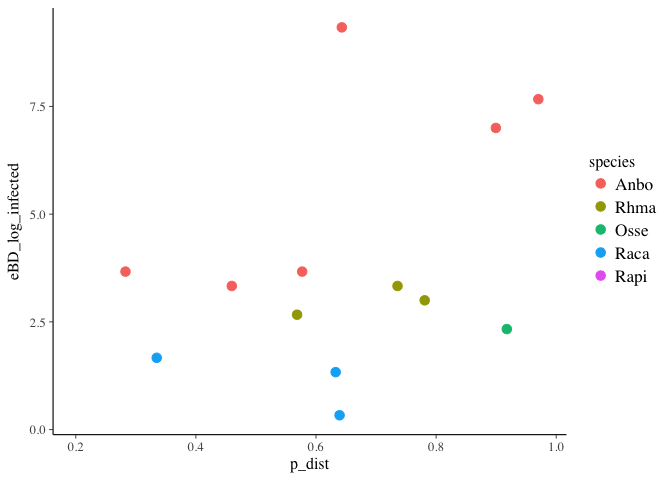
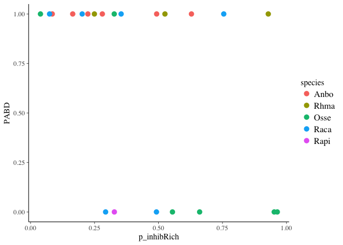
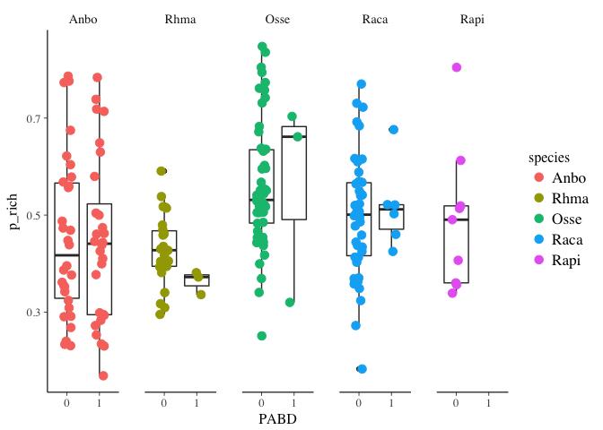

Statistical Analysis for 5Sp Dataset
================
Melissa Chen
Tue Jun 11 09:04:35 2019

``` r
# Load packages
library(tidyverse)
```

    ## ── Attaching packages ────────────────────────────────── tidyverse 1.2.1 ──

    ## ✔ ggplot2 2.2.1     ✔ purrr   0.2.4
    ## ✔ tibble  1.4.2     ✔ dplyr   0.7.5
    ## ✔ tidyr   0.8.1     ✔ stringr 1.3.1
    ## ✔ readr   1.1.1     ✔ forcats 0.3.0

    ## ── Conflicts ───────────────────────────────────── tidyverse_conflicts() ──
    ## ✖ dplyr::filter() masks stats::filter()
    ## ✖ dplyr::lag()    masks stats::lag()

``` r
library(rstanarm)
```

    ## Loading required package: Rcpp

    ## rstanarm (Version 2.17.4, packaged: 2018-04-13 01:51:52 UTC)

    ## - Do not expect the default priors to remain the same in future rstanarm versions.

    ## Thus, R scripts should specify priors explicitly, even if they are just the defaults.

    ## - For execution on a local, multicore CPU with excess RAM we recommend calling

    ## options(mc.cores = parallel::detectCores())

    ## - Plotting theme set to bayesplot::theme_default().

``` r
library(car) #Anova
```

    ## Loading required package: carData

    ## 
    ## Attaching package: 'car'

    ## The following object is masked from 'package:dplyr':
    ## 
    ##     recode

    ## The following object is masked from 'package:purrr':
    ## 
    ##     some

``` r
library(vegan) # for permanova
```

    ## Loading required package: permute

    ## Loading required package: lattice

    ## This is vegan 2.4-5

``` r
library(gridExtra)
```

    ## 
    ## Attaching package: 'gridExtra'

    ## The following object is masked from 'package:dplyr':
    ## 
    ##     combine

``` r
library(betareg) # for beta distr
library(lmtest) # for beta analysis
```

    ## Loading required package: zoo

    ## 
    ## Attaching package: 'zoo'

    ## The following objects are masked from 'package:base':
    ## 
    ##     as.Date, as.Date.numeric

``` r
# Mapping files
load("mf_con_without_init_infect.RData")
load("mf_treat_without_init_infect.RData")
load("mf.rare.RData")
# OTU table of inhibitory bacteria
load("otu.inhibOnly.treat.RData")
load("otu.inhibOnly.con.RData")
# Distance matrices
load("dm.filt.con.RData")
load("dm.filt.treat.RData")

# Previous analyses summaries
load("all_p.RData")
load("all_p_infected.RData")

# add a species column and PABD column
all_p <- all_p %>%
    mutate(PABD=ifelse(infect>0,1,0), infect = log(infect+1)) %>%
    rename(eBD_log=infect) %>%
    separate(toadID, into=c("species","indiv"), remove=FALSE)
all_p_infected <- all_p_infected %>%
    mutate(PABD=ifelse(eBD_log>0,1,0)) %>%
    separate(toadID, into=c("species","indiv"), remove=FALSE)

### TESTING: Remove 0 values to test intensity
all_p <- all_p %>%
    mutate(eBD_log_infected = ifelse(eBD_log>0,eBD_log,NA))
all_p_infected <- all_p_infected %>%
    mutate(eBD_log_infected = ifelse(eBD_log>0,eBD_log,NA))

#### CURSORY GLANCE AT DATA ####
gg_NMDS <- mf_con_without_init_infect %>%
    ggplot(aes(x=NMDS1, y=NMDS2)) +
    geom_point(aes(col=species), cex=3, show.legend = FALSE)
gg_infect <- mf_treat_without_init_infect  %>%
    ggplot(aes(x=species, y=eBD_log)) +
    geom_point(aes(col=species), cex=3, position = position_jitter(width=0.1, height=0.05), show.legend = FALSE)

temp1 <- mf_con_without_init_infect %>%
    dplyr::select(species, logRich) %>%
    mutate(metric="logRich") %>%
    rename(value=logRich)
temp2 <- mf_con_without_init_infect %>%
    dplyr::select(species, inhibRich) %>%
    mutate(metric="inhibRich")%>%
    rename(value=inhibRich)
temp3 <- mf_con_without_init_infect %>%
    dplyr::select(species, percInhib) %>%
    mutate(metric="percInhib")%>%
    rename(value=percInhib)
temp4 <- mf_con_without_init_infect %>%
    dplyr::select(species, distance_bray_curtis) %>%
    mutate(metric="distance_bray_curtis")%>%
    rename(value=distance_bray_curtis)

gg_all <- rbind(temp1,temp2,temp3,temp4) %>%
    ggplot(aes(x=species, y=value)) +
    geom_boxplot() +
    geom_point(aes(col=species), position = position_jitter(width=0.1, height=0))+
    facet_grid(metric~., scales = "free") 
lay <- rbind(c(1,2),
             c(3,2))
```

``` r
grid.arrange(gg_NMDS, gg_all, gg_infect, layout_matrix = lay)
```

    ## Warning: Removed 38 rows containing non-finite values (stat_boxplot).

    ## Warning: Removed 38 rows containing missing values (geom_point).


``` r
#### Stats ####
does_comp_differ_btwn_sp_and_across_time_con <- adonis2(dist(dm.filt.con) ~ species*time, data=mf_con_without_init_infect)
does_comp_differ_btwn_sp_and_across_time_con
```

    ## Permutation test for adonis under reduced model
    ## Terms added sequentially (first to last)
    ## Permutation: free
    ## Number of permutations: 999
    ## 
    ## adonis2(formula = dist(dm.filt.con) ~ species * time, data = mf_con_without_init_infect)
    ##               Df SumOfSqs      F Pr(>F)    
    ## species        4   424.12 78.785  0.001 ***
    ## time           1    39.03 29.000  0.001 ***
    ## species:time   4    41.22  7.657  0.001 ***
    ## Residual     197   265.12                  
    ## ---
    ## Signif. codes:  0 '***' 0.001 '**' 0.01 '*' 0.05 '.' 0.1 ' ' 1

``` r
beta_con_main_p <- does_comp_differ_btwn_sp_and_across_time_con$`Pr(>F)`[1:2]
beta_con_main_df1 <- does_comp_differ_btwn_sp_and_across_time_con$Df[1:2]
beta_con_main_df2 <- does_comp_differ_btwn_sp_and_across_time_con$Df[4]

beta_con_interaction_p <- does_comp_differ_btwn_sp_and_across_time_con$`Pr(>F)`[3]
beta_con_interaction_df1 <- does_comp_differ_btwn_sp_and_across_time_con$Df[3]
beta_con_interaction_df2 <- does_comp_differ_btwn_sp_and_across_time_con$Df[4]

beta_con_main_f <- does_comp_differ_btwn_sp_and_across_time_con$`F`[1:2]
beta_con_interaction_f <- does_comp_differ_btwn_sp_and_across_time_con$`F`[3]


mf_treat_without_init_infect_post <- mf_treat_without_init_infect %>%
    filter(prepost == "Pos")
does_comp_differ_btwn_sp_and_across_time_and_infect_treat <- adonis2(dist(dm.filt.treat) ~ species*time*PABD, data=mf_treat_without_init_infect_post)
does_comp_differ_btwn_sp_and_across_time_and_infect_treat
```

    ## Permutation test for adonis under reduced model
    ## Terms added sequentially (first to last)
    ## Permutation: free
    ## Number of permutations: 999
    ## 
    ## adonis2(formula = dist(dm.filt.treat) ~ species * time * PABD, data = mf_treat_without_init_infect_post)
    ##                    Df SumOfSqs       F Pr(>F)    
    ## species             4   344.67 43.6313  0.001 ***
    ## time                1    24.55 12.4311  0.001 ***
    ## PABD                1     5.91  2.9942  0.011 *  
    ## species:time        4    28.21  3.5707  0.001 ***
    ## species:PABD        3     6.42  1.0835  0.341    
    ## time:PABD           1     9.80  4.9597  0.002 ** 
    ## species:time:PABD   2     5.67  1.4353  0.132    
    ## Residual          180   355.48                   
    ## ---
    ## Signif. codes:  0 '***' 0.001 '**' 0.01 '*' 0.05 '.' 0.1 ' ' 1

``` r
beta_treat_main_p <- does_comp_differ_btwn_sp_and_across_time_and_infect_treat$`Pr(>F)`[1:2]
beta_treat_main_df1 <- does_comp_differ_btwn_sp_and_across_time_and_infect_treat$Df[1:2]
beta_treat_main_df2 <- does_comp_differ_btwn_sp_and_across_time_and_infect_treat$Df[8]

beta_treat_interaction_p <- does_comp_differ_btwn_sp_and_across_time_and_infect_treat$`Pr(>F)`[4]
beta_treat_interaction_df1 <- does_comp_differ_btwn_sp_and_across_time_and_infect_treat$Df[4]
beta_treat_interaction_df2 <- does_comp_differ_btwn_sp_and_across_time_and_infect_treat$Df[8]

beta_treat_main_f <- does_comp_differ_btwn_sp_and_across_time_and_infect_treat$`F`[1:2]
beta_treat_interaction_f <- does_comp_differ_btwn_sp_and_across_time_and_infect_treat$`F`[4]

beta_con_time_eff <- ""
beta_treat_time_eff <- ""
```

There is a significant effect of species, time, and PABD; all of these things also significantly interact EXCEPT species and PABD and all 3 together, which suggests species microbiomes change in the "same way" when infected

``` r
#### Preliminary stats on broad patterns ####

### RICHNESS AND TIME ###
```

Does richness change over time in control individuals?

``` r
# Type I ANOVA to test for interaction-- (AB | A, B)
rich_con_interaction_lm <- lm(logRich ~ species*time, data=mf_con_without_init_infect)
rich_con_interaction <- anova(rich_con_interaction_lm)
rich_con_interaction
```

    ## Analysis of Variance Table
    ## 
    ## Response: logRich
    ##               Df  Sum Sq Mean Sq F value    Pr(>F)    
    ## species        4  9.8448 2.46120 17.3532 3.263e-12 ***
    ## time           1  0.1974 0.19738  1.3916    0.2396    
    ## species:time   4  0.8054 0.20135  1.4197    0.2288    
    ## Residuals    197 27.9404 0.14183                      
    ## ---
    ## Signif. codes:  0 '***' 0.001 '**' 0.01 '*' 0.05 '.' 0.1 ' ' 1

``` r
# Use Type II ANOVA (no interaction present)
rich_con_main_lm <- lm(logRich ~ species + time, data=mf_con_without_init_infect)
rich_con_main <- Anova(rich_con_main_lm, type = 2)
rich_con_main
```

    ## Anova Table (Type II tests)
    ## 
    ## Response: logRich
    ##            Sum Sq  Df F value    Pr(>F)    
    ## species    9.9684   4 17.4255 2.724e-12 ***
    ## time       0.1974   1  1.3801    0.2415    
    ## Residuals 28.7458 201                      
    ## ---
    ## Signif. codes:  0 '***' 0.001 '**' 0.01 '*' 0.05 '.' 0.1 ' ' 1

``` r
# There is a significant effect of species but not time or interaction
```

Does richness change over time in treatment individuals?

``` r
# Type I ANOVA to test for interaction (AB | A,B)
rich_treat_interaction_lm <- lm(logRich ~ species*time, data=mf_treat_without_init_infect)
rich_treat_interaction <- anova(rich_treat_interaction_lm)
rich_treat_interaction
```

    ## Analysis of Variance Table
    ## 
    ## Response: logRich
    ##               Df Sum Sq Mean Sq F value    Pr(>F)    
    ## species        4 11.768 2.94196 18.1367  3.14e-13 ***
    ## time           1  0.000 0.00048  0.0029 0.9567623    
    ## species:time   4  3.364 0.84109  5.1852 0.0004847 ***
    ## Residuals    274 44.446 0.16221                      
    ## ---
    ## Signif. codes:  0 '***' 0.001 '**' 0.01 '*' 0.05 '.' 0.1 ' ' 1

``` r
# Type III ANOVA (valid in presence of interaction)
rich_treat_main_lm <- lm(logRich ~ species * time, data=mf_treat_without_init_infect, contrasts=list(species=contr.sum))
rich_treat_main <- Anova(rich_treat_main_lm, type=3)
rich_treat_main
```

    ## Anova Table (Type III tests)
    ## 
    ## Response: logRich
    ##              Sum Sq  Df   F value    Pr(>F)    
    ## (Intercept)  916.28   1 5648.7368 < 2.2e-16 ***
    ## species        2.44   4    3.7548 0.0054249 ** 
    ## time           0.02   1    0.1238 0.7252123    
    ## species:time   3.36   4    5.1852 0.0004847 ***
    ## Residuals     44.45 274                        
    ## ---
    ## Signif. codes:  0 '***' 0.001 '**' 0.01 '*' 0.05 '.' 0.1 ' ' 1

``` r
### DISTANCE TO CENTROID AND TIME ####
```

Is there an effect of species and time on controls?

``` r
# Type I ANOVA (to check for interaction) (AB | A,B)
centroid_con_interaction_lm <- lm(log(distance.to.centroid) ~ species*time, data=mf_con_without_init_infect)
centroid_con_interaction <- anova(centroid_con_interaction_lm)
centroid_con_interaction
```

    ## Analysis of Variance Table
    ## 
    ## Response: log(distance.to.centroid)
    ##               Df  Sum Sq Mean Sq F value    Pr(>F)    
    ## species        4  2.1129 0.52822  9.6625 3.724e-07 ***
    ## time           1  1.8197 1.81969 33.2866 3.045e-08 ***
    ## species:time   4  0.4254 0.10635  1.9455    0.1044    
    ## Residuals    197 10.7695 0.05467                      
    ## ---
    ## Signif. codes:  0 '***' 0.001 '**' 0.01 '*' 0.05 '.' 0.1 ' ' 1

``` r
# Type II ANOVA with no interaction
centroid_con_main_lm <- lm(log(distance.to.centroid) ~ species + time, data=mf_con_without_init_infect)
centroid_con_main <- Anova(centroid_con_main_lm, type = 2)
centroid_con_main
```

    ## Anova Table (Type II tests)
    ## 
    ## Response: log(distance.to.centroid)
    ##            Sum Sq  Df F value    Pr(>F)    
    ## species    1.8582   4  8.3407 3.036e-06 ***
    ## time       1.8197   1 32.6719 3.899e-08 ***
    ## Residuals 11.1949 201                      
    ## ---
    ## Signif. codes:  0 '***' 0.001 '**' 0.01 '*' 0.05 '.' 0.1 ' ' 1

Is there an effect of species and time on treatment??

``` r
# Type I ANOVA (to check for interaction) (AB | A,B)
centroid_treat_interaction_lm <- lm(log(distance.to.centroid) ~ species*time, data=mf_treat_without_init_infect)
centroid_treat_interaction <- anova(centroid_treat_interaction_lm)
centroid_treat_interaction
```

    ## Analysis of Variance Table
    ## 
    ## Response: log(distance.to.centroid)
    ##               Df  Sum Sq Mean Sq F value    Pr(>F)    
    ## species        4  3.0350 0.75876  9.5458 3.070e-07 ***
    ## time           1  1.9747 1.97470 24.8432 1.104e-06 ***
    ## species:time   4  1.1038 0.27595  3.4716  0.008706 ** 
    ## Residuals    274 21.7794 0.07949                      
    ## ---
    ## Signif. codes:  0 '***' 0.001 '**' 0.01 '*' 0.05 '.' 0.1 ' ' 1

``` r
# Type II ANOVA with no interaction
centroid_treat_main_lm <- lm(log(distance.to.centroid) ~ species + time, data=mf_treat_without_init_infect)
centroid_treat_main <- Anova(centroid_treat_main_lm, type = 2)
centroid_treat_main
```

    ## Anova Table (Type II tests)
    ## 
    ## Response: log(distance.to.centroid)
    ##            Sum Sq  Df F value    Pr(>F)    
    ## species    3.0312   4  9.2062 5.342e-07 ***
    ## time       1.9747   1 23.9900 1.646e-06 ***
    ## Residuals 22.8831 278                      
    ## ---
    ## Signif. codes:  0 '***' 0.001 '**' 0.01 '*' 0.05 '.' 0.1 ' ' 1

``` r
### DISPERSAL AND TIME ###
```

Is there an effect of species and time on controls?

``` r
# Type I ANOVA (to check for interaction) (AB | A,B)
# disp_con_interaction_glm <- betareg(distance_bray_curtis ~ species*time, data=mf_con_without_init_infect)
# disp_con_interaction_lm <- lm(distance_bray_curtis ~ species*time, data=mf_con_without_init_infect)

disp_con_interaction_glmmain <- betareg(distance_bray_curtis ~ species + time, data=mf_con_without_init_infect)
disp_con_interaction_glminter <- betareg(distance_bray_curtis ~ species*time, data=mf_con_without_init_infect)
disp_con_interaction <- lrtest(disp_con_interaction_glmmain,disp_con_interaction_glminter) # plus species

# Type II ANOVA with no interaction

disp_con_main_glmtonly <- betareg(distance_bray_curtis ~ time, data=mf_con_without_init_infect)
disp_con_main_glmsponly <- betareg(distance_bray_curtis ~ species, data=mf_con_without_init_infect)

disp_con_main_sp <- lrtest(disp_con_main_glmtonly,disp_con_interaction_glmmain) # plus species
disp_con_main_time <- lrtest(disp_con_main_glmsponly,disp_con_interaction_glmmain) # plus time
```

Is there an effect of species and time on treatment??

``` r
# Type I ANOVA (to check for interaction) (AB | A,B)
# disp_treat_interaction_lm <- lm(distance_bray_curtis ~ species*time, data=mf_treat_without_init_infect)
# disp_treat_interaction <- anova(disp_treat_interaction_lm)
# disp_treat_interaction
disp_treat_interaction_glmmain <- betareg(distance_bray_curtis ~ species + time, data=mf_treat_without_init_infect)
disp_treat_interaction_glminter <- betareg(distance_bray_curtis ~ species*time, data=mf_treat_without_init_infect)
disp_treat_interaction <- lrtest(disp_treat_interaction_glmmain,disp_treat_interaction_glminter) # plus species
disp_treat_interaction
```

    ## Likelihood ratio test
    ## 
    ## Model 1: distance_bray_curtis ~ species + time
    ## Model 2: distance_bray_curtis ~ species * time
    ##   #Df LogLik Df  Chisq Pr(>Chisq)
    ## 1   7 108.33                     
    ## 2  11 109.19  4 1.7143     0.7881

``` r
# Type II ANOVA with no interaction

disp_treat_main_glmtonly <- betareg(distance_bray_curtis ~ time, data=mf_treat_without_init_infect)
disp_treat_main_glmsponly <- betareg(distance_bray_curtis ~ species, data=mf_treat_without_init_infect)

disp_treat_main_sp <- lrtest(disp_treat_main_glmtonly,disp_treat_interaction_glmmain) # plus species
disp_treat_main_time <- lrtest(disp_treat_main_glmsponly,disp_treat_interaction_glmmain) # plus time
disp_treat_main_sp
```

    ## Likelihood ratio test
    ## 
    ## Model 1: distance_bray_curtis ~ time
    ## Model 2: distance_bray_curtis ~ species + time
    ##   #Df  LogLik Df  Chisq Pr(>Chisq)    
    ## 1   3  96.148                         
    ## 2   7 108.327  4 24.359  6.768e-05 ***
    ## ---
    ## Signif. codes:  0 '***' 0.001 '**' 0.01 '*' 0.05 '.' 0.1 ' ' 1

``` r
disp_treat_main_time
```

    ## Likelihood ratio test
    ## 
    ## Model 1: distance_bray_curtis ~ species
    ## Model 2: distance_bray_curtis ~ species + time
    ##   #Df LogLik Df  Chisq Pr(>Chisq)  
    ## 1   6 106.69                       
    ## 2   7 108.33  1 3.2762    0.07029 .
    ## ---
    ## Signif. codes:  0 '***' 0.001 '**' 0.01 '*' 0.05 '.' 0.1 ' ' 1

``` r
### PERCENT INHIB ###
```

Does percent inhibitory change with species or time?

``` r
# # Type I ANOVA (to test for interaction) in control group?
# pinhib_con_interaction_glm <- glm(percInhib ~ species*time, family = binomial(), data=mf_con_without_init_infect, weights=mf_con_without_init_infect$n)
# pinhib_con_interaction <- anova(pinhib_con_interaction_glm, test = "Chisq")
# pinhib_con_interaction
# # Type III ANOVA (to test for main effects, given interaction) in control group?
# pinhib_con_main_glm <- glm(percInhib ~ species*time, family = binomial(), data=mf_con_without_init_infect, weights=mf_con_without_init_infect$n, contrasts=list(species=contr.sum))
# pinhib_con_main <- Anova(pinhib_con_main_glm, type=3)
# pinhib_con_main
# 
# # Does percent inhibitory change with species or time in treatment group?
# # Type I ANOVA (to test for interaction) in control group?
# pinhib_treat_interaction_glm <- glm(percInhib ~ species*time, family = binomial(), data=mf_treat_without_init_infect, weights=mf_treat_without_init_infect$n)
# pinhib_treat_interaction <- anova(pinhib_treat_interaction_glm, test = "Chisq")
# pinhib_treat_interaction
# # Type III ANOVA (to test for main effects, given interaction) in control group?
# pinhib_treat_main_glm <- glm(percInhib ~ species*time, family = binomial(), data=mf_treat_without_init_infect, weights=mf_treat_without_init_infect$n, contrasts = list(species=contr.sum))
# pinhib_treat_main <- Anova(pinhib_treat_main_glm, type=3)
# pinhib_treat_main

# There is ONE zero... so need to transform data to be between 0 and 1. Super annoying. 
y.transf.betareg <- function(y){
    n.obs <- sum(!is.na(y))
    (y * (n.obs - 1) + 0.5) / n.obs
}

# Type I ANOVA (to check for interaction) (AB | A,B)
pinhib_con_interaction_glmmain <- betareg(y.transf.betareg(percInhib) ~ species + time, data=mf_con_without_init_infect)
pinhib_con_interaction_glminter <- betareg(y.transf.betareg(percInhib) ~ species*time, data=mf_con_without_init_infect)
pinhib_con_interaction <- lrtest(pinhib_con_interaction_glmmain,pinhib_con_interaction_glminter) # plus species
pinhib_con_interaction
```

    ## Likelihood ratio test
    ## 
    ## Model 1: y.transf.betareg(percInhib) ~ species + time
    ## Model 2: y.transf.betareg(percInhib) ~ species * time
    ##   #Df LogLik Df  Chisq Pr(>Chisq)    
    ## 1   7 201.98                         
    ## 2  11 221.63  4 39.301  6.037e-08 ***
    ## ---
    ## Signif. codes:  0 '***' 0.001 '**' 0.01 '*' 0.05 '.' 0.1 ' ' 1

``` r
# Type III ANOVA to test for main effects


pinhib_con_main_glmtonly <- betareg(y.transf.betareg(percInhib) ~ time , data=mf_con_without_init_infect)
pinhib_con_main_glmsponly <- betareg(y.transf.betareg(percInhib) ~ species , data=mf_con_without_init_infect)

pinhib_con_main_sp <- lrtest(pinhib_con_main_glmtonly,pinhib_con_interaction_glmmain) # plus species
pinhib_con_main_time <- lrtest(pinhib_con_main_glmsponly,pinhib_con_interaction_glmmain) # plus time
pinhib_con_main_sp
```

    ## Likelihood ratio test
    ## 
    ## Model 1: y.transf.betareg(percInhib) ~ time
    ## Model 2: y.transf.betareg(percInhib) ~ species + time
    ##   #Df LogLik Df  Chisq Pr(>Chisq)    
    ## 1   3 186.97                         
    ## 2   7 201.98  4 30.032  4.822e-06 ***
    ## ---
    ## Signif. codes:  0 '***' 0.001 '**' 0.01 '*' 0.05 '.' 0.1 ' ' 1

``` r
pinhib_con_main_time
```

    ## Likelihood ratio test
    ## 
    ## Model 1: y.transf.betareg(percInhib) ~ species
    ## Model 2: y.transf.betareg(percInhib) ~ species + time
    ##   #Df LogLik Df  Chisq Pr(>Chisq)
    ## 1   6 201.78                     
    ## 2   7 201.98  1 0.4047     0.5247

Is there an effect of species and time on treatment??

``` r
# Type I ANOVA (to check for interaction) (AB | A,B)
# pinhib_treat_interaction_lm <- lm(percInhib ~ species*time, data=mf_treat_without_init_infect)
# pinhib_treat_interaction <- anova(pinhib_treat_interaction_lm)
# pinhib_treat_interaction
#

pinhib_treat_interaction_glmmain <- betareg(y.transf.betareg(percInhib) ~ species + time, data=mf_treat_without_init_infect)
pinhib_treat_interaction_glminter <- betareg(y.transf.betareg(percInhib) ~ species*time, data=mf_treat_without_init_infect)
pinhib_treat_interaction <- lrtest(pinhib_treat_interaction_glmmain,pinhib_treat_interaction_glminter) # plus species
pinhib_treat_interaction
```

    ## Likelihood ratio test
    ## 
    ## Model 1: y.transf.betareg(percInhib) ~ species + time
    ## Model 2: y.transf.betareg(percInhib) ~ species * time
    ##   #Df LogLik Df  Chisq Pr(>Chisq)  
    ## 1   7 169.63                       
    ## 2  11 175.54  4 11.829    0.01867 *
    ## ---
    ## Signif. codes:  0 '***' 0.001 '**' 0.01 '*' 0.05 '.' 0.1 ' ' 1

``` r
# Type II ANOVA with no interaction

pinhib_treat_main_glmtonly <- betareg(y.transf.betareg(percInhib) ~ time, data=mf_treat_without_init_infect)
pinhib_treat_main_glmsponly <- betareg(y.transf.betareg(percInhib) ~ species, data=mf_treat_without_init_infect)

pinhib_treat_main_sp <- lrtest(pinhib_treat_main_glmtonly,pinhib_treat_interaction_glmmain) # plus species
pinhib_treat_main_time <- lrtest(pinhib_treat_main_glmsponly,pinhib_treat_interaction_glmmain) # plus time
pinhib_treat_main_sp
```

    ## Likelihood ratio test
    ## 
    ## Model 1: y.transf.betareg(percInhib) ~ time
    ## Model 2: y.transf.betareg(percInhib) ~ species + time
    ##   #Df LogLik Df  Chisq Pr(>Chisq)    
    ## 1   3 141.47                         
    ## 2   7 169.63  4 56.309  1.727e-11 ***
    ## ---
    ## Signif. codes:  0 '***' 0.001 '**' 0.01 '*' 0.05 '.' 0.1 ' ' 1

``` r
pinhib_treat_main_time
```

    ## Likelihood ratio test
    ## 
    ## Model 1: y.transf.betareg(percInhib) ~ species
    ## Model 2: y.transf.betareg(percInhib) ~ species + time
    ##   #Df LogLik Df  Chisq Pr(>Chisq)    
    ## 1   6 161.89                         
    ## 2   7 169.63  1 15.474  8.366e-05 ***
    ## ---
    ## Signif. codes:  0 '***' 0.001 '**' 0.01 '*' 0.05 '.' 0.1 ' ' 1

``` r
### INHIB RICH ###
# Does richness of inhibitory bacteria differ betwen species and time points?
# Type I ANOVA to test for interactions in control
inhibRich_con_interaction_glm <- glm(inhibRich ~ species*time, data=mf_con_without_init_infect, family=poisson())
inhibRich_con_interaction <- anova(inhibRich_con_interaction_glm, test="Chisq")
inhibRich_con_interaction
```

    ## Analysis of Deviance Table
    ## 
    ## Model: poisson, link: log
    ## 
    ## Response: inhibRich
    ## 
    ## Terms added sequentially (first to last)
    ## 
    ## 
    ##              Df Deviance Resid. Df Resid. Dev  Pr(>Chi)    
    ## NULL                           206     232.35              
    ## species       4  29.2924       202     203.06 6.818e-06 ***
    ## time          1   0.6686       201     202.39    0.4135    
    ## species:time  4  31.3583       197     171.03 2.587e-06 ***
    ## ---
    ## Signif. codes:  0 '***' 0.001 '**' 0.01 '*' 0.05 '.' 0.1 ' ' 1

``` r
# TYpe III ANOVA to test for main effects with interactions in control
inhibRich_con_main_glm <- glm(inhibRich ~ species*time, data=mf_con_without_init_infect, family=poisson(), contrasts=list(species=contr.sum))
inhibRich_con_main <- Anova(inhibRich_con_main_glm,type=3)
inhibRich_con_main
```

    ## Analysis of Deviance Table (Type III tests)
    ## 
    ## Response: inhibRich
    ##              LR Chisq Df Pr(>Chisq)    
    ## species        42.494  4  1.318e-08 ***
    ## time            0.726  1     0.3942    
    ## species:time   31.358  4  2.587e-06 ***
    ## ---
    ## Signif. codes:  0 '***' 0.001 '**' 0.01 '*' 0.05 '.' 0.1 ' ' 1

``` r
# Type I ANOVA to test for interactions
inhibRich_treat_interaction_glm <- glm(inhibRich ~ species*time, data=mf_treat_without_init_infect, family=poisson())
inhibRich_treat_interaction <- anova(inhibRich_treat_interaction_glm, test="Chisq")
inhibRich_treat_interaction
```

    ## Analysis of Deviance Table
    ## 
    ## Model: poisson, link: log
    ## 
    ## Response: inhibRich
    ## 
    ## Terms added sequentially (first to last)
    ## 
    ## 
    ##              Df Deviance Resid. Df Resid. Dev  Pr(>Chi)    
    ## NULL                           283     361.86              
    ## species       4  130.642       279     231.22 < 2.2e-16 ***
    ## time          1    0.033       278     231.19  0.856329    
    ## species:time  4   18.271       274     212.92  0.001092 ** 
    ## ---
    ## Signif. codes:  0 '***' 0.001 '**' 0.01 '*' 0.05 '.' 0.1 ' ' 1

``` r
# TYpe III ANOVA to test for main effects with interactions
inhibRich_treat_main_glm <- glm(inhibRich ~ species*time, data=mf_treat_without_init_infect, family=poisson(), contrasts = list(species=contr.sum))
inhibRich_treat_main <- Anova(inhibRich_treat_main_glm,type=3)
inhibRich_treat_main
```

    ## Analysis of Deviance Table (Type III tests)
    ## 
    ## Response: inhibRich
    ##              LR Chisq Df Pr(>Chisq)    
    ## species       23.8941  4  8.387e-05 ***
    ## time           0.7994  1   0.371281    
    ## species:time  18.2715  4   0.001092 ** 
    ## ---
    ## Signif. codes:  0 '***' 0.001 '**' 0.01 '*' 0.05 '.' 0.1 ' ' 1

``` r
#### Summarize overall trends into table ####

# RICHNESS
rich_con_main_p <- rich_con_main$`Pr(>F)`[1:2]
rich_con_main_df1 <- rich_con_main$Df[1:2]
rich_con_main_df2 <- rich_con_main$Df[3]

rich_con_interaction_p <- rich_con_interaction$`Pr(>F)`[3]
rich_con_interaction_df1 <- rich_con_interaction$Df[3]
rich_con_interaction_df2 <- rich_con_interaction$Df[4]

rich_treat_main_p <- rich_treat_main$`Pr(>F)`[2:3]
rich_treat_main_df1 <- rich_treat_main$Df[2:3]
rich_treat_main_df2 <- rich_treat_main$Df[5]

rich_treat_interaction_p <- rich_treat_interaction$`Pr(>F)`[3]
rich_treat_interaction_df1 <- rich_treat_interaction$Df[3]
rich_treat_interaction_df2 <- rich_treat_interaction$Df[4]

rich_con_main_f <- rich_con_main$`F value`[1:2]
rich_con_interaction_f <- rich_con_interaction$`F value`[3]

rich_treat_main_f <- rich_treat_main$`F value`[2:3]
rich_treat_interaction_f <- rich_treat_interaction$`F value`[3]

rich_con_time_eff <- ifelse(rich_con_main_lm$coefficients["time"]>0,"(+)","(-)")
rich_treat_time_eff <- ifelse(rich_treat_main_lm$coefficients["time"]>0,"(+)","(-)")

# CENTROID
centroid_con_main_p <- centroid_con_main$`Pr(>F)`[1:2]
centroid_con_main_df1 <- centroid_con_main$Df[1:2]
centroid_con_main_df2 <- centroid_con_main$Df[3]

centroid_con_interaction_p <- centroid_con_interaction$`Pr(>F)`[3]
centroid_con_interaction_df1 <- centroid_con_interaction$Df[3]
centroid_con_interaction_df2 <- centroid_con_interaction$Df[4]

centroid_treat_main_p <- centroid_treat_main$`Pr(>F)`[1:2]
centroid_treat_main_df1 <- centroid_treat_main$Df[1:2]
centroid_treat_main_df2 <- centroid_treat_main$Df[3]

centroid_treat_interaction_p <- centroid_treat_interaction$`Pr(>F)`[3]
centroid_treat_interaction_df1 <- centroid_treat_interaction$Df[3]
centroid_treat_interaction_df2 <- centroid_treat_interaction$Df[4]

centroid_con_main_f <- centroid_con_main$`F value`[1:2]
centroid_con_interaction_f <- centroid_con_interaction$`F value`[3]

centroid_treat_main_f <- centroid_treat_main$`F value`[1:2]
centroid_treat_interaction_f <- centroid_treat_interaction$`F value`[3]

centroid_con_time_eff <- ifelse(centroid_con_main_lm$coefficients["time"]>0,"(+)","(-)")
centroid_treat_time_eff <- ifelse(centroid_treat_main_lm$coefficients["time"]>0,"(+)","(-)")


# DISPERSION
disp_con_main_p <- c(disp_con_main_sp$`Pr(>Chisq)`[2], disp_con_main_time$`Pr(>Chisq)`[2])
# disp_con_main_p <- disp_con_main$`Pr(>F)`[1:2]
disp_con_main_df1 <- c(disp_con_main_sp$Df[2], disp_con_main_time$Df[2])
disp_con_main_n <- sum(!is.na(mf_con_without_init_infect$distance_bray_curtis))-1-7

disp_con_interaction_p <- disp_con_interaction$`Pr(>Chisq)`[2]
disp_con_interaction_df1 <- disp_con_interaction$Df[2]
disp_con_interaction_n <- sum(!is.na(mf_con_without_init_infect$distance_bray_curtis))-1-11

disp_treat_main_p <- c(disp_treat_main_sp$`Pr(>Chisq)`[2], disp_treat_main_time$`Pr(>Chisq)`[2])
# disp_treat_main_p <- disp_treat_main$`Pr(>F)`[1:2]
disp_treat_main_df1 <- c(disp_treat_main_sp$Df[2], disp_treat_main_time$Df[2])
disp_treat_main_n <- sum(!is.na(mf_treat_without_init_infect$distance_bray_curtis))-1-7

disp_treat_interaction_p <- disp_treat_interaction$`Pr(>Chisq)`[2]
disp_treat_interaction_df1 <- disp_treat_interaction$Df[2]
disp_treat_interaction_n <- sum(!is.na(mf_treat_without_init_infect$distance_bray_curtis))-1-11

disp_con_main_f <- c(disp_con_main_sp$Chisq[2], disp_con_main_time$Chisq[2])
disp_con_interaction_f <- disp_con_interaction$Chisq[2]

disp_treat_main_f <- c(disp_treat_main_sp$Chisq[2], disp_treat_main_time$Chisq[2])
disp_treat_interaction_f <- disp_treat_interaction$Chisq[2]

# disp_con_time_eff <- ifelse(disp_con_main_lm$coefficients["time"]>0,"(+)","(-)")
disp_con_time_eff <- ifelse(disp_con_main_glmtonly$coefficients$mean[2]>0,"(+)","(-)")
# disp_treat_time_eff <- ifelse(disp_treat_main_lm$coefficients["time"]>0,"(+)","(-)")
disp_treat_time_eff <- ifelse(disp_treat_main_glmtonly$coefficients$mean[2]>0,"(+)","(-)")


# INHIB RICH
inhibRich_con_main_p <- inhibRich_con_main$`Pr(>Chisq)`[1:2]
inhibRich_con_main_df1 <- inhibRich_con_main$Df[1:2]

inhibRich_con_interaction_p <- inhibRich_con_interaction$`Pr(>Chi)`[4]
inhibRich_con_interaction_df1 <- inhibRich_con_interaction$Df[4]
inhibRich_con_interaction_n <- inhibRich_con_interaction$`Resid. Df`[1]

inhibRich_treat_main_p <- inhibRich_treat_main$`Pr(>Chisq)`[1:2]
inhibRich_treat_main_df1 <- inhibRich_treat_main$Df[1:2]

inhibRich_treat_interaction_p <- inhibRich_treat_interaction$`Pr(>Chi)`[4]
inhibRich_treat_interaction_df1 <- inhibRich_treat_interaction$Df[4]
inhibRich_treat_interaction_n <- inhibRich_treat_interaction$`Resid. Df`[1]

inhibRich_con_main_f <- inhibRich_con_main$`LR Chisq`[1:2]
inhibRich_con_interaction_f <- inhibRich_con_interaction$Deviance[4]

inhibRich_treat_main_f <- inhibRich_treat_main$`LR Chisq`[1:2]
inhibRich_treat_interaction_f <- inhibRich_treat_interaction$Deviance[4]

inhibRich_con_time_eff <- ifelse(inhibRich_con_main_glm$coefficients["time"]>0,"(+)","(-)")
inhibRich_treat_time_eff <- ifelse(inhibRich_treat_main_glm$coefficients["time"]>0,"(+)","(-)")


# PERCENT
pinhib_con_main_p <- c(pinhib_con_main_sp$`Pr(>Chisq)`[2], pinhib_con_main_time$`Pr(>Chisq)`[2])
# pinhib_con_main_p <- pinhib_con_main$`Pr(>F)`[1:2]
pinhib_con_main_df1 <- c(pinhib_con_main_sp$Df[2], pinhib_con_main_time$Df[2])
pinhib_con_main_n <- sum(!is.na(mf_con_without_init_infect$distance_bray_curtis))-1-7

pinhib_con_interaction_p <- pinhib_con_interaction$`Pr(>Chisq)`[2]
pinhib_con_interaction_df1 <- pinhib_con_interaction$Df[2]
pinhib_con_interaction_n <- sum(!is.na(mf_con_without_init_infect$distance_bray_curtis))-1-11

pinhib_treat_main_p <- c(pinhib_treat_main_sp$`Pr(>Chisq)`[2], pinhib_treat_main_time$`Pr(>Chisq)`[2])
# pinhib_treat_main_p <- pinhib_treat_main$`Pr(>F)`[1:2]
pinhib_treat_main_df1 <- c(pinhib_treat_main_sp$Df[2], pinhib_treat_main_time$Df[2])
pinhib_treat_main_n <- sum(!is.na(mf_treat_without_init_infect$distance_bray_curtis))-1-7

pinhib_treat_interaction_p <- pinhib_treat_interaction$`Pr(>Chisq)`[2]
pinhib_treat_interaction_df1 <- pinhib_treat_interaction$Df[2]
pinhib_treat_interaction_n <- sum(!is.na(mf_treat_without_init_infect$distance_bray_curtis))-1-11

pinhib_con_main_f <- c(pinhib_con_main_sp$Chisq[2], pinhib_con_main_time$Chisq[2])
pinhib_con_interaction_f <- pinhib_con_interaction$Chisq[2]

pinhib_treat_main_f <- c(pinhib_treat_main_sp$Chisq[2], pinhib_treat_main_time$Chisq[2])
pinhib_treat_interaction_f <- pinhib_treat_interaction$Chisq[2]

# pinhib_con_time_eff <- ifelse(pinhib_con_main_lm$coefficients["time"]>0,"(+)","(-)")
pinhib_con_time_eff <- ifelse(pinhib_con_main_glmtonly$coefficients$mean[2]>0,"(+)","(-)")
# pinhib_treat_time_eff <- ifelse(pinhib_treat_main_lm$coefficients["time"]>0,"(+)","(-)")
pinhib_treat_time_eff <- ifelse(pinhib_treat_main_glmtonly$coefficients$mean[2]>0,"(+)","(-)")

stat_results <- as.data.frame(matrix(ncol=5, nrow=12, dimnames = list(NULL,c("Microbiome metric","Control or Treatment","Main effect: species","Main effect: time", "Interaction: species x time"))), check.names=FALSE)
stat_results$`Microbiome metric` <- c("Beta Diversity"
                                      , "Beta Diversity"
                                      , "OTU Richness"
                                      , "OTU RIchness"
                                      , "Distance to centroid"
                                      , "Distance to centroid"
                                      , "Stability (BC distance)"
                                      , "Stability (BC distance)"
                                      , "Percent Inhibitory"
                                      , "Percent Inhibitory"
                                      ,"Inhibitory Richness"
                                      ,"Inhibitory Richness"
                                      )
stat_results$`Control or Treatment` <- rep(c("Control","Treatment"), 6)
current_row <- 1

for ( test in c("beta","rich","centroid","disp","pinhib","inhibRich") ) {
    for ( ct in c("con","treat")) {
        if (test %in% c("beta","rich","centroid")) {
            df1_sp <- get(paste(test, ct, "main_df1", sep="_"))[1] # species
            df2_sp <- get(paste(test, ct, "main_df2", sep="_")) # species
            
            df1_t <- get(paste(test, ct, "main_df1", sep="_"))[2] # time
            df2_t <- get(paste(test, ct, "main_df2", sep="_")) # time
            
            df1_inter <- get(paste(test, ct, "interaction_df1", sep="_"))
            df2_inter <- get(paste(test, ct, "interaction_df2", sep="_"))
            
            stat_main_sp<- paste0(", F(",df1_sp,",",df2_sp,")=")
            stat_main_t<- paste0(", F(",df1_t,",",df2_t,")=")
            
            stat_interaction <- paste0(", F(",df1_inter,",",df2_inter,")=")
            
        } else if ( test %in% c("disp","pinhib")) {
            df1_sp <- get(paste(test, ct, "main_df1", sep="_"))[1] # species
            n_sp <- get(paste(test, ct, "main_n", sep="_")) # species
            
            df1_t <- get(paste(test, ct, "main_df1", sep="_"))[2] # time
            n_t <- get(paste(test, ct, "main_n", sep="_")) # time
            
            df1_inter <- get(paste(test, ct, "interaction_df1", sep="_"))
            n_inter <- get(paste(test, ct, "interaction_n", sep="_"))
            
            stat_main_sp<- paste0(", Chisq(",df1_sp,",N=",df2_sp,")=")
            stat_main_t<- paste0(", Chisq(",df1_t,",N=",df2_t,")=")
            
            stat_interaction <- paste0(", Chisq(",df1_inter,",N=",df2_inter,")=")
            
        } else {
            
            df1_sp <- get(paste(test, ct, "main_df1", sep="_"))[1] # species

            df1_t <- get(paste(test, ct, "main_df1", sep="_"))[2] # time

            df1_inter <- get(paste(test, ct, "interaction_df1", sep="_"))
            n_inter <- get(paste(test, ct, "interaction_n", sep="_"))
            
            stat_main_sp <- paste0(", Chisq(",df1_sp,")=")
            stat_main_t <- paste0(", Chisq(",df1_t,")=")
            stat_interaction <- paste0(", LRChi(",df1_inter,",N=",n_inter,")=")
        }
        
            stat_results[current_row, 3:5] <- c(paste0("p=", signif(get(paste(test, ct, "main_p", sep="_"))[1],3), stat_main_sp, signif(get(paste(test, ct, "main_f", sep="_"))[1],2))
              , paste0("p=", signif(get(paste(test, ct, "main_p", sep="_"))[2],3), stat_main_t, signif(get(paste(test, ct, "main_f", sep="_"))[2],3),get(paste(test, ct, "time_eff", sep="_")) )
              , paste0("p=", signif(get(paste(test, ct, "interaction_p", sep="_")),3), stat_interaction, signif(get(paste(test, ct, "interaction_f", sep="_"))[1],2))
            )
        
        current_row <- current_row+1
    }
}


stat_results
```

    ##          Microbiome metric Control or Treatment
    ## 1           Beta Diversity              Control
    ## 2           Beta Diversity            Treatment
    ## 3             OTU Richness              Control
    ## 4             OTU RIchness            Treatment
    ## 5     Distance to centroid              Control
    ## 6     Distance to centroid            Treatment
    ## 7  Stability (BC distance)              Control
    ## 8  Stability (BC distance)            Treatment
    ## 9       Percent Inhibitory              Control
    ## 10      Percent Inhibitory            Treatment
    ## 11     Inhibitory Richness              Control
    ## 12     Inhibitory Richness            Treatment
    ##             Main effect: species                  Main effect: time
    ## 1           p=0.001, F(4,197)=79               p=0.001, F(1,197)=29
    ## 2           p=0.001, F(4,180)=44             p=0.001, F(1,180)=12.4
    ## 3        p=2.72e-12, F(4,201)=17          p=0.241, F(1,201)=1.38(+)
    ## 4        p=0.00542, F(4,274)=3.8         p=0.725, F(1,274)=0.124(+)
    ## 5       p=3.04e-06, F(4,201)=8.3        p=3.9e-08, F(1,201)=32.7(+)
    ## 6       p=5.34e-07, F(4,278)=9.2         p=1.65e-06, F(1,278)=24(+)
    ## 7  p=2.57e-05, Chisq(4,N=278)=26   p=0.644, Chisq(1,N=278)=0.214(-)
    ## 8  p=6.77e-05, Chisq(4,N=278)=24   p=0.0703, Chisq(1,N=278)=3.28(-)
    ## 9  p=4.82e-06, Chisq(4,N=278)=30   p=0.525, Chisq(1,N=278)=0.405(+)
    ## 10 p=1.73e-11, Chisq(4,N=278)=56 p=8.37e-05, Chisq(1,N=278)=15.5(+)
    ## 11       p=1.32e-08, Chisq(4)=42         p=0.394, Chisq(1)=0.726(-)
    ## 12       p=8.39e-05, Chisq(4)=24         p=0.371, Chisq(1)=0.799(-)
    ##      Interaction: species x time
    ## 1          p=0.001, F(4,197)=7.7
    ## 2          p=0.001, F(4,180)=3.6
    ## 3          p=0.229, F(4,197)=1.4
    ## 4       p=0.000485, F(4,274)=5.2
    ## 5          p=0.104, F(4,197)=1.9
    ## 6        p=0.00871, F(4,274)=3.5
    ## 7    p=0.513, Chisq(4,N=274)=3.3
    ## 8    p=0.788, Chisq(4,N=274)=1.7
    ## 9  p=6.04e-08, Chisq(4,N=274)=39
    ## 10   p=0.0187, Chisq(4,N=274)=12
    ## 11 p=2.59e-06, LRChi(4,N=206)=31
    ## 12  p=0.00109, LRChi(4,N=283)=18

``` r
write_csv(stat_results, path = "stats_table.csv")


#### PART I ####
```

PART I
======

Part I: Microbiome state and effect on infection risk and intensity
-------------------------------------------------------------------

``` r
#### PABD and OTU Richness ####
```

### (1a) Does overall diversity of microbiome influence BD infection rate?
The first thing we would like to know is whether microbiome richness of an individual influences

its risk of becoming infected by BD. The most simple way to look at this would be to plot OTU richness VS presence/absence of BD Below, we fitted normal and lognormal distributions, respectively, to diversity (shannon) and otu richness to individuals prior to BD infection. Now, we fit a binomial general linearized model to see if there is a relationship between diversity and infection rate.

``` r
glm_PABD_prich <- glm(PABD ~ species*p_rich, data=all_p, family=binomial(link="logit"))
anova(glm_PABD_prich, test="Chisq") # test for interaction
```

    ## Analysis of Deviance Table
    ## 
    ## Model: binomial, link: logit
    ## 
    ## Response: PABD
    ## 
    ## Terms added sequentially (first to last)
    ## 
    ## 
    ##                Df Deviance Resid. Df Resid. Dev Pr(>Chi)  
    ## NULL                              21     27.522           
    ## species         4  12.2453        17     15.276  0.01562 *
    ## p_rich          1   3.1137        16     12.163  0.07764 .
    ## species:p_rich  3   0.0014        13     12.161  0.99999  
    ## ---
    ## Signif. codes:  0 '***' 0.001 '**' 0.01 '*' 0.05 '.' 0.1 ' ' 1

``` r
Anova(glm_PABD_prich, type=2) # test for main effects
```

    ## Analysis of Deviance Table (Type II tests)
    ## 
    ## Response: PABD
    ##                LR Chisq Df Pr(>Chisq)  
    ## species         12.8268  4    0.01215 *
    ## p_rich           3.1137  1    0.07764 .
    ## species:p_rich   0.0014  3    0.99999  
    ## ---
    ## Signif. codes:  0 '***' 0.001 '**' 0.01 '*' 0.05 '.' 0.1 ' ' 1

``` r
all_p %>%
    ggplot(aes(x=p_rich, y=PABD)) +
    geom_point(aes(col=species), cex=3)  
```


If anything, it looks like increased diversity and richness might increase infection risk

``` r
#### eBD and OTU Richness ####
```

(1b) Does overall diversity of microbiome influence BD infection intensity?
The next thing we would like to know is if richness of the microbiome influences infection intensity.
Now let's do richness

``` r
lm_eBD_prich <- lm(eBD_log ~ species*p_rich, data=all_p)
anova(lm_eBD_prich)
```

    ## Analysis of Variance Table
    ## 
    ## Response: eBD_log
    ##                Df  Sum Sq Mean Sq F value    Pr(>F)    
    ## species         4 110.258 27.5644  9.5749 0.0007803 ***
    ## p_rich          1   0.260  0.2597  0.0902 0.7686504    
    ## species:p_rich  3   2.927  0.9756  0.3389 0.7975916    
    ## Residuals      13  37.425  2.8788                      
    ## ---
    ## Signif. codes:  0 '***' 0.001 '**' 0.01 '*' 0.05 '.' 0.1 ' ' 1

``` r
Anova(lm_eBD_prich, type=2)
```

    ## Note: model has aliased coefficients
    ##       sums of squares computed by model comparison

    ## Anova Table (Type II tests)
    ## 
    ## Response: eBD_log
    ##                Sum Sq Df F value   Pr(>F)   
    ## species        67.736  4  5.8823 0.006286 **
    ## p_rich          0.260  1  0.0902 0.768650   
    ## species:p_rich  2.927  3  0.3389 0.797592   
    ## Residuals      37.425 13                    
    ## ---
    ## Signif. codes:  0 '***' 0.001 '**' 0.01 '*' 0.05 '.' 0.1 ' ' 1

``` r
all_p %>%
    ggplot(aes(x=p_rich, y=eBD_log)) +
    geom_point(aes(col=species), cex=3) 
```


Try a version where we remove zeros so that we do not have zero-inflated data

``` r
lm_eBD_prich_nozeros <- lm(eBD_log_infected ~ species*p_rich, data=all_p)
anova(lm_eBD_prich_nozeros)
```

    ## Analysis of Variance Table
    ## 
    ## Response: eBD_log_infected
    ##                Df Sum Sq Mean Sq F value  Pr(>F)  
    ## species         3 59.196 19.7321  4.3324 0.05036 .
    ## p_rich          1  1.430  1.4295  0.3139 0.59279  
    ## species:p_rich  3  1.003  0.3344  0.0734 0.97236  
    ## Residuals       7 31.882  4.5546                  
    ## ---
    ## Signif. codes:  0 '***' 0.001 '**' 0.01 '*' 0.05 '.' 0.1 ' ' 1

``` r
Anova(lm_eBD_prich_nozeros, type=2)
```

    ## Anova Table (Type II tests)
    ## 
    ## Response: eBD_log_infected
    ##                Sum Sq Df F value Pr(>F)
    ## species        39.236  3  2.8715 0.1131
    ## p_rich          1.430  1  0.3139 0.5928
    ## species:p_rich  1.003  3  0.0734 0.9724
    ## Residuals      31.882  7

``` r
all_p %>%
    ggplot(aes(x=p_rich, y=eBD_log_infected)) +
    geom_point(aes(col=species), cex=3) 
```

    ## Warning: Removed 7 rows containing missing values (geom_point).


``` r
#### PABD and Instability  ####
```

(2a) Does instability of microbiome influence BD infection rate?
Here we look at average distance travelled (bray-curtis) between samples prior to being infected. We see if it is correlated to infection risk.

``` r
glm_PABD_pbc <- glm(PABD ~ species*p_mu, data=all_p, family=binomial)
anova(glm_PABD_pbc, test="Chisq")
```

    ## Analysis of Deviance Table
    ## 
    ## Model: binomial, link: logit
    ## 
    ## Response: PABD
    ## 
    ## Terms added sequentially (first to last)
    ## 
    ## 
    ##              Df Deviance Resid. Df Resid. Dev Pr(>Chi)  
    ## NULL                            21     27.522           
    ## species       4  12.2453        17     15.276  0.01562 *
    ## p_mu          1   0.2924        16     14.984  0.58869  
    ## species:p_mu  3   0.0522        13     14.932  0.99688  
    ## ---
    ## Signif. codes:  0 '***' 0.001 '**' 0.01 '*' 0.05 '.' 0.1 ' ' 1

``` r
Anova(glm_PABD_pbc, type=2)
```

    ## Analysis of Deviance Table (Type II tests)
    ## 
    ## Response: PABD
    ##              LR Chisq Df Pr(>Chisq)  
    ## species       12.4914  4    0.01405 *
    ## p_mu           0.2924  1    0.58869  
    ## species:p_mu   0.0522  3    0.99688  
    ## ---
    ## Signif. codes:  0 '***' 0.001 '**' 0.01 '*' 0.05 '.' 0.1 ' ' 1

``` r
all_p %>%
    ggplot(aes(x=p_mu, y=PABD)) +
    geom_point(aes(col=species), cex=3) 
```


``` r
#### eBD and Instability ####
```

(2b) Does instability of microbiome influence BD infection intensity?

``` r
lm_BD_pbc <- lm(eBD_log ~ species*p_mu, data=all_p)
anova(lm_BD_pbc)
```

    ## Analysis of Variance Table
    ## 
    ## Response: eBD_log
    ##              Df  Sum Sq Mean Sq F value    Pr(>F)    
    ## species       4 110.258 27.5644 14.3393 0.0001077 ***
    ## p_mu          1   3.011  3.0109  1.5663 0.2327958    
    ## species:p_mu  3  12.610  4.2035  2.1867 0.1385132    
    ## Residuals    13  24.990  1.9223                      
    ## ---
    ## Signif. codes:  0 '***' 0.001 '**' 0.01 '*' 0.05 '.' 0.1 ' ' 1

``` r
Anova(lm_BD_pbc, type=2)
```

    ## Note: model has aliased coefficients
    ##       sums of squares computed by model comparison

    ## Anova Table (Type II tests)
    ## 
    ## Response: eBD_log
    ##               Sum Sq Df F value    Pr(>F)    
    ## species      100.048  4 13.0116 0.0001767 ***
    ## p_mu           3.011  1  1.5663 0.2327958    
    ## species:p_mu  12.610  3  2.1867 0.1385132    
    ## Residuals     24.990 13                      
    ## ---
    ## Signif. codes:  0 '***' 0.001 '**' 0.01 '*' 0.05 '.' 0.1 ' ' 1

``` r
all_p %>%
    ggplot(aes(x=p_mu, y=eBD_log)) +
    geom_point(aes(col=species), cex=3) 
```



What if we remove those not infected?

``` r
lm_BD_pbc_nozeros <- lm(eBD_log_infected ~ species*p_mu, data=all_p)
anova(lm_BD_pbc_nozeros)
```

    ## Analysis of Variance Table
    ## 
    ## Response: eBD_log_infected
    ##              Df Sum Sq Mean Sq F value  Pr(>F)  
    ## species       3 59.196 19.7321  7.5887 0.01327 *
    ## p_mu          1  6.081  6.0815  2.3388 0.17003  
    ## species:p_mu  3 10.032  3.3440  1.2860 0.35150  
    ## Residuals     7 18.201  2.6002                  
    ## ---
    ## Signif. codes:  0 '***' 0.001 '**' 0.01 '*' 0.05 '.' 0.1 ' ' 1

``` r
Anova(lm_BD_pbc_nozeros, type=2)
```

    ## Anova Table (Type II tests)
    ## 
    ## Response: eBD_log_infected
    ##              Sum Sq Df F value Pr(>F)  
    ## species      44.010  3  5.6418 0.0277 *
    ## p_mu          6.081  1  2.3388 0.1700  
    ## species:p_mu 10.032  3  1.2860 0.3515  
    ## Residuals    18.201  7                 
    ## ---
    ## Signif. codes:  0 '***' 0.001 '**' 0.01 '*' 0.05 '.' 0.1 ' ' 1

``` r
all_p %>%
    ggplot(aes(x=p_mu, y=eBD_log_infected)) +
    geom_point(aes(col=species), cex=3) 
```

    ## Warning: Removed 7 rows containing missing values (geom_point).


``` r
#### PABD and Dispersion ####
```

(2a) Does dispersion of microbiome influence BD infection rate?
Here we look at average distance to centroid (bray-curtis) between samples prior to being infected at same time point. We see if it is correlated to infection risk.

``` r
glm_PABD_pdist <- glm(PABD ~ species*p_distmu, data=all_p, family=binomial)
```

    ## Warning: glm.fit: fitted probabilities numerically 0 or 1 occurred

``` r
anova(glm_PABD_pdist, test="Chisq")
```

    ## Analysis of Deviance Table
    ## 
    ## Model: binomial, link: logit
    ## 
    ## Response: PABD
    ## 
    ## Terms added sequentially (first to last)
    ## 
    ## 
    ##                  Df Deviance Resid. Df Resid. Dev Pr(>Chi)  
    ## NULL                                21    27.5216           
    ## species           4  12.2453        17    15.2763  0.01562 *
    ## p_distmu          1   0.3435        16    14.9328  0.55779  
    ## species:p_distmu  3   7.5297        13     7.4031  0.05680 .
    ## ---
    ## Signif. codes:  0 '***' 0.001 '**' 0.01 '*' 0.05 '.' 0.1 ' ' 1

``` r
Anova(glm_PABD_pdist, type=2)
```

    ## Analysis of Deviance Table (Type II tests)
    ## 
    ## Response: PABD
    ##                  LR Chisq Df Pr(>Chisq)  
    ## species           10.5920  4    0.03155 *
    ## p_distmu           0.3435  1    0.55779  
    ## species:p_distmu   7.5297  3    0.05680 .
    ## ---
    ## Signif. codes:  0 '***' 0.001 '**' 0.01 '*' 0.05 '.' 0.1 ' ' 1

``` r
all_p %>%
    ggplot(aes(x=p_distmu, y=PABD)) +
    geom_point(aes(col=species), cex=3) 
```


``` r
#### eBD and Dispersion ####
```

(2b) Does dispersion of microbiome influence BD infection intensity?

``` r
lm_BD_pdist <- lm(eBD_log ~ species*p_distmu, data=all_p)
anova(lm_BD_pdist)
```

    ## Analysis of Variance Table
    ## 
    ## Response: eBD_log
    ##                  Df  Sum Sq Mean Sq F value    Pr(>F)    
    ## species           4 110.258 27.5644 15.1464 8.117e-05 ***
    ## p_distmu          1  13.160 13.1596  7.2311   0.01858 *  
    ## species:p_distmu  3   3.793  1.2644  0.6948   0.57150    
    ## Residuals        13  23.658  1.8199                      
    ## ---
    ## Signif. codes:  0 '***' 0.001 '**' 0.01 '*' 0.05 '.' 0.1 ' ' 1

``` r
Anova(lm_BD_pdist, type=2) ## SIG
```

    ## Note: model has aliased coefficients
    ##       sums of squares computed by model comparison

    ## Anova Table (Type II tests)
    ## 
    ## Response: eBD_log
    ##                  Sum Sq Df F value    Pr(>F)    
    ## species          70.349  4  9.6641 0.0007474 ***
    ## p_distmu         13.160  1  7.2311 0.0185772 *  
    ## species:p_distmu  3.793  3  0.6948 0.5715035    
    ## Residuals        23.658 13                      
    ## ---
    ## Signif. codes:  0 '***' 0.001 '**' 0.01 '*' 0.05 '.' 0.1 ' ' 1

``` r
all_p %>%
    ggplot(aes(x=p_distmu, y=eBD_log)) +
    geom_point(aes(col=species), cex=3) 
```


Let's try removing zeros

``` r
lm_BD_pdist_nozeros <- lm(eBD_log_infected ~ species*p_distmu, data=all_p)
anova(lm_BD_pdist_nozeros)
```

    ## Analysis of Variance Table
    ## 
    ## Response: eBD_log_infected
    ##                  Df Sum Sq Mean Sq F value Pr(>F)  
    ## species           3 59.196 19.7321  7.8631 0.0121 *
    ## p_distmu          1 14.212 14.2121  5.6634 0.0489 *
    ## species:p_distmu  3  2.537  0.8455  0.3369 0.7995  
    ## Residuals         7 17.566  2.5095                 
    ## ---
    ## Signif. codes:  0 '***' 0.001 '**' 0.01 '*' 0.05 '.' 0.1 ' ' 1

``` r
Anova(lm_BD_pdist_nozeros, type=2) ## SIG
```

    ## Anova Table (Type II tests)
    ## 
    ## Response: eBD_log_infected
    ##                  Sum Sq Df F value  Pr(>F)  
    ## species          34.609  3  4.5972 0.04426 *
    ## p_distmu         14.212  1  5.6634 0.04890 *
    ## species:p_distmu  2.537  3  0.3369 0.79953  
    ## Residuals        17.566  7                  
    ## ---
    ## Signif. codes:  0 '***' 0.001 '**' 0.01 '*' 0.05 '.' 0.1 ' ' 1

``` r
all_p %>%
    ggplot(aes(x=p_distmu, y=eBD_log_infected)) +
    geom_point(aes(col=species), cex=3) 
```

    ## Warning: Removed 7 rows containing missing values (geom_point).


``` r
#### PABD and Inhibitory ####
```

(3a) Does composition of microbiome influence BD infection risk?
Now, we ask if composition-- specitically, the richness and percent of BD inhibitory bacteria-- influences infection risk in individuals. First, below, we use just a regular correlation between richness and infection risk

``` r
glm_PABD_pinhibRich <- glm(PABD ~ species*p_inhibRich, data=all_p, family=binomial)
```

    ## Warning: glm.fit: fitted probabilities numerically 0 or 1 occurred

``` r
anova(glm_PABD_pinhibRich, test="Chisq")
```

    ## Analysis of Deviance Table
    ## 
    ## Model: binomial, link: logit
    ## 
    ## Response: PABD
    ## 
    ## Terms added sequentially (first to last)
    ## 
    ## 
    ##                     Df Deviance Resid. Df Resid. Dev Pr(>Chi)  
    ## NULL                                   21    27.5216           
    ## species              4  12.2453        17    15.2763  0.01562 *
    ## p_inhibRich          1   4.0339        16    11.2424  0.04459 *
    ## species:p_inhibRich  3   3.7051        13     7.5373  0.29511  
    ## ---
    ## Signif. codes:  0 '***' 0.001 '**' 0.01 '*' 0.05 '.' 0.1 ' ' 1

``` r
Anova(glm_PABD_pinhibRich, type=2) #### SIG
```

    ## Analysis of Deviance Table (Type II tests)
    ## 
    ## Response: PABD
    ##                     LR Chisq Df Pr(>Chisq)  
    ## species              12.2451  4    0.01562 *
    ## p_inhibRich           4.0339  1    0.04459 *
    ## species:p_inhibRich   3.7051  3    0.29511  
    ## ---
    ## Signif. codes:  0 '***' 0.001 '**' 0.01 '*' 0.05 '.' 0.1 ' ' 1

``` r
Anova(glm(PABD ~ species + p_inhibRich, data=all_p, family=binomial), type=2)
```

    ## Analysis of Deviance Table (Type II tests)
    ## 
    ## Response: PABD
    ##             LR Chisq Df Pr(>Chisq)  
    ## species      12.2451  4    0.01562 *
    ## p_inhibRich   4.0339  1    0.04459 *
    ## ---
    ## Signif. codes:  0 '***' 0.001 '**' 0.01 '*' 0.05 '.' 0.1 ' ' 1

``` r
all_p %>%
    ggplot(aes(x=p_inhibRich, y=PABD)) +
    geom_point(aes(col=species), cex=3)
```



Now let's do percent inhibitory of standardized values

``` r
glm_PABD_ppinhib <- glm(PABD ~ species*p_pinhib, data=all_p, family=binomial)
anova(glm_PABD_ppinhib, test="Chisq")
```

    ## Analysis of Deviance Table
    ## 
    ## Model: binomial, link: logit
    ## 
    ## Response: PABD
    ## 
    ## Terms added sequentially (first to last)
    ## 
    ## 
    ##                  Df Deviance Resid. Df Resid. Dev Pr(>Chi)  
    ## NULL                                21     27.522           
    ## species           4  12.2453        17     15.276  0.01562 *
    ## p_pinhib          1   0.0754        16     15.201  0.78367  
    ## species:p_pinhib  3   1.5219        13     13.679  0.67724  
    ## ---
    ## Signif. codes:  0 '***' 0.001 '**' 0.01 '*' 0.05 '.' 0.1 ' ' 1

``` r
Anova(glm_PABD_ppinhib, type=2)
```

    ## Analysis of Deviance Table (Type II tests)
    ## 
    ## Response: PABD
    ##                  LR Chisq Df Pr(>Chisq)  
    ## species           12.3109  4    0.01518 *
    ## p_pinhib           0.0754  1    0.78367  
    ## species:p_pinhib   1.5219  3    0.67724  
    ## ---
    ## Signif. codes:  0 '***' 0.001 '**' 0.01 '*' 0.05 '.' 0.1 ' ' 1

``` r
all_p %>%
    ggplot(aes(x=p_pinhib, y=PABD)) +
    geom_point(aes(col=species), cex=3)
```


``` r
#### eBD and Inhibitory ####
```

(3b) Does composition of microbiome influence BD infection intensity?

``` r
lm_eBD_pinhibRich <- lm(eBD_log ~ species*p_inhibRich, data=all_p)
anova(lm_eBD_pinhibRich)
```

    ## Analysis of Variance Table
    ## 
    ## Response: eBD_log
    ##                     Df  Sum Sq Mean Sq F value    Pr(>F)    
    ## species              4 110.258 27.5644  9.7415 0.0007201 ***
    ## p_inhibRich          1   2.473  2.4728  0.8739 0.3669175    
    ## species:p_inhibRich  3   1.354  0.4512  0.1595 0.9216826    
    ## Residuals           13  36.785  2.8296                      
    ## ---
    ## Signif. codes:  0 '***' 0.001 '**' 0.01 '*' 0.05 '.' 0.1 ' ' 1

``` r
Anova(lm_eBD_pinhibRich, type=2)
```

    ## Note: model has aliased coefficients
    ##       sums of squares computed by model comparison

    ## Anova Table (Type II tests)
    ## 
    ## Response: eBD_log
    ##                     Sum Sq Df F value   Pr(>F)   
    ## species             99.057  4  8.7519 0.001178 **
    ## p_inhibRich          2.473  1  0.8739 0.366917   
    ## species:p_inhibRich  1.354  3  0.1595 0.921683   
    ## Residuals           36.785 13                    
    ## ---
    ## Signif. codes:  0 '***' 0.001 '**' 0.01 '*' 0.05 '.' 0.1 ' ' 1

``` r
all_p %>%
    ggplot(aes(x=p_inhibRich, y=eBD_log)) +
    geom_point(aes(col=species), cex=3)
```


``` r
# Remove non-infected individuals and re-run
lm_eBD_pinhibRich_nozeros <- lm(eBD_log_infected ~ species*p_inhibRich, data=all_p)
anova(lm_eBD_pinhibRich_nozeros)
```

    ## Analysis of Variance Table
    ## 
    ## Response: eBD_log_infected
    ##                     Df Sum Sq Mean Sq F value  Pr(>F)  
    ## species              3 59.196 19.7321  4.2011 0.05378 .
    ## p_inhibRich          1  0.128  0.1285  0.0274 0.87331  
    ## species:p_inhibRich  3  1.308  0.4361  0.0928 0.96162  
    ## Residuals            7 32.878  4.6969                  
    ## ---
    ## Signif. codes:  0 '***' 0.001 '**' 0.01 '*' 0.05 '.' 0.1 ' ' 1

``` r
Anova(lm_eBD_pinhibRich_nozeros, type=2)
```

    ## Anova Table (Type II tests)
    ## 
    ## Response: eBD_log_infected
    ##                     Sum Sq Df F value  Pr(>F)  
    ## species             58.907  3  4.1806 0.05435 .
    ## p_inhibRich          0.128  1  0.0274 0.87331  
    ## species:p_inhibRich  1.308  3  0.0928 0.96162  
    ## Residuals           32.878  7                  
    ## ---
    ## Signif. codes:  0 '***' 0.001 '**' 0.01 '*' 0.05 '.' 0.1 ' ' 1

``` r
all_p %>%
    ggplot(aes(x=p_inhibRich, y=eBD_log_infected)) +
    geom_point(aes(col=species), cex=3)
```

    ## Warning: Removed 7 rows containing missing values (geom_point).


Now let's do percent inhibitory of standardized values

``` r
lm_eBD_ppinhib <- lm(eBD_log ~  species*p_pinhib, data=all_p)
anova(lm_eBD_ppinhib)
```

    ## Analysis of Variance Table
    ## 
    ## Response: eBD_log
    ##                  Df  Sum Sq Mean Sq F value   Pr(>F)   
    ## species           4 110.258 27.5644  9.0029 0.001036 **
    ## p_pinhib          1   0.000  0.0003  0.0001 0.992418   
    ## species:p_pinhib  3   0.808  0.2695  0.0880 0.965369   
    ## Residuals        13  39.802  3.0617                    
    ## ---
    ## Signif. codes:  0 '***' 0.001 '**' 0.01 '*' 0.05 '.' 0.1 ' ' 1

``` r
Anova(lm_eBD_ppinhib, type=2)
```

    ## Note: model has aliased coefficients
    ##       sums of squares computed by model comparison

    ## Anova Table (Type II tests)
    ## 
    ## Response: eBD_log
    ##                   Sum Sq Df F value   Pr(>F)   
    ## species          109.689  4  8.9565 0.001061 **
    ## p_pinhib           0.000  1  0.0001 0.992418   
    ## species:p_pinhib   0.808  3  0.0880 0.965369   
    ## Residuals         39.802 13                    
    ## ---
    ## Signif. codes:  0 '***' 0.001 '**' 0.01 '*' 0.05 '.' 0.1 ' ' 1

``` r
all_p %>%
    ggplot(aes(x=p_pinhib, y=eBD_log)) +
    geom_point(aes(col=species), cex=3) 
```


``` r
# Remove non-infected individuals and re-run
lm_eBD_ppinhib_nozeros <- lm(eBD_log_infected ~  species*p_pinhib, data=all_p)
anova(lm_eBD_ppinhib_nozeros)
```

    ## Analysis of Variance Table
    ## 
    ## Response: eBD_log_infected
    ##                  Df Sum Sq Mean Sq F value  Pr(>F)  
    ## species           3 59.196 19.7321  4.2026 0.05374 .
    ## p_pinhib          1  0.018  0.0179  0.0038 0.95251  
    ## species:p_pinhib  3  1.430  0.4768  0.1015 0.95656  
    ## Residuals         7 32.867  4.6952                  
    ## ---
    ## Signif. codes:  0 '***' 0.001 '**' 0.01 '*' 0.05 '.' 0.1 ' ' 1

``` r
Anova(lm_eBD_ppinhib_nozeros, type=2)
```

    ## Anova Table (Type II tests)
    ## 
    ## Response: eBD_log_infected
    ##                  Sum Sq Df F value  Pr(>F)  
    ## species          57.385  3  4.0740 0.05739 .
    ## p_pinhib          0.018  1  0.0038 0.95251  
    ## species:p_pinhib  1.430  3  0.1015 0.95656  
    ## Residuals        32.867  7                  
    ## ---
    ## Signif. codes:  0 '***' 0.001 '**' 0.01 '*' 0.05 '.' 0.1 ' ' 1

``` r
all_p %>%
    ggplot(aes(x=p_pinhib, y=eBD_log_infected)) +
    geom_point(aes(col=species), cex=3) 
```

    ## Warning: Removed 7 rows containing missing values (geom_point).


``` r
####Part II: Affect of BD infection on microbiome state####
```

Part II: Affect of BD infection on microbiome state

``` r
#### OTU Richness and PABD ####
```

(1a) Does BD infection state affect microbiome diversity?

``` r
lm_prich_PABD <- lm(p_rich ~ species*PABD, data=all_p_infected)
anova(lm_prich_PABD)
```

    ## Analysis of Variance Table
    ## 
    ## Response: p_rich
    ##               Df Sum Sq  Mean Sq F value    Pr(>F)    
    ## species        4 0.5007 0.125173  6.7309 4.391e-05 ***
    ## PABD           1 0.0011 0.001129  0.0607    0.8056    
    ## species:PABD   3 0.0121 0.004035  0.2170    0.8845    
    ## Residuals    188 3.4962 0.018597                      
    ## ---
    ## Signif. codes:  0 '***' 0.001 '**' 0.01 '*' 0.05 '.' 0.1 ' ' 1

``` r
Anova(lm_prich_PABD, type=2)
```

    ## Note: model has aliased coefficients
    ##       sums of squares computed by model comparison

    ## Anova Table (Type II tests)
    ## 
    ## Response: p_rich
    ##              Sum Sq  Df F value    Pr(>F)    
    ## species      0.4551   4  6.1184 0.0001194 ***
    ## PABD         0.0011   1  0.0607 0.8056269    
    ## species:PABD 0.0121   3  0.2170 0.8845418    
    ## Residuals    3.4962 188                      
    ## ---
    ## Signif. codes:  0 '***' 0.001 '**' 0.01 '*' 0.05 '.' 0.1 ' ' 1

``` r
all_p_infected %>%
    mutate(PABD = factor(PABD)) %>%
    ggplot(aes(x=PABD, y=p_rich)) +
    geom_boxplot() +
    geom_point(aes(col=species), cex=3, position=position_jitter(width=0.15, height=0))+
    facet_wrap(~species, nrow=1)
```


``` r
#### OTU Richness and eBD ####
```

(1b) Does BD infection intensity affect microbiome diversity?

``` r
lm_prich_eBD <- lm(p_rich ~ species*eBD_log, data=all_p_infected)
anova(lm_prich_eBD)
```

    ## Analysis of Variance Table
    ## 
    ## Response: p_rich
    ##                  Df Sum Sq  Mean Sq F value   Pr(>F)    
    ## species           4 0.5007 0.125173  6.8310 3.73e-05 ***
    ## eBD_log           1 0.0328 0.032799  1.7900   0.1825    
    ## species:eBD_log   3 0.0317 0.010567  0.5767   0.6310    
    ## Residuals       188 3.4449 0.018324                     
    ## ---
    ## Signif. codes:  0 '***' 0.001 '**' 0.01 '*' 0.05 '.' 0.1 ' ' 1

``` r
Anova(lm_prich_eBD, type=2)
```

    ## Note: model has aliased coefficients
    ##       sums of squares computed by model comparison

    ## Anova Table (Type II tests)
    ## 
    ## Response: p_rich
    ##                 Sum Sq  Df F value    Pr(>F)    
    ## species         0.4034   4  5.5032 0.0003275 ***
    ## eBD_log         0.0328   1  1.7900 0.1825478    
    ## species:eBD_log 0.0317   3  0.5767 0.6310109    
    ## Residuals       3.4449 188                      
    ## ---
    ## Signif. codes:  0 '***' 0.001 '**' 0.01 '*' 0.05 '.' 0.1 ' ' 1

``` r
all_p_infected %>%
    ggplot(aes(x=eBD_log, y=p_rich)) +
    geom_point(aes(col=species), cex=3)
```



``` r
lm_prich_eBD_nozeros <- lm(p_rich ~ species*eBD_log_infected, data=all_p_infected)
anova(lm_prich_eBD_nozeros)
```

    ## Analysis of Variance Table
    ## 
    ## Response: p_rich
    ##                          Df  Sum Sq  Mean Sq F value Pr(>F)
    ## species                   3 0.08210 0.027368  1.1645 0.3385
    ## eBD_log_infected          1 0.05880 0.058796  2.5017 0.1236
    ## species:eBD_log_infected  3 0.09152 0.030506  1.2980 0.2920
    ## Residuals                32 0.75207 0.023502

``` r
Anova(lm_prich_eBD_nozeros, type=2)
```

    ## Anova Table (Type II tests)
    ## 
    ## Response: p_rich
    ##                           Sum Sq Df F value Pr(>F)
    ## species                  0.04134  3  0.5864 0.6284
    ## eBD_log_infected         0.05880  1  2.5017 0.1236
    ## species:eBD_log_infected 0.09152  3  1.2980 0.2920
    ## Residuals                0.75207 32

``` r
all_p_infected %>%
    ggplot(aes(x=eBD_log_infected, y=p_rich)) +
    geom_point(aes(col=species), cex=3)
```

    ## Warning: Removed 157 rows containing missing values (geom_point).


``` r
#### Instability and PABD ####
```

(2a) Does BD infection state affect microbiome instability?

``` r
lm_pbc_PABD <- lm(p_BC ~ species*PABD, data=all_p_infected)
anova(lm_pbc_PABD)
```

    ## Analysis of Variance Table
    ## 
    ## Response: p_BC
    ##               Df  Sum Sq  Mean Sq F value Pr(>F)
    ## species        4  0.5543 0.138579  1.5405 0.1935
    ## PABD           1  0.1252 0.125163  1.3913 0.2401
    ## species:PABD   3  0.0855 0.028503  0.3168 0.8132
    ## Residuals    147 13.2239 0.089959

``` r
Anova(lm_pbc_PABD)
```

    ## Note: model has aliased coefficients
    ##       sums of squares computed by model comparison

    ## Anova Table (Type II tests)
    ## 
    ## Response: p_BC
    ##               Sum Sq  Df F value Pr(>F)
    ## species       0.6013   4  1.6712 0.1597
    ## PABD          0.1252   1  1.3913 0.2401
    ## species:PABD  0.0855   3  0.3168 0.8132
    ## Residuals    13.2239 147

``` r
all_p_infected %>%
    mutate(PABD = factor(PABD)) %>%
    ggplot(aes(x=PABD, y=p_BC)) +
    geom_boxplot() +
    geom_point(aes(color=species), cex=4, position=position_jitter(width=0.15, height=0))+
    facet_wrap(~species, nrow=1)
```

    ## Warning: Removed 41 rows containing non-finite values (stat_boxplot).

    ## Warning: Removed 41 rows containing missing values (geom_point).


``` r
#### Dispersion and eBD ####
```

(2b) Does BD infection intensity affect microbiome instability?

``` r
lm_pbc_eBD <- lm(p_BC ~ species*eBD_log, data=all_p_infected)
anova(lm_pbc_eBD)
```

    ## Analysis of Variance Table
    ## 
    ## Response: p_BC
    ##                  Df  Sum Sq  Mean Sq F value Pr(>F)
    ## species           4  0.5543 0.138579  1.5392 0.1938
    ## eBD_log           1  0.0610 0.061046  0.6780 0.4116
    ## species:eBD_log   3  0.1389 0.046306  0.5143 0.6730
    ## Residuals       147 13.2347 0.090032

``` r
Anova(lm_pbc_eBD)
```

    ## Note: model has aliased coefficients
    ##       sums of squares computed by model comparison

    ## Anova Table (Type II tests)
    ## 
    ## Response: p_BC
    ##                  Sum Sq  Df F value Pr(>F)
    ## species          0.5584   4  1.5505 0.1907
    ## eBD_log          0.0610   1  0.6780 0.4116
    ## species:eBD_log  0.1389   3  0.5143 0.6730
    ## Residuals       13.2347 147

``` r
all_p_infected %>%
    ggplot(aes(x=eBD_log, y=p_BC)) +
    geom_point(aes(color=species), cex=4)
```

    ## Warning: Removed 41 rows containing missing values (geom_point).


``` r
# Remove non-infected individuals and re-run
lm_pbc_eBD_nozeros <- lm(p_BC ~ species*eBD_log_infected, data=all_p_infected)
anova(lm_pbc_eBD_nozeros)
```

    ## Analysis of Variance Table
    ## 
    ## Response: p_BC
    ##                          Df  Sum Sq  Mean Sq F value Pr(>F)
    ## species                   3 0.24590 0.081966  0.8734 0.4666
    ## eBD_log_infected          1 0.00471 0.004710  0.0502 0.8244
    ## species:eBD_log_infected  2 0.11726 0.058628  0.6247 0.5427
    ## Residuals                28 2.62766 0.093845

``` r
Anova(lm_pbc_eBD_nozeros)
```

    ## Note: model has aliased coefficients
    ##       sums of squares computed by model comparison

    ## Anova Table (Type II tests)
    ## 
    ## Response: p_BC
    ##                           Sum Sq Df F value Pr(>F)
    ## species                  0.25046  3  0.8896 0.4586
    ## eBD_log_infected         0.00471  1  0.0502 0.8244
    ## species:eBD_log_infected 0.11726  2  0.6247 0.5427
    ## Residuals                2.62766 28

``` r
all_p_infected %>%
    ggplot(aes(x=eBD_log_infected, y=p_BC)) +
    geom_point(aes(color=species), cex=4)
```

    ## Warning: Removed 162 rows containing missing values (geom_point).


``` r
#### Dispersion and PABD ####
```

(2a) Does BD infection state affect microbiome dispersion?

``` r
# 

lm_pdist_PABD <- lm(p_BCdist ~ species*PABD, data=all_p_infected)
anova(lm_pdist_PABD) ## SIG
```

    ## Analysis of Variance Table
    ## 
    ## Response: p_BCdist
    ##               Df  Sum Sq   Mean Sq F value    Pr(>F)    
    ## species        4 0.09524 0.0238101  7.2568 1.867e-05 ***
    ## PABD           1 0.00798 0.0079788  2.4318   0.12058    
    ## species:PABD   3 0.03091 0.0103049  3.1407   0.02653 *  
    ## Residuals    188 0.61684 0.0032811                      
    ## ---
    ## Signif. codes:  0 '***' 0.001 '**' 0.01 '*' 0.05 '.' 0.1 ' ' 1

``` r
Anova(lm_pdist_PABD)
```

    ## Note: model has aliased coefficients
    ##       sums of squares computed by model comparison

    ## Anova Table (Type II tests)
    ## 
    ## Response: p_BCdist
    ##               Sum Sq  Df F value    Pr(>F)    
    ## species      0.06872   4  5.2363 0.0005079 ***
    ## PABD         0.00798   1  2.4318 0.1205813    
    ## species:PABD 0.03091   3  3.1407 0.0265294 *  
    ## Residuals    0.61684 188                      
    ## ---
    ## Signif. codes:  0 '***' 0.001 '**' 0.01 '*' 0.05 '.' 0.1 ' ' 1

``` r
all_p_infected %>%
    mutate(PABD = factor(PABD)) %>%
    ggplot(aes(x=PABD, y=p_BCdist)) +
    geom_boxplot() +
    geom_point(aes(color=species), cex=4, position=position_jitter(width=0.15, height=0))+
    facet_wrap(~species, nrow=1)
```


``` r
#### Dispersion and eBD ####
```

(2b) Does BD infection intensity affect microbiome dispersion?

``` r
lm_pbcdist_eBD <- lm(p_BCdist ~ species*eBD_log, data=all_p_infected)
anova(lm_pbcdist_eBD)
```

    ## Analysis of Variance Table
    ## 
    ## Response: p_BCdist
    ##                  Df  Sum Sq   Mean Sq F value    Pr(>F)    
    ## species           4 0.09524 0.0238101  7.1130 2.358e-05 ***
    ## eBD_log           1 0.00617 0.0061673  1.8424    0.1763    
    ## species:eBD_log   3 0.02026 0.0067528  2.0173    0.1130    
    ## Residuals       188 0.62931 0.0033474                      
    ## ---
    ## Signif. codes:  0 '***' 0.001 '**' 0.01 '*' 0.05 '.' 0.1 ' ' 1

``` r
Anova(lm_pbcdist_eBD)
```

    ## Note: model has aliased coefficients
    ##       sums of squares computed by model comparison

    ## Anova Table (Type II tests)
    ## 
    ## Response: p_BCdist
    ##                  Sum Sq  Df F value  Pr(>F)   
    ## species         0.06360   4  4.7499 0.00113 **
    ## eBD_log         0.00617   1  1.8424 0.17629   
    ## species:eBD_log 0.02026   3  2.0173 0.11296   
    ## Residuals       0.62931 188                   
    ## ---
    ## Signif. codes:  0 '***' 0.001 '**' 0.01 '*' 0.05 '.' 0.1 ' ' 1

``` r
all_p_infected %>%
    ggplot(aes(x=eBD_log, y=p_BCdist)) +
    geom_point(aes(color=species), cex=4)
```


``` r
# Remove non-infected individuals and re-run

lm_pbcdist_eBD_nozros <- lm(p_BCdist ~ species*eBD_log_infected, data=all_p_infected)
anova(lm_pbcdist_eBD_nozros)
```

    ## Analysis of Variance Table
    ## 
    ## Response: p_BCdist
    ##                          Df   Sum Sq   Mean Sq F value    Pr(>F)    
    ## species                   3 0.062783 0.0209275  7.0712 0.0008892 ***
    ## eBD_log_infected          1 0.000142 0.0001421  0.0480 0.8279272    
    ## species:eBD_log_infected  3 0.002098 0.0006992  0.2362 0.8704276    
    ## Residuals                32 0.094705 0.0029595                      
    ## ---
    ## Signif. codes:  0 '***' 0.001 '**' 0.01 '*' 0.05 '.' 0.1 ' ' 1

``` r
Anova(lm_pbcdist_eBD_nozros)
```

    ## Anova Table (Type II tests)
    ## 
    ## Response: p_BCdist
    ##                            Sum Sq Df F value   Pr(>F)   
    ## species                  0.057229  3  6.4457 0.001541 **
    ## eBD_log_infected         0.000142  1  0.0480 0.827927   
    ## species:eBD_log_infected 0.002098  3  0.2362 0.870428   
    ## Residuals                0.094705 32                    
    ## ---
    ## Signif. codes:  0 '***' 0.001 '**' 0.01 '*' 0.05 '.' 0.1 ' ' 1

``` r
all_p_infected %>%
    ggplot(aes(x=eBD_log_infected, y=p_BCdist)) +
    geom_point(aes(color=species), cex=4)
```

    ## Warning: Removed 157 rows containing missing values (geom_point).


``` r
#### Inhibitory and PABD ####
```

(3a) Does BD infection state affect microbiome composition?

``` r
lm_pinhibRich_PABD <- lm(p_inhibRich ~ species*PABD, data=all_p_infected)
anova(lm_pinhibRich_PABD)
```

    ## Analysis of Variance Table
    ## 
    ## Response: p_inhibRich
    ##               Df  Sum Sq Mean Sq F value    Pr(>F)    
    ## species        4  4.2297 1.05742 16.8714 7.772e-12 ***
    ## PABD           1  0.0142 0.01422  0.2268    0.6344    
    ## species:PABD   3  0.1544 0.05147  0.8212    0.4836    
    ## Residuals    188 11.7830 0.06268                      
    ## ---
    ## Signif. codes:  0 '***' 0.001 '**' 0.01 '*' 0.05 '.' 0.1 ' ' 1

``` r
Anova(lm_pinhibRich_PABD)
```

    ## Note: model has aliased coefficients
    ##       sums of squares computed by model comparison

    ## Anova Table (Type II tests)
    ## 
    ## Response: p_inhibRich
    ##               Sum Sq  Df F value  Pr(>F)    
    ## species       3.6312   4 14.4841 2.5e-10 ***
    ## PABD          0.0142   1  0.2268  0.6344    
    ## species:PABD  0.1544   3  0.8212  0.4836    
    ## Residuals    11.7830 188                    
    ## ---
    ## Signif. codes:  0 '***' 0.001 '**' 0.01 '*' 0.05 '.' 0.1 ' ' 1

``` r
all_p_infected %>%
    mutate(PABD = factor(PABD)) %>%
    ggplot(aes(x=PABD, y=p_inhibRich)) +
    geom_boxplot() +
    geom_point(aes(col=species), cex=3, position=position_jitter(width=0.15, height=0)) +
    facet_wrap(~species, nrow=1)
```


``` r
lm_ppercInhib_PABD <- lm(p_percInhib ~ species*PABD, data=all_p_infected)
anova(lm_ppercInhib_PABD)
```

    ## Analysis of Variance Table
    ## 
    ## Response: p_percInhib
    ##               Df  Sum Sq Mean Sq F value    Pr(>F)    
    ## species        4  3.7660 0.94149 11.2213 3.475e-08 ***
    ## PABD           1  0.1803 0.18028  2.1487    0.1444    
    ## species:PABD   3  0.3815 0.12716  1.5156    0.2119    
    ## Residuals    188 15.7735 0.08390                      
    ## ---
    ## Signif. codes:  0 '***' 0.001 '**' 0.01 '*' 0.05 '.' 0.1 ' ' 1

``` r
Anova(lm_ppercInhib_PABD)
```

    ## Note: model has aliased coefficients
    ##       sums of squares computed by model comparison

    ## Anova Table (Type II tests)
    ## 
    ## Response: p_percInhib
    ##               Sum Sq  Df F value    Pr(>F)    
    ## species       3.8756   4 11.5481 2.099e-08 ***
    ## PABD          0.1803   1  2.1487    0.1444    
    ## species:PABD  0.3815   3  1.5156    0.2119    
    ## Residuals    15.7735 188                      
    ## ---
    ## Signif. codes:  0 '***' 0.001 '**' 0.01 '*' 0.05 '.' 0.1 ' ' 1

``` r
all_p_infected %>%
    mutate(PABD = factor(PABD)) %>%
    ggplot(aes(x=PABD, y=p_percInhib)) +
    geom_boxplot() +
    geom_point(aes(col=species), cex=3, position=position_jitter(width=0.15, height=0))+
    facet_wrap(~species, nrow=1)
```


``` r
#### Inhibitory and eBD ####
```

(3b) Does BD infection intensity affect microbiome composition?

``` r
lm_pinhibRich_eBD <- lm(p_inhibRich ~ species*eBD_log, data=all_p_infected)
Anova(lm_pinhibRich_eBD)
```

    ## Note: model has aliased coefficients
    ##       sums of squares computed by model comparison

    ## Anova Table (Type II tests)
    ## 
    ## Response: p_inhibRich
    ##                  Sum Sq  Df F value    Pr(>F)    
    ## species          3.3503   4 13.4053 1.247e-09 ***
    ## eBD_log          0.0274   1  0.4377    0.5090    
    ## species:eBD_log  0.1780   3  0.9496    0.4178    
    ## Residuals       11.7463 188                      
    ## ---
    ## Signif. codes:  0 '***' 0.001 '**' 0.01 '*' 0.05 '.' 0.1 ' ' 1

``` r
all_p_infected %>%
    ggplot(aes(x=eBD_log, y=p_inhibRich)) +
    geom_point(aes(col=species), cex=3) 
```


``` r
# Re-run with non-zeros
lm_pinhibRich_eBD_nozeros <- lm(p_inhibRich ~ species*eBD_log_infected, data=all_p_infected)
Anova(lm_pinhibRich_eBD_nozeros)
```

    ## Anova Table (Type II tests)
    ## 
    ## Response: p_inhibRich
    ##                           Sum Sq Df F value    Pr(>F)    
    ## species                  1.13227  3  8.2444 0.0003318 ***
    ## eBD_log_infected         0.00008  1  0.0018 0.9667768    
    ## species:eBD_log_infected 0.12467  3  0.9077 0.4481726    
    ## Residuals                1.46494 32                      
    ## ---
    ## Signif. codes:  0 '***' 0.001 '**' 0.01 '*' 0.05 '.' 0.1 ' ' 1

``` r
Anova(lm_pinhibRich_eBD_nozeros, type=2)
```

    ## Anova Table (Type II tests)
    ## 
    ## Response: p_inhibRich
    ##                           Sum Sq Df F value    Pr(>F)    
    ## species                  1.13227  3  8.2444 0.0003318 ***
    ## eBD_log_infected         0.00008  1  0.0018 0.9667768    
    ## species:eBD_log_infected 0.12467  3  0.9077 0.4481726    
    ## Residuals                1.46494 32                      
    ## ---
    ## Signif. codes:  0 '***' 0.001 '**' 0.01 '*' 0.05 '.' 0.1 ' ' 1

``` r
all_p_infected %>%
    ggplot(aes(x=eBD_log_infected, y=p_inhibRich)) +
    geom_point(aes(col=species), cex=3) 
```

    ## Warning: Removed 157 rows containing missing values (geom_point).


``` r
# No do percent inhibitory
lm_ppercInhib_eBD <- lm(p_percInhib ~  species*eBD_log, data=all_p_infected)
anova(lm_ppercInhib_eBD)
```

    ## Analysis of Variance Table
    ## 
    ## Response: p_percInhib
    ##                  Df  Sum Sq Mean Sq F value    Pr(>F)    
    ## species           4  3.7660 0.94149 11.2304 3.426e-08 ***
    ## eBD_log           1  0.4106 0.41064  4.8982   0.02809 *  
    ## species:eBD_log   3  0.1639 0.05464  0.6518   0.58276    
    ## Residuals       188 15.7607 0.08383                      
    ## ---
    ## Signif. codes:  0 '***' 0.001 '**' 0.01 '*' 0.05 '.' 0.1 ' ' 1

``` r
Anova(lm_ppercInhib_eBD, type = 2)
```

    ## Note: model has aliased coefficients
    ##       sums of squares computed by model comparison

    ## Anova Table (Type II tests)
    ## 
    ## Response: p_percInhib
    ##                  Sum Sq  Df F value    Pr(>F)    
    ## species          4.0501   4 12.0777 9.313e-09 ***
    ## eBD_log          0.4106   1  4.8982   0.02809 *  
    ## species:eBD_log  0.1639   3  0.6518   0.58276    
    ## Residuals       15.7607 188                      
    ## ---
    ## Signif. codes:  0 '***' 0.001 '**' 0.01 '*' 0.05 '.' 0.1 ' ' 1

``` r
all_p_infected %>%
    ggplot(aes(x=eBD_log, y=p_percInhib)) +
    geom_point(aes(col=species), cex=3) +
    facet_wrap(~species, nrow=1)
```


``` r
# Re-run with non-zeros
lm_ppercInhib_eBD_nozeros <- lm(p_percInhib ~  species*eBD_log_infected, data=all_p_infected)
anova(lm_ppercInhib_eBD_nozeros)
```

    ## Analysis of Variance Table
    ## 
    ## Response: p_percInhib
    ##                          Df Sum Sq Mean Sq F value Pr(>F)
    ## species                   3 0.0964 0.03215  0.2813 0.8385
    ## eBD_log_infected          1 0.2107 0.21067  1.8435 0.1840
    ## species:eBD_log_infected  3 0.5036 0.16788  1.4691 0.2415
    ## Residuals                32 3.6568 0.11427

``` r
Anova(lm_ppercInhib_eBD_nozeros, type = 2)
```

    ## Anova Table (Type II tests)
    ## 
    ## Response: p_percInhib
    ##                          Sum Sq Df F value Pr(>F)
    ## species                  0.2499  3  0.7290 0.5423
    ## eBD_log_infected         0.2107  1  1.8435 0.1840
    ## species:eBD_log_infected 0.5036  3  1.4691 0.2415
    ## Residuals                3.6568 32

``` r
all_p_infected %>%
    ggplot(aes(x=eBD_log_infected, y=p_percInhib)) +
    geom_point(aes(col=species), cex=3) +
    facet_wrap(~species, nrow=1)
```

    ## Warning: Removed 157 rows containing missing values (geom_point).


``` r
#### FOLLOW UP ####


# Is OTU richness and inhibitory bacterial richness related?

all_p %>%
    ggplot(aes(x=p_rich, y=p_inhibRich)) +
    geom_point(aes(col=species), cex=3) +
    geom_smooth(method="lm")
```


``` r
anova(lm(p_inhibRich ~ p_rich, data=all_p))
```

    ## Analysis of Variance Table
    ## 
    ## Response: p_inhibRich
    ##           Df  Sum Sq  Mean Sq F value Pr(>F)
    ## p_rich     1 0.00129 0.001286  0.0154 0.9026
    ## Residuals 20 1.67301 0.083651

``` r
# No, it's not-- it means it's decoupled


# Is percent inhibitory and inhibitory bacterial richness related?

all_p %>%
    ggplot(aes(x=p_pinhib, y=p_inhibRich)) +
    geom_point(aes(col=species), cex=3) +
    geom_smooth(method="lm")
```


``` r
anova(lm(p_inhibRich ~ p_pinhib, data=all_p))
```

    ## Analysis of Variance Table
    ## 
    ## Response: p_inhibRich
    ##           Df  Sum Sq  Mean Sq F value Pr(>F)
    ## p_pinhib   1 0.02635 0.026348  0.3198  0.578
    ## Residuals 20 1.64795 0.082398

``` r
# No, it's not-- it means it's decoupled
```
