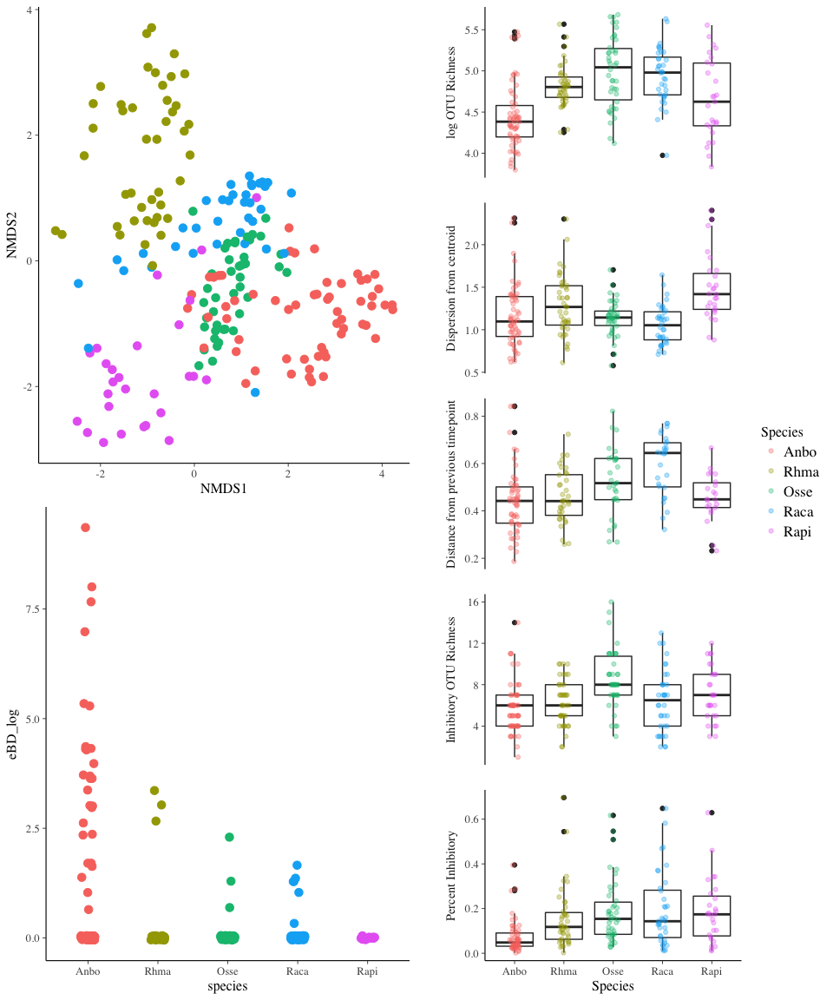
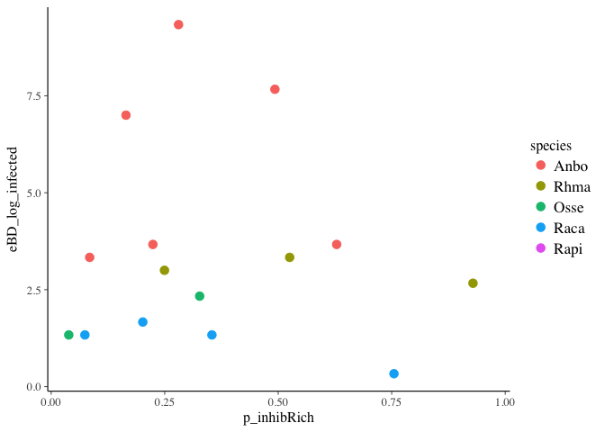
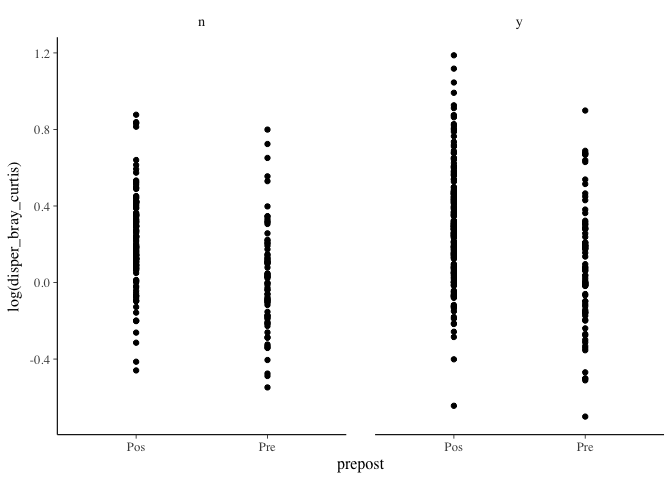
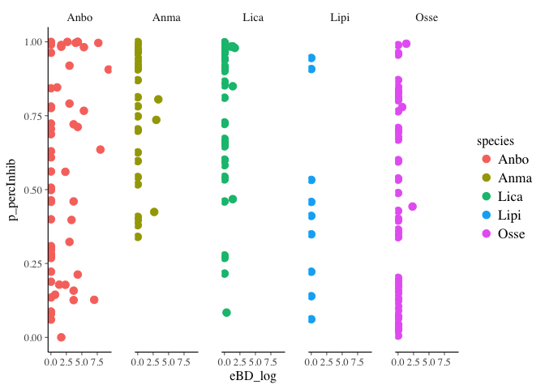
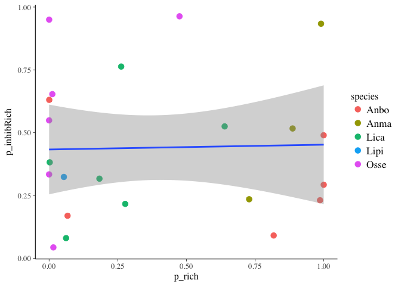

Statistical Analysis for 5Sp Dataset
================
Melissa Chen
Wed Jun 5 18:09:38 2019

``` r
# Load packages
library(tidyverse)
```

    ## ── Attaching packages ────────────────────────────────── tidyverse 1.2.1 ──

    ## ✔ ggplot2 2.2.1     ✔ purrr   0.2.4
    ## ✔ tibble  1.4.2     ✔ dplyr   0.7.5
    ## ✔ tidyr   0.8.1     ✔ stringr 1.3.1
    ## ✔ readr   1.1.1     ✔ forcats 0.3.0

    ## ── Conflicts ───────────────────────────────────── tidyverse_conflicts() ──
    ## ✖ dplyr::filter() masks stats::filter()
    ## ✖ dplyr::lag()    masks stats::lag()

``` r
library(rstanarm)
```

    ## Loading required package: Rcpp

    ## rstanarm (Version 2.17.4, packaged: 2018-04-13 01:51:52 UTC)

    ## - Do not expect the default priors to remain the same in future rstanarm versions.

    ## Thus, R scripts should specify priors explicitly, even if they are just the defaults.

    ## - For execution on a local, multicore CPU with excess RAM we recommend calling

    ## options(mc.cores = parallel::detectCores())

    ## - Plotting theme set to bayesplot::theme_default().

``` r
library(car) #Anova
```

    ## Loading required package: carData

    ## 
    ## Attaching package: 'car'

    ## The following object is masked from 'package:dplyr':
    ## 
    ##     recode

    ## The following object is masked from 'package:purrr':
    ## 
    ##     some

``` r
library(vegan) # for permanova
```

    ## Loading required package: permute

    ## Loading required package: lattice

    ## This is vegan 2.4-5

``` r
library(gridExtra)
```

    ## 
    ## Attaching package: 'gridExtra'

    ## The following object is masked from 'package:dplyr':
    ## 
    ##     combine

``` r
# Mapping files
load("mf_con_without_init_infect.RData")
load("mf_treat_without_init_infect.RData")
load("mf.rare.RData")
# OTU table of inhibitory bacteria
load("otu.inhibOnly.treat.RData")
load("otu.inhibOnly.con.RData")
# Distance matrices
load("dm.filt.con.RData")
load("dm.filt.treat.RData")

# Previous analyses summaries
load("all_p.RData")
load("all_p_infected.RData")

# add a species column and PABD column
all_p <- all_p %>%
    mutate(PABD=ifelse(infect>0,1,0), infect = log(infect+1)) %>%
    rename(eBD_log=infect) %>%
    separate(toadID, into=c("species","indiv"), remove=FALSE)
all_p_infected <- all_p_infected %>%
    mutate(PABD=ifelse(eBD_log>0,1,0)) %>%
    separate(toadID, into=c("species","indiv"), remove=FALSE)

# ### TESTING: Remove values for intensity
# all_p <- all_p %>%
#     mutate(eBD_log = ifelse(eBD_log>0,eBD_log,NA))
# all_p_infected <- all_p_infected %>%
#     mutate(eBD_log = ifelse(eBD_log>0,eBD_log,NA))

#### CURSORY GLANCE AT DATA ####
gg_NMDS <- mf_con_without_init_infect %>%
    ggplot(aes(x=NMDS1, y=NMDS2)) +
    geom_point(aes(col=species), cex=3, show.legend = FALSE)
gg_infect <- mf_treat_without_init_infect  %>%
    ggplot(aes(x=species, y=eBD_log)) +
    geom_point(aes(col=species), cex=3, position = position_jitter(width=0.1, height=0.05), show.legend = FALSE)

temp1 <- mf_con_without_init_infect %>%
    dplyr::select(species, logRich) %>%
    mutate(metric="logRich") %>%
    rename(value=logRich)
temp2 <- mf_con_without_init_infect %>%
    dplyr::select(species, inhibRich) %>%
    mutate(metric="inhibRich")%>%
    rename(value=inhibRich)
temp3 <- mf_con_without_init_infect %>%
    dplyr::select(species, percInhib) %>%
    mutate(metric="percInhib")%>%
    rename(value=percInhib)
temp4 <- mf_con_without_init_infect %>%
    dplyr::select(species, distance_bray_curtis) %>%
    mutate(metric="distance_bray_curtis")%>%
    rename(value=distance_bray_curtis)

gg_all <- rbind(temp1,temp2,temp3,temp4) %>%
    ggplot(aes(x=species, y=value)) +
    geom_boxplot() +
    geom_point(aes(col=species), position = position_jitter(width=0.1, height=0))+
    facet_grid(metric~., scales = "free") 
lay <- rbind(c(1,2),
             c(3,2))
```

``` r
grid.arrange(gg_NMDS, gg_all, gg_infect, layout_matrix = lay)
```

    ## Warning: Removed 38 rows containing non-finite values (stat_boxplot).

    ## Warning: Removed 38 rows containing missing values (geom_point).



``` r
#### Stats ####
does_comp_differ_btwn_sp_and_across_time_con <- adonis2(dist(dm.filt.con) ~ species*time, data=mf_con_without_init_infect)
does_comp_differ_btwn_sp_and_across_time_con
```

    ## Permutation test for adonis under reduced model
    ## Terms added sequentially (first to last)
    ## Permutation: free
    ## Number of permutations: 999
    ## 
    ## adonis2(formula = dist(dm.filt.con) ~ species * time, data = mf_con_without_init_infect)
    ##               Df SumOfSqs      F Pr(>F)    
    ## species        4   424.12 78.785  0.001 ***
    ## time           1    39.03 29.000  0.001 ***
    ## species:time   4    41.22  7.657  0.001 ***
    ## Residual     197   265.12                  
    ## ---
    ## Signif. codes:  0 '***' 0.001 '**' 0.01 '*' 0.05 '.' 0.1 ' ' 1

``` r
beta_con_main_p <- does_comp_differ_btwn_sp_and_across_time_con$`Pr(>F)`[1:2]
beta_con_interaction_p <- does_comp_differ_btwn_sp_and_across_time_con$`Pr(>F)`[3]
beta_con_main_f <- does_comp_differ_btwn_sp_and_across_time_con$`F`[1:2]
beta_con_interaction_f <- does_comp_differ_btwn_sp_and_across_time_con$`F`[3]


mf_treat_without_init_infect_post <- mf_treat_without_init_infect %>%
    filter(prepost == "Pos")
does_comp_differ_btwn_sp_and_across_time_and_infect_treat <- adonis2(dist(dm.filt.treat) ~ species*time*PABD, data=mf_treat_without_init_infect_post)
does_comp_differ_btwn_sp_and_across_time_and_infect_treat
```

    ## Permutation test for adonis under reduced model
    ## Terms added sequentially (first to last)
    ## Permutation: free
    ## Number of permutations: 999
    ## 
    ## adonis2(formula = dist(dm.filt.treat) ~ species * time * PABD, data = mf_treat_without_init_infect_post)
    ##                    Df SumOfSqs       F Pr(>F)    
    ## species             4   344.67 43.6313  0.001 ***
    ## time                1    24.55 12.4311  0.001 ***
    ## PABD                1     5.91  2.9942  0.010 ** 
    ## species:time        4    28.21  3.5707  0.001 ***
    ## species:PABD        3     6.42  1.0835  0.328    
    ## time:PABD           1     9.80  4.9597  0.001 ***
    ## species:time:PABD   2     5.67  1.4353  0.121    
    ## Residual          180   355.48                   
    ## ---
    ## Signif. codes:  0 '***' 0.001 '**' 0.01 '*' 0.05 '.' 0.1 ' ' 1

``` r
beta_treat_main_p <- does_comp_differ_btwn_sp_and_across_time_and_infect_treat$`Pr(>F)`[1:2]
beta_treat_interaction_p <- does_comp_differ_btwn_sp_and_across_time_and_infect_treat$`Pr(>F)`[4]
beta_treat_main_f <- does_comp_differ_btwn_sp_and_across_time_and_infect_treat$`F`[1:2]
beta_treat_interaction_f <- does_comp_differ_btwn_sp_and_across_time_and_infect_treat$`F`[4]
```

There is a significant effect of species, time, and PABD; all of these things also significantly interact EXCEPT species and PABD and all 3 together, which suggests species microbiomes change in the "same way" when infected

``` r
#### Preliminary stats on broad patterns ####

### RICHNESS AND TIME ###
```

Does richness change over time in control individuals?

``` r
# Type I ANOVA to test for interaction-- (AB | A, B)
rich_con_interaction_lm <- lm(logRich ~ species*time, data=mf_con_without_init_infect)
rich_con_interaction <- anova(rich_con_interaction_lm)
rich_con_interaction
```

    ## Analysis of Variance Table
    ## 
    ## Response: logRich
    ##               Df  Sum Sq Mean Sq F value    Pr(>F)    
    ## species        4  9.8448 2.46120 17.3532 3.263e-12 ***
    ## time           1  0.1974 0.19738  1.3916    0.2396    
    ## species:time   4  0.8054 0.20135  1.4197    0.2288    
    ## Residuals    197 27.9404 0.14183                      
    ## ---
    ## Signif. codes:  0 '***' 0.001 '**' 0.01 '*' 0.05 '.' 0.1 ' ' 1

``` r
# Use Type II ANOVA (no interaction present)
rich_con_main_lm <- lm(logRich ~ species + time, data=mf_con_without_init_infect)
rich_con_main <- Anova(rich_con_main_lm, type = 2)
rich_con_main
```

    ## Anova Table (Type II tests)
    ## 
    ## Response: logRich
    ##            Sum Sq  Df F value    Pr(>F)    
    ## species    9.9684   4 17.4255 2.724e-12 ***
    ## time       0.1974   1  1.3801    0.2415    
    ## Residuals 28.7458 201                      
    ## ---
    ## Signif. codes:  0 '***' 0.001 '**' 0.01 '*' 0.05 '.' 0.1 ' ' 1

``` r
# There is a significant effect of species but not time or interaction
```

Does richness change over time in treatment individuals?

``` r
# Type I ANOVA to test for interaction (AB | A,B)
rich_treat_interaction_lm <- lm(logRich ~ species*time, data=mf_treat_without_init_infect)
rich_treat_interaction <- anova(rich_treat_interaction_lm)
rich_treat_interaction
```

    ## Analysis of Variance Table
    ## 
    ## Response: logRich
    ##               Df Sum Sq Mean Sq F value    Pr(>F)    
    ## species        4 11.768 2.94196 18.1367  3.14e-13 ***
    ## time           1  0.000 0.00048  0.0029 0.9567623    
    ## species:time   4  3.364 0.84109  5.1852 0.0004847 ***
    ## Residuals    274 44.446 0.16221                      
    ## ---
    ## Signif. codes:  0 '***' 0.001 '**' 0.01 '*' 0.05 '.' 0.1 ' ' 1

``` r
# Type III ANOVA (valid in presence of interaction)
rich_treat_main_lm <- lm(logRich ~ species * time, data=mf_treat_without_init_infect, contrasts=list(species=contr.sum))
rich_treat_main <- Anova(rich_treat_main_lm, type=3)
rich_treat_main
```

    ## Anova Table (Type III tests)
    ## 
    ## Response: logRich
    ##              Sum Sq  Df   F value    Pr(>F)    
    ## (Intercept)  916.28   1 5648.7368 < 2.2e-16 ***
    ## species        2.44   4    3.7548 0.0054249 ** 
    ## time           0.02   1    0.1238 0.7252123    
    ## species:time   3.36   4    5.1852 0.0004847 ***
    ## Residuals     44.45 274                        
    ## ---
    ## Signif. codes:  0 '***' 0.001 '**' 0.01 '*' 0.05 '.' 0.1 ' ' 1

``` r
### DISTANCE TO CENTROID AND TIME ####
```

Is there an effect of species and time on controls?

``` r
# Type I ANOVA (to check for interaction) (AB | A,B)
centroid_con_interaction_lm <- lm(log(distance.to.centroid) ~ species*time, data=mf_con_without_init_infect)
centroid_con_interaction <- anova(centroid_con_interaction_lm)
centroid_con_interaction
```

    ## Analysis of Variance Table
    ## 
    ## Response: log(distance.to.centroid)
    ##               Df  Sum Sq Mean Sq F value    Pr(>F)    
    ## species        4  2.1129 0.52822  9.6625 3.724e-07 ***
    ## time           1  1.8197 1.81969 33.2866 3.045e-08 ***
    ## species:time   4  0.4254 0.10635  1.9455    0.1044    
    ## Residuals    197 10.7695 0.05467                      
    ## ---
    ## Signif. codes:  0 '***' 0.001 '**' 0.01 '*' 0.05 '.' 0.1 ' ' 1

``` r
# Type II ANOVA with no interaction
centroid_con_main_lm <- lm(log(distance.to.centroid) ~ species + time, data=mf_con_without_init_infect)
centroid_con_main <- Anova(centroid_con_main_lm, type = 2)
centroid_con_main
```

    ## Anova Table (Type II tests)
    ## 
    ## Response: log(distance.to.centroid)
    ##            Sum Sq  Df F value    Pr(>F)    
    ## species    1.8582   4  8.3407 3.036e-06 ***
    ## time       1.8197   1 32.6719 3.899e-08 ***
    ## Residuals 11.1949 201                      
    ## ---
    ## Signif. codes:  0 '***' 0.001 '**' 0.01 '*' 0.05 '.' 0.1 ' ' 1

Is there an effect of species and time on treatment??

``` r
# Type I ANOVA (to check for interaction) (AB | A,B)
centroid_treat_interaction_lm <- lm(distance_bray_curtis ~ species*time, data=mf_treat_without_init_infect)
centroid_treat_interaction <- anova(centroid_treat_interaction_lm)
centroid_treat_interaction
```

    ## Analysis of Variance Table
    ## 
    ## Response: distance_bray_curtis
    ##               Df Sum Sq  Mean Sq F value   Pr(>F)    
    ## species        4 0.6596 0.164896  6.9084 2.99e-05 ***
    ## time           1 0.0775 0.077468  3.2455  0.07301 .  
    ## species:time   4 0.0392 0.009805  0.4108  0.80078    
    ## Residuals    216 5.1557 0.023869                     
    ## ---
    ## Signif. codes:  0 '***' 0.001 '**' 0.01 '*' 0.05 '.' 0.1 ' ' 1

``` r
# Type II ANOVA with no interaction
centroid_treat_main_lm <- lm(distance_bray_curtis ~ species + time, data=mf_treat_without_init_infect)
centroid_treat_main <- Anova(centroid_treat_main_lm, type = 2)
centroid_treat_main
```

    ## Anova Table (Type II tests)
    ## 
    ## Response: distance_bray_curtis
    ##           Sum Sq  Df F value    Pr(>F)    
    ## species   0.6256   4  6.6233 4.742e-05 ***
    ## time      0.0775   1  3.2807   0.07146 .  
    ## Residuals 5.1949 220                      
    ## ---
    ## Signif. codes:  0 '***' 0.001 '**' 0.01 '*' 0.05 '.' 0.1 ' ' 1

``` r
### DISPERSAL AND TIME ###
```

Is there an effect of species and time on controls?

``` r
# Type I ANOVA (to check for interaction) (AB | A,B)
disp_con_interaction_lm <- lm(distance_bray_curtis ~ species*time, data=mf_con_without_init_infect)
disp_con_interaction <- anova(disp_con_interaction_lm)
disp_con_interaction
```

    ## Analysis of Variance Table
    ## 
    ## Response: distance_bray_curtis
    ##               Df  Sum Sq  Mean Sq F value    Pr(>F)    
    ## species        4 0.50309 0.125772  7.6486 1.161e-05 ***
    ## time           1 0.00416 0.004155  0.2527    0.6159    
    ## species:time   4 0.05099 0.012746  0.7752    0.5429    
    ## Residuals    159 2.61456 0.016444                      
    ## ---
    ## Signif. codes:  0 '***' 0.001 '**' 0.01 '*' 0.05 '.' 0.1 ' ' 1

``` r
# Type II ANOVA with no interaction
disp_con_main_lm <- lm(distance_bray_curtis ~ species + time, data=mf_con_without_init_infect)
disp_con_main <- Anova(disp_con_main_lm, type = 2)
disp_con_main
```

    ## Anova Table (Type II tests)
    ## 
    ## Response: distance_bray_curtis
    ##            Sum Sq  Df F value    Pr(>F)    
    ## species   0.47511   4  7.2633 2.086e-05 ***
    ## time      0.00416   1  0.2541    0.6149    
    ## Residuals 2.66554 163                      
    ## ---
    ## Signif. codes:  0 '***' 0.001 '**' 0.01 '*' 0.05 '.' 0.1 ' ' 1

Is there an effect of species and time on treatment??

``` r
# Type I ANOVA (to check for interaction) (AB | A,B)
disp_treat_interaction_lm <- lm(distance_bray_curtis ~ species*time, data=mf_treat_without_init_infect)
disp_treat_interaction <- anova(disp_treat_interaction_lm)
disp_treat_interaction
```

    ## Analysis of Variance Table
    ## 
    ## Response: distance_bray_curtis
    ##               Df Sum Sq  Mean Sq F value   Pr(>F)    
    ## species        4 0.6596 0.164896  6.9084 2.99e-05 ***
    ## time           1 0.0775 0.077468  3.2455  0.07301 .  
    ## species:time   4 0.0392 0.009805  0.4108  0.80078    
    ## Residuals    216 5.1557 0.023869                     
    ## ---
    ## Signif. codes:  0 '***' 0.001 '**' 0.01 '*' 0.05 '.' 0.1 ' ' 1

``` r
# Type II ANOVA with no interaction
disp_treat_main_lm <- lm(distance_bray_curtis ~ species + time, data=mf_treat_without_init_infect)
disp_treat_main <- Anova(disp_treat_main_lm, type = 2)
disp_treat_main
```

    ## Anova Table (Type II tests)
    ## 
    ## Response: distance_bray_curtis
    ##           Sum Sq  Df F value    Pr(>F)    
    ## species   0.6256   4  6.6233 4.742e-05 ***
    ## time      0.0775   1  3.2807   0.07146 .  
    ## Residuals 5.1949 220                      
    ## ---
    ## Signif. codes:  0 '***' 0.001 '**' 0.01 '*' 0.05 '.' 0.1 ' ' 1

``` r
### PERCENT INHIB ###
```

Does percent inhibitory change with species or time?

``` r
# Type I ANOVA (to test for interaction) in control group?
pinhib_con_interaction_glm <- glm(percInhib ~ species*time, family = binomial(), data=mf_con_without_init_infect, weights=mf_con_without_init_infect$n)
pinhib_con_interaction <- anova(pinhib_con_interaction_glm, test = "Chisq")
pinhib_con_interaction
```

    ## Analysis of Deviance Table
    ## 
    ## Model: binomial, link: logit
    ## 
    ## Response: percInhib
    ## 
    ## Terms added sequentially (first to last)
    ## 
    ## 
    ##              Df Deviance Resid. Df Resid. Dev  Pr(>Chi)    
    ## NULL                           206     505798              
    ## species       4    73171       202     432627 < 2.2e-16 ***
    ## time          1     4778       201     427849 < 2.2e-16 ***
    ## species:time  4    80748       197     347101 < 2.2e-16 ***
    ## ---
    ## Signif. codes:  0 '***' 0.001 '**' 0.01 '*' 0.05 '.' 0.1 ' ' 1

``` r
# Type III ANOVA (to test for main effects, given interaction) in control group?
pinhib_con_main_glm <- glm(percInhib ~ species*time, family = binomial(), data=mf_con_without_init_infect, weights=mf_con_without_init_infect$n, contrasts=list(species=contr.sum))
pinhib_con_main <- Anova(pinhib_con_main_glm, type=3)
pinhib_con_main
```

    ## Analysis of Deviance Table (Type III tests)
    ## 
    ## Response: percInhib
    ##              LR Chisq Df Pr(>Chisq)    
    ## species         81206  4     <2e-16 ***
    ## time                0  1     0.7259    
    ## species:time    80748  4     <2e-16 ***
    ## ---
    ## Signif. codes:  0 '***' 0.001 '**' 0.01 '*' 0.05 '.' 0.1 ' ' 1

``` r
# Does percent inhibitory change with species or time in treatment group?
# Type I ANOVA (to test for interaction) in control group?
pinhib_treat_interaction_glm <- glm(percInhib ~ species*time, family = binomial(), data=mf_treat_without_init_infect, weights=mf_treat_without_init_infect$n)
pinhib_treat_interaction <- anova(pinhib_treat_interaction_glm, test = "Chisq")
pinhib_treat_interaction
```

    ## Analysis of Deviance Table
    ## 
    ## Model: binomial, link: logit
    ## 
    ## Response: percInhib
    ## 
    ## Terms added sequentially (first to last)
    ## 
    ## 
    ##              Df Deviance Resid. Df Resid. Dev  Pr(>Chi)    
    ## NULL                           283    1273299              
    ## species       4   163434       279    1109865 < 2.2e-16 ***
    ## time          1   107035       278    1002830 < 2.2e-16 ***
    ## species:time  4    50701       274     952129 < 2.2e-16 ***
    ## ---
    ## Signif. codes:  0 '***' 0.001 '**' 0.01 '*' 0.05 '.' 0.1 ' ' 1

``` r
# Type III ANOVA (to test for main effects, given interaction) in control group?
pinhib_treat_main_glm <- glm(percInhib ~ species*time, family = binomial(), data=mf_treat_without_init_infect, weights=mf_treat_without_init_infect$n, contrasts = list(species=contr.sum))
pinhib_treat_main <- Anova(pinhib_treat_main_glm, type=3)
pinhib_treat_main
```

    ## Analysis of Deviance Table (Type III tests)
    ## 
    ## Response: percInhib
    ##              LR Chisq Df Pr(>Chisq)    
    ## species         42348  4  < 2.2e-16 ***
    ## time            57575  1  < 2.2e-16 ***
    ## species:time    50701  4  < 2.2e-16 ***
    ## ---
    ## Signif. codes:  0 '***' 0.001 '**' 0.01 '*' 0.05 '.' 0.1 ' ' 1

``` r
### INHIB RICH ###
# Does proportion of inhibitory bacteria differ betwen species and time points?
# Type I ANOVA to test for interactions in control
inhibRich_con_interaction_glm <- glm(inhibRich ~ species*time, data=mf_con_without_init_infect, family=poisson())
inhibRich_con_interaction <- anova(inhibRich_con_interaction_glm, test="Chisq")
inhibRich_con_interaction
```

    ## Analysis of Deviance Table
    ## 
    ## Model: poisson, link: log
    ## 
    ## Response: inhibRich
    ## 
    ## Terms added sequentially (first to last)
    ## 
    ## 
    ##              Df Deviance Resid. Df Resid. Dev  Pr(>Chi)    
    ## NULL                           206     232.35              
    ## species       4  29.2924       202     203.06 6.818e-06 ***
    ## time          1   0.6686       201     202.39    0.4135    
    ## species:time  4  31.3583       197     171.03 2.587e-06 ***
    ## ---
    ## Signif. codes:  0 '***' 0.001 '**' 0.01 '*' 0.05 '.' 0.1 ' ' 1

``` r
# TYpe III ANOVA to test for main effects with interactions in control
inhibRich_con_main_glm <- glm(inhibRich ~ species*time, data=mf_con_without_init_infect, family=poisson(), contrasts=list(species=contr.sum))
inhibRich_con_main <- Anova(inhibRich_con_main_glm,type=3)
inhibRich_con_main
```

    ## Analysis of Deviance Table (Type III tests)
    ## 
    ## Response: inhibRich
    ##              LR Chisq Df Pr(>Chisq)    
    ## species        42.494  4  1.318e-08 ***
    ## time            0.726  1     0.3942    
    ## species:time   31.358  4  2.587e-06 ***
    ## ---
    ## Signif. codes:  0 '***' 0.001 '**' 0.01 '*' 0.05 '.' 0.1 ' ' 1

``` r
# Type I ANOVA to test for interactions
inhibRich_treat_interaction_glm <- glm(inhibRich ~ species*time, data=mf_treat_without_init_infect, family=poisson())
inhibRich_treat_interaction <- anova(inhibRich_treat_interaction_glm, test="Chisq")
inhibRich_treat_interaction
```

    ## Analysis of Deviance Table
    ## 
    ## Model: poisson, link: log
    ## 
    ## Response: inhibRich
    ## 
    ## Terms added sequentially (first to last)
    ## 
    ## 
    ##              Df Deviance Resid. Df Resid. Dev  Pr(>Chi)    
    ## NULL                           283     361.86              
    ## species       4  130.642       279     231.22 < 2.2e-16 ***
    ## time          1    0.033       278     231.19  0.856329    
    ## species:time  4   18.271       274     212.92  0.001092 ** 
    ## ---
    ## Signif. codes:  0 '***' 0.001 '**' 0.01 '*' 0.05 '.' 0.1 ' ' 1

``` r
# TYpe III ANOVA to test for main effects with interactions
inhibRich_treat_main_glm <- glm(inhibRich ~ species*time, data=mf_treat_without_init_infect, family=poisson(), contrasts = list(species=contr.sum))
inhibRich_treat_main <- Anova(inhibRich_treat_main_glm,type=3)
inhibRich_treat_main
```

    ## Analysis of Deviance Table (Type III tests)
    ## 
    ## Response: inhibRich
    ##              LR Chisq Df Pr(>Chisq)    
    ## species       23.8941  4  8.387e-05 ***
    ## time           0.7994  1   0.371281    
    ## species:time  18.2715  4   0.001092 ** 
    ## ---
    ## Signif. codes:  0 '***' 0.001 '**' 0.01 '*' 0.05 '.' 0.1 ' ' 1

``` r
#### Summarize overall trends into table ####

rich_con_main_p <- rich_con_main$`Pr(>F)`[1:2]
# rich_con_time_p <- rich_con_main$`Pr(>F)`[2]
rich_con_interaction_p <- rich_con_interaction$`Pr(>F)`[3]
rich_treat_main_p <- rich_treat_main$`Pr(>F)`[1:2]
# rich_treat_time_p <- rich_treat_main$`Pr(>F)`[2]
rich_treat_interaction_p <- rich_treat_interaction$`Pr(>F)`[3]
rich_con_main_f <- rich_con_main$`F value`[1:2]
# rich_con_time_f <- rich_con_main$`F value`[2]
rich_con_interaction_f <- rich_con_interaction$`Pr(>F)`[3]
rich_treat_main_f <- rich_treat_main$`F value`[1:2]
# rich_treat_time_f <- rich_treat_main$`F value`[2]
rich_treat_interaction_f <- rich_treat_interaction$`F value`[3]
rich_con_time_eff <- rich_con_main_lm$coefficients["time"]
rich_treat_time_eff <- rich_treat_main_lm$coefficients["time"]


centroid_con_main_p <- centroid_con_main$`Pr(>F)`[1:2]
# centroid_con_time_p <- centroid_con_main$`Pr(>F)`[2]
centroid_con_interaction_p <- centroid_con_interaction$`Pr(>F)`[3]
centroid_treat_main_p <- centroid_treat_main$`Pr(>F)`[1:2]
# centroid_treat_time_p <- centroid_treat_main$`Pr(>F)`[2]
centroid_treat_interaction_p <- centroid_treat_interaction$`Pr(>F)`[3]
centroid_con_main_f <- centroid_con_main$`F value`[1:2]
# centroid_con_time_f <- centroid_con_main$`F value`[2]
centroid_con_interaction_f <- centroid_con_interaction$`Pr(>F)`[3]
centroid_treat_main_f <- centroid_treat_main$`F value`[1:2]
# centroid_treat_time_f <- centroid_treat_main$`F value`[2]
centroid_treat_interaction_f <- centroid_treat_interaction$`F value`[3]
centroid_con_time_eff <- centroid_con_main_lm$coefficients["time"]
centroid_treat_time_eff <- centroid_treat_main_lm$coefficients["time"]

disp_con_main_p <- disp_con_main$`Pr(>F)`[1:2]
# disp_con_time_p <- disp_con_main$`Pr(>F)`[2]
disp_con_interaction_p <- disp_con_interaction$`Pr(>F)`[3]
disp_treat_main_p <- disp_treat_main$`Pr(>F)`[1:2]
# disp_treat_time_p <- disp_treat_main$`Pr(>F)`[2]
disp_treat_interaction_p <- disp_treat_interaction$`Pr(>F)`[3]
disp_con_main_f <- disp_con_main$`F value`[1:2]
# disp_con_time_f <- disp_con_main$`F value`[2]
disp_con_interaction_f <- disp_con_interaction$`Pr(>F)`[3]
disp_treat_main_f <- disp_treat_main$`F value`[1:2]
# disp_treat_time_f <- disp_treat_main$`F value`[2]
disp_treat_interaction_f <- disp_treat_interaction$`F value`[3]
disp_con_time_eff <- disp_con_main_lm$coefficients["time"]
disp_treat_time_eff <- disp_treat_main_lm$coefficients["time"]

pinhib_con_main_p <- pinhib_con_main$`Pr(>Chisq)`[1:2]
# pinhib_con_time_p <- pinhib_con_main$`Pr(>F)`[2]
pinhib_con_interaction_p <- pinhib_con_interaction$`Pr(>Chi)`[4]
pinhib_treat_main_p <- pinhib_treat_main$`Pr(>Chisq)`[1:2]
# pinhib_treat_time_p <- pinhib_treat_main$`Pr(>F)`[2]
pinhib_treat_interaction_p <- pinhib_treat_interaction$`Pr(>Chi)`[4]
pinhib_con_main_f <- pinhib_con_main$`LR Chisq`[1:2]
# pinhib_con_time_f <- pinhib_con_main$`LR Chisq`[2]
pinhib_con_interaction_f <- pinhib_con_interaction$Deviance[4]
pinhib_treat_main_f <- pinhib_treat_main$`LR Chisq`[1:2]
# pinhib_treat_time_f <- pinhib_treat_main$`LR Chisq`[2]
pinhib_treat_interaction_f <- pinhib_treat_interaction$Deviance[4]
pinhib_con_time_eff <- pinhib_con_main_glm$coefficients["time"]
pinhib_treat_time_eff <- pinhib_treat_main_glm$coefficients["time"]


inhibRich_con_main_p <- inhibRich_con_main$`Pr(>Chisq)`[1:2]
# inhibRich_con_time_p <- inhibRich_con_main$`Pr(>F)`[2]
inhibRich_con_interaction_p <- inhibRich_con_interaction$`Pr(>Chi)`[4]
inhibRich_treat_main_p <- inhibRich_treat_main$`Pr(>Chisq)`[1:2]
# inhibRich_treat_time_p <- inhibRich_treat_main$`Pr(>F)`[2]
inhibRich_treat_interaction_p <- inhibRich_treat_interaction$`Pr(>Chi)`[4]
inhibRich_con_main_f <- inhibRich_con_main$`LR Chisq`[1:2]
# inhibRich_con_time_f <- inhibRich_con_main$`LR Chisq`[2]
inhibRich_con_interaction_f <- inhibRich_con_interaction$Deviance[4]
inhibRich_treat_main_f <- inhibRich_treat_main$`LR Chisq`[1:2]
# inhibRich_treat_time_f <- inhibRich_treat_main$`LR Chisq`[2]
inhibRich_treat_interaction_f <- inhibRich_treat_interaction$Deviance[4]
inhibRich_con_time_eff <- inhibRich_con_main_glm$coefficients["time"]
inhibRich_treat_time_eff <- inhibRich_treat_main_glm$coefficients["time"]

stat_results <- as.data.frame(matrix(ncol=5, nrow=12, dimnames = list(NULL,c("Microbiome metric","Control or Treatment","Main effect: species","Main effect: time", "Interaction: species x time"))), check.names=FALSE)
stat_results$`Microbiome metric` <- c("Beta Diversity"
                                      , "Beta Diversity"
                                      , "OTU Richness"
                                      , "OTU RIchness"
                                      , "Distance to centroid"
                                      , "Distance to centroid"
                                      , "Stability (BC distance)"
                                      , "Stability (BC distance)"
                                      , "Percent Inhibitory"
                                      , "Percent Inhibitory"
                                      ,"Inhibitory Richness"
                                      ,"Inhibitory Richness"
                                      )
stat_results$`Control or Treatment` <- rep(c("Control","Treatent"), 6)
current_row <- 1
for ( test in c("beta","rich","centroid","disp","pinhib","inhibRich") ) {
    if (test %in% c("beta","rich","centroid","disp")) {
        stat_main<- ", F="
        stat_interaction <- ", F="
    } else {
        stat_main<- ", Chisq="
        stat_interaction <- ", Chi="
    }
    for ( ct in c("con","treat")) {
            stat_results[current_row, 3:5] <- c(paste0("p=", signif(get(paste(test, ct, "main_p", sep="_"))[1],3), stat_main, signif(get(paste(test, ct, "main_f", sep="_"))[1],3))
              , paste0("p=", signif(get(paste(test, ct, "main_p", sep="_"))[2],3), stat_main, signif(get(paste(test, ct, "main_f", sep="_"))[2],3))
              , paste0("p=", signif(get(paste(test, ct, "interaction_p", sep="_")),3), stat_interaction, signif(get(paste(test, ct, "interaction_f", sep="_"))[1],3))
            )
        
        current_row <- current_row+1
    }
}

stat_results
```

    ##          Microbiome metric Control or Treatment   Main effect: species
    ## 1           Beta Diversity              Control        p=0.001, F=78.8
    ## 2           Beta Diversity             Treatent        p=0.001, F=43.6
    ## 3             OTU Richness              Control     p=2.72e-12, F=17.4
    ## 4             OTU RIchness             Treatent    p=6.75e-185, F=5650
    ## 5     Distance to centroid              Control     p=3.04e-06, F=8.34
    ## 6     Distance to centroid             Treatent     p=4.74e-05, F=6.62
    ## 7  Stability (BC distance)              Control     p=2.09e-05, F=7.26
    ## 8  Stability (BC distance)             Treatent     p=4.74e-05, F=6.62
    ## 9       Percent Inhibitory              Control       p=0, Chisq=81200
    ## 10      Percent Inhibitory             Treatent       p=0, Chisq=42300
    ## 11     Inhibitory Richness              Control p=1.32e-08, Chisq=42.5
    ## 12     Inhibitory Richness             Treatent p=8.39e-05, Chisq=23.9
    ##       Main effect: time Interaction: species x time
    ## 1         p=0.001, F=29             p=0.001, F=7.66
    ## 2       p=0.001, F=12.4             p=0.001, F=3.57
    ## 3       p=0.241, F=1.38            p=0.229, F=0.229
    ## 4     p=0.00542, F=3.75          p=0.000485, F=5.19
    ## 5     p=3.9e-08, F=32.7            p=0.104, F=0.104
    ## 6      p=0.0715, F=3.28            p=0.801, F=0.411
    ## 7      p=0.615, F=0.254            p=0.543, F=0.543
    ## 8      p=0.0715, F=3.28            p=0.801, F=0.411
    ## 9  p=0.726, Chisq=0.123              p=0, Chi=80700
    ## 10     p=0, Chisq=57600              p=0, Chi=50700
    ## 11 p=0.394, Chisq=0.726        p=2.59e-06, Chi=31.4
    ## 12 p=0.371, Chisq=0.799         p=0.00109, Chi=18.3

``` r
#### PART I ####
```

Part I: Microbiome state and effect on infection risk and intensity
(1a) Does overall diversity of microbiome influence BD infection rate?
The first thing we would like to know is whether microbiome richness of an individual influences its risk of becoming infected by BD. The most simple way to look at this would be to plot diversity VS presence/absence of BD and OTU richness VS presence/absence of BD Below, we fitted normal and lognormal distributions, respectively, to diversity (shannon) and otu richness to individuals prior to BD infection. Now, we fit a binomial general linearized model to see if there is a relationship between diversity and infection rate.

``` r
# glm_PABD_shan <- glm(PABD ~ species*exp_shan, data=all_p, family=binomial(link="logit"))
# Anova(glm_PABD_shan)
# all_p %>%
#     ggplot(aes(x=exp_shan, y=PABD)) +
#     geom_point(aes(col=species), cex=3)  
```

Now for observed OTUs

``` r
# glm_PABD_rich <- glm(PABD ~ species*exp_rich, data=all_p, family=binomial(link="logit"))
# anova(glm_PABD_rich, test="Chisq") # Check for interaction
# Anova(glm_PABD_rich, type=2) # Check for main effects
# all_p %>%
#     ggplot(aes(x=exp_rich, y=PABD)) +
#     geom_point(aes(col=species), cex=3)
```

Clearly, we see that neither diversity nor richness seems to signficiatly affect infection risk.
However, let's try normalizing it by species; using each species to determine whether it is "out of the ordinary"

``` r
# 
# glm_PABD_pshan <- glm(PABD ~ species*p_shan, data=all_p, family=binomial(link="logit"))
# Anova(glm_PABD_pshan)
# all_p %>%
#     ggplot(aes(x=p_shan, y=PABD)) +
#     geom_point(aes(col=species), cex=3) 
```

Now for observed OTUs

``` r
glm_PABD_prich <- glm(PABD ~ species*p_rich, data=all_p, family=binomial(link="logit"))
anova(glm_PABD_prich, test="Chisq") # test for interaction
```

    ## Analysis of Deviance Table
    ## 
    ## Model: binomial, link: logit
    ## 
    ## Response: PABD
    ## 
    ## Terms added sequentially (first to last)
    ## 
    ## 
    ##                Df Deviance Resid. Df Resid. Dev Pr(>Chi)  
    ## NULL                              21     27.522           
    ## species         4  12.2453        17     15.276  0.01562 *
    ## p_rich          1   3.1137        16     12.163  0.07764 .
    ## species:p_rich  3   0.0014        13     12.161  0.99999  
    ## ---
    ## Signif. codes:  0 '***' 0.001 '**' 0.01 '*' 0.05 '.' 0.1 ' ' 1

``` r
Anova(glm_PABD_prich, type=2) # test for main effects
```

    ## Analysis of Deviance Table (Type II tests)
    ## 
    ## Response: PABD
    ##                LR Chisq Df Pr(>Chisq)  
    ## species         12.8268  4    0.01215 *
    ## p_rich           3.1137  1    0.07764 .
    ## species:p_rich   0.0014  3    0.99999  
    ## ---
    ## Signif. codes:  0 '***' 0.001 '**' 0.01 '*' 0.05 '.' 0.1 ' ' 1

``` r
all_p %>%
    ggplot(aes(x=p_rich, y=PABD)) +
    geom_point(aes(col=species), cex=3)  
```


If anything, it looks like increased diversity and richness might increase infection risk

``` r
#### eBD and diversity ####
```

(1b) Does overall diversity of microbiome influence BD infection intensity?
The next thing we would like to know is if diversity of richness of the microbiome influences infection intensity.

``` r
# 
# lm_eBD_shan <- lm(eBD_log ~ species*exp_shan, data=all_p)
# Anova(lm_eBD_shan)
# all_p %>%
#     ggplot(aes(x=exp_shan, y=eBD_log)) +
#     geom_point(aes(col=species), cex=3) 
```

Now let's do richness

``` r
# lm_eBD_rich <- lm(eBD_log ~ species*exp_rich, data=all_p)
# Anova(lm_eBD_rich)
# all_p %>%
#     ggplot(aes(x=exp_rich, y=eBD_log)) +
#     geom_point(aes(col=species), cex=3)  
```

  It looks like diversity might slightly increasing risk of infection, which is opposite what we might expect Let's try using the normalized values.

``` r
# lm_eBD_pshan <- lm(eBD_log ~ species*p_shan, data=all_p)
# Anova(lm_eBD_pshan)
# all_p %>%
#     ggplot(aes(x=p_shan, y=eBD_log)) +
#     geom_point(aes(col=species), cex=3)
```

Now let's do richness

``` r
lm_eBD_prich <- lm(eBD_log ~ species*p_rich, data=all_p)
anova(lm_eBD_prich)
```

    ## Analysis of Variance Table
    ## 
    ## Response: eBD_log
    ##                Df  Sum Sq Mean Sq F value    Pr(>F)    
    ## species         4 110.258 27.5644  9.5749 0.0007803 ***
    ## p_rich          1   0.260  0.2597  0.0902 0.7686504    
    ## species:p_rich  3   2.927  0.9756  0.3389 0.7975916    
    ## Residuals      13  37.425  2.8788                      
    ## ---
    ## Signif. codes:  0 '***' 0.001 '**' 0.01 '*' 0.05 '.' 0.1 ' ' 1

``` r
Anova(lm_eBD_prich, type=2)
```

    ## Note: model has aliased coefficients
    ##       sums of squares computed by model comparison

    ## Anova Table (Type II tests)
    ## 
    ## Response: eBD_log
    ##                Sum Sq Df F value   Pr(>F)   
    ## species        67.736  4  5.8823 0.006286 **
    ## p_rich          0.260  1  0.0902 0.768650   
    ## species:p_rich  2.927  3  0.3389 0.797592   
    ## Residuals      37.425 13                    
    ## ---
    ## Signif. codes:  0 '***' 0.001 '**' 0.01 '*' 0.05 '.' 0.1 ' ' 1

``` r
all_p %>%
    ggplot(aes(x=p_rich, y=eBD_log)) +
    geom_point(aes(col=species), cex=3) 
```


``` r
#### PABD and instability ####
```

(2a) Does instability of microbiome influence BD infection rate?
Here we look at average distance travelled (bray-curtis) between samples prior to being infected. We see if it is correlated to infection risk.

``` r
# 
# glm_PABD_bc <- glm(PABD ~ species*exp_mu, data=all_p, family=binomial)
# Anova(glm_PABD_bc)
# all_p %>%
#     ggplot(aes(x=exp_mu, y=PABD)) +
#     geom_point(aes(col=species), cex=3) 

glm_PABD_pbc <- glm(PABD ~ species*p_mu, data=all_p, family=binomial)
anova(glm_PABD_pbc, test="Chisq")
```

    ## Analysis of Deviance Table
    ## 
    ## Model: binomial, link: logit
    ## 
    ## Response: PABD
    ## 
    ## Terms added sequentially (first to last)
    ## 
    ## 
    ##              Df Deviance Resid. Df Resid. Dev Pr(>Chi)  
    ## NULL                            21     27.522           
    ## species       4  12.2453        17     15.276  0.01562 *
    ## p_mu          1   0.2269        16     15.049  0.63380  
    ## species:p_mu  3   0.0049        13     15.044  0.99991  
    ## ---
    ## Signif. codes:  0 '***' 0.001 '**' 0.01 '*' 0.05 '.' 0.1 ' ' 1

``` r
Anova(glm_PABD_pbc, type=2)
```

    ## Analysis of Deviance Table (Type II tests)
    ## 
    ## Response: PABD
    ##              LR Chisq Df Pr(>Chisq)  
    ## species       11.8005  4     0.0189 *
    ## p_mu           0.2269  1     0.6338  
    ## species:p_mu   0.0049  3     0.9999  
    ## ---
    ## Signif. codes:  0 '***' 0.001 '**' 0.01 '*' 0.05 '.' 0.1 ' ' 1

``` r
all_p %>%
    ggplot(aes(x=p_mu, y=PABD)) +
    geom_point(aes(col=species), cex=3) 
```


``` r
#### eBD and instability ####
```

(2b) Does instability of microbiome influence BD infection intensity?

``` r
# 
# lm_eBD_bc <- lm(eBD_log ~ species*exp_mu, data=all_p)
# Anova(lm_eBD_bc)
# all_p %>%
#     ggplot(aes(x=exp_mu, y=eBD_log)) +
#     geom_point(aes(col=species), cex=3) 

lm_BD_pbc <- lm(eBD_log ~ species*p_mu, data=all_p)
anova(lm_BD_pbc)
```

    ## Analysis of Variance Table
    ## 
    ## Response: eBD_log
    ##              Df  Sum Sq Mean Sq F value    Pr(>F)    
    ## species       4 110.258 27.5644 13.1554 0.0001671 ***
    ## p_mu          1   2.911  2.9106  1.3891 0.2596815    
    ## species:p_mu  3  10.462  3.4872  1.6643 0.2233870    
    ## Residuals    13  27.239  2.0953                      
    ## ---
    ## Signif. codes:  0 '***' 0.001 '**' 0.01 '*' 0.05 '.' 0.1 ' ' 1

``` r
Anova(lm_BD_pbc, type=2)
```

    ## Note: model has aliased coefficients
    ##       sums of squares computed by model comparison

    ## Anova Table (Type II tests)
    ## 
    ## Response: eBD_log
    ##               Sum Sq Df F value    Pr(>F)    
    ## species      112.853  4 13.4650 0.0001486 ***
    ## p_mu           2.911  1  1.3891 0.2596815    
    ## species:p_mu  10.462  3  1.6643 0.2233870    
    ## Residuals     27.239 13                      
    ## ---
    ## Signif. codes:  0 '***' 0.001 '**' 0.01 '*' 0.05 '.' 0.1 ' ' 1

``` r
all_p %>%
    ggplot(aes(x=p_mu, y=eBD_log)) +
    geom_point(aes(col=species), cex=3) 
```


``` r
#### PABD and dispersion ####
```

(2a) Does dispersion of microbiome influence BD infection rate?
Here we look at average distance travelled (bray-curtis) between samples prior to being infected. We see if it is correlated to infection risk.

``` r
# 
# glm_PABD_bc <- glm(PABD ~ species*exp_mu, data=all_p, family=binomial)
# Anova(glm_PABD_bc)
# all_p %>%
#     ggplot(aes(x=exp_mu, y=PABD)) +
#     geom_point(aes(col=species), cex=3) 

glm_PABD_pdist <- glm(PABD ~ species*p_distmu, data=all_p, family=binomial)
```

    ## Warning: glm.fit: fitted probabilities numerically 0 or 1 occurred

``` r
anova(glm_PABD_pdist, test="Chisq")
```

    ## Analysis of Deviance Table
    ## 
    ## Model: binomial, link: logit
    ## 
    ## Response: PABD
    ## 
    ## Terms added sequentially (first to last)
    ## 
    ## 
    ##                  Df Deviance Resid. Df Resid. Dev Pr(>Chi)  
    ## NULL                                21    27.5216           
    ## species           4  12.2453        17    15.2763  0.01562 *
    ## p_distmu          1   0.3435        16    14.9328  0.55779  
    ## species:p_distmu  3   7.5297        13     7.4031  0.05680 .
    ## ---
    ## Signif. codes:  0 '***' 0.001 '**' 0.01 '*' 0.05 '.' 0.1 ' ' 1

``` r
Anova(glm_PABD_pdist, type=2)
```

    ## Analysis of Deviance Table (Type II tests)
    ## 
    ## Response: PABD
    ##                  LR Chisq Df Pr(>Chisq)  
    ## species           10.5920  4    0.03155 *
    ## p_distmu           0.3435  1    0.55779  
    ## species:p_distmu   7.5297  3    0.05680 .
    ## ---
    ## Signif. codes:  0 '***' 0.001 '**' 0.01 '*' 0.05 '.' 0.1 ' ' 1

``` r
all_p %>%
    ggplot(aes(x=p_distmu, y=PABD)) +
    geom_point(aes(col=species), cex=3) 
```


``` r
#### eBD and dispersion ####
```

(2b) Does dispersion of microbiome influence BD infection intensity?

``` r
# 
# lm_eBD_bc <- lm(eBD_log ~ species*exp_mu, data=all_p)
# Anova(lm_eBD_bc)
# all_p %>%
#     ggplot(aes(x=exp_mu, y=eBD_log)) +
#     geom_point(aes(col=species), cex=3) 

lm_BD_pdist <- lm(eBD_log ~ species*p_distmu, data=all_p)
anova(lm_BD_pdist)
```

    ## Analysis of Variance Table
    ## 
    ## Response: eBD_log
    ##                  Df  Sum Sq Mean Sq F value    Pr(>F)    
    ## species           4 110.258 27.5644 15.1464 8.117e-05 ***
    ## p_distmu          1  13.160 13.1596  7.2311   0.01858 *  
    ## species:p_distmu  3   3.793  1.2644  0.6948   0.57150    
    ## Residuals        13  23.658  1.8199                      
    ## ---
    ## Signif. codes:  0 '***' 0.001 '**' 0.01 '*' 0.05 '.' 0.1 ' ' 1

``` r
Anova(lm_BD_pdist, type=2) ## SIG
```

    ## Note: model has aliased coefficients
    ##       sums of squares computed by model comparison

    ## Anova Table (Type II tests)
    ## 
    ## Response: eBD_log
    ##                  Sum Sq Df F value    Pr(>F)    
    ## species          70.349  4  9.6641 0.0007474 ***
    ## p_distmu         13.160  1  7.2311 0.0185772 *  
    ## species:p_distmu  3.793  3  0.6948 0.5715035    
    ## Residuals        23.658 13                      
    ## ---
    ## Signif. codes:  0 '***' 0.001 '**' 0.01 '*' 0.05 '.' 0.1 ' ' 1

``` r
all_p %>%
    ggplot(aes(x=p_distmu, y=eBD_log)) +
    geom_point(aes(col=species), cex=3) 
```


``` r
#### PABD and inhibitory ####
```

(3a) Does composition of microbiome influence BD infection risk?
Now, we ask if composition-- specitically, the richness and percent of BD inhibitory bacteria-- influences infection risk in individuals. First, below, we use just a regular correlation \#' between richness and infection risk

glm\_PABD\_inhibRich &lt;- glm(PABD ~ species\*exp\_inhibRich, data=all\_p, family=binomial) Anova(glm\_PABD\_inhibRich) all\_p %&gt;% ggplot(aes(x=exp\_inhibRich, y=PABD)) + geom\_point(aes(col=species), cex=3) Now let's do percent inhibitory

``` r
# glm_PABD_percInhib <- glm(PABD ~ species*exp_pinhib, data=all_p, family=binomial)
# Anova(glm_PABD_percInhib)
# summary(glm_PABD_percInhib)
# all_p %>%
#     ggplot(aes(x=exp_pinhib, y=PABD)) +
#     geom_point(aes(col=species), cex=3) 
```

Now let's look at the standardized values

``` r
glm_PABD_pinhibRich <- glm(PABD ~ species*p_inhibRich, data=all_p, family=binomial)
```

    ## Warning: glm.fit: fitted probabilities numerically 0 or 1 occurred

``` r
anova(glm_PABD_pinhibRich, test="Chisq")
```

    ## Analysis of Deviance Table
    ## 
    ## Model: binomial, link: logit
    ## 
    ## Response: PABD
    ## 
    ## Terms added sequentially (first to last)
    ## 
    ## 
    ##                     Df Deviance Resid. Df Resid. Dev Pr(>Chi)  
    ## NULL                                   21     27.522           
    ## species              4  12.2453        17     15.276  0.01562 *
    ## p_inhibRich          1   3.9665        16     11.310  0.04642 *
    ## species:p_inhibRich  3   3.7459        13      7.564  0.29024  
    ## ---
    ## Signif. codes:  0 '***' 0.001 '**' 0.01 '*' 0.05 '.' 0.1 ' ' 1

``` r
Anova(glm_PABD_pinhibRich, type=2) #### SIG
```

    ## Analysis of Deviance Table (Type II tests)
    ## 
    ## Response: PABD
    ##                     LR Chisq Df Pr(>Chisq)  
    ## species              12.3678  4    0.01482 *
    ## p_inhibRich           3.9665  1    0.04642 *
    ## species:p_inhibRich   3.7459  3    0.29024  
    ## ---
    ## Signif. codes:  0 '***' 0.001 '**' 0.01 '*' 0.05 '.' 0.1 ' ' 1

``` r
Anova(glm(PABD ~ species + p_inhibRich, data=all_p, family=binomial), type=2)
```

    ## Analysis of Deviance Table (Type II tests)
    ## 
    ## Response: PABD
    ##             LR Chisq Df Pr(>Chisq)  
    ## species      12.3678  4    0.01482 *
    ## p_inhibRich   3.9665  1    0.04642 *
    ## ---
    ## Signif. codes:  0 '***' 0.001 '**' 0.01 '*' 0.05 '.' 0.1 ' ' 1

``` r
all_p %>%
    ggplot(aes(x=p_inhibRich, y=PABD)) +
    geom_point(aes(col=species), cex=3)
```



Now let's do percent inhibitory of standardized values

``` r
glm_PABD_ppinhib <- glm(PABD ~ species*p_pinhib, data=all_p, family=binomial)
anova(glm_PABD_ppinhib, test="Chisq")
```

    ## Analysis of Deviance Table
    ## 
    ## Model: binomial, link: logit
    ## 
    ## Response: PABD
    ## 
    ## Terms added sequentially (first to last)
    ## 
    ## 
    ##                  Df Deviance Resid. Df Resid. Dev Pr(>Chi)  
    ## NULL                                21     27.522           
    ## species           4  12.2453        17     15.276  0.01562 *
    ## p_pinhib          1   0.2264        16     15.050  0.63417  
    ## species:p_pinhib  3   0.4695        13     14.580  0.92554  
    ## ---
    ## Signif. codes:  0 '***' 0.001 '**' 0.01 '*' 0.05 '.' 0.1 ' ' 1

``` r
Anova(glm_PABD_ppinhib, type=2)
```

    ## Analysis of Deviance Table (Type II tests)
    ## 
    ## Response: PABD
    ##                  LR Chisq Df Pr(>Chisq)  
    ## species           12.4314  4    0.01442 *
    ## p_pinhib           0.2264  1    0.63417  
    ## species:p_pinhib   0.4695  3    0.92554  
    ## ---
    ## Signif. codes:  0 '***' 0.001 '**' 0.01 '*' 0.05 '.' 0.1 ' ' 1

``` r
all_p %>%
    ggplot(aes(x=p_pinhib, y=PABD)) +
    geom_point(aes(col=species), cex=3)
```


``` r
#### eBD and inhibitory ####
```

(3b) Does composition of microbiome influence BD infection intensity?

``` r
# lm_eBD_inhibRich <- lm(eBD_log ~ species*exp_inhibRich, data=all_p)
# Anova(lm_eBD_inhibRich)
# all_p %>%
#     ggplot(aes(x=exp_inhibRich, y=eBD_log)) +
#     geom_point(aes(col=species), cex=3)
```

Now let's do percent inhibitory

``` r
# lm_eBD_percInhib <- lm(eBD_log ~  species*exp_pinhib, data=all_p)
# Anova(lm_eBD_percInhib)
# all_p %>%
#     ggplot(aes(x=exp_pinhib, y=eBD_log)) +
#     geom_point(aes(col=species), cex=3) 
```

Now let's look at the standardized values

``` r
lm_eBD_pinhibRich <- lm(eBD_log ~ species*p_inhibRich, data=all_p)
anova(lm_eBD_pinhibRich)
```

    ## Analysis of Variance Table
    ## 
    ## Response: eBD_log
    ##                     Df  Sum Sq Mean Sq F value    Pr(>F)    
    ## species              4 110.258 27.5644  9.7259 0.0007255 ***
    ## p_inhibRich          1   2.539  2.5394  0.8960 0.3611205    
    ## species:p_inhibRich  3   1.228  0.4093  0.1444 0.9314241    
    ## Residuals           13  36.844  2.8341                      
    ## ---
    ## Signif. codes:  0 '***' 0.001 '**' 0.01 '*' 0.05 '.' 0.1 ' ' 1

``` r
Anova(lm_eBD_pinhibRich, type=2)
```

    ## Note: model has aliased coefficients
    ##       sums of squares computed by model comparison

    ## Anova Table (Type II tests)
    ## 
    ## Response: eBD_log
    ##                      Sum Sq Df F value   Pr(>F)   
    ## species             100.008  4  8.8217 0.001136 **
    ## p_inhibRich           2.539  1  0.8960 0.361121   
    ## species:p_inhibRich   1.228  3  0.1444 0.931424   
    ## Residuals            36.844 13                    
    ## ---
    ## Signif. codes:  0 '***' 0.001 '**' 0.01 '*' 0.05 '.' 0.1 ' ' 1

``` r
all_p %>%
    ggplot(aes(x=p_inhibRich, y=eBD_log)) +
    geom_point(aes(col=species), cex=3)
```


Now let's do percent inhibitory of standardized values

``` r
lm_eBD_ppinhib <- lm(eBD_log ~  species*p_pinhib, data=all_p)
anova(lm_eBD_ppinhib)
```

    ## Analysis of Variance Table
    ## 
    ## Response: eBD_log
    ##                  Df  Sum Sq Mean Sq F value    Pr(>F)    
    ## species           4 110.258 27.5644  9.3714 0.0008618 ***
    ## p_pinhib          1   0.340  0.3402  0.1157 0.7392263    
    ## species:p_pinhib  3   2.034  0.6779  0.2305 0.8735195    
    ## Residuals        13  38.237  2.9413                      
    ## ---
    ## Signif. codes:  0 '***' 0.001 '**' 0.01 '*' 0.05 '.' 0.1 ' ' 1

``` r
Anova(lm_eBD_ppinhib, type=2)
```

    ## Note: model has aliased coefficients
    ##       sums of squares computed by model comparison

    ## Anova Table (Type II tests)
    ## 
    ## Response: eBD_log
    ##                   Sum Sq Df F value    Pr(>F)    
    ## species          110.301  4  9.3751 0.0008603 ***
    ## p_pinhib           0.340  1  0.1157 0.7392263    
    ## species:p_pinhib   2.034  3  0.2305 0.8735195    
    ## Residuals         38.237 13                      
    ## ---
    ## Signif. codes:  0 '***' 0.001 '**' 0.01 '*' 0.05 '.' 0.1 ' ' 1

``` r
all_p %>%
    ggplot(aes(x=p_pinhib, y=eBD_log)) +
    geom_point(aes(col=species), cex=3) 
```


``` r
####Part II: Affect of BD infection on microbiome state####
```

Part II: Affect of BD infection on microbiome state

``` r
#### Diversity and PABD ####
```

(1a) Does BD infection state affect microbiome diversity? - OTU richness vs BD infection - Chao1 richness vs BD infection - Shannon richness vs BD infection - PD vs BD infection

``` r
# 
# lm_shan_PABD <- lm(shannon ~ species*PABD, data=all_p_infected)
# Anova(lm_shan_PABD)
# all_p_infected %>%
#     mutate(PABD = factor(PABD)) %>%
#     ggplot(aes(x=PABD, y=shannon)) +
#     geom_violin() +
#     geom_point(aes(col=species), cex=3, position=position_jitter(width=0.15, height=0))+
#     facet_wrap(~species, nrow=1)
# 
# 
# 
# lm_rich_PABD <- lm(logRich ~ species*PABD, data=all_p_infected)
# Anova(lm_rich_PABD)
# all_p_infected %>%
#     mutate(PABD = factor(PABD)) %>%
#     ggplot(aes(x=PABD, y=logRich)) +
#     geom_violin() +
#     geom_point(aes(col=species), cex=3, position=position_jitter(width=0.15, height=0))+
#     facet_wrap(~species, nrow=1)
```

Now let's try the standardized values

``` r
# lm_pshan_PABD <- lm(p_shan ~ species*PABD, data=all_p_infected)
# Anova(lm_pshan_PABD)
# all_p_infected %>%
#     mutate(PABD = factor(PABD)) %>%
#     ggplot(aes(x=PABD, y=p_shan)) +
#     geom_violin() +
#     geom_point(aes(col=species), cex=3, position=position_jitter(width=0.15, height=0)) +
#     facet_wrap(~species, nrow=1)

lm_prich_PABD <- lm(p_rich ~ species*PABD, data=all_p_infected)
anova(lm_prich_PABD)
```

    ## Analysis of Variance Table
    ## 
    ## Response: p_rich
    ##               Df Sum Sq  Mean Sq F value    Pr(>F)    
    ## species        4 0.5242 0.131053  6.8992 3.338e-05 ***
    ## PABD           1 0.0014 0.001437  0.0756    0.7836    
    ## species:PABD   3 0.0122 0.004078  0.2147    0.8861    
    ## Residuals    188 3.5712 0.018995                      
    ## ---
    ## Signif. codes:  0 '***' 0.001 '**' 0.01 '*' 0.05 '.' 0.1 ' ' 1

``` r
Anova(lm_prich_PABD, type=2)
```

    ## Note: model has aliased coefficients
    ##       sums of squares computed by model comparison

    ## Anova Table (Type II tests)
    ## 
    ## Response: p_rich
    ##              Sum Sq  Df F value    Pr(>F)    
    ## species      0.4698   4  6.1833 0.0001074 ***
    ## PABD         0.0014   1  0.0756 0.7836147    
    ## species:PABD 0.0122   3  0.2147 0.8861259    
    ## Residuals    3.5712 188                      
    ## ---
    ## Signif. codes:  0 '***' 0.001 '**' 0.01 '*' 0.05 '.' 0.1 ' ' 1

``` r
all_p_infected %>%
    mutate(PABD = factor(PABD)) %>%
    ggplot(aes(x=PABD, y=p_rich)) +
    geom_boxplot() +
    geom_point(aes(col=species), cex=3, position=position_jitter(width=0.15, height=0))+
    facet_wrap(~species, nrow=1)
```


``` r
#### Diversity and eBD ####
```

(1b) Does BD infection intensity affect microbiome diversity?

``` r
# 
# lm_shan_eBD <- lm(shannon ~ species*eBD_log, data=all_p_infected)
# Anova(lm_shan_eBD)
# all_p_infected %>%
#     ggplot(aes(x=eBD_log, y=shannon)) +
#     geom_point(aes(col=species), cex=3)

# lm_rich_eBD <- lm(logRich ~ species*eBD_log, data=all_p_infected)
# Anova(lm_rich_eBD)
# all_p_infected %>%
#     ggplot(aes(x=eBD_log, y=logRich)) +
#     geom_point(aes(col=species), cex=3)
```

Now let's try the standardized values

``` r
# lm_pshan_eBD <- lm(p_shan ~ species*eBD_log, data=all_p_infected)
# Anova(lm_pshan_eBD)
# all_p_infected %>%
#     ggplot(aes(x=eBD_log, y=p_shan)) +
#     geom_point(aes(col=species), cex=3) 

lm_prich_eBD <- lm(p_rich ~ species*eBD_log, data=all_p_infected)
anova(lm_prich_eBD)
```

    ## Analysis of Variance Table
    ## 
    ## Response: p_rich
    ##                  Df Sum Sq Mean Sq F value    Pr(>F)    
    ## species           4 0.5242 0.13105  7.0005 2.831e-05 ***
    ## eBD_log           1 0.0306 0.03057  1.6329    0.2029    
    ## species:eBD_log   3 0.0348 0.01160  0.6197    0.6031    
    ## Residuals       188 3.5195 0.01872                      
    ## ---
    ## Signif. codes:  0 '***' 0.001 '**' 0.01 '*' 0.05 '.' 0.1 ' ' 1

``` r
Anova(lm_prich_eBD, type=2)
```

    ## Note: model has aliased coefficients
    ##       sums of squares computed by model comparison

    ## Anova Table (Type II tests)
    ## 
    ## Response: p_rich
    ##                 Sum Sq  Df F value    Pr(>F)    
    ## species         0.4169   4  5.5672 0.0002948 ***
    ## eBD_log         0.0306   1  1.6329 0.2028712    
    ## species:eBD_log 0.0348   3  0.6197 0.6030958    
    ## Residuals       3.5195 188                      
    ## ---
    ## Signif. codes:  0 '***' 0.001 '**' 0.01 '*' 0.05 '.' 0.1 ' ' 1

``` r
all_p_infected %>%
    ggplot(aes(x=eBD_log, y=p_rich)) +
    geom_point(aes(col=species), cex=3)
```


``` r
#### Instability and PABD ####
```

(2a) Does BD infection state affect microbiome instability?

``` r
# 
# lm_bc_PABD <- lm(distance_bray_curtis ~ species*PABD, data=all_p_infected)
# Anova(lm_bc_PABD)
# all_p_infected %>%
#     mutate(PABD = factor(PABD)) %>%
#     ggplot(aes(x=PABD, y=distance_bray_curtis)) +
#     geom_violin() +
#     geom_point(aes(color=species), cex=4, position=position_jitter(width=0.15, height=0))+
#     facet_wrap(~species, nrow=1)

# try standardized
lm_pbc_PABD <- lm(p_BC ~ species*PABD, data=all_p_infected)
anova(lm_pbc_PABD)
```

    ## Analysis of Variance Table
    ## 
    ## Response: p_BC
    ##               Df  Sum Sq  Mean Sq F value   Pr(>F)   
    ## species        4  1.1336 0.283398  3.6360 0.007417 **
    ## PABD           1  0.1786 0.178557  2.2909 0.132281   
    ## species:PABD   3  0.0664 0.022135  0.2840 0.836900   
    ## Residuals    147 11.4574 0.077942                    
    ## ---
    ## Signif. codes:  0 '***' 0.001 '**' 0.01 '*' 0.05 '.' 0.1 ' ' 1

``` r
Anova(lm_pbc_PABD)
```

    ## Note: model has aliased coefficients
    ##       sums of squares computed by model comparison

    ## Anova Table (Type II tests)
    ## 
    ## Response: p_BC
    ##               Sum Sq  Df F value   Pr(>F)   
    ## species       1.1888   4  3.8132 0.005582 **
    ## PABD          0.1786   1  2.2909 0.132281   
    ## species:PABD  0.0664   3  0.2840 0.836900   
    ## Residuals    11.4574 147                    
    ## ---
    ## Signif. codes:  0 '***' 0.001 '**' 0.01 '*' 0.05 '.' 0.1 ' ' 1

``` r
all_p_infected %>%
    mutate(PABD = factor(PABD)) %>%
    ggplot(aes(x=PABD, y=p_BC)) +
    geom_boxplot() +
    geom_point(aes(color=species), cex=4, position=position_jitter(width=0.15, height=0))+
    facet_wrap(~species, nrow=1)
```

    ## Warning: Removed 41 rows containing non-finite values (stat_boxplot).

    ## Warning: Removed 41 rows containing missing values (geom_point).


``` r
#### Dispersion and eBD ####
```

(2b) Does BD infection intensity affect microbiome instability?

``` r
# lm_bc_eBD <- lm(distance_bray_curtis ~ species*eBD_log, data=all_p_infected)
# Anova(lm_bc_eBD)
# all_p_infected %>%
#     ggplot(aes(x=eBD_log, y=distance_bray_curtis)) +
#     geom_point(aes(color=species), cex=4)

# try standardized
lm_pbc_eBD <- lm(p_BC ~ species*eBD_log, data=all_p_infected)
anova(lm_pbc_eBD)
```

    ## Analysis of Variance Table
    ## 
    ## Response: p_BC
    ##                  Df  Sum Sq  Mean Sq F value   Pr(>F)   
    ## species           4  1.1336 0.283398  3.6355 0.007423 **
    ## eBD_log           1  0.1474 0.147412  1.8910 0.171178   
    ## species:eBD_log   3  0.0959 0.031968  0.4101 0.745980   
    ## Residuals       147 11.4591 0.077953                    
    ## ---
    ## Signif. codes:  0 '***' 0.001 '**' 0.01 '*' 0.05 '.' 0.1 ' ' 1

``` r
Anova(lm_pbc_eBD)
```

    ## Note: model has aliased coefficients
    ##       sums of squares computed by model comparison

    ## Anova Table (Type II tests)
    ## 
    ## Response: p_BC
    ##                  Sum Sq  Df F value   Pr(>F)   
    ## species          1.1284   4  3.6188 0.007625 **
    ## eBD_log          0.1474   1  1.8910 0.171178   
    ## species:eBD_log  0.0959   3  0.4101 0.745980   
    ## Residuals       11.4591 147                    
    ## ---
    ## Signif. codes:  0 '***' 0.001 '**' 0.01 '*' 0.05 '.' 0.1 ' ' 1

``` r
all_p_infected %>%
    ggplot(aes(x=eBD_log, y=p_BC)) +
    geom_point(aes(color=species), cex=4)
```

    ## Warning: Removed 41 rows containing missing values (geom_point).


``` r
#### Dispersion and PABD ####
```

(2a) Does BD infection state affect microbiome dispersion?

``` r
# 
# lm_dist_PABD <- lm(distance.to.centroid ~ species*PABD, data=all_p_infected)
# Anova(lm_dist_PABD)
# all_p_infected %>%
#     mutate(PABD = factor(PABD)) %>%
#     ggplot(aes(x=PABD, y=distance.to.centroid)) +
#     geom_violin() +
#     geom_point(aes(color=species), cex=4, position=position_jitter(width=0.15, height=0))+
#     facet_wrap(~species, nrow=1)

# try standardized
lm_pdist_PABD <- lm(p_BCdist ~ species*PABD, data=all_p_infected)
anova(lm_pdist_PABD) ## SIG
```

    ## Analysis of Variance Table
    ## 
    ## Response: p_BCdist
    ##               Df  Sum Sq   Mean Sq F value    Pr(>F)    
    ## species        4 0.09170 0.0229261  6.8404 3.673e-05 ***
    ## PABD           1 0.00813 0.0081278  2.4251   0.12109    
    ## species:PABD   3 0.02911 0.0097032  2.8951   0.03652 *  
    ## Residuals    188 0.63010 0.0033516                      
    ## ---
    ## Signif. codes:  0 '***' 0.001 '**' 0.01 '*' 0.05 '.' 0.1 ' ' 1

``` r
Anova(lm_pdist_PABD)
```

    ## Note: model has aliased coefficients
    ##       sums of squares computed by model comparison

    ## Anova Table (Type II tests)
    ## 
    ## Response: p_BCdist
    ##               Sum Sq  Df F value    Pr(>F)    
    ## species      0.06468   4  4.8248 0.0009994 ***
    ## PABD         0.00813   1  2.4251 0.1210898    
    ## species:PABD 0.02911   3  2.8951 0.0365161 *  
    ## Residuals    0.63010 188                      
    ## ---
    ## Signif. codes:  0 '***' 0.001 '**' 0.01 '*' 0.05 '.' 0.1 ' ' 1

``` r
all_p_infected %>%
    mutate(PABD = factor(PABD)) %>%
    ggplot(aes(x=PABD, y=p_BCdist)) +
    geom_boxplot() +
    geom_point(aes(color=species), cex=4, position=position_jitter(width=0.15, height=0))+
    facet_wrap(~species, nrow=1)
```



``` r
#### Dispersion and eBD ####
```

(2b) Does BD infection intensity affect microbiome dispersion?

``` r
# lm_dist_eBD <- lm(distance.to.centroid ~ species*eBD_log, data=all_p_infected)
# Anova(lm_dist_eBD)
# all_p_infected %>%
#     ggplot(aes(x=eBD_log, y=distance.to.centroid)) +
#     geom_point(aes(color=species), cex=4)

# try standardized
lm_pbcdist_eBD <- lm(p_BCdist ~ species*eBD_log, data=all_p_infected)
anova(lm_pbcdist_eBD)
```

    ## Analysis of Variance Table
    ## 
    ## Response: p_BCdist
    ##                  Df  Sum Sq   Mean Sq F value    Pr(>F)    
    ## species           4 0.09170 0.0229261  6.7112 4.534e-05 ***
    ## eBD_log           1 0.00616 0.0061567  1.8023    0.1811    
    ## species:eBD_log   3 0.01895 0.0063179  1.8495    0.1397    
    ## Residuals       188 0.64222 0.0034161                      
    ## ---
    ## Signif. codes:  0 '***' 0.001 '**' 0.01 '*' 0.05 '.' 0.1 ' ' 1

``` r
Anova(lm_pbcdist_eBD)
```

    ## Note: model has aliased coefficients
    ##       sums of squares computed by model comparison

    ## Anova Table (Type II tests)
    ## 
    ## Response: p_BCdist
    ##                  Sum Sq  Df F value  Pr(>F)   
    ## species         0.05992   4  4.3851 0.00206 **
    ## eBD_log         0.00616   1  1.8023 0.18106   
    ## species:eBD_log 0.01895   3  1.8495 0.13968   
    ## Residuals       0.64222 188                   
    ## ---
    ## Signif. codes:  0 '***' 0.001 '**' 0.01 '*' 0.05 '.' 0.1 ' ' 1

``` r
all_p_infected %>%
    ggplot(aes(x=eBD_log, y=p_BCdist)) +
    geom_point(aes(color=species), cex=4)
```


``` r
#### Inhib and PABD ####
```

(3a) Does BD infection state affect microbiome composition?

``` r
# 
# lm_inhibRich_PABD <- lm(inhibRich ~ species*PABD, data=all_p_infected)
# Anova(lm_inhibRich_PABD)
# all_p_infected %>%
#     mutate(PABD = factor(PABD)) %>%
#     ggplot(aes(x=PABD, y=inhibRich)) +
#     geom_violin() +
#     geom_point(aes(col=species), cex=3, position=position_jitter(width=0.15, height=0))+
#     facet_wrap(~species, nrow=1)
# 
# 
# lm_percInhib_PABD <- lm(percInhib ~ species*PABD, data=all_p_infected)
# Anova(lm_percInhib_PABD)
# all_p_infected %>%
#     mutate(PABD = factor(PABD)) %>%
#     ggplot(aes(x=PABD, y=percInhib)) +
#     geom_violin() +
#     geom_point(aes(col=species), cex=3, position=position_jitter(width=0.15, height=0))+
#     facet_wrap(~species, nrow=1)
```

Now let's try the standardized values

``` r
lm_pinhibRich_PABD <- lm(p_inhibRich ~ species*PABD, data=all_p_infected)
anova(lm_pinhibRich_PABD)
```

    ## Analysis of Variance Table
    ## 
    ## Response: p_inhibRich
    ##               Df  Sum Sq Mean Sq F value    Pr(>F)    
    ## species        4  4.2257 1.05643 16.8546 7.961e-12 ***
    ## PABD           1  0.0129 0.01290  0.2058    0.6506    
    ## species:PABD   3  0.1482 0.04939  0.7879    0.5020    
    ## Residuals    188 11.7837 0.06268                      
    ## ---
    ## Signif. codes:  0 '***' 0.001 '**' 0.01 '*' 0.05 '.' 0.1 ' ' 1

``` r
Anova(lm_pinhibRich_PABD)
```

    ## Note: model has aliased coefficients
    ##       sums of squares computed by model comparison

    ## Anova Table (Type II tests)
    ## 
    ## Response: p_inhibRich
    ##               Sum Sq  Df F value    Pr(>F)    
    ## species       3.6299   4 14.4782 2.522e-10 ***
    ## PABD          0.0129   1  0.2058    0.6506    
    ## species:PABD  0.1482   3  0.7879    0.5020    
    ## Residuals    11.7837 188                      
    ## ---
    ## Signif. codes:  0 '***' 0.001 '**' 0.01 '*' 0.05 '.' 0.1 ' ' 1

``` r
all_p_infected %>%
    mutate(PABD = factor(PABD)) %>%
    ggplot(aes(x=PABD, y=p_inhibRich)) +
    geom_boxplot() +
    geom_point(aes(col=species), cex=3, position=position_jitter(width=0.15, height=0)) +
    facet_wrap(~species, nrow=1)
```


``` r
lm_ppercInhib_PABD <- lm(p_percInhib ~ species*PABD, data=all_p_infected)
anova(lm_ppercInhib_PABD)
```

    ## Analysis of Variance Table
    ## 
    ## Response: p_percInhib
    ##               Df  Sum Sq Mean Sq F value    Pr(>F)    
    ## species        4  3.7256 0.93140  9.4511 5.542e-07 ***
    ## PABD           1  0.1166 0.11661  1.1832    0.2781    
    ## species:PABD   3  0.3531 0.11769  1.1942    0.3133    
    ## Residuals    188 18.5272 0.09855                      
    ## ---
    ## Signif. codes:  0 '***' 0.001 '**' 0.01 '*' 0.05 '.' 0.1 ' ' 1

``` r
Anova(lm_ppercInhib_PABD)
```

    ## Note: model has aliased coefficients
    ##       sums of squares computed by model comparison

    ## Anova Table (Type II tests)
    ## 
    ## Response: p_percInhib
    ##               Sum Sq  Df F value    Pr(>F)    
    ## species       3.8381   4  9.7365 3.531e-07 ***
    ## PABD          0.1166   1  1.1832    0.2781    
    ## species:PABD  0.3531   3  1.1942    0.3133    
    ## Residuals    18.5272 188                      
    ## ---
    ## Signif. codes:  0 '***' 0.001 '**' 0.01 '*' 0.05 '.' 0.1 ' ' 1

``` r
all_p_infected %>%
    mutate(PABD = factor(PABD)) %>%
    ggplot(aes(x=PABD, y=p_percInhib)) +
    geom_boxplot() +
    geom_point(aes(col=species), cex=3, position=position_jitter(width=0.15, height=0))+
    facet_wrap(~species, nrow=1)
```


``` r
#### Inhib and eBD ####
```

(3b) Does BD infection intensity affect microbiome composition?

``` r
# 
# lm_inhibRich_eBD <- lm(inhibRich ~ species*eBD_log, data=all_p_infected)
# Anova(lm_inhibRich_eBD)
# all_p_infected %>%
#     ggplot(aes(x=eBD_log, y=inhibRich)) +
#     geom_point(aes(col=species), cex=3)
# 
# lm_percInhib_eBD <- lm(percInhib ~ species*eBD_log, data=all_p_infected)
# Anova(lm_percInhib_eBD)
# all_p_infected %>%
#     ggplot(aes(x=eBD_log, y=percInhib)) +
#     geom_point(aes(col=species), cex=3)
```

Now let's try the standardized values

``` r
lm_pinhibRich_eBD <- lm(p_inhibRich ~ species*eBD_log, data=all_p_infected)
Anova(lm_pinhibRich_eBD)
```

    ## Note: model has aliased coefficients
    ##       sums of squares computed by model comparison

    ## Anova Table (Type II tests)
    ## 
    ## Response: p_inhibRich
    ##                  Sum Sq  Df F value    Pr(>F)    
    ## species          3.3548   4 13.4273 1.206e-09 ***
    ## eBD_log          0.0244   1  0.3909    0.5326    
    ## species:eBD_log  0.1773   3  0.9463    0.4194    
    ## Residuals       11.7430 188                      
    ## ---
    ## Signif. codes:  0 '***' 0.001 '**' 0.01 '*' 0.05 '.' 0.1 ' ' 1

``` r
all_p_infected %>%
    ggplot(aes(x=eBD_log, y=p_inhibRich)) +
    geom_point(aes(col=species), cex=3) 
```


``` r
lm_ppercInhib_eBD <- lm(p_percInhib ~  species*eBD_log, data=all_p_infected)
anova(lm_ppercInhib_eBD)
```

    ## Analysis of Variance Table
    ## 
    ## Response: p_percInhib
    ##                  Df  Sum Sq Mean Sq F value    Pr(>F)    
    ## species           4  3.7256 0.93140  9.4882 5.226e-07 ***
    ## eBD_log           1  0.4064 0.40641  4.1401   0.04328 *  
    ## species:eBD_log   3  0.1357 0.04524  0.4608   0.70998    
    ## Residuals       188 18.4548 0.09816                      
    ## ---
    ## Signif. codes:  0 '***' 0.001 '**' 0.01 '*' 0.05 '.' 0.1 ' ' 1

``` r
Anova(lm_ppercInhib_eBD, type = 2)
```

    ## Note: model has aliased coefficients
    ##       sums of squares computed by model comparison

    ## Anova Table (Type II tests)
    ## 
    ## Response: p_percInhib
    ##                  Sum Sq  Df F value    Pr(>F)    
    ## species          4.0827   4 10.3976 1.251e-07 ***
    ## eBD_log          0.4064   1  4.1401   0.04328 *  
    ## species:eBD_log  0.1357   3  0.4608   0.70998    
    ## Residuals       18.4548 188                      
    ## ---
    ## Signif. codes:  0 '***' 0.001 '**' 0.01 '*' 0.05 '.' 0.1 ' ' 1

``` r
all_p_infected %>%
    ggplot(aes(x=eBD_log, y=p_percInhib)) +
    geom_point(aes(col=species), cex=3) +
    facet_wrap(~species, nrow=1)
```



``` r
#### FOLLOW UP ####


# Is OTU richness and inhibitory bacterial richness related?

all_p %>%
    ggplot(aes(x=p_rich, y=p_inhibRich)) +
    geom_point(aes(col=species), cex=3) +
    geom_smooth(method="lm")
```



``` r
anova(lm(p_inhibRich ~ p_rich, data=all_p))
```

    ## Analysis of Variance Table
    ## 
    ## Response: p_inhibRich
    ##           Df  Sum Sq  Mean Sq F value Pr(>F)
    ## p_rich     1 0.00252 0.002519  0.0298 0.8647
    ## Residuals 20 1.69042 0.084521

``` r
# No, it's not-- it means it's decoupled
```
