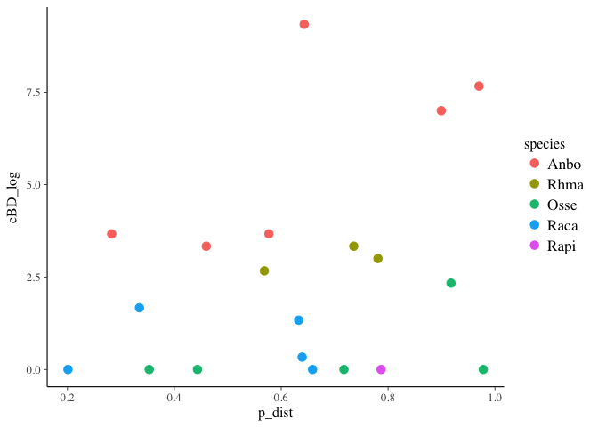
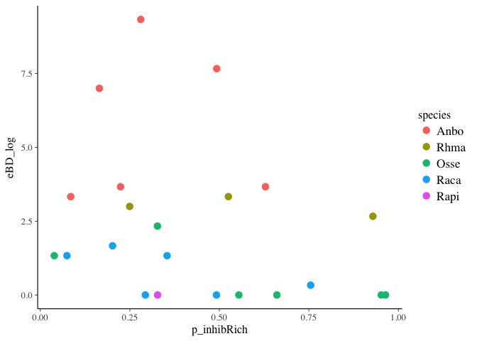
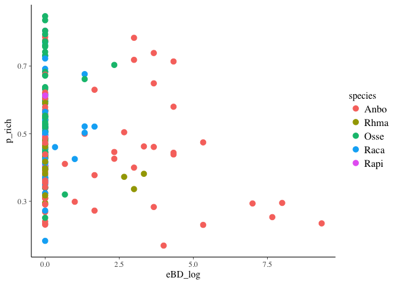

Statistical Analysis for 5Sp Dataset
================
Melissa Chen
Fri Mar 1 10:10:51 2019

``` r
# Load packages
library(tidyverse)
```

    ## ── Attaching packages ────────────────────────────────── tidyverse 1.2.1 ──

    ## ✔ ggplot2 2.2.1     ✔ purrr   0.2.4
    ## ✔ tibble  1.4.2     ✔ dplyr   0.7.5
    ## ✔ tidyr   0.8.1     ✔ stringr 1.3.1
    ## ✔ readr   1.1.1     ✔ forcats 0.3.0

    ## ── Conflicts ───────────────────────────────────── tidyverse_conflicts() ──
    ## ✖ dplyr::filter() masks stats::filter()
    ## ✖ dplyr::lag()    masks stats::lag()

``` r
library(rstanarm)
```

    ## Loading required package: Rcpp

    ## rstanarm (Version 2.17.4, packaged: 2018-04-13 01:51:52 UTC)

    ## - Do not expect the default priors to remain the same in future rstanarm versions.

    ## Thus, R scripts should specify priors explicitly, even if they are just the defaults.

    ## - For execution on a local, multicore CPU with excess RAM we recommend calling

    ## options(mc.cores = parallel::detectCores())

    ## - Plotting theme set to bayesplot::theme_default().

``` r
library(car) #Anova
```

    ## Loading required package: carData

    ## 
    ## Attaching package: 'car'

    ## The following object is masked from 'package:dplyr':
    ## 
    ##     recode

    ## The following object is masked from 'package:purrr':
    ## 
    ##     some

``` r
library(vegan) # for permanova
```

    ## Loading required package: permute

    ## Loading required package: lattice

    ## This is vegan 2.4-5

``` r
library(gridExtra)
```

    ## 
    ## Attaching package: 'gridExtra'

    ## The following object is masked from 'package:dplyr':
    ## 
    ##     combine

``` r
# Mapping files
load("mf_con_without_init_infect.RData")
load("mf_treat_without_init_infect.RData")
load("mf.rare.RData")

# Previous analyses summaries
load("all_p.RData")
load("all_p_infected.RData")

# add a species column and PABD column
all_p <- all_p %>%
    mutate(PABD=ifelse(infect>0,1,0), infect = log(infect+1)) %>%
    rename(eBD_log=infect) %>%
    separate(toadID, into=c("species","indiv"), remove=FALSE)
all_p_infected <- all_p_infected %>%
    mutate(PABD=ifelse(eBD_log>0,1,0)) %>%
    separate(toadID, into=c("species","indiv"), remove=FALSE)

#### CURSORY GLANCE AT DATA ####
gg_NMDS <- mf_con_without_init_infect %>%
    ggplot(aes(x=NMDS1, y=NMDS2)) +
    geom_point(aes(col=species), cex=3, show.legend = FALSE)
gg_infect <- mf_treat_without_init_infect  %>%
    ggplot(aes(x=species, y=eBD_log)) +
    geom_point(aes(col=species), cex=3, position = position_jitter(width=0.1, height=0.05), show.legend = FALSE)

temp1 <- mf_con_without_init_infect %>%
    dplyr::select(species, logRich) %>%
    mutate(metric="logRich") %>%
    rename(value=logRich)
temp2 <- mf_con_without_init_infect %>%
    dplyr::select(species, inhibRich) %>%
    mutate(metric="inhibRich")%>%
    rename(value=inhibRich)
temp3 <- mf_con_without_init_infect %>%
    dplyr::select(species, percInhib) %>%
    mutate(metric="percInhib")%>%
    rename(value=percInhib)
temp4 <- mf_con_without_init_infect %>%
    dplyr::select(species, distance_bray_curtis) %>%
    mutate(metric="distance_bray_curtis")%>%
    rename(value=distance_bray_curtis)

gg_all <- rbind(temp1,temp2,temp3,temp4) %>%
    ggplot(aes(x=species, y=value)) +
    geom_boxplot() +
    geom_point(aes(col=species), position = position_jitter(width=0.1, height=0))+
    facet_grid(metric~., scales = "free") 
lay <- rbind(c(1,2),
             c(3,2))
```

``` r
grid.arrange(gg_NMDS, gg_all, gg_infect, layout_matrix = lay)
```

    ## Warning: Removed 38 rows containing non-finite values (stat_boxplot).

    ## Warning: Removed 38 rows containing missing values (geom_point).


``` r
#### PART I ####
```

Part I: Microbiome state and effect on infection risk and intensity
(1a) Does overall diversity of microbiome influence BD infection rate?
The first thing we would like to know is whether microbiome richness of an individual influences its risk of becoming infected by BD. The most simple way to look at this would be to plot diversity VS presence/absence of BD and OTU richness VS presence/absence of BD Below, we fitted normal and lognormal distributions, respectively, to diversity (shannon) and otu richness to individuals prior to BD infection. Now, we fit a binomial general linearized model to see if there is a relationship between diversity and infection rate.

``` r
# glm_PABD_shan <- glm(PABD ~ species*exp_shan, data=all_p, family=binomial(link="logit"))
# Anova(glm_PABD_shan)
# all_p %>%
#     ggplot(aes(x=exp_shan, y=PABD)) +
#     geom_point(aes(col=species), cex=3)  
```

Now for observed OTUs

``` r
# glm_PABD_rich <- glm(PABD ~ species*exp_rich, data=all_p, family=binomial(link="logit"))
# anova(glm_PABD_rich, test="Chisq") # Check for interaction
# Anova(glm_PABD_rich, type=2) # Check for main effects
# all_p %>%
#     ggplot(aes(x=exp_rich, y=PABD)) +
#     geom_point(aes(col=species), cex=3)
```

Clearly, we see that neither diversity nor richness seems to signficiatly affect infection risk.
However, let's try normalizing it by species; using each species to determine whether it is "out of the ordinary"

``` r
# 
# glm_PABD_pshan <- glm(PABD ~ species*p_shan, data=all_p, family=binomial(link="logit"))
# Anova(glm_PABD_pshan)
# all_p %>%
#     ggplot(aes(x=p_shan, y=PABD)) +
#     geom_point(aes(col=species), cex=3) 
```

Now for observed OTUs

``` r
glm_PABD_prich <- glm(PABD ~ species*p_rich, data=all_p, family=binomial(link="logit"))
anova(glm_PABD_prich, test="Chisq") # test for interaction
```

    ## Analysis of Deviance Table
    ## 
    ## Model: binomial, link: logit
    ## 
    ## Response: PABD
    ## 
    ## Terms added sequentially (first to last)
    ## 
    ## 
    ##                Df Deviance Resid. Df Resid. Dev Pr(>Chi)  
    ## NULL                              21     27.522           
    ## species         4  12.2453        17     15.276  0.01562 *
    ## p_rich          1   3.0679        16     12.208  0.07985 .
    ## species:p_rich  3   0.0029        13     12.206  0.99996  
    ## ---
    ## Signif. codes:  0 '***' 0.001 '**' 0.01 '*' 0.05 '.' 0.1 ' ' 1

``` r
Anova(glm_PABD_prich, type=2) # test for main effects
```

    ## Analysis of Deviance Table (Type II tests)
    ## 
    ## Response: PABD
    ##                LR Chisq Df Pr(>Chisq)  
    ## species         12.7802  4    0.01240 *
    ## p_rich           3.0679  1    0.07985 .
    ## species:p_rich   0.0029  3    0.99996  
    ## ---
    ## Signif. codes:  0 '***' 0.001 '**' 0.01 '*' 0.05 '.' 0.1 ' ' 1

``` r
all_p %>%
    ggplot(aes(x=p_rich, y=PABD)) +
    geom_point(aes(col=species), cex=3)  
```


If anything, it looks like increased diversity and richness might increase infection risk

``` r
#### eBD and diversity ####
```

(1b) Does overall diversity of microbiome influence BD infection intensity?
The next thing we would like to know is if diversity of richness of the microbiome influences infection intensity.

``` r
# 
# lm_eBD_shan <- lm(eBD_log ~ species*exp_shan, data=all_p)
# Anova(lm_eBD_shan)
# all_p %>%
#     ggplot(aes(x=exp_shan, y=eBD_log)) +
#     geom_point(aes(col=species), cex=3) 
```

Now let's do richness

``` r
# lm_eBD_rich <- lm(eBD_log ~ species*exp_rich, data=all_p)
# Anova(lm_eBD_rich)
# all_p %>%
#     ggplot(aes(x=exp_rich, y=eBD_log)) +
#     geom_point(aes(col=species), cex=3)  
```

  It looks like diversity might slightly increasing risk of infection, which is opposite what we might expect Let's try using the normalized values.

``` r
# lm_eBD_pshan <- lm(eBD_log ~ species*p_shan, data=all_p)
# Anova(lm_eBD_pshan)
# all_p %>%
#     ggplot(aes(x=p_shan, y=eBD_log)) +
#     geom_point(aes(col=species), cex=3)
```

Now let's do richness

``` r
lm_eBD_prich <- lm(eBD_log ~ species*p_rich, data=all_p)
anova(lm_eBD_prich)
```

    ## Analysis of Variance Table
    ## 
    ## Response: eBD_log
    ##                Df  Sum Sq Mean Sq F value    Pr(>F)    
    ## species         4 110.258 27.5644  9.6064 0.0007685 ***
    ## p_rich          1   0.302  0.3017  0.1052 0.7508831    
    ## species:p_rich  3   3.007  1.0025  0.3494 0.7902909    
    ## Residuals      13  37.302  2.8694                      
    ## ---
    ## Signif. codes:  0 '***' 0.001 '**' 0.01 '*' 0.05 '.' 0.1 ' ' 1

``` r
Anova(lm_eBD_prich, type=2)
```

    ## Note: model has aliased coefficients
    ##       sums of squares computed by model comparison

    ## Anova Table (Type II tests)
    ## 
    ## Response: eBD_log
    ##                Sum Sq Df F value   Pr(>F)   
    ## species        67.607  4  5.8904 0.006252 **
    ## p_rich          0.302  1  0.1052 0.750883   
    ## species:p_rich  3.007  3  0.3494 0.790291   
    ## Residuals      37.302 13                    
    ## ---
    ## Signif. codes:  0 '***' 0.001 '**' 0.01 '*' 0.05 '.' 0.1 ' ' 1

``` r
all_p %>%
    ggplot(aes(x=p_rich, y=eBD_log)) +
    geom_point(aes(col=species), cex=3) 
```


``` r
#### PABD and instability ####
```

(2a) Does instability of microbiome influence BD infection rate?
Here we look at average distance travelled (bray-curtis) between samples prior to being infected. We see if it is correlated to infection risk.

``` r
# 
# glm_PABD_bc <- glm(PABD ~ species*exp_mu, data=all_p, family=binomial)
# Anova(glm_PABD_bc)
# all_p %>%
#     ggplot(aes(x=exp_mu, y=PABD)) +
#     geom_point(aes(col=species), cex=3) 

glm_PABD_pbc <- glm(PABD ~ species*p_mu, data=all_p, family=binomial)
anova(glm_PABD_pbc, test="Chisq")
```

    ## Analysis of Deviance Table
    ## 
    ## Model: binomial, link: logit
    ## 
    ## Response: PABD
    ## 
    ## Terms added sequentially (first to last)
    ## 
    ## 
    ##              Df Deviance Resid. Df Resid. Dev Pr(>Chi)  
    ## NULL                            21     27.522           
    ## species       4  12.2453        17     15.276  0.01562 *
    ## p_mu          1   0.2579        16     15.018  0.61158  
    ## species:p_mu  3   0.0041        13     15.014  0.99993  
    ## ---
    ## Signif. codes:  0 '***' 0.001 '**' 0.01 '*' 0.05 '.' 0.1 ' ' 1

``` r
Anova(glm_PABD_pbc, type=2)
```

    ## Analysis of Deviance Table (Type II tests)
    ## 
    ## Response: PABD
    ##              LR Chisq Df Pr(>Chisq)  
    ## species       11.7204  4    0.01956 *
    ## p_mu           0.2579  1    0.61158  
    ## species:p_mu   0.0041  3    0.99993  
    ## ---
    ## Signif. codes:  0 '***' 0.001 '**' 0.01 '*' 0.05 '.' 0.1 ' ' 1

``` r
all_p %>%
    ggplot(aes(x=p_mu, y=PABD)) +
    geom_point(aes(col=species), cex=3) 
```


``` r
#### eBD and instability ####
```

(2b) Does instability of microbiome influence BD infection intensity?

``` r
# 
# lm_eBD_bc <- lm(eBD_log ~ species*exp_mu, data=all_p)
# Anova(lm_eBD_bc)
# all_p %>%
#     ggplot(aes(x=exp_mu, y=eBD_log)) +
#     geom_point(aes(col=species), cex=3) 

lm_BD_pbc <- lm(eBD_log ~ species*p_mu, data=all_p)
anova(lm_BD_pbc)
```

    ## Analysis of Variance Table
    ## 
    ## Response: eBD_log
    ##              Df  Sum Sq Mean Sq F value    Pr(>F)    
    ## species       4 110.258 27.5644 13.1256 0.0001691 ***
    ## p_mu          1   2.781  2.7814  1.3245 0.2705213    
    ## species:p_mu  3  10.529  3.5097  1.6712 0.2219427    
    ## Residuals    13  27.301  2.1001                      
    ## ---
    ## Signif. codes:  0 '***' 0.001 '**' 0.01 '*' 0.05 '.' 0.1 ' ' 1

``` r
Anova(lm_BD_pbc, type=2)
```

    ## Note: model has aliased coefficients
    ##       sums of squares computed by model comparison

    ## Anova Table (Type II tests)
    ## 
    ## Response: eBD_log
    ##               Sum Sq Df F value    Pr(>F)    
    ## species      112.613  4 13.4059 0.0001519 ***
    ## p_mu           2.781  1  1.3245 0.2705213    
    ## species:p_mu  10.529  3  1.6712 0.2219427    
    ## Residuals     27.301 13                      
    ## ---
    ## Signif. codes:  0 '***' 0.001 '**' 0.01 '*' 0.05 '.' 0.1 ' ' 1

``` r
all_p %>%
    ggplot(aes(x=p_mu, y=eBD_log)) +
    geom_point(aes(col=species), cex=3) 
```


``` r
#### PABD and inhibitory ####
```

(3a) Does composition of microbiome influence BD infection risk?
Now, we ask if composition-- specitically, the richness and percent of BD inhibitory bacteria-- influences infection risk in individuals. First, below, we use just a regular correlation \#' between richness and infection risk

glm\_PABD\_inhibRich &lt;- glm(PABD ~ species\*exp\_inhibRich, data=all\_p, family=binomial) Anova(glm\_PABD\_inhibRich) all\_p %&gt;% ggplot(aes(x=exp\_inhibRich, y=PABD)) + geom\_point(aes(col=species), cex=3) Now let's do percent inhibitory

``` r
# glm_PABD_percInhib <- glm(PABD ~ species*exp_pinhib, data=all_p, family=binomial)
# Anova(glm_PABD_percInhib)
# summary(glm_PABD_percInhib)
# all_p %>%
#     ggplot(aes(x=exp_pinhib, y=PABD)) +
#     geom_point(aes(col=species), cex=3) 
```

Now let's look at the standardized values

``` r
glm_PABD_pinhibRich <- glm(PABD ~ species*p_inhibRich, data=all_p, family=binomial)
```

    ## Warning: glm.fit: fitted probabilities numerically 0 or 1 occurred

``` r
anova(glm_PABD_pinhibRich, test="Chisq")
```

    ## Analysis of Deviance Table
    ## 
    ## Model: binomial, link: logit
    ## 
    ## Response: PABD
    ## 
    ## Terms added sequentially (first to last)
    ## 
    ## 
    ##                     Df Deviance Resid. Df Resid. Dev Pr(>Chi)  
    ## NULL                                   21     27.522           
    ## species              4  12.2453        17     15.276  0.01562 *
    ## p_inhibRich          1   3.8632        16     11.413  0.04936 *
    ## species:p_inhibRich  3   3.8302        13      7.583  0.28040  
    ## ---
    ## Signif. codes:  0 '***' 0.001 '**' 0.01 '*' 0.05 '.' 0.1 ' ' 1

``` r
Anova(glm_PABD_pinhibRich, type=2) #### SIG
```

    ## Analysis of Deviance Table (Type II tests)
    ## 
    ## Response: PABD
    ##                     LR Chisq Df Pr(>Chisq)  
    ## species              12.3209  4    0.01512 *
    ## p_inhibRich           3.8632  1    0.04936 *
    ## species:p_inhibRich   3.8302  3    0.28040  
    ## ---
    ## Signif. codes:  0 '***' 0.001 '**' 0.01 '*' 0.05 '.' 0.1 ' ' 1

``` r
all_p %>%
    ggplot(aes(x=p_inhibRich, y=PABD)) +
    geom_point(aes(col=species), cex=3)
```


Now let's do percent inhibitory of standardized values

``` r
glm_PABD_ppinhib <- glm(PABD ~ species*p_pinhib, data=all_p, family=binomial)
anova(glm_PABD_ppinhib, test="Chisq")
```

    ## Analysis of Deviance Table
    ## 
    ## Model: binomial, link: logit
    ## 
    ## Response: PABD
    ## 
    ## Terms added sequentially (first to last)
    ## 
    ## 
    ##                  Df Deviance Resid. Df Resid. Dev Pr(>Chi)  
    ## NULL                                21     27.522           
    ## species           4  12.2453        17     15.276  0.01562 *
    ## p_pinhib          1   0.1943        16     15.082  0.65934  
    ## species:p_pinhib  3   0.3479        13     14.734  0.95078  
    ## ---
    ## Signif. codes:  0 '***' 0.001 '**' 0.01 '*' 0.05 '.' 0.1 ' ' 1

``` r
Anova(glm_PABD_ppinhib, type=2)
```

    ## Analysis of Deviance Table (Type II tests)
    ## 
    ## Response: PABD
    ##                  LR Chisq Df Pr(>Chisq)  
    ## species           12.4060  4    0.01457 *
    ## p_pinhib           0.1943  1    0.65934  
    ## species:p_pinhib   0.3479  3    0.95078  
    ## ---
    ## Signif. codes:  0 '***' 0.001 '**' 0.01 '*' 0.05 '.' 0.1 ' ' 1

``` r
all_p %>%
    ggplot(aes(x=p_pinhib, y=PABD)) +
    geom_point(aes(col=species), cex=3)
```


``` r
#### eBD and inhibitory ####
```

(3b) Does composition of microbiome influence BD infection intensity?

``` r
# lm_eBD_inhibRich <- lm(eBD_log ~ species*exp_inhibRich, data=all_p)
# Anova(lm_eBD_inhibRich)
# all_p %>%
#     ggplot(aes(x=exp_inhibRich, y=eBD_log)) +
#     geom_point(aes(col=species), cex=3)
```

Now let's do percent inhibitory

``` r
# lm_eBD_percInhib <- lm(eBD_log ~  species*exp_pinhib, data=all_p)
# Anova(lm_eBD_percInhib)
# all_p %>%
#     ggplot(aes(x=exp_pinhib, y=eBD_log)) +
#     geom_point(aes(col=species), cex=3) 
```

Now let's look at the standardized values

``` r
lm_eBD_pinhibRich <- lm(eBD_log ~ species*p_inhibRich, data=all_p)
anova(lm_eBD_pinhibRich)
```

    ## Analysis of Variance Table
    ## 
    ## Response: eBD_log
    ##                     Df  Sum Sq Mean Sq F value    Pr(>F)    
    ## species              4 110.258 27.5644  9.7511 0.0007168 ***
    ## p_inhibRich          1   2.527  2.5268  0.8939 0.3616772    
    ## species:p_inhibRich  3   1.336  0.4453  0.1575 0.9229507    
    ## Residuals           13  36.748  2.8268                      
    ## ---
    ## Signif. codes:  0 '***' 0.001 '**' 0.01 '*' 0.05 '.' 0.1 ' ' 1

``` r
Anova(lm_eBD_pinhibRich, type=2)
```

    ## Note: model has aliased coefficients
    ##       sums of squares computed by model comparison

    ## Anova Table (Type II tests)
    ## 
    ## Response: eBD_log
    ##                      Sum Sq Df F value   Pr(>F)   
    ## species             100.553  4  8.8928 0.001095 **
    ## p_inhibRich           2.527  1  0.8939 0.361677   
    ## species:p_inhibRich   1.336  3  0.1575 0.922951   
    ## Residuals            36.748 13                    
    ## ---
    ## Signif. codes:  0 '***' 0.001 '**' 0.01 '*' 0.05 '.' 0.1 ' ' 1

``` r
all_p %>%
    ggplot(aes(x=p_inhibRich, y=eBD_log)) +
    geom_point(aes(col=species), cex=3)
```



Now let's do percent inhibitory of standardized values

``` r
lm_eBD_ppinhib <- lm(eBD_log ~  species*p_pinhib, data=all_p)
anova(lm_eBD_ppinhib)
```

    ## Analysis of Variance Table
    ## 
    ## Response: eBD_log
    ##                  Df  Sum Sq Mean Sq F value    Pr(>F)    
    ## species           4 110.258 27.5644  9.4256 0.0008392 ***
    ## p_pinhib          1   0.376  0.3762  0.1286 0.7255960    
    ## species:p_pinhib  3   2.218  0.7392  0.2528 0.8579770    
    ## Residuals        13  38.017  2.9244                      
    ## ---
    ## Signif. codes:  0 '***' 0.001 '**' 0.01 '*' 0.05 '.' 0.1 ' ' 1

``` r
Anova(lm_eBD_ppinhib, type=2)
```

    ## Note: model has aliased coefficients
    ##       sums of squares computed by model comparison

    ## Anova Table (Type II tests)
    ## 
    ## Response: eBD_log
    ##                   Sum Sq Df F value    Pr(>F)    
    ## species          110.255  4  9.4254 0.0008393 ***
    ## p_pinhib           0.376  1  0.1286 0.7255960    
    ## species:p_pinhib   2.218  3  0.2528 0.8579770    
    ## Residuals         38.017 13                      
    ## ---
    ## Signif. codes:  0 '***' 0.001 '**' 0.01 '*' 0.05 '.' 0.1 ' ' 1

``` r
all_p %>%
    ggplot(aes(x=p_pinhib, y=eBD_log)) +
    geom_point(aes(col=species), cex=3) 
```


Part II: Affect of BD infection on microbiome state

(1a) Does BD infection state affect microbiome diversity? - OTU richness vs BD infection - Chao1 richness vs BD infection - Shannon richness vs BD infection - PD vs BD infection

``` r
# 
# lm_shan_PABD <- lm(shannon ~ species*PABD, data=all_p_infected)
# Anova(lm_shan_PABD)
# all_p_infected %>%
#     mutate(PABD = factor(PABD)) %>%
#     ggplot(aes(x=PABD, y=shannon)) +
#     geom_violin() +
#     geom_point(aes(col=species), cex=3, position=position_jitter(width=0.15, height=0))+
#     facet_wrap(~species, nrow=1)
# 
# 
# 
# lm_rich_PABD <- lm(logRich ~ species*PABD, data=all_p_infected)
# Anova(lm_rich_PABD)
# all_p_infected %>%
#     mutate(PABD = factor(PABD)) %>%
#     ggplot(aes(x=PABD, y=logRich)) +
#     geom_violin() +
#     geom_point(aes(col=species), cex=3, position=position_jitter(width=0.15, height=0))+
#     facet_wrap(~species, nrow=1)
```

Now let's try the standardized values

``` r
# lm_pshan_PABD <- lm(p_shan ~ species*PABD, data=all_p_infected)
# Anova(lm_pshan_PABD)
# all_p_infected %>%
#     mutate(PABD = factor(PABD)) %>%
#     ggplot(aes(x=PABD, y=p_shan)) +
#     geom_violin() +
#     geom_point(aes(col=species), cex=3, position=position_jitter(width=0.15, height=0)) +
#     facet_wrap(~species, nrow=1)

lm_prich_PABD <- lm(p_rich ~ species*PABD, data=all_p_infected)
anova(lm_prich_PABD)
```

    ## Analysis of Variance Table
    ## 
    ## Response: p_rich
    ##               Df Sum Sq  Mean Sq F value    Pr(>F)    
    ## species        4 0.4488 0.112201  6.0659 0.0001301 ***
    ## PABD           1 0.0019 0.001902  0.1028 0.7488342    
    ## species:PABD   3 0.0125 0.004174  0.2257 0.8784707    
    ## Residuals    188 3.4774 0.018497                      
    ## ---
    ## Signif. codes:  0 '***' 0.001 '**' 0.01 '*' 0.05 '.' 0.1 ' ' 1

``` r
Anova(lm_prich_PABD, type=2)
```

    ## Note: model has aliased coefficients
    ##       sums of squares computed by model comparison

    ## Anova Table (Type II tests)
    ## 
    ## Response: p_rich
    ##              Sum Sq  Df F value    Pr(>F)    
    ## species      0.4048   4  5.4706 0.0003456 ***
    ## PABD         0.0019   1  0.1028 0.7488342    
    ## species:PABD 0.0125   3  0.2257 0.8784707    
    ## Residuals    3.4774 188                      
    ## ---
    ## Signif. codes:  0 '***' 0.001 '**' 0.01 '*' 0.05 '.' 0.1 ' ' 1

``` r
all_p_infected %>%
    mutate(PABD = factor(PABD)) %>%
    ggplot(aes(x=PABD, y=p_rich)) +
    geom_boxplot() +
    geom_point(aes(col=species), cex=3, position=position_jitter(width=0.15, height=0))+
    facet_wrap(~species, nrow=1)
```


(1b) Does BD infection intensity affect microbiome diversity?

``` r
# 
# lm_shan_eBD <- lm(shannon ~ species*eBD_log, data=all_p_infected)
# Anova(lm_shan_eBD)
# all_p_infected %>%
#     ggplot(aes(x=eBD_log, y=shannon)) +
#     geom_point(aes(col=species), cex=3)

# lm_rich_eBD <- lm(logRich ~ species*eBD_log, data=all_p_infected)
# Anova(lm_rich_eBD)
# all_p_infected %>%
#     ggplot(aes(x=eBD_log, y=logRich)) +
#     geom_point(aes(col=species), cex=3)
```

Now let's try the standardized values

``` r
# lm_pshan_eBD <- lm(p_shan ~ species*eBD_log, data=all_p_infected)
# Anova(lm_pshan_eBD)
# all_p_infected %>%
#     ggplot(aes(x=eBD_log, y=p_shan)) +
#     geom_point(aes(col=species), cex=3) 

lm_prich_eBD <- lm(p_rich ~ species*eBD_log, data=all_p_infected)
anova(lm_prich_eBD)
```

    ## Analysis of Variance Table
    ## 
    ## Response: p_rich
    ##                  Df Sum Sq  Mean Sq F value    Pr(>F)    
    ## species           4 0.4488 0.112201  6.1572 0.0001121 ***
    ## eBD_log           1 0.0335 0.033487  1.8376 0.1768546    
    ## species:eBD_log   3 0.0325 0.010820  0.5937 0.6198362    
    ## Residuals       188 3.4259 0.018223                      
    ## ---
    ## Signif. codes:  0 '***' 0.001 '**' 0.01 '*' 0.05 '.' 0.1 ' ' 1

``` r
Anova(lm_prich_eBD, type=2)
```

    ## Note: model has aliased coefficients
    ##       sums of squares computed by model comparison

    ## Anova Table (Type II tests)
    ## 
    ## Response: p_rich
    ##                 Sum Sq  Df F value    Pr(>F)    
    ## species         0.3596   4  4.9330 0.0008364 ***
    ## eBD_log         0.0335   1  1.8376 0.1768546    
    ## species:eBD_log 0.0325   3  0.5937 0.6198362    
    ## Residuals       3.4259 188                      
    ## ---
    ## Signif. codes:  0 '***' 0.001 '**' 0.01 '*' 0.05 '.' 0.1 ' ' 1

``` r
all_p_infected %>%
    ggplot(aes(x=eBD_log, y=p_rich)) +
    geom_point(aes(col=species), cex=3)
```


(2a) Does BD infection state affect microbiome instability?

``` r
# 
# lm_bc_PABD <- lm(distance_bray_curtis ~ species*PABD, data=all_p_infected)
# Anova(lm_bc_PABD)
# all_p_infected %>%
#     mutate(PABD = factor(PABD)) %>%
#     ggplot(aes(x=PABD, y=distance_bray_curtis)) +
#     geom_violin() +
#     geom_point(aes(color=species), cex=4, position=position_jitter(width=0.15, height=0))+
#     facet_wrap(~species, nrow=1)

# try standardized
lm_pbc_PABD <- lm(p_BC ~ species*PABD, data=all_p_infected)
anova(lm_pbc_PABD)
```

    ## Analysis of Variance Table
    ## 
    ## Response: p_BC
    ##               Df  Sum Sq  Mean Sq F value   Pr(>F)   
    ## species        4  1.1230 0.280750  3.5929 0.007948 **
    ## PABD           1  0.1824 0.182399  2.3342 0.128706   
    ## species:PABD   3  0.0682 0.022741  0.2910 0.831832   
    ## Residuals    147 11.4866 0.078140                    
    ## ---
    ## Signif. codes:  0 '***' 0.001 '**' 0.01 '*' 0.05 '.' 0.1 ' ' 1

``` r
Anova(lm_pbc_PABD)
```

    ## Note: model has aliased coefficients
    ##       sums of squares computed by model comparison

    ## Anova Table (Type II tests)
    ## 
    ## Response: p_BC
    ##               Sum Sq  Df F value   Pr(>F)   
    ## species       1.1803   4  3.7762 0.005924 **
    ## PABD          0.1824   1  2.3342 0.128706   
    ## species:PABD  0.0682   3  0.2910 0.831832   
    ## Residuals    11.4866 147                    
    ## ---
    ## Signif. codes:  0 '***' 0.001 '**' 0.01 '*' 0.05 '.' 0.1 ' ' 1

``` r
all_p_infected %>%
    mutate(PABD = factor(PABD)) %>%
    ggplot(aes(x=PABD, y=p_BC)) +
    geom_boxplot() +
    geom_point(aes(color=species), cex=4, position=position_jitter(width=0.15, height=0))+
    facet_wrap(~species, nrow=1)
```

    ## Warning: Removed 41 rows containing non-finite values (stat_boxplot).

    ## Warning: Removed 41 rows containing missing values (geom_point).


(2b) Does BD infection intensity affect microbiome instability?

``` r
# lm_bc_eBD <- lm(distance_bray_curtis ~ species*eBD_log, data=all_p_infected)
# Anova(lm_bc_eBD)
# all_p_infected %>%
#     ggplot(aes(x=eBD_log, y=distance_bray_curtis)) +
#     geom_point(aes(color=species), cex=4)

# try standardized
lm_pbc_eBD <- lm(p_BC ~ species*eBD_log, data=all_p_infected)
anova(lm_pbc_eBD)
```

    ## Analysis of Variance Table
    ## 
    ## Response: p_BC
    ##                  Df  Sum Sq  Mean Sq F value   Pr(>F)   
    ## species           4  1.1230 0.280750  3.5922 0.007957 **
    ## eBD_log           1  0.1528 0.152793  1.9550 0.164157   
    ## species:eBD_log   3  0.0956 0.031854  0.4076 0.747782   
    ## Residuals       147 11.4889 0.078156                    
    ## ---
    ## Signif. codes:  0 '***' 0.001 '**' 0.01 '*' 0.05 '.' 0.1 ' ' 1

``` r
Anova(lm_pbc_eBD)
```

    ## Note: model has aliased coefficients
    ##       sums of squares computed by model comparison

    ## Anova Table (Type II tests)
    ## 
    ## Response: p_BC
    ##                  Sum Sq  Df F value   Pr(>F)   
    ## species          1.1198   4  3.5819 0.008089 **
    ## eBD_log          0.1528   1  1.9550 0.164157   
    ## species:eBD_log  0.0956   3  0.4076 0.747782   
    ## Residuals       11.4889 147                    
    ## ---
    ## Signif. codes:  0 '***' 0.001 '**' 0.01 '*' 0.05 '.' 0.1 ' ' 1

``` r
all_p_infected %>%
    ggplot(aes(x=eBD_log, y=p_BC)) +
    geom_point(aes(color=species), cex=4)
```

    ## Warning: Removed 41 rows containing missing values (geom_point).



(3a) Does BD infection state affect microbiome composition?

``` r
# 
# lm_inhibRich_PABD <- lm(inhibRich ~ species*PABD, data=all_p_infected)
# Anova(lm_inhibRich_PABD)
# all_p_infected %>%
#     mutate(PABD = factor(PABD)) %>%
#     ggplot(aes(x=PABD, y=inhibRich)) +
#     geom_violin() +
#     geom_point(aes(col=species), cex=3, position=position_jitter(width=0.15, height=0))+
#     facet_wrap(~species, nrow=1)
# 
# 
# lm_percInhib_PABD <- lm(percInhib ~ species*PABD, data=all_p_infected)
# Anova(lm_percInhib_PABD)
# all_p_infected %>%
#     mutate(PABD = factor(PABD)) %>%
#     ggplot(aes(x=PABD, y=percInhib)) +
#     geom_violin() +
#     geom_point(aes(col=species), cex=3, position=position_jitter(width=0.15, height=0))+
#     facet_wrap(~species, nrow=1)
```

Now let's try the standardized values

``` r
lm_pinhibRich_PABD <- lm(p_inhibRich ~ species*PABD, data=all_p_infected)
anova(lm_pinhibRich_PABD)
```

    ## Analysis of Variance Table
    ## 
    ## Response: p_inhibRich
    ##               Df  Sum Sq Mean Sq F value    Pr(>F)    
    ## species        4  4.2387 1.05968 16.8502 8.011e-12 ***
    ## PABD           1  0.0135 0.01351  0.2149    0.6435    
    ## species:PABD   3  0.1499 0.04996  0.7944    0.4984    
    ## Residuals    188 11.8229 0.06289                      
    ## ---
    ## Signif. codes:  0 '***' 0.001 '**' 0.01 '*' 0.05 '.' 0.1 ' ' 1

``` r
Anova(lm_pinhibRich_PABD)
```

    ## Note: model has aliased coefficients
    ##       sums of squares computed by model comparison

    ## Anova Table (Type II tests)
    ## 
    ## Response: p_inhibRich
    ##               Sum Sq  Df F value    Pr(>F)    
    ## species       3.6321   4 14.4389 2.673e-10 ***
    ## PABD          0.0135   1  0.2149    0.6435    
    ## species:PABD  0.1499   3  0.7944    0.4984    
    ## Residuals    11.8229 188                      
    ## ---
    ## Signif. codes:  0 '***' 0.001 '**' 0.01 '*' 0.05 '.' 0.1 ' ' 1

``` r
all_p_infected %>%
    mutate(PABD = factor(PABD)) %>%
    ggplot(aes(x=PABD, y=p_inhibRich)) +
    geom_boxplot() +
    geom_point(aes(col=species), cex=3, position=position_jitter(width=0.15, height=0)) +
    facet_wrap(~species, nrow=1)
```


``` r
lm_ppercInhib_PABD <- lm(p_percInhib ~ species*PABD, data=all_p_infected)
anova(lm_ppercInhib_PABD)
```

    ## Analysis of Variance Table
    ## 
    ## Response: p_percInhib
    ##               Df  Sum Sq Mean Sq F value    Pr(>F)    
    ## species        4  3.7527 0.93817  9.5678 4.609e-07 ***
    ## PABD           1  0.1123 0.11226  1.1449    0.2860    
    ## species:PABD   3  0.3482 0.11607  1.1838    0.3172    
    ## Residuals    188 18.4344 0.09806                      
    ## ---
    ## Signif. codes:  0 '***' 0.001 '**' 0.01 '*' 0.05 '.' 0.1 ' ' 1

``` r
Anova(lm_ppercInhib_PABD)
```

    ## Note: model has aliased coefficients
    ##       sums of squares computed by model comparison

    ## Anova Table (Type II tests)
    ## 
    ## Response: p_percInhib
    ##               Sum Sq  Df F value   Pr(>F)    
    ## species       3.8603   4  9.8422 2.99e-07 ***
    ## PABD          0.1123   1  1.1449   0.2860    
    ## species:PABD  0.3482   3  1.1838   0.3172    
    ## Residuals    18.4344 188                     
    ## ---
    ## Signif. codes:  0 '***' 0.001 '**' 0.01 '*' 0.05 '.' 0.1 ' ' 1

``` r
all_p_infected %>%
    mutate(PABD = factor(PABD)) %>%
    ggplot(aes(x=PABD, y=p_percInhib)) +
    geom_boxplot() +
    geom_point(aes(col=species), cex=3, position=position_jitter(width=0.15, height=0))+
    facet_wrap(~species, nrow=1)
```


(3b) Does BD infection intensity affect microbiome composition?

``` r
# 
# lm_inhibRich_eBD <- lm(inhibRich ~ species*eBD_log, data=all_p_infected)
# Anova(lm_inhibRich_eBD)
# all_p_infected %>%
#     ggplot(aes(x=eBD_log, y=inhibRich)) +
#     geom_point(aes(col=species), cex=3)
# 
# lm_percInhib_eBD <- lm(percInhib ~ species*eBD_log, data=all_p_infected)
# Anova(lm_percInhib_eBD)
# all_p_infected %>%
#     ggplot(aes(x=eBD_log, y=percInhib)) +
#     geom_point(aes(col=species), cex=3)
```

Now let's try the standardized values

``` r
lm_pinhibRich_eBD <- lm(p_inhibRich ~ species*eBD_log, data=all_p_infected)
Anova(lm_pinhibRich_eBD)
```

    ## Note: model has aliased coefficients
    ##       sums of squares computed by model comparison

    ## Anova Table (Type II tests)
    ## 
    ## Response: p_inhibRich
    ##                  Sum Sq  Df F value    Pr(>F)    
    ## species          3.3422   4 13.3276 1.401e-09 ***
    ## eBD_log          0.0282   1  0.4502    0.5031    
    ## species:eBD_log  0.1716   3  0.9123    0.4361    
    ## Residuals       11.7865 188                      
    ## ---
    ## Signif. codes:  0 '***' 0.001 '**' 0.01 '*' 0.05 '.' 0.1 ' ' 1

``` r
all_p_infected %>%
    ggplot(aes(x=eBD_log, y=p_inhibRich)) +
    geom_point(aes(col=species), cex=3) 
```



``` r
lm_ppercInhib_eBD <- lm(p_percInhib ~  species*eBD_log, data=all_p_infected)
anova(lm_ppercInhib_eBD)
```

    ## Analysis of Variance Table
    ## 
    ## Response: p_percInhib
    ##                  Df  Sum Sq Mean Sq F value    Pr(>F)    
    ## species           4  3.7527 0.93817  9.6040 4.353e-07 ***
    ## eBD_log           1  0.3950 0.39501  4.0437   0.04576 *  
    ## species:eBD_log   3  0.1349 0.04498  0.4605   0.71023    
    ## Residuals       188 18.3649 0.09769                      
    ## ---
    ## Signif. codes:  0 '***' 0.001 '**' 0.01 '*' 0.05 '.' 0.1 ' ' 1

``` r
Anova(lm_ppercInhib_eBD, type = 2)
```

    ## Note: model has aliased coefficients
    ##       sums of squares computed by model comparison

    ## Anova Table (Type II tests)
    ## 
    ## Response: p_percInhib
    ##                  Sum Sq  Df F value    Pr(>F)    
    ## species          4.0977   4 10.4869 1.088e-07 ***
    ## eBD_log          0.3950   1  4.0437   0.04576 *  
    ## species:eBD_log  0.1349   3  0.4605   0.71023    
    ## Residuals       18.3649 188                      
    ## ---
    ## Signif. codes:  0 '***' 0.001 '**' 0.01 '*' 0.05 '.' 0.1 ' ' 1

``` r
all_p_infected %>%
    ggplot(aes(x=eBD_log, y=p_percInhib)) +
    geom_point(aes(col=species), cex=3) +
    facet_wrap(~species, nrow=1)
```


``` r
#### FOLLOW UP ####


# Is OTU richness and inhibitory bacterial richness related?

all_p %>%
    ggplot(aes(x=p_rich, y=p_inhibRich)) +
    geom_point(aes(col=species), cex=3) +
    geom_smooth(method="lm")
```


``` r
anova(lm(p_inhibRich ~ p_rich, data=all_p))
```

    ## Analysis of Variance Table
    ## 
    ## Response: p_inhibRich
    ##           Df  Sum Sq  Mean Sq F value Pr(>F)
    ## p_rich     1 0.00289 0.002893  0.0333 0.8571
    ## Residuals 20 1.73946 0.086973

``` r
# No, it's not-- it means it's decoupled
```
